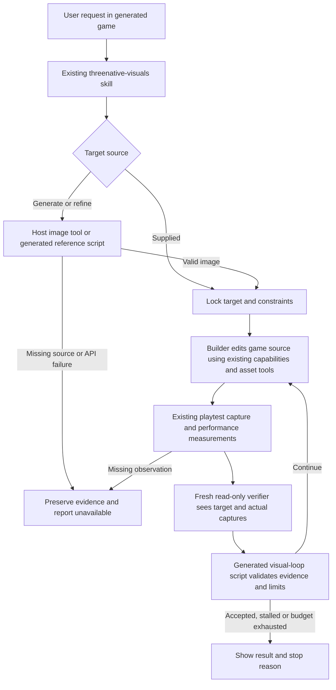

# PRD-371 — Authoring agents build toward a target image and prove the result

**Status: PROPOSED — 2026-09-09. Implementation has not started.**

**Planning Mode: Principal Architect. Complexity: 8 → HIGH mode.** More than ten implementation
files (+3), new authoring helpers (+2), resumable state and budget accounting (+2), external API
(+1). Independent review follows every phase; real images and an actual playable game require
human visual verification in addition to automated gates.

**Problem:** a generated project's agent can capture a frame and find assets, but has no shipped
process for obtaining a target, measuring visual progress independently, and stopping honestly
when visual quality, performance, or the available budget disagree.

**Decision:** adapt [Dream Loop](https://github.com/achimala/dream-loop) into the existing
`threenative-visuals` skill, with optional OpenRouter image generation using `meta/muse-image`
as the preferred candidate. Ship the workflow and small authoring scripts as editable generated
project files. The agent host runs the builder and critic; ThreeNative supplies instructions,
validation, and its existing capture/asset tools.

**Layer:** authoring support in `packages/create-threenative`, not the runtime engine. Art
direction, prompts, materials, lighting and asset choices remain in the game's source. No new
runtime package, editor, scene format, `threenative` subcommand, or Studio dependency is needed.

This plan takes over the image-generation implementation proposed by
[PRD-106](../tooling/PRD-106-reference-image-generation.md). Its historical file locations,
three-template copies, hand-written environment parser and assumed API transport must not become
a parallel implementation. Its unfinished scaffold hygiene obligations are included in phase 6.

## Integration ledger

Paths below are relative to `packages/create-threenative/` unless prefixed otherwise. Line anchors
describe inspected main commit `942402aa2`; replace intended wiring with actual caller lines at
the phase checkpoint. Generated files are ordinary project files, not a game interchange format.

| # | New thing | Live caller, inspected anchor and planned invocation | Replaces | Old path removed? | Negative control |
| --- | --- | --- | --- | --- | --- |
| 1 | `agent-docs/references/dream-loop.md` → generated `agent-docs/dream-loop.md` | Existing `.agents` and `.claude` `threenative-visuals/SKILL.md` reference-matching branch; reached from `templates/starter/AGENTS.md:34`; copied by `src/index.ts:664` | Unbounded, self-reviewed reference matching | Branch delegates in phase 1; baseline and capture recipes retain their separate jobs | Remove the delegation; a cold agent no longer locks a target and obtains an independent verdict |
| 2 | `agent-files/scripts/reference.mjs` → generated `scripts/reference.mjs` | #1 invokes `node scripts/reference.mjs`; `createProject` already calls `copyAgentFiles` at `src/index.ts:662` | PRD-106's proposed three copies and `pnpm reference` registration | No shipped incumbent found; PRD-106 is superseded as a plan | Remove the script from a packed scaffold; target acquisition fails before a success record exists |
| 3 | `agent-files/scripts/visual-loop.mjs` → generated `scripts/visual-loop.mjs` | #1 invokes it before every round and after each capture/verdict; same `copyAgentFiles` caller | Instructions alone deciding whether stale or incomplete evidence is good enough | #1 delegates terminal decisions in phase 3 | Supply an old capture hash, invalid score or exhausted budget; helper refuses acceptance |
| 4 | `.dream-loop/<run-id>/` evidence and `run.json` | #2 owns atomic image reservations and receipts from phase 2; #3 reads those receipts and advances round decisions; #1 resumes it | Loose target/capture files with no common identity | Phase 2 establishes one record and request protocol; phase 3 adds round validation | Remove target, verdict or request ledger; resume fails rather than reconstructing success |
| 5 | Asset-to-target handoff | Existing `threenative-assets` adapters and `agent-docs/sculpt-from-a-reference.md` invoke #1/#2 before existing asset/sculpt/Blender tools | Bespoke-without-reference always ending with “ask for one” | Both adapters and shared sculpt recipe delegate in phase 5 | No key and no supplied image yields an explicit unavailable path, never an invented reference |
| 6 | Shared scaffold hygiene and packaging gate | `src/index.ts:646-650` already installs a dotless `gitignore`; extend the live `createProject` path once | Partial asset-only ignore files; omission of script/recipe from packed distribution | Merge required rules centrally in phase 6, preserve existing rules | Delete one required packed file or ignore rule; cold scaffold verification names it |

Every new helper export, generated artifact or gate introduced during implementation must have a
row or be explicitly covered by an existing row. A test is not its consumer. No phase completes
with an unnamed caller, an unexecuted invocation, or a competing replacement still live.

## Inspected behavior and reuse

1. `src/index.ts:404,628-669` already copies `agent-files` recursively, renders placeholders,
   copies shared reference pages, and validates root recipe links. `package.json` already packs
   both bundles. Extend this path; do not install a remote skill at scaffold time.
2. The two `threenative-visuals` adapters already link capture and visual-baseline recipes.
   Templates already discover both adapters. Keep their existing diagnostics, capability-search
   requirement and frame-budget guidance; add one shared workflow instead of ten long root edits.
3. `agent-files/.threenative/agents/verifier.md` defines a read-only verifier with `PASS`,
   `REQUEST_CHANGES`, and `NOT_OBSERVED`. Reuse that role and its host adapters for visual review.
   The role documentation currently says there is no automatic builder/verifier chain: the
   explicitly invoked visual workflow is the caller, not a background chain on every task.
4. `packages/core/mcp/servers.mjs` wires asset, sculpt, engine and Blender servers.
   `packages/blender-mcp/src/index.ts:44-135` exposes `blender_status`, `blender_inspect`,
   `blender_convert`, `blender_recipes`, and `blender_run_python`. The asset server remains
   externally pinned. `packages/playtest/AGENTS.md` supplies real captures and native targets;
   `scripts/visual-ab.ts` supplies blind release comparisons. Do not rebuild these systems.
5. No `OPENROUTER_API_KEY` resolver or reference-image executable was found in the current
   authoring bundles. `src/config.ts:1376` loads **game build configuration**, not authoring
   secrets. Templates already have dotless `gitignore` files, but the starter's inspected file
   only excludes cooked assets. PRD-106's “no gitignore at all” premise is stale.

No database or runtime configuration migration. Existing projects opt in by copying the reviewed
generated files; scaffolding never overwrites a nonempty project. Re-running an installer is not
an update mechanism introduced by this PRD.

## Upstream adaptation and provider evidence

Dream Loop was inspected at commit
[`9bddb901f7d071cfefdd21e264267c757177a9df`](https://github.com/achimala/dream-loop/tree/9bddb901f7d071cfefdd21e264267c757177a9df).
Its [main skill](https://github.com/achimala/dream-loop/blob/9bddb901f7d071cfefdd21e264267c757177a9df/SKILL.md)
starts from a supplied or generated image and conditions improvements on an existing screenshot.
Its [Pro workflow](https://github.com/achimala/dream-loop/blob/9bddb901f7d071cfefdd21e264267c757177a9df/references/pro-mode/workflow.md)
uses independent image comparison, visual scores, performance checks and stall handling. Adopt
those mechanics. Do not infer subscription tiers, switch the user's model, omit builder tests,
or interpret an asset restriction as permission to buy generated assets. Fal image-to-3D is not
required in this integration. Blender is optional and reached through the installed tools.

The [MIT license](https://github.com/achimala/dream-loop/blob/9bddb901f7d071cfefdd21e264267c757177a9df/LICENSE)
names Anshu Chimala. Include the upstream copyright and full MIT notice in the shared recipe
when adapting its instructions; record the source revision. Do not copy its preview media or
assume generated images and downloaded assets inherit its software license.

Provider findings on **2026-09-09**, from public read-only requests; no paid generation executed:

| Source | Observed | Consequence |
| --- | --- | --- |
| [Muse model page](https://openrouter.ai/meta/muse-image) | Advertises text/image input, image output, editing, and $0.01/image | Candidate is real; price is a dated observation, not a hardcoded cost estimate or proven quality result |
| [General endpoints API](https://openrouter.ai/api/v1/models/meta/muse-image/endpoints) | Returned one Meta endpoint, image output, and token-oriented image pricing | Capture actual route/usage in a live smoke test; do not equate a pricing field with cost per finished image |
| [Dedicated image endpoints API](https://openrouter.ai/api/v1/images/models/meta/muse-image/endpoints) | Returned `{"id":"meta/muse-image","endpoints":[]}` | The general catalog does not prove dedicated Image API availability for Muse |
| [Image API documentation](https://openrouter.ai/docs/guides/overview/multimodal/image-generation) | Documents `/api/v1/images`, endpoint-specific capabilities, reference inputs and base64 responses | Do not transplant a generic example onto a model with no advertised endpoint |
| [Chat API documentation](https://openrouter.ai/docs/api/api-reference/chat/create-a-chat-completion) | Documents `/api/v1/chat/completions`, modalities and image configuration | Initial Muse transport candidate; phase 2 must prove its real response, phase 4 its reference editing |

**Transport decision:** qualify non-streaming chat completions for Muse first, with image-only
output requested and no undocumented image settings. Record request fields and the redacted real
response, then implement that verified parser. This is a candidate, not a statement that a live
generation already worked. If it fails, stop the provider phase with the observed error; do not
automatically retry another endpoint or bill another model. A later dedicated-Image-API switch
requires its own live proof and replacement of the previous route, not speculative dual plumbing.

The initial image generator is optional: an explicit supplied target takes precedence; otherwise
use an available host image tool or configured OpenRouter according to the user's selection.
The preferred OpenRouter model is `meta/muse-image`, with an explicit `--model` override. Never
silently replace the user's target, provider, or model. Without any usable source, report what
input is missing and preserve the run. No key is required to install, build, or play a game.

## User flow and boundaries

The user asks the agent to improve an existing game or build from a target. The existing visual
skill routes reference-driven work to `agent-docs/dream-loop.md`; it remains usable for a simple
capture without opening a refinement run. Users see the locked target, latest real capture,
largest remaining differences, measured performance and the reason the run stopped. There is no
new application UI; the existing agent conversation and local image files are the interface.



```mermaid
sequenceDiagram
    participant A as Authoring agent
    participant G as Image source
    participant P as Playtest
    participant C as Independent verifier
    participant V as Record validator
    A->>P: Capture baseline when a game already exists
    A->>G: Explicit prompt and optional baseline reference
    alt Image source fails
        G-->>A: Configuration, provider or invalid-image error
        A->>V: Preserve failed request; no target accepted
    else Image available
        G-->>A: Image bytes and provenance
        A->>V: Lock target hash, constraints and finite limits
        loop While validator permits another round
            A->>A: Build and run functional checks
            A->>P: Drive repeatable player actions and capture
            P-->>A: Screenshot, observations, adapter and frame windows
            A->>C: Target, captures, rubric and required constraints
            C-->>A: Verdict, scored differences and missing observations
            A->>V: Validate complete round and recompute decision
            V-->>A: Continue, accept, replan once, or stop with reason
        end
    end
```

### Target and asset rules

1. Lock a playable-camera target, viewport/aspect, distinctive subject, required controls/HUD,
   target platforms and performance requirement. An existing game uses a real baseline image
   as generation input; retain recognizable layout and identity requested by the user. The
   prompt is authored in the game and forwarded unchanged by the transport helper.
2. Preserve the original target bytes and hash. A refinement requested or already authorized
   by the user starts a new target revision, retains previous scores, and does not reset the
   total time or image-call budget. The builder cannot lower the target to improve its score.
3. Use the existing source/license discovery and sculpt decision tree. For a bespoke subject,
   produce a reference crop/edit if needed, then use existing Blender or sculpt tools. Generated
   texture bytes are ordinary source assets; validate tiling, UV use, color space and normals
   rather than assuming an attractive image is a valid material map.
4. Import art through the game's existing asset pipeline and put appearance code in
   `src/render/`. Record model/provider, prompt hash, source references and generation date;
   downloaded asset credits keep the returned license. Reference-only images stay out of the
   runtime build. Do not send unrelated project files or credentials to image services.
5. Capture gameplay from multiple positions after integration. Asset orientation, scale,
   floor contact, materials and animations must survive both browser and native desktop.
   A generated image displayed over the game, a Blender render, or one favorable frozen camera
   cannot stand in for the real playable result.

### Image script contract

Proposed command, available only after phase 2, from the generated project root:

```sh
node scripts/reference.mjs --record .dream-loop/current/run.json --request-id target-001 \
  --prompt-file .dream-loop/current/prompt.txt \
  --out .dream-loop/current/target.png --model meta/muse-image
```

Phase 4 adds repeatable `--reference <local-image>` for editing. The recipe resolves `current`
to one concrete run directory before invocation; implementations must not rely on a symlink
named `current`. Examples use that directory name for readability. Paths in the final evidence
record use the actual run ID.

| Concern | Required behavior |
| --- | --- |
| Credentials and configuration | Read `OPENROUTER_API_KEY` once at the Node process boundary. Inherit the environment; optional local loading uses explicit `node --env-file=.env.authoring scripts/reference.mjs ...` on the package's supported Node version. No custom dotenv parser, Vite-prefixed key, source import of `loadConfig`, committed secret, or global configuration edit. |
| Model and request | Default candidate is declared once in editable generated source; CLI override wins. Discover image input/output support for the selected model; unavailable or unknown support fails explicitly. Do not send unsupported seed, resolution, transparency or reference-count options. Record actual dimensions rather than inventing provider guarantees. |
| Result | Require a supported raster payload, bounded bytes, valid encoding and the matching MIME/extension. Do not rename JPEG bytes to PNG. Write to a new temporary file and atomically publish after validation; the caller must decode/open it before target lock. A text-only 200, truncated image or unsupported format is failure. Never overwrite an existing locked target. |
| Requests and cost | `--record` and unique `--request-id` are required. The script itself exclusively locks the run, validates deadline and remaining allowance from its immutable limits, reserves the request and persists intent before its one POST. Persist completion or unknown outcome afterward. Reusing an ID returns the verified completed artifact or an explicit pending/unknown failure; it never sends another POST. No automatic POST retries. Record returned usage/cost or `unknown`, never zero for missing usage. |
| Errors and output | Exit 0 only for a validated artifact plus provenance; exit 2 for invalid input/missing credentials; exit 1 for provider/transport/output failure. Report action, model, output path, elapsed milliseconds, safe error category and HTTP status. Redact authorization, reference payloads and echoed secrets; stdout is structured metadata, not raw upstream response bodies. |

Default request timeout: 120 seconds, configurable explicitly. Default maximum image response:
32 MiB. These are operational safety limits, not render settings. Cover 400, 401, 402, 403, 404,
429, 5xx, network loss, cancellation, empty responses and wrong media types. Respect `Retry-After`
in the error metadata; the agent may retry only as a new accounted request within its allowance.
Do not forward bearer credentials when retrieving an image URL. The initial qualified transport
should consume inline image bytes; adding URL download support is a separate tested capability.

### Run record, critic and stopping

`visual-loop.mjs` is a small generated **evidence validator**, invoked by the skill. It does not
spawn agents, build a scheduler, or run a second browser harness. Its file-based input makes host
integration portable; it owns validation and terminal decisions so prose cannot silently ignore
a failed requirement. Its implementation must stay smaller than duplicating these checks across
the two host adapters; avoid exported abstractions without consumers.

| Record group | Required contents |
| --- | --- |
| Identity and target | Schema version, run ID, project root, source revision plus dirty-source hash when applicable, original request, target revision/path/SHA-256, prompt hash, provider/model or supplied-image provenance, baseline hash for editing |
| Limits and requests | Start/deadline timestamps, maximum rounds and image requests, accounted pending/completed/unknown requests, user overrides, actual/unknown provider usage, one exclusive active writer |
| Capture and functional proof | Scenario path/hash, build/source identity, viewport, deterministic state or input sequence, screenshot hashes and paths, actual adapter/platform, nonempty executed assertions and their outcomes |
| Performance and critic | Steady frame windows and target bound; critic host/agent identity distinct from builder, target/capture hashes it reviewed, rubric scores, actionable gaps, blockers, and `PASS`, `REQUEST_CHANGES` or `NOT_OBSERVED` |
| Decision and history | Append-only round records, best eligible round, last two gap sets, whether the one replan was used, computed next action and terminal reason; interrupted work is explicit |

Use project-relative paths; reject traversal outside the run's declared artifact roots, missing
files, symlink escapes, nonfinite values, invalid enum values and hash mismatches. Evidence
metadata is not proof by itself: the independent checkpoint reruns real transport and playtest
calls and checks their raw artifacts. Serialize writes using exclusive creation and atomic
replacement; a second invocation reports the owner, never steals a live lease. Resume validates
state and reconciles a pending request as unknown rather than paying again. Image request
reservation and completion have exactly one writer, `reference.mjs`, beginning in phase 2.
`visual-loop.mjs` reads the same canonical receipts and writes round decisions; it never reserves
an image or resets the allowance. Both respect the same run lock. Changed code requires
a new capture; a stale screenshot cannot certify current source.

The critic uses a fresh context, can inspect the request and target/capture files, and receives
the previous verdict for consistency. It does not receive the builder's self-assessment or edit
the game. Use the user's available host/model configuration; do not infer account tiers. If the
host cannot provide independent vision review, record `NOT_OBSERVED` and request an external
review through the conversation. Never relabel builder self-review as independent.

Score composition/framing (0–3), lighting/readability (0–3), material/shape fidelity (0–3), and
finish/HUD details (0–1). Validate category ranges and compute the total rather than trusting a
supplied sum. Gaps must identify visible locations and proposed corrections. These scores assess
visual progress; their numeric precision does not establish objective pixel identity.

1. **Accepted:** score at least 8/10, no required visual blocker, functional playtest passed,
   and actual steady performance meets the recorded target. Derive the default performance
   goal from the game's resolved `display.maxFps` and measurement contract; no assumed desktop
   60 FPS. `display.maxFps=0` means uncapped: use a finite positive user target, or measure and
   lock the pre-change game's sustained FPS as a no-regression floor on the same device and
   viewport. Missing baseline and missing target mean unverified performance; zero is never an
   acceptance bound. Read-only browser capture does not certify native performance.
2. **Continue or optimize:** visual and functional evidence is valid but a target remains
   unmet. Optimize performance without silently changing the target, then capture and rejudge.
3. **Replan once:** no improvement of at least one point across two completed rounds, or the
   same major gap repeats twice. Change the responsible approach in game source and measure
   again. If that replan does not improve the result, stop as stalled.
4. **Stop at a bound:** default six rounds, 30 minutes total and four image requests, all
   explicit overridable operational limits. Start accounting before image generation, so slow
   acquisition is included. A money ceiling is enforced only if a conservative bound is known;
   otherwise stop generation as cost-unverifiable while allowing supplied-image work. These
   limits bound this helper's requests, not unrelated host tokens or the whole OpenRouter account.
5. **Unavailable/interrupted:** missing observation, invalid artifact, external failure, or
   cancellation preserves the latest evidence. Report the best previously eligible result and
   why current work did not qualify. Stalled, exhausted and unavailable never mean accepted.

Keep scratch images/logs ignored in `.dream-loop/`. Promote final target/captures, sanitized
request evidence and verdicts into a cited `docs/verification/` run record before cleanup.
Do not track base64 duplicates, secret-bearing logs, or upstream sample media. Reuse the existing
evidence-budget and citation rules; an ignored directory is not durable delivery evidence.

## Phased implementation

Each phase edits an existing live caller. File limits count actual repository paths, including
its evidence note; generated copies in a temporary sandbox are measured outputs, not additional
source locations. Do not compress multiple template edits into a fictional “logical file.”

**Production proof subject for all phases:** the sealed exploration request at
`docs/benchmark/genres/exploration/brief.md`, installed through
`pnpm sandbox --genre exploration --name prd-371-exploration`. The real game must retain its hub,
two distinct areas, three inspections, journal state and return-to-hub flow. Use a bespoke
lantern tower with its roof and glowing circular face as the identity-bearing landmark,
retaining the tree masses and route structure. This is the earliest full-game proof, not a
standalone asset. The sealed `reference.png` was visually inspected during planning: it is a flat
schematic, so it proves composition only and cannot certify the promised fidelity improvement.

Before phase 1's capability checkpoint, lock a separately supplied detailed, feasible gameplay
target depicting that same scene; it must exercise modeled geometry, textured surfaces, lighting,
depth and the journal. Record its source and hash. If no suitable supplied target is available,
obtain one using an existing host image tool as phase 1 setup within the authorized image budget.
That exercises the host's existing capability, not the unimplemented OpenRouter helper. If neither
source is available, the schematic run remains provisional and phase 1 cannot pass. The final
comparison uses the same locked detailed target for both arms. Never overwrite the sealed
reference or weaken its functional assertions.

Phase 1 proves the supplied-target workflow on that game using the detailed target above.
It deliberately leaves provider
generation to phase 2, executable resume/decision checks to phase 3, editing to phase 4, bespoke
asset conversion to phase 5, and packed cross-platform qualification to phase 6. These are open
requirements until their named phases pass.

### Phase 1 — A supplied target leads to an independently reviewed playable frame

**Files (5):** EDIT `agent-files/.agents/skills/threenative-visuals/SKILL.md`; EDIT its existing
`.claude` counterpart; NEW `agent-docs/references/dream-loop.md`; EDIT
`__tests__/scaffold.spec.ts`; NEW `docs/verification/prd-371-phase-1.md` at repository root.

Wire the reference-matching branches to the shared recipe, preserve the existing capture path,
and include upstream attribution. Until phase 3, the read-only verifier audits records and
decisions explicitly; no executable resume or automated terminal-validation claim is allowed.
Update measured scaffold hashes only after inspecting the actual generated differences.

**Tests:** in `scaffold.spec.ts`, add `should expose the shared visual workflow when any template
is scaffolded` and `should fail when a visual adapter names an absent recipe`. Assert all current
templates and both host adapters resolve the same generated recipe. Remove the copied recipe
and observe the second test fail; remove an adapter link and observe the first fail.

**Consumer/revert proof:** launch the exploration build from its game root with only installed
instructions. The host invokes the visual skill, locks the supplied target, builds, drives its
existing gameplay scenario, captures a nonblank frame and obtains a fresh verifier verdict.
Removing the new branch must break that target-lock/critic flow; a string-presence test alone
does not release the phase. Seed a wrong camera and prove the critic requests changes.

**Verification:** run the phase's `scaffold.spec.ts`, common implementation gates below, and the
actual exploration playtest. Record command output, both image identities, fresh reviewer
identity, first and corrected verdicts. Human action: open target and gameplay frame together
and verify that the subject and journal are visible, with camera defects reported honestly.

### Phase 2 — The same game obtains a target through a qualified image provider

**Files (5):** NEW `agent-files/scripts/reference.mjs`; NEW `__tests__/reference.spec.ts`;
EDIT `agent-docs/references/dream-loop.md`; EDIT `__tests__/scaffold.spec.ts`;
NEW `docs/verification/prd-371-phase-2.md`.

Invoke the generated script from the shared recipe and use the existing bundle-copy path.
Qualify Muse's candidate transport with a live call before treating its response shape as
supported. Host-provided image tools remain a separate existing capability; the script implements
only the selected OpenRouter route. Establish the final `--record`/`--request-id` protocol now:
the script alone enforces the run deadline and image allowance before dispatch, under its run
lock. Phase 3 reads these receipts while deciding round eligibility. Test repeated IDs,
simultaneous invocations and a crash after dispatch; none may issue a duplicate request.
Preserve phase 1's supplied target
as the no-credential path.

**Tests:** `reference.spec.ts` contains `should write an image and provenance when the qualified
provider returns valid bytes`, `should preserve the prompt when generating a target`, and
`should refuse success when credentials or valid image bytes are absent`. Execute the generated
Node process against a loopback HTTP fixture through a test-only transport injection unavailable
to normal CLI arguments; exercise the error matrix above. This fixture is transport proof,
not live-provider proof. Remove the response-image extraction to observe red.

**Live/revert proof:** run the proposed script for the actual exploration landmark, decode and
open its output, and use that image in the next real capture/critique cycle. Record the general
and dedicated endpoint discovery responses, request shape, response shape, model, dimensions,
cost or unknown usage and resulting image. An invalid model must yield an observed failure.
Without credentials, the live phase stays unverified even when offline tests pass. Removing
the script from the generated bundle must break the same user's invocation.

**Verification:** run `reference.spec.ts`, `scaffold.spec.ts`, common gates and live script
command. Human action: open the generated image and confirm it depicts the requested landmark
as a feasible game view. This creation task does not authorize paid calls; implementation uses
the image budget and credentials authorized for that later run.

### Phase 3 — Missing evidence, repeated gaps and exhausted limits stop the loop

**Files (5):** NEW `agent-files/scripts/visual-loop.mjs`; NEW `__tests__/visual-loop.spec.ts`;
EDIT `agent-docs/references/dream-loop.md`; EDIT `__tests__/scaffold.spec.ts`;
NEW `docs/verification/prd-371-phase-3.md`.

Replace the recipe's provisional round checks with calls to the generated validator before
rounds and after review. Keep round schema/decision logic in this script; read phase 2's
canonical request receipts and immutable limits. The existing image script still enforces its
request protocol if an agent bypasses the recipe. Do not introduce a second reservation operation,
independent allowance, exported runtime API or host subprocess launcher.

Proposed invocation: `node scripts/visual-loop.mjs --record .dream-loop/current/run.json`.
Exit 0 means a valid decision was computed; callers must read `decision`, which is one of
`continue`, `replan`, `accepted`, `stalled`, `budget-exhausted`, or `unavailable`. Invalid input
exits 2. A valid stop is never inferred from exit 0 alone. The image script's existing exclusive
reservation remains the last enforcement point before paid dispatch.

**Tests:** `visual-loop.spec.ts` contains `should reject acceptance when the capture is stale`,
`should refuse another request when an interrupted request consumed the allowance`,
`should stop when an unproductive replan follows repeated gaps`, and
`should reject acceptance when independent review or performance observations are missing`.
Also cover changed target hashes, malformed/empty assertions, score bounds, source changes,
cross-run artifacts, exclusive writers and cancellation. Add `should refuse a zero FPS bound
when display configuration is uncapped`. Remove hash verification in this phase and rerun phase
2's request-reservation mutation; each must produce its corresponding red, not an unrelated failure.

**Consumer/revert proof:** interrupt the same exploration run between request reservation and
completion, resume it, and show that no POST is repeated. Swap in a previous screenshot, then
exhaust the round budget. The actual skill stops with the matching reason. Disable the
validator invocation: the stale-capture and round-budget runs must fail their required outcome.
The no-duplicate-POST guarantee must remain intact when the round validator is disabled; its
red is phase 2's mutation of `reference.mjs` reservation, the actual dispatch enforcement point.

**Verification:** run `visual-loop.spec.ts`, `reference.spec.ts`, `scaffold.spec.ts`, common
gates and the same gameplay scenario after any game changes. Record input records, decisions,
request counts and command output. Human action: read the final stop report and confirm that
the last good frame remains available without being presented as a completed current build.

### Phase 4 — Refining an existing game preserves its identity and accounting

**Files (5):** EDIT `agent-files/scripts/reference.mjs`; EDIT `__tests__/reference.spec.ts`;
EDIT `agent-docs/references/dream-loop.md`; EDIT `__tests__/scaffold.spec.ts`;
NEW `docs/verification/prd-371-phase-4.md`.

Add reference-conditioned generation to the already qualified route. Use the real exploration
capture as input; keep baseline, original target and edited target as distinct hashed files.
Derive accepted reference counts/options from current endpoint evidence and a live call, not
from another image model. Unsupported editing is a reported provider capability gap.

**Tests:** add `should send the original screenshot when refining an existing game`,
`should retain the original target and budget when a target revision is authorized`, and
`should fail when reference editing is unsupported`. Assert actual input bytes in the transport
fixture and prove dropping the reference field causes red. Cover wrong MIME, excessive bytes,
missing files, partial writes, and an output path that would replace the original target.

**Consumer/revert proof:** request a specific lighting/material improvement while preserving
the hub layout, landmark and journal. Open the live provider edit, implement it in the game,
and recapture from both the baseline camera and a second gameplay position. Removing the
reference input must fail the unchanged-layout criterion; a fresh unrelated image is not a pass.

**Verification:** run `reference.spec.ts`, `visual-loop.spec.ts`, `scaffold.spec.ts`, common
gates and gameplay/performance capture commands. Live image editing and human inspection are
required. Model availability in a GET response cannot substitute for this phase's POST proof.

### Phase 5 — The target guides a bespoke asset through existing tools

**Files (5):** EDIT `agent-files/.agents/skills/threenative-assets/SKILL.md`; EDIT its existing
`.claude` counterpart; EDIT `agent-docs/references/sculpt-from-a-reference.md`;
EDIT `__tests__/scaffold.spec.ts`; NEW `docs/verification/prd-371-phase-5.md`.

Replace the three existing no-reference dead ends with the shared acquisition flow. Preserve
source/license discovery and the existing sculpt gates. Use `blender_status` and the existing
Python/inspect/convert tools when the chosen landmark needs a GLB; do not add another Blender
bridge or claim image-to-3D generation is included. Missing Blender leaves other available
asset branches usable but cannot satisfy the Blender qualification criterion.

**Tests:** `scaffold.spec.ts` adds `should route missing bespoke references through target
acquisition when the asset workflow is selected` and `should preserve license and sculpt gates
when a generated reference is used`. Check both adapters and the shared recipe; restoring a
dead-end branch or deleting the credit requirement must cause a named red. Refresh measured
full-tree scaffold hashes after inspecting the changed adapter and recipe bytes.

**Consumer/revert proof:** extract a landmark reference, build/import the actual landmark into
the exploration game and run the existing sculpt comparison/pass gates where that branch is
used. Move around it and inspect its silhouette, floor contact, material and scale in real
browser and native desktop captures. Removing the asset import must fail entity visibility or
the named landmark scenario; removing acquisition delegation must strand the no-reference run.

**Verification:** run `scaffold.spec.ts`, common gates, browser and desktop gameplay scenarios.
Record MCP call names/arguments without secrets, returned asset paths, credits, scene source
caller and images. Human action: inspect two gameplay angles on each executed target.

### Phase 6 — A cold install exposes the complete workflow without leaking authoring state

**Files (5):** EDIT `src/index.ts`; EDIT `__tests__/publication.spec.ts`; EDIT
`__tests__/scaffold.spec.ts`; EDIT `.agents/skills/build-on-sandbox/SKILL.md` at repository root;
NEW `docs/verification/prd-371-phase-6.md`.

Extend the existing gitignore installation point to merge uniform authoring/dependency rules
without removing asset rules: `.dream-loop/`, `node_modules/`, `.env`, `.env.*`, with
`!.env.example`. Do not create populated secret files or require `.env.example` for inherited
credentials. PRD-106's proposed example-file requirement is replaced by the explicit environment
contract in this recipe. Validate both skill adapters' recipe/script targets in the real
scaffold path; root-only link validation is insufficient for newly indirect references.

Extend packed-publication checks to launch the generated scripts and resolve their files from
the extracted tarball. Do not patch frozen example `examples/abyss-vanilla`. Update the existing
developer sandbox skill to use the installed visual workflow on a supplied benchmark reference,
delegating iteration instead of maintaining a second loop; sealed references remain immutable.

**Tests:** `publication.spec.ts` adds `should run target acquisition and record validation when
installed from a packed tarball` and `should keep authoring secrets and scratch records out of
staged files and runtime output when a project is built`. `scaffold.spec.ts` adds `should fail
when either host adapter points to an unshipped workflow file`. Delete each packed helper,
remove one ignore rule, and point one adapter at a missing recipe for observed negative controls.
Use synthetic credential sentinels, never real keys, for the stage/build leak check.

**Consumer/revert proof:** create fresh packed starter and minimal projects, run without a key
using a supplied target, then use the qualified provider in the exploration project. Exercise
both Codex and Claude adapters in fresh sessions where those hosts are available; unavailable
hosts remain unverified, not inferred from file parity. Every template must pass bundle/path
checks. The browser and native desktop execute the same final game; Android/iOS remain explicitly
unverified unless their actual lanes run. No browser-only generated runtime helper is introduced.

Run a paired exploration comparison against the pre-change installed authoring workflow under
equal time/round limits, the same sealed functional brief and the same locked detailed target.
Use two identically named before/after viewpoint files, `hub.png` and `landmark-side.png`, so the
comparison sees both gameplay positions. Reuse `pnpm visuals:ab` for blinded final
frames and `pnpm sweep:measure` for authored code/friction; do not compare an image to itself.
Require no loss of functional coverage or target performance and a positive visual preference
from at least two of three independent raters. Report all scores and disagreement; one pair is
release evidence for this subject, not a general benchmark claim. If it does not improve, keep
the feature opt-in and record the unmet acceptance criterion.

**Verification:** run publication/scaffold tests, common gates, `pnpm test:templates` and the
real consumer commands below. Human action: open the blind comparison and final browser/desktop
captures, then accept or reject the visual result. Archive the PRD only after all phases and
checks pass; a provider outage or missing host must not turn unchecked criteria into completion.

## Verification commands and phase checkpoints

The following commands already exist unless explicitly labeled proposed. Test paths introduced
above become runnable in their phase. Expand variables to recorded absolute paths before
execution; preserve both the actual command and raw output in that phase's evidence note.

```sh
# Required implementation board, after every phase.
pnpm typecheck && pnpm lint && pnpm test
pnpm build && pnpm budgets
pnpm sync:agents --check

# Narrow examples; run only once the corresponding test file exists.
pnpm exec vitest run packages/create-threenative/__tests__/scaffold.spec.ts
pnpm exec vitest run packages/create-threenative/__tests__/reference.spec.ts
pnpm exec vitest run packages/create-threenative/__tests__/visual-loop.spec.ts
pnpm exec vitest run packages/create-threenative/__tests__/template.spec.ts packages/create-threenative/__tests__/publication.spec.ts

# Real subject: run from repository root, one game per invocation.
pnpm sandbox --genre exploration --name prd-371-exploration

# Run from the generated game; TN_DREAM_SCENARIO names its recorded, nonempty scenario.
npx @threenative/playtest "$TN_DREAM_SCENARIO" \
  --url http://127.0.0.1:5173 \
  --server-command "pnpm dev --host 127.0.0.1 --port 5173 --strictPort" \
  --browser-recipe webgpu
npx @threenative/playtest perf --file "$TN_DREAM_FRAME_LOG" \
  --require-windows 2 --min-fps "$TN_DREAM_TARGET_FPS" --text
pnpm exec threenative build --target desktop
npx @threenative/playtest "$TN_DREAM_SCENARIO" --target desktop \
  --executable "$TN_NATIVE_RUNTIME_EXECUTABLE" --host-arg run --host-arg dist/game.js

# Repository release comparison. A bundle-only run exits 2 until verdicts are supplied.
pnpm visuals:ab --before "$TN_DREAM_BEFORE" --after "$TN_DREAM_AFTER" \
  --out "$TN_DREAM_AB" --duplicates 2 --raters 3 \
  --verdict "$TN_DREAM_RATER_1" --verdict "$TN_DREAM_RATER_2" --verdict "$TN_DREAM_RATER_3"
pnpm sweep:measure "$TN_DREAM_GAME"
pnpm test:templates
```

Use `packages/playtest/AGENTS.md` for current artifact locations and native flags. The runner
provisions Xvfb itself. Read `adapter.info`; software-rendered captures cannot prove the GPU
performance target. First-window exclusion is handled by the existing `perf` command. No
captured steady windows means missing evidence. Run doctor before diagnosing an unavailable lane.

After **every** phase, spawn an independent `prd-work-reviewer` or available equivalent with this
PRD, the phase diff and artifacts. It must rerun the relevant gates, find live non-test callers,
check distinct artifact identities, inspect the incumbent removal, and verify each recorded
negative control actually disables the feature it claims to test. It returns PASS or correction
requirements; the next phase starts only after PASS. Include first-class evidence that new
tests were collected by the runner. Never substitute static instruction checks for host behavior.

For the human checkpoints, present target and live frames, exact executed platforms, test
results and the one requested visual check. Existing authorization to proceed still applies;
do not invent a new approval requirement for reversible implementation work. A visual acceptance
claim requires an actual human result or must remain unverified.

### Verification evidence at planning time

| Phase | Automated proof | Real consumer/manual proof | Actual implementation result |
| --- | --- | --- | --- |
| 1 | Scaffold collection, links, removed-recipe control | Cold exploration game, independent critic, wrong-camera control | UNVERIFIED — not implemented |
| 2 | Generated process, error matrix, unchanged prompt | Live Muse generation decoded and used by the game | UNVERIFIED — no paid request executed |
| 3 | Hash/decision/budget/lease controls | Interrupted run resumes without duplicated POST | UNVERIFIED — not implemented |
| 4 | Reference bytes, immutable targets, accounting | Live screenshot-conditioned edit and two-angle gameplay | UNVERIFIED — not implemented |
| 5 | Asset routing and license/sculpt retention | Bespoke landmark in browser and native desktop | UNVERIFIED — not implemented |
| 6 | Cold tarball, every template, both adapters, secrets sentinel | Both host sessions, final browser/desktop game, blind paired assessment | UNVERIFIED — not implemented |

The verification notes named by the phases are **planned artifacts**, not existing proof. This
PRD creation's documentation checks are recorded separately in
[the authoring verification record](../../verification/prd-371-authoring-2026-09-09.md).

## Acceptance criteria

- [ ] A fresh generated project discovers the shared workflow through either shipped visual
  adapter; a supplied target works with no image-service credentials, and a missing source
  produces an actionable unavailable result.
- [ ] With configured OpenRouter access, the generated script produces and edits real images
  with the qualified Muse route, preserves user prompts and existing-game identity, reports
  usage honestly, and does not duplicate paid requests after interruption.
- [ ] Independent review and the validator prevent acceptance of stale captures, missing
  observations, invalid scores, broken gameplay or insufficient measured performance; stalled
  and bounded runs retain their best evidence with an honest stop reason.
- [ ] The real exploration consumer retains all sealed gameplay requirements, integrates a
  target-derived bespoke landmark using existing tools, and demonstrates its appearance and
  behavior in browser and native desktop. The paired comparison meets phase 6's visual bar.
- [ ] All actual caller lines, negative controls, phase reviews, full required gates, cold
  packaging checks and required human results are recorded; authoring secrets/scratch files
  stay out of Git staging and runtime bundles; no overlapping PRD-106 implementation remains.

## Risks and resolved choices

| Risk | Resolution or release requirement |
| --- | --- |
| Model catalog and usable transport disagree | Live Muse generation in phase 2 and editing in phase 4; supplied targets remain usable. No invented endpoint guarantee. |
| A critic rewards a static illusion or target drift | Immutable target revisions, same-input gameplay captures, multiple viewpoints, functional assertions, source/capture hashes and native proof. |
| Endless polishing or hidden spend | Finite shared run limits, one accounted POST at a time, unknown outcomes retained, one major replan, explicit stop reason. |
| Workflow ships but a cold agent never invokes it | Existing adapters are edited callers; packed installs and fresh Codex/Claude sessions must traverse acquisition, capture and review. |
| Integration grows into another engine or host platform | Editable generated scripts and one shared recipe; reuse existing asset, Blender, playtest and reviewer surfaces. Defer Fal, hosted services and any new runtime API. |

**First implementation action:** execute phase 1's removed-recipe negative control in a task
checkout, then wire the two existing visual adapters to the shared recipe.
