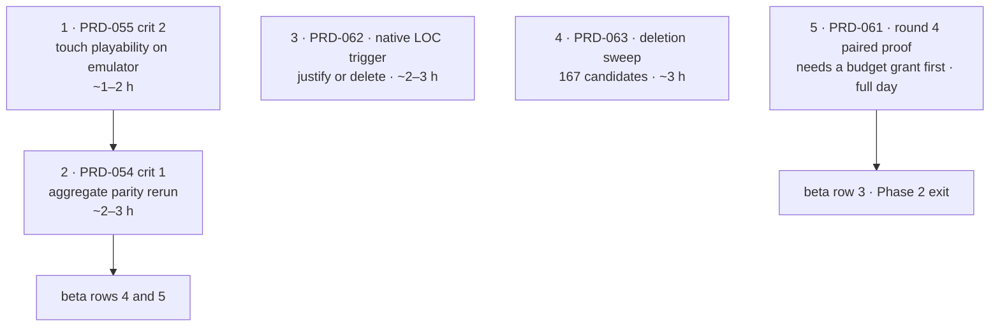

# Batch — 2026-08-10

Five items were sized for one day on **this** machine: no physical device, no Apple hardware,
no hosted release credentials. The two batch PRDs are now closed in `docs/PRDs/done/`; the
other three remain in their owning locations with their separate gate states.

**How the batch was chosen:** every item is executable here today, and every item either
clears an unmet charter obligation or unblocks a `ROADMAP.md` beta row. Items needing a
device, a signing identity or a hosted release run were excluded — that is PRD-056, 057, 058,
059 and 060, all correctly parked in `docs/PRDs/native/blocked/`.

## What the codebase says today

| Reading | Source |
|---|---|
| `native runtime LOC review trigger: 61617 (trigger 50000, +11617)` — fires every run and is now justified by PRD-062 | `node --import tsx/esm scripts/check-budgets.ts`, 2026-08-10 |
| `stop round 3 / Stop condition recorded: budget` — round 4 cannot start until an owner grants budget | `pnpm round:next`, 2026-08-10 |
| 167 unreached exports classified: 48 kept, 106 un-exported, 8 contract-kept, 5 deleted | round-3 ledger, `docs/verification/deletions-2026-08-10.md` |
| Android touch parity landed — the orientation defect that gated three PRDs is fixed | `0995e01`, `d625299`, 2026-08-10 |
| Beta rows 3, 4 and 5 remain the blockers | `ROADMAP.md` |

The touch fix is the reason this batch exists now. `docs/verification/unblocked-2026-08-09-android-touch.md`
recorded one defect terminating three PRDs; it landed on 2026-08-10, so PRD-055 criterion 2
and PRD-054's aggregate rerun became executable in the same hour.

## Order

1 and 2 are sequential — the parity matrix cannot aggregate green while a 053/055 row is red.
3 and 4 are independent of everything and of each other; run them while an emulator run is in
flight. 5 is the highest-value item on the roadmap and the only one that does not fit
alongside the rest.

## The batch

| # | Item | Where | Executable here | Estimate | Why it is in the batch |
|---|---|---|---|---|---|
| 1 | **PRD-055** criterion 2 — playable on touch with no keyboard | [`../native/blocked/PRD-055-native-hud-reopened.md`](../native/blocked/PRD-055-native-hud-reopened.md) | yes — Android emulator | 1–2 h | The blocker was the touch orientation defect. It is fixed and `templates/platformer/src/render/touch-controls.ts` shipped 181 lines of on-canvas controls. Re-run the criterion and close it, or record the red |
| 2 | **PRD-054** criterion 1 — aggregate parity rerun | [`../native/blocked/PRD-054-write-once-run-anywhere.md`](../native/blocked/PRD-054-write-once-run-anywhere.md) | yes — browser + Linux desktop + emulator | 2–3 h | Beta row 4. The matrix could not aggregate while 053 was red; it no longer is. Clean-machine remains a separate, still-unexecuted prerequisite — do not claim it |
| 3 | **PRD-062** — native LOC trigger justification + kill-switch pass | [`../done/PRD-062-native-loc-trigger-justification.md`](../done/PRD-062-native-loc-trigger-justification.md) | complete | 2–3 h | All measured areas have a keep verdict, owning PRDs carry justification, and the 61,617-line residual is recorded without changing the trigger |
| 4 | **PRD-063** — resolve the 167 unreached exports | [`../done/PRD-063-unreached-export-deletion-sweep.md`](../done/PRD-063-unreached-export-deletion-sweep.md) | complete | ~3 h | All 167 candidates have one disposition; five dead exports were deleted and 106 internal-only exports were un-exported |
| 5 | **PRD-061** — round 4, the paired capability proof | [`../PRD-061-round-4-paired-capability-proof.md`](../PRD-061-round-4-paired-capability-proof.md) | yes, but **gated on an owner decision** | full day | The only PRD pointing at beta row 3, the Phase 2 exit gate. `pnpm round:next` refuses to resume: round 3's stop condition is `budget` |

## The one decision this batch needs from the owner

`pnpm round:next` prints `stop round 3 / Stop condition recorded: budget`. That is not
evidence and not a defect — it is the round-3 budget grant having been spent. **Round 4 cannot
start until a new budget is granted.** Grant it and item 5 becomes today's work and items 3–4
slip; withhold it and items 1–4 fill the day and beta row 3 stays unowned for another day.

Recommendation: grant it. Rows 4 and 5 are native plumbing that already has momentum; row 3
is the question of whether anyone should use this framework at all, and it has been unowned
since Phase 2 opened.

## Explicitly not in this batch

| Excluded | Why |
|---|---|
| PRD-056 physical mobile qualification | every criterion needs a physical device or an Apple signing identity |
| PRD-057 native audio parity, PRD-058 perf/observability, PRD-059 SBOM | implementation sits in unsquashed isolated lanes; remaining rows need physical hardware or a hosted release candidate |
| PRD-060 promoted consumer distribution | needs npm, desktop, Android and Apple credentials |
| Raising `LIMITS.nativeRuntimeLoc` | moving a budget is a `CHARTER.md` change, not a task. PRD-062 produces the evidence and stops |
| Anything on `ROADMAP.md` "Not on the roadmap" | closed with evidence in `CHARTER.md` §2 |

**A separate observation, not in the batch:** PRD-057, 058 and 059 each record a lane commit
(`f9e9e95`, `5865937`, `fb222c8`) that is committed but not squashed onto `main`. That is three
bodies of implementation living outside the branch that every gate runs against. It needs a
decision — land behind the blocked rows, or drop — but it is not a today-sized item.
