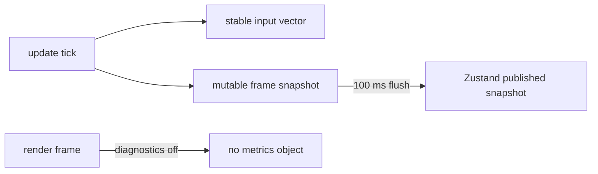

# PRD-189 — The core ordinary frame allocates nothing

**Status:** NOT STARTED

**Complexity:** +2 for 6–10 files, +2 for state/snapshot semantics = **4 → MEDIUM mode**.

## Context

This is an engine bug: every game reaches these paths through `defineGame`; game code cannot
replace them portably. The audit found:

- `InputMap.vector()` creates at least two `Vector2` objects per call.
- `createGameStore().set()` spreads both pending and current state on every loop-rate write.
- `Game` returns fresh empty metric objects while diagnostics are off.
- `FixedStepLoop` creates a new request-frame closure each frame, and input tick still creates a
  predicate closure.

Files analyzed: `packages/core/src/input.ts`, `state.ts`, `game.ts`, `loop.ts`, and their
existing specs. The capability manifest confirms input and state are existing public surfaces; no
new capability is needed.

## Solution

- Cache one stable action vector per binding name, including a distinct zero vector for unknown
  names; two action names must never alias.
- Keep a mutable loop-rate state snapshot separate from Zustand's published snapshot. Mutate the
  former per `set`; allocate/publish only on the existing 100 ms flush.
- Return `undefined` when metrics are disabled and retain one bound frame callback for every rAF
  re-arm.
- Replace input's per-tick `find` predicate with a direct loop.

Data changes: none. Public method names and update timing stay unchanged.

## Integration Ledger

| # | Changed thing | Live caller | Replaces | Negative control |
| --- | --- | --- | --- | --- |
| 1 | Stable action-vector cache | `game.ts` installs `InputMap`; every scene calls `ctx.input.vector` | fresh vectors per call | restore `new Vector2` → identity/allocation test red |
| 2 | Mutable frame-state snapshot | `game.ts` exposes `ctx.state.set`; templates call it in scene updates | two spreads per write | restore current-state spread → pre-flush identity test red |
| 3 | Allocation-free render return | `game.ts` passes the callback to `FixedStepLoop.stepFrame` | fresh `{}` | return `{}` → disabled-metrics test red |
| 4 | Stable rAF callback/direct gamepad scan | `FixedStepLoop.start/#frame` and `InputMap.tick` | closures per frame/tick | inline either closure → callback-identity/source control red |

## Execution Phases

### Phase 1 — Input reads reuse storage without cross-action aliasing

**Files (2):** `packages/core/src/input.ts`, `packages/core/__tests__/input.spec.ts` (both EDIT).

- [ ] Allocate a vector only when a binding name is first observed; mutate it on later reads.
- [ ] Preserve diagonal clamp, relative pointer, gamepad and unknown-binding behavior.
- [ ] Replace `source().find` with a direct first-non-null scan.

**Tests:** `should reuse one vector when the same action is sampled`; `should keep move and aim
vectors independent`; `should report the same values after reuse`. Observe red by restoring
the constructor in `vector()`.

### Phase 2 — State coalesces without loop-rate snapshots

**Files (2):** `packages/core/src/state.ts`, `packages/core/__tests__/state.spec.ts` (EDIT; use
the existing state spec if named differently).

- [ ] Separate the mutable immediate-read snapshot from Zustand's last published object.
- [ ] Merge patches into reusable pending storage; keep function patches reading the latest value.
- [ ] Preserve one subscriber notification per flush and stop's final flush.

**Tests:** repeated pre-flush `set` calls keep `getState()` identity stable and latest values
visible; a flush publishes once; a retained published snapshot is never mutated. Reintroducing the
spread must make the identity test red.

### Phase 3 — The fixed loop reuses its callback and emits no disabled metrics object

**Files (4):** `packages/core/src/game.ts`, `packages/core/src/loop.ts`,
`packages/core/__tests__/game.spec.ts`, `packages/core/__tests__/loop.spec.ts` (EDIT).

- [ ] Return no metrics when collection is disabled.
- [ ] Bind/store the frame callback once and reuse it in `start` and every re-arm.
- [ ] Verify collection-on samples remain byte-for-byte equivalent.

**Tests:** a request-frame stub sees one callback identity across 120 frames; disabled metrics
collect zero samples and no empty record; enabled metrics still carry frame time, draws and
triangles. Inline a new closure to observe red.

## Verification

Record commands and negative controls in
`docs/verification/prd-189-core-frame-allocations-<date>.md`.

1. Run focused core specs with each control mutation, then restored green.
2. Run a 10,000-frame Node allocation probe with input reads and state writes; report heap/GC
   before and after, never infer zero from timing alone.
3. Run `pnpm --filter @threenative/core test`, then root typecheck/lint/test/budgets.
4. Run the starter playtest on browser WebGPU; movement and HUD state must still change.

## Acceptance Criteria

- [ ] A normal game can sample `move`, write state and render with diagnostics off for 10,000
      frames without core creating one object per frame on these paths.
- [ ] Immediate `state.getState()` reads stay current while React subscribers remain throttled.
- [ ] Retained action vectors for different names and retained published state snapshots do not
      corrupt one another.
- [ ] Every gate has a pasted red caused by reverting the corresponding reuse.

