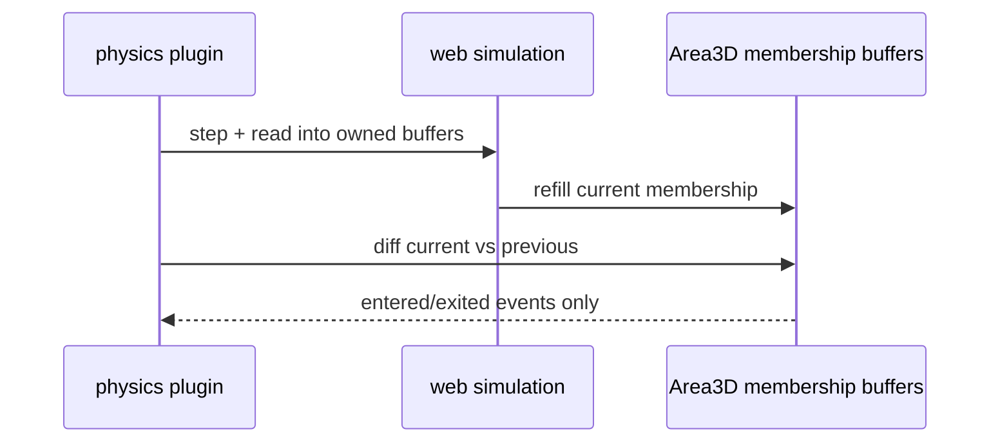

# PRD-191 — Physics feature frames reuse their crossing storage

**Status:** NOT STARTED

**Complexity:** +2 for 6–10 files, +2 for backend-sensitive state = **4 → MEDIUM mode**.

## Context

This is a physics-package bug. Trigger games allocate a map per area in `plugin.ts` and a set plus
callback per `areaIntersections()` in web `simulation.ts`, even with no overlap. The web
visible-transform path also receives fresh Rapier translation/rotation wrappers per body and
`characterState()` creates a record per character. Native already crosses in reusable typed
arrays; the shared node contract must stay identical.

Files analyzed: `packages/physics/src/plugin.ts`, `simulation.ts`, area/plugin/parity specs, and
`scripts/bench-allocations.ts`.

## Solution

- Keep current/previous Area3D membership maps per registered area and clear/swap them each step.
- Keep one simulation-owned read-only membership set per area; absence returns a stable empty view,
  never a new set. The plugin remains its pre-existing live consumer.
- Read Rapier transforms directly into the existing typed record when the pinned API permits it;
  otherwise contain wrapper creation behind one measured adapter and record the irreducible cost.
- Refill a reusable character-state record rather than constructing one per query.

## Integration Ledger

| # | Changed thing | Live caller | Replaces | Negative control |
| --- | --- | --- | --- | --- |
| 1 | Per-area membership buffers | `plugin.ts:beforeUpdate` registration loop | new Map per area/step | restore local Map → stable-buffer test red |
| 2 | Stable area intersection views | plugin calls web/native simulation seam | new Set and callback | return a new Set → identity test red |
| 3 | Typed transform writes | `plugin.ts` calls `readVisibleTransforms` every step | Rapier compat wrapper temporaries | restore wrapper path → allocation probe red |
| 4 | Reusable character state | character update/query path in `simulation.ts` | record per character/frame | restore record literal → reuse test red |

## Execution Phases

### Phase 1 — Both simulations return stable Area3D membership views

**Files (4):** `packages/physics/src/simulation.ts`,
`packages/physics/src/native/host.ts`, `packages/physics/__tests__/area.spec.ts`, and
`packages/physics/__tests__/parity.spec.ts` (EDIT).

- [ ] Refill simulation-owned sets without exposing mutable storage to game callbacks.
- [ ] Return one stable empty view for absent/empty areas on both backends.
- [ ] Preserve genuine web/native backend identity and exact membership values.

Observe red by restoring either per-call `new Set`. The pre-existing plugin is already the
non-test caller, so this phase reaches running games without new registration.

### Phase 2 — The plugin reuses current/previous reconciliation maps

**Files (3):** `packages/physics/src/plugin.ts`,
`packages/physics/__tests__/area.spec.ts`, and
`packages/physics/__tests__/plugin.spec.ts` (EDIT).

- [ ] Clear/swap per-area current and previous maps instead of constructing them per step.
- [ ] Emit each enter/exit edge exactly once across empty, overlap, separation and disposal.
- [ ] Remove a disposed area's buffers in the same scene-exit path that removes the node.

Observe red by restoring the per-step map constructor. Existing Area3D event tests are the
pre-existing flow that must break when reconciliation is disabled.

### Phase 3 — Web Rapier boundary writes into reusable records

**Files (4):** `packages/physics/src/simulation.ts`,
`packages/physics/__tests__/plugin.spec.ts`, `parity.spec.ts`,
`packages/physics/scripts/bench-allocations.ts` (EDIT).

- [ ] Use the hardest subject: 120 moving bodies, 120 characters and 120 empty/active areas.
- [ ] Preserve sleeping, quaternion order, character grounding and collider membership.
- [ ] If pinned Rapier cannot fill a target, record that exact residual instead of reaching into an
      unstable raw API.

## Verification

Record `docs/verification/prd-191-physics-crossing-storage-<date>.md`.

1. Run each focused spec with a constructor/reuse control observed red.
2. Run `NODE_OPTIONS=--expose-gc pnpm --filter @threenative/physics exec tsx
   scripts/bench-allocations.ts`; paste allocations, GC events and wall time.
3. Run web/native parity and prove the two backends resolve to different implementations.
4. Run one Area3D playtest on browser WebGPU and desktop native.

## Acceptance Criteria

- [ ] Empty Area3D feature frames allocate no map/set/callback per registered area.
- [ ] Enter/exit event sequences remain identical on real web Rapier and native parity subjects.
- [ ] Visible transforms and character state retain exact values while reusable storage stays
      bounded at the high-water mark.
- [ ] Any irreducible third-party wrapper is named and measured; no “zero allocation” claim hides it.
