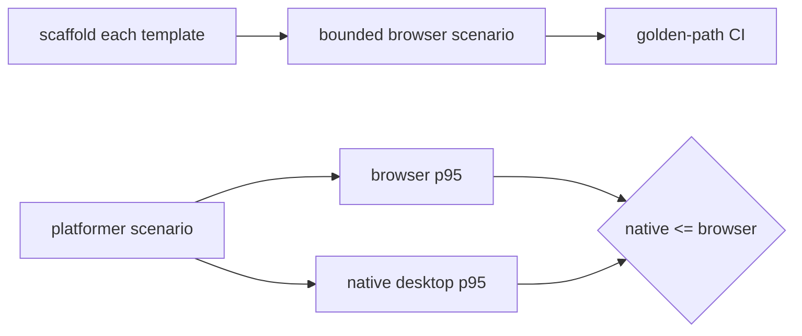

# PRD-194 — Every template carries a real performance proof

**Status:** NOT STARTED

**Complexity:** +3 for 10+ files = **3 → LOW mode**. Performance-sensitive manual verification
is required.

## Context

The assertion machinery is already real and fail-closed. Usage is not: only platformer's
`performance.playtest.json` has bounds; starter and minimal carry empty objects; action-RPG,
defense, racing and shooter have none. The platformer reference workload also lacks the Charter's
same-machine browser/native parity proof.

This PRD changes scenarios and their execution wiring, not the playtest assertion vocabulary.
PRD-186 Phase 3 keeps ownership of in-game `FrameStats`.

## Solution

- Give each template one dedicated production workload at 1920×1080 with
  `maxFrameMsP95: 33`; measure and pin workload-specific draw/triangle ceilings.
- Replace starter/minimal's empty placeholders with those bounded scenarios; no empty
  `performance: {}` remains in shipped templates.
- Derive draw/triangle ceilings from ten clean browser WebGPU runs after PRD-193: observed maximum
  plus 10% headroom, rounded up. Record raw runs and adapter identity.
- Run the exact platformer scenario on browser and native desktop on the same machine; native p95
  must be no slower than browser p95. Mobile remains explicitly open under §10a.

## Integration Ledger

| # | New/changed thing | Live caller | Replaces | Negative control |
| --- | --- | --- | --- | --- |
| 1 | Six bounded template scenarios | `verify-golden-path.ts` runs each scaffold's playtest glob | four absent + two empty proofs | set `maxDrawCalls: 0` → each scenario exits 1 |
| 2 | Scenario required-set gate | create-threenative template tests | platformer-only pin | delete one scenario → test names template red |
| 3 | Platformer desktop parity run | native desktop playtest runner | web-only proof | slow native arm/invert comparison → parity gate red |
| 4 | Committed raw measurement record | verification record linked from this PRD | undocumented threshold guesses | remove one of ten runs → completeness check red |

## Execution Phases

### Phase 1 — Four genre templates gain measured, bounded scenarios

**Files (5):** add `performance.playtest.json` to action-RPG, defense, racing and shooter; EDIT
`packages/create-threenative/__tests__/template.spec.ts` to require those four plus platformer's
existing non-empty performance scenario.

- [ ] Scaffold these four templates from packed local packages and run the chosen workload ten
      times with browser WebGPU and adapter info.
- [ ] Freeze draw/triangle ceilings by the declared formula, then add `maxFrameMsP95: 33`.
- [ ] Drive real gameplay for at least 600 fixed ticks after 60 warmup frames.
- [ ] Observe `maxDrawCalls: 0` failing each scenario with the named assertion error.

### Phase 2 — Existing placeholders become bounds and the reference proves desktop parity

**Files (4):** `templates/starter/playtests/play.playtest.json`,
`templates/minimal/playtests/play.playtest.json`, and
`packages/create-threenative/__tests__/template.spec.ts` and
`packages/create-threenative/__tests__/platformer.spec.ts` (EDIT).

- [ ] Measure starter/minimal ten times, replace each empty object with the 33 ms and derived
      draw/triangle ceilings, and retain platformer's existing bounded scenario.
- [ ] Broaden the required-set test from five templates to every discovered template.
- [ ] Run `packages/runtime-native/scripts/profile-production.mjs` so the exact platformer
      scenario executes on browser and native desktop on the same machine.
- [ ] Compare separately identified raw p95 arms; native must be no slower than browser.
- [ ] Remove the runtime performance provider and observe the missing-capability error; keep mobile
      open unless a physical-device run actually executes.

## Verification

Run `pnpm test:templates`, focused scenario-schema/evaluator specs, the seven browser scenarios,
and the platformer desktop parity arm. Then run root gates. Paste commands, exit codes, adapter,
viewport, sample count, actual values and every negative control.

## Acceptance Criteria

- [ ] Grepping shipped template scenarios finds seven non-empty `performance` assertions and zero
      empty ones.
- [ ] Every generated template's bounded browser scenario runs in the existing golden-path flow.
- [ ] Platformer meets 33 ms p95 on browser and native desktop is no slower on the same machine.
- [ ] Missing samples, a false bound and a missing provider each fail with the named error.
