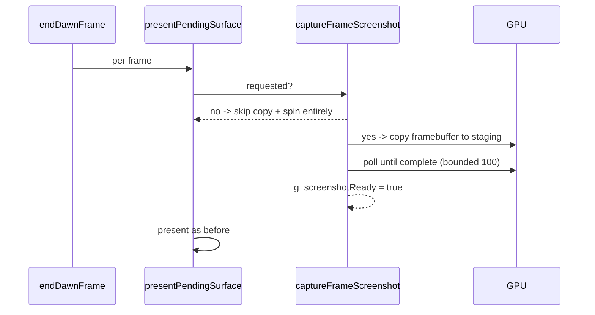

# PRD-168 — Gate the present-path framebuffer capture behind a request

Complexity: 6 → HIGH mode (long native build; correctness-sensitive capture semantics)

## Context

Every presented native frame pays for a screenshot nobody requested. `endDawnFrame()`
(`packages/runtime-native/src/webgpu/bindings.cpp:6189`) runs per frame from the main loop and
calls `presentPendingSurface()` (`:6101`), whose first statement is an **unconditional**
`captureFrameScreenshot()` (`:6107`). Inside, the only gate is
`g_surfaceRenderPassEnded && !g_screenshotCapturedThisFrame && screenshotTexture && g_device
&& g_queue` (`:6020`) — there is no "a screenshot was requested" condition anywhere. On every
normal rendered frame this:

1. allocates/reuses a full-res MAP_READ staging buffer (~10 MB at 1080×2400 BGRA),
2. encodes + submits a whole-framebuffer `wgpuCommandEncoderCopyTextureToBuffer` (`:6046-6068`),
3. spins a fixed 100 iterations of `wgpuDeviceTick`/`wgpuDevicePoll` +
   `wgpuInstanceProcessEvents` with **no completion predicate** (`:6075-6084`),
4. sets `g_screenshotReady = true` (`:6086`) regardless of whether any consumer exists.

The trigger flag `g_surfaceRenderPassEnded` is set on every normal frame's render-pass end and
reset each frame at `:6145-6146`, so the gate passes every frame the game renders anything.

Consequences: serialised GPU work ahead of every present; bandwidth, latency and battery cost
in shipped games on all platforms; and **a hidden tax inside every native measurement** — load
test ladders, js-engine comparisons and conformance timings all pay it, so PRD-069's "true
native floor" figures carry it too.

This is a native-runtime problem: the fix lives in `bindings.cpp` (+ wherever screenshot
requests originate), not in game code.

## Solution

- Add a request flag (`g_screenshotRequested`). `captureFrameScreenshot()` does nothing unless
  it is set alongside the existing conditions.
- Raise the flag exactly where a consumer is about to read the capture: the playtest screenshot
  request path (`processPlaytestScreenshotRequest`, `src/runtime.cpp:900/740-750`), the
  conformance/screenshot bindings, and any verify script entry that reads `isScreenshotReady`.
  Find every setter/consumer of `g_screenshotReady` and `isScreenshotReady` before choosing the
  set — completeness is the acceptance criterion, and a missed consumer means that lane loses
  its screenshots.
- Clear the flag once the frame's capture has been consumed (or at frame reset), never leaving
  a stale request capturing frames forever.
- When a capture IS requested, keep the current behaviour byte-identical (copy → bounded wait →
  ready). Additionally add an early exit to the 100-iteration spin: break as soon as the device
  poll reports completion or the buffer map state advances; keep 100 as the upper bound so the
  worst case cannot regress.
- The unrelated present-counting fix of commit `473f9f37` stays untouched.

Data changes: none.

## Integration Ledger

| # | Thing built | Live caller | Replaces | May claim green when | Negative control |
|---|---|---|---|---|---|
| 1 | Request-gated capture | `bindings.cpp:6107` call site reads the new flag | unconditional per-frame capture | a normal frame issues zero copy commands (instrumented counter or verbose-log absence) | force the flag true unconditionally → desktop ladder regresses to pre-fix numbers |
| 2 | Request sources raise/clear the flag | playtest screenshot path + conformance/screenshot consumers | consumers relied on always-captured frames | `pnpm native:verify:desktop` still produces its non-blank screenshot | break only the raise site → verify:desktop fails non-blank-screenshot criterion |
| 3 | Completion-bounded wait | `bindings.cpp:6075-6084` loop | fixed 100 iterations even when done early | requested-path screenshots identical (pixel-compare one capture before/after) | remove the completion check → capture still succeeds but wait returns to worst case |

## Execution Phases

### Phase 1: map the consumers, then land the gate

**Files (3+):**

- `packages/runtime-native/src/webgpu/bindings.cpp` - EDIT: add `g_screenshotRequested`; gate `captureFrameScreenshot()`; early-exit the wait loop.
- `packages/runtime-native/src/runtime.cpp` - EDIT: raise/clear the flag around real screenshot requests.
- Any additional consumer file found by grepping `g_screenshotReady|isScreenshotReady|saveScreenshot` across `packages/runtime-native/src/` - EDIT identically.
- `docs/verification/prd-168-present-capture-<date>.md` - NEW: evidence record.

**Implementation:**

- [ ] Grep + list every screenshot consumer; each one named in the PR's evidence with how it raises the flag.
- [ ] Land the gate; normal frames execute no copy and no wait iterations (assert via a debug counter or existing verbose log).
- [ ] Early-exit wait when completion is observable; document which wgpu signal was used.

**Wiring:**

- [ ] Caller edited: `presentPendingSurface()` is the production path (`endDawnFrame`).
- [ ] Registration: every consumer that reads a capture now requests it first.
- [ ] Old path: unconditional capture removed; no dead flag remains.
- [ ] Ledger rows filled.

**Tests Required:**

| Test File | Test Name | Assertion | Negative control (observed red) |
|---|---|---|---|
| desktop verify lane | `pnpm native:verify:desktop` after the change | 300 frames, markers, **non-blank screenshot identical to pre-change capture** (save both, pixel-diff or hash) | revert only the raise site → verify fails its screenshot criterion; paste exit code |
| measurement lane | engine-load-test desktop arm, before vs after | p50 ms/frame improves by a measured delta recorded in the verification file | re-introduce unconditional capture → delta disappears |

**Verification Plan:** `pnpm native:build` (long; run first). Then
`pnpm native:verify:desktop`, `node packages/runtime-native/conformance/run-conformance.mjs`
(no row silently blocked), and one engine-load-test desktop ladder A/B
(`artifacts/engine-load-test/*prd-168*.json`). Record everything in the dated verification
file. Android device numbers are NOT claimed by this batch (HIGH lane, optional): if the phone
is cool enough, one `native-smoke` uncapped rung comparison may be added, labelled with serial
and thermal state.

**User Verification:** run any native example; gameplay looks identical, and (with verbose
logging on) no `[Screenshot] Copying` line appears per frame anymore.

### Phase 2: re-baseline note

- [ ] Add one paragraph to `docs/verification/prd-168-…md`: prior native baselines carried this
      tax; comparisons across the boundary must name which side of PRD-168 they were taken on.

## Acceptance Criteria

- [ ] A rendered native frame that nobody screenshotted performs zero framebuffer copies and zero
      capture-wait iterations (evidence: instrumented counter or log absence, pasted).
- [ ] Every screenshot-consuming lane still captures correctly; `pnpm native:verify:desktop`
      exits 0 with a non-blank screenshot, and conformance reports no silently blocked rows.
- [ ] A desktop load-test A/B records the recovered frame-time delta in
      `docs/verification/prd-168-…md` with artifacts.
- [ ] No platform result is claimed that did not execute; Android/iOS stay explicitly unverified
      unless actually run.
- [ ] `pnpm typecheck && pnpm lint && pnpm test && pnpm budgets` pass (census re-run if native LOC moved).

## Checkpoint Protocol

Record exact commands, exit codes, the consumer inventory, and the A/B artifacts. A green-only
checkpoint with no measured delta is UNVERIFIED and blocks delivery.

## Results — 2026-08-22

EXECUTED on desktop Linux. Request gate landed; playtest mailbox became a bounded pending
state machine; early-exit wait descoped and recorded. `pnpm native:verify:desktop` exit 0;
desktop ladder −3.0/−3.2 ms p50 at 164/629 draws, ≥2 469 unresolvable under machine contention
drift. Evidence: `docs/verification/prd-168-present-capture-2026-08-22.md`. Device lanes
unverified.
