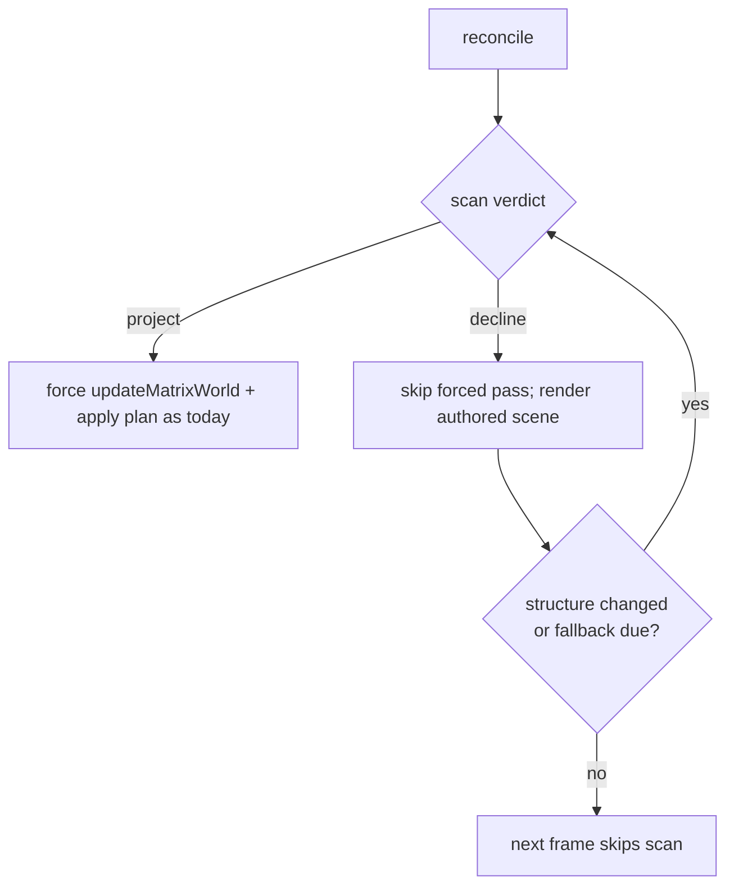

# PRD-169 — The projection declines a scene without re-judging it every frame

Complexity: 5 → standard

## Context

`SceneRenderProjection` is the framework's opportunistic draw optimiser: below `minMeshes`
(default **200**, `packages/core/src/renderProjection.ts:117`) eligible meshes it declines and
the authored scene renders directly. Most agent-built scenes sit below the floor, so the common
case is *permanent decline* — and permanent decline still pays full price every rendered frame:

- `game.ts:530` calls `this.#projection?.reconcile()` unconditionally in `onRender`.
- `reconcile()` (`renderProjection.ts:145-184`) first forces
  `this.#source.updateMatrixWorld(true)` (`:149`) — a whole-scene matrix recompose that defeats
  three's dirty flags.
- It then runs the full classification scan `scanProjection(this.#source, this.#minMeshes)`
  (`:162`) — per-object parent-chain probes (LOD checks), string-keyed batch keys
  (`projection-plan.ts:49-58,251`), fresh `Set`/array collections per frame
  (`projection-plan.ts:188-193,225`).
- Only then does it read the verdict, release everything, and hand the authored scene back.

The forced matrix pass on the declined path is pure duplicate work: when the authored scene is
what the renderer draws, three's own render refreshes world matrices. The audit estimates
0.3–1 ms/frame at ~1k objects on desktop, several ms on mobile, plus steady GC churn — paid in
full by exactly the games that get zero benefit.

This file's own doc comment states the contract any fix must keep: *"Correct rendering is
unconditional; optimization is opportunistic"* and *"Everything the mirror asserts about a
source is re-derived here rather than remembered"*. A stale "declined" while the scene grew past
the floor must resolve within bounded frames; nothing may render wrongly even once.

## Solution

Two independent cuts; land both, each behind its own test.

**Cut A — declined frames stop forcing matrices (S).**
Reorder so the scan/verdict runs before the forced pass. On the declined path skip
`updateMatrixWorld(true)` entirely: the renderer refreshes the authored scene itself during
`render()`. On the projecting path keep today's behaviour verbatim (the mirror needs fresh
matrices because the authored scene is not what renders).

- Verify first that `scanProjection` never reads `matrixWorld` (it classifies by geometry,
  material, visibility and parents). If any read exists, this cut needs that read made lazy or
  the cut re-scoped — STOP and report rather than improvising.

**Cut B — a declined verdict is re-checked cheaply, not free-of-charge every frame (M).**
While declined, replace the per-frame full scan with:

1. structural invalidation via the source scene's `added`/`removed` events (three `Object3D`
   dispatches both on reparent), scheduling one rescan;
2. a low-frequency fallback rescan (e.g. every 60 declined frames) catching non-structural
   changes events cannot see;
3. first frame after construction always scans (today's semantics).

The projected path keeps its existing per-frame reconcile unchanged — its correctness story is
different and already tested.

Residual gap to document honestly: a mesh whose *material swaps from absent to present* while
below the floor neither fires added/removed nor changes renderable count in a way events see;
the 60-frame fallback bounds it.

Data changes: none.

## Integration Ledger

| # | Thing built | Live caller | Replaces | May claim green when | Negative control |
|---|---|---|---|---|---|
| 1 | Declined-path matrix-pass skip | `renderProjection.ts:149` branch | unconditional forced pass | unit test shows zero `updateMatrixWorld(true)` calls on settled declined frames; moved objects still render correctly through the authored scene | restore unconditional call → spy sees the call again |
| 2 | Event + cadence invalidation while declined | `game.ts:530` reconcile entry | full scan every declined frame | adding meshes past the floor flips to `projected` within ≤61 frames in a test; removing them deoptimizes likewise | remove the event listener → flip takes until the fallback tick, asserting the bound fails |
| 3 | Reconcile-cost evidence | bench scenario recording ms/frame before/after at 0 / 250 / 2000 objects | unmeasured claim | dated verification file with numbers | revert Cut A → cost returns |

## Execution Phases

### Phase 1: Cut A

**Files (4):**

- `packages/core/src/renderProjection.ts` - EDIT: order scan-before-force; skip force on decline.
- `packages/core/__tests__/renderProjection.spec.ts` (or the file that owns these tests today) - EDIT: new cases.
- `packages/core/src/game.ts` - only if the reconcile call site needs a hint flag; prefer no change.
- `docs/verification/prd-169-projection-decline-<date>.md` - NEW.

**Tests Required:**

| Test File | Test Name | Assertion | Negative control |
|---|---|---|---|
| renderProjection spec | declined frames do not force-update matrices | stub scene records `updateMatrixWorld` calls; after settle, declined frames record none; renderer-side update still leaves world matrices correct for a moved object | restore the unconditional call → red with the recorded-call assertion |
| renderProjection spec | projected frames still force-update | mirror-projecting frames record the forced pass | remove the projecting-branch call → red |

### Phase 2: Cut B

**Files:** `renderProjection.ts` (event listeners + cadence state + dispose cleanup),
its spec file, verification record.

**Tests Required:**

| Test File | Test Name | Assertion | Negative control |
|---|---|---|---|
| renderProjection spec | growth past the floor projects within bound | 300-mesh scene added under the floor flips `deoptimized=false` within ≤61 frames | delete the event wiring → flip waits for fallback; assert-bound test goes red |
| renderProjection spec | shrink deoptimizes within bound | inverse of above | same mutation shape |
| renderProjection spec | dispose detaches listeners | re-added scenes after dispose produce no callbacks/errors | remove listener cleanup → leak assertion red |

**Verification Plan:** focused core suite → `pnpm typecheck && pnpm lint && pnpm test`. Bench:
one browser playtest scenario over `examples/engine-load-test` arms at 0/250/2000 objects
recording p50 ms/frame before/after (before = commit under test's parent, measured locally,
artifacts saved). Existing projection playtests/conformance rows stay green.

**User Verification:** scaffold the starter template; console still prints
`TN_RENDER_PROJECTION:{...}` on load with the same verdicts as before.

## Acceptance Criteria

- [ ] Settled declined frames perform no forced whole-scene matrix pass and no full scan
      (both asserted by tests that were observed red against the reverted code).
- [ ] Verdict transitions in either direction resolve within the documented bound; the residual
      material-swap gap is written down, not hidden.
- [ ] Projecting-path behaviour is byte-for-byte today's: all existing projection specs and any
      conformance/playtest rows green without edits to their expectations.
- [ ] Measured reconcile cost before/after recorded with artifacts.
- [ ] No public API change; `minMeshes`, reasons and reports unchanged.
- [ ] `pnpm typecheck && pnpm lint && pnpm test` pass.

## Checkpoint Protocol

Each phase: paste the red observation (exact assertion failure) before the fix, the green after,
and the bench artifact. A phase whose negative control was never observed red blocks delivery.

## Results — 2026-08-22

EXECUTED (`a8893660`). Cut A: scan-before-force; declined frames run no matrix pass. Cut B
simplified to a bounded rescan cadence only — three's `added`/`removed` events fire on the
child, not the root, so per-object listeners would be their own per-frame cost; documented in
the reconcile doc comment. Recovery from settled decline is cadence-bounded; the existing
reversibility test was updated to that contract with its reasoning inline. Core suite green.
Ledger row 3's load-test bench was NOT run: the removed pass is the same per-frame-churn class
PRD-170 measured below instrument resolution, and the structural skip is proven by the spy
tests; an end-to-end reconcile-cost bench remains available if wanted.
