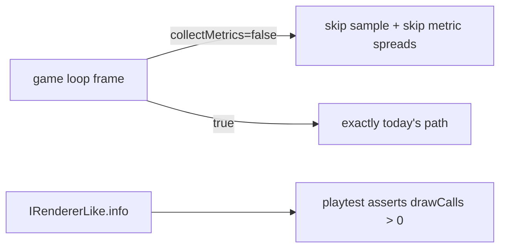

# PRD-172 — Diagnostics cost nothing until asked: `renderer.info` and on-demand render metrics

Complexity: 3 → standard

## Context

Two verified facts, one contract gap and one tax:

1. **A game cannot count its own draws.** `wrapRenderer`
   (`packages/core/src/renderer.ts:156-216`) exposes `domElement, kind, raw, compileAsync,
   compute, render, renderOverlay, setOutputNode, setSize` — not `info`. PRD-069 §3.1/§3.3 and
   criterion 7 own this exact item: without it no game can apply a draw-count lever on evidence,
   and playtest cannot assert draw counts. PRD-069's convention is fail-closed: an unavailable
   capability **throws** (see `setOutputNode` on webgl2, `renderer.ts:205-207`), it never
   returns `undefined`.
2. **Render metrics are collected every frame for a reader that is almost never there.**
   `FixedStepLoop.stepFrame` (`packages/core/src/loop.ts:104-118`) builds a sample object per
   frame via conditional spreads, pushes it, and `.shift()`s at the 1,024 cap; upstream,
   `game.ts` builds 1–2 metrics objects per frame (`game.ts:535-551`,
   `rendererPerformanceMetrics` at `:221-241`, `addRenderPerformanceMetrics` at `:243-255`).
   The sole consumer chain is `game.ts:580 runtimeDiagnosticsSeries → playtest.ts:50-60 →
   packages/playtest observations`. No production reader exists — every shipped game pays
   ~2–4 allocations/frame for diagnostics only a performance assertion consumes.

## Solution

1. **`info` on `IRendererLike`.** A getter returning `raw.info`; when the underlying renderer
   has none, throw with the same shape as `setOutputNode`'s error ("info is unavailable on the
   {kind} renderer."). One-page API rule: this is a contract fix owned by PRD-069 criterion 7,
   recorded here, not new surface invention.
2. **Sampling behind a consumer.** `IFixedStepLoopOptions` gains `collectMetrics?: boolean`
   (default false). When false, `stepFrame` skips building samples AND `onRender`'s return value
   is ignored for sampling; `game.ts` sets it from whether the playtest bridge installed
   `runtimeDiagnosticsSeries`. When true, behaviour is byte-identical to today.
3. **Prove it end-to-end.** One browser playtest scenario asserts `drawCalls > 0` read through
   the framework handle (no `.raw`) during a rendered run — the first consumer-scoped proof of
   criterion 7's web half.

Data changes: `IRendererLike` gains `info` (documented as throwing when absent);
`IFixedStepLoopOptions` gains optional `collectMetrics`.

## Integration Ledger

| # | Thing built | Live caller | Replaces | May claim green when | Negative control |
|---|---|---|---|---|---|
| 1 | `info` exposure | any game reading `ctx.renderer.info.render.drawCalls` | reach-through-`.raw` or nothing | scenario reads non-zero drawCalls through the wrapper | stub renderer without info → call throws (not undefined) |
| 2 | On-demand sampling | `game.ts` loop construction | unconditional per-frame collection | unit shows zero samples accumulated when disabled; existing diagnostics series test green when enabled | force collectMetrics=true off-path → samples reappear |
| 3 | drawCalls observation proof | playtest scenario in an example/template fixture | unprovable claim | scenario exit 0 naming the observed count | assert ceiling of 0 draws → red with measured count |

## Execution Phases

### Phase 1

**Files (6):**

- `packages/core/src/renderer.ts` - EDIT: add `info` getter + interface field + doc.
- `packages/core/__tests__/renderer.spec.ts` (or owner file) - EDIT: throw-case + pass-through cases.
- `packages/core/src/loop.ts` - EDIT: `collectMetrics` gate.
- `packages/core/src/game.ts` - EDIT: pass the flag from bridge installation; skip metric object construction when disabled.
- `packages/core/__tests__/loop.spec.ts` - EDIT: sampling cases.
- one example/template playtest scenario JSON + its fixture page - EDIT/NEW: the drawCalls assertion.

**Tests Required:**

| Test File | Test Name | Assertion | Negative control (observed red) |
|---|---|---|---|
| renderer spec | info throws when absent | webgl-ish stub lacking info → construct access throws named error | return-instead-of-throw mutation → red |
| renderer spec | info passes through | stub with info returns same object identity | n/a |
| loop spec | no samples when disabled | N stepFrames with flag false → `runtimeDiagnosticsSeries().length === 0`, zero metric callbacks invoked | default-on mutation → red |
| loop spec | identical samples when enabled | flag true reproduces today's series exactly | n/a |
| scenario | drawCalls observed > 0 | runner reports the count; exit 0 | ceiling 0 → exit non-zero naming count |

**Verification Plan:** focused core suite → `pnpm typecheck && pnpm lint && pnpm test` →
the new scenario under `sh scripts/xvfb.sh … --browser-recipe webgpu` (check adapter.info).
Record in `docs/verification/prd-172-diagnostics-<date>.md`.

**User Verification:** in a scaffolded game, `console.log(game.ctx.renderer.info.render.drawCalls)`
after a frame prints a number.

## Acceptance Criteria

- [ ] A game reads `renderer.info` without `.raw`; absence throws, never returns undefined (red observed).
- [ ] Games without a diagnostics consumer build zero metric objects per frame (red observed).
- [ ] With a consumer, the series is unchanged (existing tests green unedited).
- [ ] One scenario proves end-to-end drawCalls observation on browser WebGPU.
- [ ] `pnpm typecheck && pnpm lint && pnpm test` pass; capabilities manifest regenerated if the export surface moved (`pnpm build`).

## Checkpoint Protocol

Reds pasted for both negative controls; scenario output naming the adapter and count. Unexecuted
platforms stay unnamed.

## Results — 2026-08-22

EXECUTED (`656eba69`, `36426fe0`). info fails closed; collection behind
enableRuntimeDiagnostics; playtest plugin announces when a runner is expected. End-to-end
scenario proves drawCalls observed on browser WebGPU (performance.samples and maxDrawCalls
pass); overall exit 1 from pre-existing popErrorScope console noise identical at HEAD.
Evidence: `docs/verification/prd-172-diagnostics-2026-08-22.md`.
