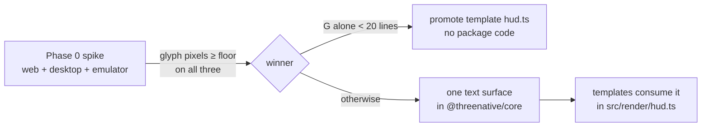

# PRD-209 — the framework ships portable screen-space text, and nothing else

**Status: CLOSED — G-only.** Phase 0 ran and exercised the clause this PRD wrote for itself:
*"If a game reaches readable text in under 20 lines using candidate G alone … this PRD closes
having shipped G's promotion and no package code."* It does, in three statements. **No package
code was written, and none should be.** Phases 1 and 2 are moot as written — Phase 1's chosen
surface is the template file that already exists and is already consumed by
`templates/minimal/src/scenes/Play.ts`.

Evidence: `docs/verification/prd-209-2026-08-23.md`. In one line: one unbranched source renders
`SCORE 1200` to **2 152 bright glyph pixels, bounds `[49,56,313,85]`, on web, on the Linux desktop
native host, on the Android emulator and on a physical Pixel 8** — `pixelMismatchRatio` 0 against
the browser reference on all three native lanes — while the SDF-atlas arm costs 53 % more source
and renders it as `2COKE ]500`.

What shipped instead of a package: the convention, in the two template `AGENTS.md` files that were
getting it wrong (`starter` called a native HUD optional; `minimal` described a DOM readout its own
`main.ts` does not have), plus the instruction-budget override those words needed
(`docs/verification/instruction-budgets-2026-08-23.md`).

Still open, and neither is a text problem: row 31 on the physical Pixel 8 needs the phone unlocked
by its owner, and row 25's `0.0221` pixel drift on that device belongs to PRD-214. PRD-055's
recorded ADB blocker was retried and is **stale** — both an emulator and the Pixel 8 were driven
from this lane today — but its criterion 2 (touch playability) is untested here and stays with it.

**Original status:** NOT STARTED

**Complexity:** +2 for multi-package changes (core + create-threenative templates), +2 for a new
system (portable text surface) = **4 → MEDIUM mode**. Phase 0 is a spike whose result can close
this PRD without any package change (see below).

## Context

On Android the Bayview build renders its world correctly and shows **no HUD, no crosshair, no
minimap, no loading screen and no touch controls**. The installed APK contains zero occurrences of
`LOADING` and zero of `createRoot`: every UI piece mounts through React DOM from `src/main.ts`,
which the native host never executes (`threenative.config.ts` sets `nativeEntry: "src/game.ts"`).
Evidence and APK inspection: `docs/verification/mobile-stability-2026-08-23.md` §2,
`docs/bugs/mobile-stability-2026-08-23.md` bug 2.

This is structural, decided twice:

- PRD-051 chose candidate D (`@threenative/ui` stays web-only). PRD-055 reopened it with a real
  game's cost table — 330 lines of per-game HUD plumbing that is not about any game — and sits
  BLOCKED in `docs/PRDs/BLOCKED/requires-touch-evidence/` recommending "**G now, E next**".
- On 2026-08-23 João decided the fix layer from device evidence: framework work in `packages/`,
  candidate **E** — the framework ships portable screen-space text and nothing else; games compose
  their own HUD from it. Rule 3 holds because colour, size, layout and content stay the game's.

Prior art already passing in-tree: `templates/minimal/src/render/hud.ts` (69 lines, 5×7 bitmap
font drawn as an `InstancedMesh` of quads — portable because it is geometry); conformance rows
`25-camera-parented-overlay`, `30-screen-space-text`, `31-hud-readout-updates` are all
`implemented` and `required` with `desktopGate: true` (`packages/runtime-native/conformance/registry.json:315,380,393`).

What killed earlier candidates must not be repeated: a Canvas2D-texture HUD measured 1,939 bright
text pixels in the browser and **0** on the desktop host (PRD-051). Nothing yet has proven a
portable *text* path beyond the template's instanced-quads trick — that is Phase 0's job.

## Solution

- **Phase 0 (spike, decides everything):** prove one source renders legible text in screen space
  on web, Linux desktop native and the Android emulator, measured by bright-glyph pixel counts —
  the instrument that killed candidate A. Two arms: the template's instanced-quads bitmap approach
  promoted toward a reusable form, and an SDF-atlas arm. Record authored line counts per arm.
- If a game reaches readable text in under 20 lines using candidate G alone (generated
  `src/render/hud.ts` copied into every project), this PRD closes having shipped G's promotion and
  **no package code**. Otherwise implement the winning arm as one portable text surface in
  `@threenative/core` (mechanism: glyph geometry, atlas, layout-of-a-single-string; never widgets,
  styles, or look).
- Templates' generated `hud.ts` becomes the reference consumer either way.

**Key decisions**

- Text is **mechanism**: the game supplies string, size, colour, position, and update timing.
  No widget, no layout system, no style ever enters `packages/`.
- The spike fails closed: a missing or blank capture on any target is a failed spike, never a
  skipped one.
- PRD-055's criterion 2 (touch playability) stays owned by PRD-055; this PRD only unblocks its
  "E next" recommendation. Its recorded ADB blocker (`TN_PARITY_ANDROID_ADB_BLOCKED …EPERM`) is
  suspected stale — adb exists on disk off-PATH here — and is retried once before anyone re-files
  that PRD as blocked.

## Integration Ledger

| # | New thing | Live caller (`file:line`, non-test) | Replaces | Old path removed? | Negative control |
|---|-----------|-------------------------------------|----------|-------------------|------------------|
| 1 | Portable text surface (name fixed by spike arm) | templates' regenerated `src/render/hud.ts` draw path; Bayview-class games | per-game seven-segment digit renderer (~70 lines/game) | deleted from templates in the adopting phase | blank the string input → glyph pixel count drops to baseline in the conformance scene |
| 2 | Spike evidence record | `docs/verification/prd-209-text-spike-<date>.md` | none (new measurement) | n/a | zeroing glyph scale → count falls below floor on at least one target |

If the spike picks G-only, row 1 narrows to the promoted template helper and rows about package
surface are deleted, not left TBD.

### Reachability

**How is this reached?** A scaffolded project's `src/render/hud.ts` imports the text surface (or
the stamped template helper), draws `SCORE 1200`-class readouts each frame; the native bundle
executes it inside `game.ts` because it is Three.js geometry, not DOM.

**User-facing?** Yes — the player sees the HUD; the authoring agent writes tens of lines instead
of hundreds.

**Full flow:** game updates a counter → calls the text surface with the new string → geometry
updates → presents on web/desktop/Android identically → conformance row 31 asserts the readout
changed on screen.

**What does this replace?** Nothing today (games write all 330 lines or ship nothing); it retires
the per-game digit renderer pattern documented in PRD-055 §2.

## Execution Phases

#### Phase 0: the spike that decides E vs G-only

**Files (max 5):** spike scene under `packages/runtime-native/conformance/scenes/shared/`
(EDIT or NEW sibling of the existing row-30 scene), spike runner invocation, evidence record
(NEW in `docs/verification/`), template `hud.ts` variant per arm (NEW, sandbox-local copies are
acceptable for the spike), this PRD's outcome note (EDIT).

**Implementation:**

- [ ] One source file renders `SCORE 1200` at 32 px in screen space on web, Linux desktop native,
      Android emulator — no per-target branch.
- [ ] Measure bright-glyph pixel counts per target (PRD-051's instrument); compare glyph bounds
      across targets within PRD-054 tolerances; record authored line counts for both arms.
- [ ] Fail closed on missing/blank captures.

**Tests Required:**

| Test File | Test Name | Assertion | Negative control (must be observed red) |
|---|---|---|---|
| spike evidence | `should measure nonzero glyph pixels on all three targets` | counts ≥ stated floor everywhere | zero the glyph scale → at least one target reads below floor |

**Revert check:** n/a (measurement phase).

**User verification:** the spike capture shows readable text on the emulator screenshot, not just
a green number.

#### Phase 1: the chosen surface exists and one template uses it

**Files (max 5):** winner's implementation home (`packages/core/src/…` if E wins; template files
if G wins), `templates/minimal/src/render/hud.ts` regenerated as first consumer, conformance
scene updated to exercise the surface, package spec file, this file (EDIT).

**Implementation:**

- [ ] Surface ships exactly: draw/update a string in screen space; dispose. Nothing else.
- [ ] `templates/minimal` HUD rewritten onto it; its boot-time glyph-count assertion keeps
      holding (377→361-style nontrivial change, PRD-055 repair #2 precedent).
- [ ] Kill-switch scoring: `scripts/count-loc.ts` over the surface + all repetition it removes;
      net must be negative or the approach is revised.

**Wiring:**

- [ ] Caller edited: template `hud.ts` draw path invokes the surface.
- [ ] Old path: the template's hand-rolled digit quads deleted if E wins.
- [ ] Ledger rows filled: #1.

**Tests Required:**

| Test File | Test Name | Assertion | Negative control |
|---|---|---|---|
| owning package spec | `should draw a changing readout via the text surface` | glyph instance data mutates between frames | revert to old path → new assertion fails |
| conformance row 31 rerun | `should update the readout on screen when state changes` | pixel-level change on all three targets | freeze the string → red |

**Revert check:** disable the surface export → the regenerated template fails typecheck/boot.

**User verification:** scaffolded minimal project boots on Android emulator showing its HUD with
zero user-authored HUD code (PRD-055 acceptance 1's emulated half).

#### Phase 2: proof moves off the emulator's back

**Files (max 4):** playtest scenario (NEW) asserting HUD presence via the bridge glyph count,
runner config naming its target, evidence record, this file (EDIT).

- [ ] Scenario runs `--target android` against the physical-device lane used throughout
      `docs/verification/mobile-stability-2026-08-23.md`; asserts nonzero glyphs presented after
      boot and a change after simulated state mutation.
- [ ] Unexecuted targets stay explicitly unverified in the record (no mobile-ready wording).

**Revert check:** remove the scenario's glyph assertion → the phase's evidence has no red twin;
phase incomplete.

## Verification Strategy

Record `docs/verification/prd-209-<date>.md`. Gates: `pnpm typecheck && pnpm lint && pnpm test`;
conformance rows 25/30/31 re-run; emulator + physical-device runs named separately (they have
disagreed before). Caller census pasted for the new export. Negative controls observed, not
assumed.

## Acceptance Criteria

- [ ] A scaffolded minimal project shows a score-or-counter readout on web, desktop and Android
      (emulator at minimum; physical run recorded) with no user-authored HUD code.
- [ ] Authoring a new readout costs the game under 20 lines, demonstrated by the template diff.
- [ ] No package under `packages/` gains a widget, layout system or style; kill-switch score net
      negative or approach revised.
- [ ] The spike's per-target glyph counts are pasted in the verification record with their red
      control.
- [ ] PRD-055 re-filed: either unblocked (its criterion 2 retried successfully) or still blocked
      naming the current reason.

## Out of scope

- Touch controls (owned by PRD-055 criterion 2 and the templates' own touch source).
- Any `@threenative/ui` widening — it stays web-only React convenience.
- Loading screens as components (a loading readout is just text the game composes).
