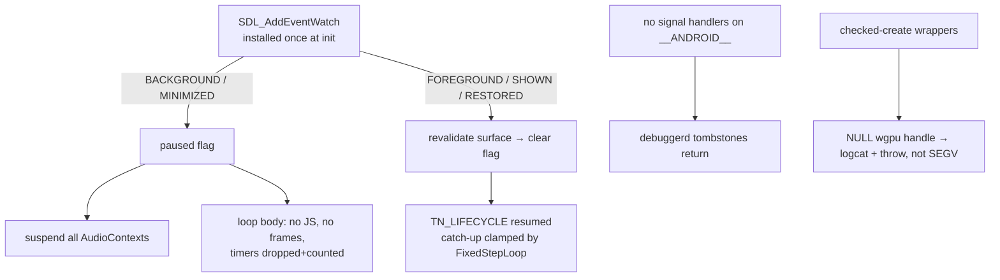

# PRD-210 — the native host survives backgrounding, memory pressure, and its own crashes

**Status:** NOT STARTED

**Complexity:** +2 for 6–10 files, +2 for complex state logic (lifecycle state machine, signal
handling), +2 for multi-platform behaviour change = **6 → MEDIUM mode**, checkpoint after every
phase (device proofs make phases slow; drift is expensive).

Owns two bugs from `docs/bugs/mobile-stability-2026-08-23.md` that share one layer
(`packages/runtime-native`) and one truth: the host currently hides its own failures.

## Context

**Bug 4 — intermittent SIGSEGV, no tombstone.** Six `SIGNALED status=11` exits recorded for
`com.threenative.bayview` on 2026-08-23 (18:32:41, 18:37:31, 18:40:03, 19:08:26, 19:12:17,
19:23:43), none leaving a tombstone. The no-tombstone signature is **self-inflicted**:
`src/runtime.cpp:191-206` installs handlers for SIGSEGV/SIGABRT/SIGBUS/SIGTRAP/SIGILL via bionic
`signal()` at startup (`runtime.cpp:525`), replacing zygote-chained debuggerd — so any crash after
startup yields exactly this silent signature. Proven by natural experiment: the one dropbox
tombstone on the device (2026-08-21, `com.threenative.game`) is a wgpu-native Rust panic →
SIGABRT caught *before* our handlers installed, fully symbolized. Failure taxonomy therefore:
wgpu misuse panics abort loudly; the Aug-23 signature is consistent only with raw memory faults —
ranked suspect class is **unchecked NULL handles from wgpu create/pass/finish fed into
wgpu-native FFI**: `bindings.cpp:3288` (`createCommandEncoder`), `:3453`/`:3809` (passes),
`:4134-4149` (`finish()` checks encoder but not returned cmdBuffer), `:1858` (`queue.submit`);
canvas2D chain `:5902/:6042/:6054`; shader/bind-group family `:2681/:4629/:4711/:4733/:4778/:4891`;
offscreen views `:1360/:1676`. Guarded-for-contrast sites (createBuffer/createTexture/pipelines)
throw to JS correctly. Shutdown order adds a latent UAF: `runtime.cpp:619-620` resets `jsEngine_`
before `webgpu_` while `webgpu::g_engine` still points across. Raw malloc/mmap unchecked patterns:
grep-clean.

**Bug 9 — presents continue with the screen off.** The event pump
(`src/platform/window.cpp:176-234`) handles QUIT, WINDOW_RESIZED, keys, pointers, fingers,
gamepads — **no lifecycle event of any kind**. `Runtime::run()` (`runtime.cpp:800-844`) →
`pollEvents()` (`:872-941`) unconditionally runs timers, microtasks, `beginFrame`, rAF callbacks,
`endDawnFrame` → `presentPendingSurface` (`bindings.cpp:6290`) every iteration; nothing consults
visibility. Confirmed on device: 60 s of continued presenting with the screen off. SDL 3.2.8 fact
that shapes the fix: on Android, WILL/DID_ENTER_BACKGROUND are queued and the pump **then blocks**
inside `Android_WaitLifecycleEvent` (`third_party/sdl3/SDL3-3.2.8/src/core/android/SDL_androidevents.c`,
BlockOnPause default true) — poll-based pause handling is structurally impossible;
`SDL_AddEventWatch` (synchronous at send time) is the only correct mechanism. Audio has
`suspend()`/`resume()` (`audio_context.cpp:456-471`) reachable only from JS; no host-side registry
of live contexts exists. Desktop minimize is equally exposed.

The two bugs meet at surface destruction: `SDLSurface.surfaceDestroyed` releases the ANativeWindow
on the UI thread without waiting for the native side — a present into a released window is in
today's crash surface. Pausing before acquire, and treating acquire/present failure on a hidden
window as skip-a-frame rather than fatal, shrinks bug 4's trigger set too.

## Solution

1. **Stop severing debuggerd**: never install the crash handlers on `__ANDROID__`; desktop branch
   may stay. Tombstones return, so the *next* crash names itself.
2. **Checked-create discipline**: wrap the ranked unchecked sites so a NULL from wgpu logs op +
   args to logcat and throws to JS (matching the already-guarded sites and the fail-closed rule)
   instead of arming an FFI fault.
3. **Lifecycle contract via event watch**: one host-owned atomic paused flag. Pause on
   WILL/DID_ENTER_BACKGROUND (mobile) or WINDOW_MINIMIZED/HIDDEN (desktop); resume on
   DID_ENTER_FOREGROUND / WINDOW_SHOWN|RESTORED; WINDOW_DESTROYED/TERMINATING are terminal
   fail-closed. While paused: audio suspended through a new context registry, loop body executes
   no JS and skips beginFrame/endDawnFrame, timer firings counted-and-dropped with the count
   logged on resume, markers `TN_LIFECYCLE:{"event":"paused"|"resumed",…}` emitted through the
   existing TN_ path. Surface revalidated like startup does (`runtime.cpp:337-351` precedent).
   Time-jump safety already exists TS-side — `FixedStepLoop` clamps negative elapsed and drops
   backlog past maxSteps (`packages/core/src/loop.ts:111,121`) — assert it, don't rebuild it.
4. **Named override**: `display.backgroundMode?: "pause" | "continue"` (default `"pause"`),
   plumbed like its siblings (`TN_BACKGROUND_MODE` metadata beside TN_ORIENTATION in
   `package-android.mjs:321-327`; desktop env `THREENATIVE_BACKGROUND_MODE`). Turning the knob
   off must not turn the markers off.

**Key decisions**

- Crash-source-of-truth after Phase 1 is `dumpsys dropbox --print data_app_native_crash`
  (works non-rooted) plus exit-info; repro protocol below stays the red detector.
- Never pause on FOCUS_LOST alone (desktop split-screen/server games); on Android it accompanies
  real pauses but is not one.
- WINDOW_OCCLUDED records only, no behaviour change, until evidence shows it fires usefully.

## Integration Ledger

| # | New thing | Live caller (`file:line`, non-test) | Replaces | Old path removed? | Negative control |
|---|-----------|-------------------------------------|----------|-------------------|------------------|
| 1 | Android handler-install removal | `src/runtime.cpp:525` install site gated off `__ANDROID__` | unconditional `installCrashHandlers()` | desktop path retained deliberately | deliberate env-gated null deref → tombstone appears in dropbox |
| 2 | Checked-create helpers (~18 sites) | every listed `bindings.cpp` call site | bare NULL-to-FFI calls | replaced per site | stub one create to return NULL in a test executable → throw + logcat line, not SEGV |
| 3 | Lifecycle event watch + paused flag | `Runtime::run`/`pollEvents` gate (`runtime.cpp:872-941`) | unconditional frame execution | n/a (new behaviour) | KEYCODE_SLEEP → zero new `TN_PRESENTS_TICK` within ~1 s; deleting the BACKGROUND case re-reddens it |
| 4 | AudioContext registry | watch pause path calling `AudioContext::suspend()` (`audio_context.cpp:465`) | JS-only suspend reachability | n/a | suspend-all during playtest → `[Audio] … suspended` per live context |
| 5 | `display.backgroundMode` knob | `IThreeNativeConfig` display block → `upsertApplicationMetadata('TN_BACKGROUND_MODE')` (`package-android.mjs:321-327`) → RuntimeConfig | nothing | n/a | `"continue"` run keeps ticking through screen-off while still logging mode |

### Reachability

**How is this reached?** Every frame already flows through `pollEvents`; the watch fires inside
SDL's send path; the wrappers sit on call sites the renderer exercises every frame. No new entry
point.

**User-facing?** Battery life, crash diagnosability and post-resume correctness — observable
without UI.

**Full flow:** player presses power → SDL queues BACKGROUND → watch sets flag, suspends audio →
loop parks → player returns → FOREGROUND → surface revalidated → markers logged → FixedStepLoop
absorbs the gap in ≤ maxSteps steps → play resumes.

**What does this replace?** The unconditional handler install (#1) and the unpauseable loop (#3).

## Execution Phases

#### Phase 1: crashes become nameable again

**Files (max 5):** `src/runtime.cpp` (EDIT), one deliberate-crash test executable or env-gated
branch (NEW), `android/app/build.gradle.kts` symbol settings (EDIT), evidence record (NEW).

- [ ] Gate handler install off on `__ANDROID__`.
- [ ] Prove tombstones return: one deliberate null deref under an env flag → symbolized
      `data_app_native_crash` entry captured and pasted.
- [ ] Keep unstripped `.so` for ndk-stack (debugSymbolLevel SYMBOL_TABLE or usePrebuiltRuntime=false
      lane note).

**Negative control:** run the same deliberate crash at HEAD → no dropbox entry, exit-info-only —
paste both.

#### Phase 2: NULL handles cannot reach FFI

**Files (max 5):** `src/webgpu/bindings.cpp` wrapper header + edits at ranked sites, contract
test executable (NEW), spec (EDIT).

- [ ] Checked-create helper: log op+args, throw to JS on NULL; migrate ranked sites S1–S4 first
      (encoder chain, canvas2D, shaders/bind-groups, offscreen views), then screenshot path.
- [ ] Red first: test executable forces a NULL create against HEAD → SEGV pasted; after → throw
      with named op pasted.

#### Phase 3: the loop pauses

**Files (max 5):** `platform/window.cpp` (EDIT: watch install), `runtime.cpp` (EDIT: gate loop
body, surface revalidation, markers), `audio_context.cpp` registry (EDIT), core config type +
metadata plumbing (EDIT), spec/scenario (NEW).

- [ ] Watch + paused flag + markers + audio registry + count-and-drop timers, as specified above.
- [ ] Playtest scenario (`--target android`): launch → observe ticks → KEYCODE_SLEEP → 10 s →
      assert zero new `TN_PRESENTS_TICK`; wake → `resumed` marker + bounded catch-up. At HEAD this
      scenario fails exactly as bug 9 documents (60 s of ticks) — paste that red first.
- [ ] Desktop arm: minimize step asserts same pause semantics.
- [ ] Assert `FixedStepLoop` clamp by unit test naming `loop.ts:111,121` (mutation: remove the
      clamp → red).

#### Phase 4: the knob and the honest record

**Files (max 4):** config surface + metadata plumb-through (EDIT), desktop env read (EDIT),
scenario extension for `"continue"` (EDIT), verification record (NEW).

- [ ] `backgroundMode:"continue"` run keeps ticking through screen-off **and logs which mode
      executed**; default `"pause"`.
- [ ] Repro protocol executed once at reduced scale for the record: ≥10 relaunch cycles over a
      winding-down instance (am start → hold → force-stop → immediate relaunch), GL mtrack/rss
      logged per cycle, dropbox checked after each; thermal quirk honoured (cool to ≤31.5 °C).

## Verification Strategy

Record `docs/verification/prd-210-<date>.md`: paste the deliberate-crash tombstone, the forced-NULL
throw, the sleep/resume tick traces, and the relaunch-cycle table. Gates: `pnpm typecheck && pnpm
lint && pnpm test`; conformance suite green after Phases 1–2 (bindings touched); physical-device
and emulator results named separately. Caller census for the new export(s) pasted.

## Acceptance Criteria

- [ ] A crash after startup on Android leaves a symbolized tombstone in dropbox (deliberate-crash
      proof pasted).
- [ ] A NULL from any migrated wgpu create throws to JS naming the operation; no SEGV path
      remains at the migrated sites (forced-NULL test red/green pasted).
- [ ] Screen-off stops presenting within ~1 s and suspends audio, on device; resume recovers with
      catch-up bounded by maxSteps; markers report what happened either way.
- [ ] `backgroundMode:"continue"` demonstrably overrides pausing while markers keep flowing.
- [ ] Ten relaunch-over-pressure cycles produce either zero reds (recorded) or named crashes —
      never unnamed ones.
- [ ] Desktop minimize behaves per the same contract; iOS stays honestly unproven (physical lane
      open).

## Out of scope

- Naming the exact mid-run fault behind the Aug-23 sextet — that becomes possible only after
  Phase 1 lands; this PRD makes the next crash nameable, it does not pretend to have caught it.
- WINDOW_OCCLUDED throttling, V8 near-heap-limit callbacks beyond an optional log marker.
- iOS lifecycle proof (no hardware lane).
