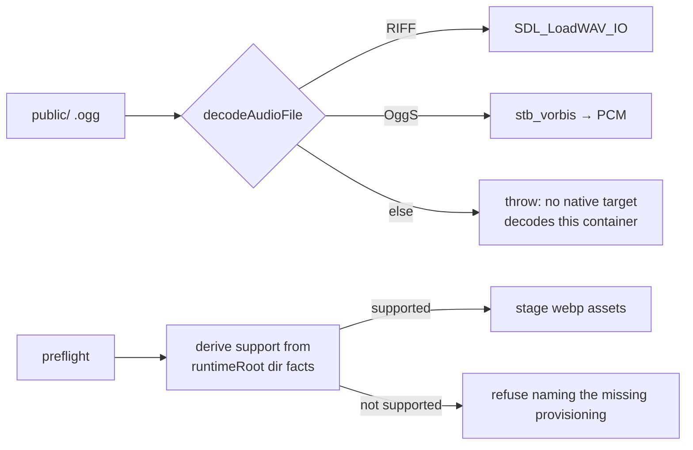

# PRD-211 — an Android APK builds and boots from the repository's own assets

**Status:** PARTIAL — Phases 1, 2 and 3 landed and are desktop-executed; every remaining
criterion needs a physical Pixel 8. Evidence:
`docs/verification/prd-211-2026-08-23.md` (Phase 2),
`docs/verification/prd-211-phase1-2026-08-23.md` (Phases 1 and 3).

**Complexity:** +2 for multi-package changes (runtime-native + assets scripts), +1 vendored
dependency addition, +2 new decode capability = **5 → MEDIUM mode**.

Owns bugs 5 and 10 from `docs/bugs/mobile-stability-2026-08-23.md` — the asset lane that produced
a shipped app nobody can rebuild, plus a preflight whose capability claims have already gone stale
once.

## Context

**Bug 5 — repo assets produce a boot-dead APK.** Building with `public/`'s genuine Ogg files dies:
`TN_NATIVE_START_FAILED: decodeAudioData could not decode the supplied audio`. The working
installed APK's `.ogg` files are RIFF/WAV renamed by hand in an unrecorded staging step. The root
is not Android-specific: the entire native decoder is one call —
`SDL_LoadWAV_IO` (`src/audio/audio_context.cpp:577-633`), reached from the global
`decodeAudioData` (`audio_bindings.cpp:516-537`). **There is no Vorbis/MP3/Opus decoder anywhere
in the runtime** (no miniaudio, no stb_vorbis; `download-deps.mjs` provisions only stb_image
headers). Desktop never noticed because its test feeds a WAV fixture. Codec truth table measured:
RIFF/WAVE PCM decodes on all natives and browsers; Ogg Vorbis is browser-only today; MP3/FLAC/
AAC/Opus likewise fail closed on every native target.

Fix shape decided by evidence: **add Ogg Vorbis decode to the runtime** via `stb_vorbis.c`
(same vendored-single-header precedent as cgltf/stb_image; fixes desktop+Android+iOS in one
change; templates ship `.ogg`, so same-source demands it). Transcode-to-WAV was rejected: ~10×
audio size, per-target surgery the framework would own forever; nothing in `packages/assets`
assumes an ffmpeg binary (codecs arrive as npm-wasm: ktx2-encoder, draco3dgltf), and the
"recorded command" alternative *is* the status quo that produced this bug — preflight already
prints ffmpeg commands and the step still never entered any build graph.

**Bug 10 — preflight claims contradict the build it ships with.** `scripts/asset-preflight.mjs`
rejects webp for Android claiming "the android runtime is built without libwebp" (`:92,:110`),
while commit `62fac4d5` added `webp-source` to androidDeps and CMake builds libwebp from source
under `MYSTRAL_HAS_WEBP` (`CMakeLists.txt:657-696`) — the device logs
`[Mystral] WebP format support: YES`. The disease generalizes: hardcoded capability claims go
stale whenever the build changes under them. The existing three-leg sync test
(`tests/android-webp-provisioning.test.mjs:9-13`) even names asset-preflight.mjs as leg 3 but
pins only legs 1–2. iOS genuinely lacks webp (`CMakeLists.txt:697` excludes IOS) — the corrected
check must stay true there.

## Solution

- **Ogg decode**: provision `stb_vorbis.c` through `download-deps.mjs`; sniff `OggS` before
  `SDL_LoadWAV_IO` in `decodeAudioFile`; decode to PCM the existing path already returns.
  Fail closed on malformed Ogg exactly like SDL_LoadWAV_IO failures today.
- **Capability-derived checks**: `deriveAndroidWebpSupport(runtimeRoot)` replicates CMake's own
  condition against the directory facts (`third_party/webp-source/libwebp-*/CMakeLists.txt`
  present, no prebuilt `lib/`); thread the result into `assertAndroidAssetsDecodable`
  (`package-android.mjs:500-521`) instead of hardcoded refusal strings.
- **One owner decision to record**: after Ogg lands, the audio-refusal message says "no native
  target decodes this container" rather than naming Android alone, and desktop/iOS packagers gain
  the same preflight gate they currently skip entirely.

## Integration Ledger

| # | New thing | Live caller (`file:line`, non-test) | Replaces | Old path removed? | Negative control |
|---|-----------|-------------------------------------|----------|-------------------|------------------|
| 1 | `stb_vorbis` decode arm | `decodeAudioFile` (`audio_context.cpp:577`) | WAV-only rejection for Ogg inputs | rejection deleted for decodable Ogg | truncated/corrupt Ogg → same loud throw class as today |
| 2 | `deps.stb_vorbis` entry | `download-deps.mjs` stb header set (`:229-233` area) | absent dependency | n/a | remove the header from disk → configure/build fails loudly |
| 3 | `deriveAndroidWebpSupport()` | `stageAndroidAssets` → `assertAndroidAssetsDecodable` (`package-android.mjs:513`) | hardcoded "built without libwebp" strings (`asset-preflight.mjs:92,:110`) | replaced in Phase 2 | fake an unprovisioned runtimeRoot → webp refused again; fake provisioned → accepted |
| 4 | Preflight on desktop/iOS packagers | `package-desktop.mjs` / `package-ios.mjs` stage steps | no preflight at all | gap closed | real-Ogg desktop build before Phase 3 dies at boot silently; after, refuses at package time |

### Reachability

**How is this reached?** `threenative build --target android|desktop|ios` → `compileAssets` →
packager staging → preflight assertions → runtime `decodeAudioData` at game start. All entry
points exist.

**User-facing?** Yes: an agent's cold build either boots or names exactly what is wrong.

**Full flow:** scaffold → drop ordinary `.ogg`/webp-GLB assets into `public/` → build for Android
→ preflight passes because the build genuinely supports what ships → APK boots playing its audio.

**What does this replace?** The undocumented manual transcode step (#1) and the stale hardcoded
claims (#3).

## Execution Phases

#### Phase 1: the runtime decodes Ogg

**Files (max 5):** `scripts/download-deps.mjs` (EDIT), `CMakeLists.txt` source list (EDIT),
`src/audio/stb_impl.cpp` or sibling (EDIT), `src/audio/audio_context.cpp` (EDIT), spec (NEW).

- [x] Red first: `tests/audio_decode_ogg_test.cpp` feeds `tests/fixtures/pickup.ogg` at HEAD;
      "could not decode" pasted.
- [x] Implement sniff-and-decode; truncated Ogg, corrupt Ogg and Ogg-carrying-Opus all fail loudly
      (negative cases in the same test). Passed on V8 **and** QuickJS, the Android rollback engine.
- [x] `targetSampleRate` **honoured**, not filed: `AudioBufferSourceNode::process` does no rate
      conversion, so a buffer kept at its own rate played sharp. Every container is now resampled
      to the context rate, pinned by a 22 050 Hz asset coming back 44 100 frames long.

#### Phase 2: preflight tells the truth about the build it ships with

**Files (max 5):** `scripts/asset-preflight.mjs` (EDIT), `scripts/package-android.mjs` (EDIT),
`tests/android-webp-provisioning.test.mjs` (EDIT — pin leg 3), `tests/android-asset-preflight.test.mjs`
(EDIT — the `:106-113` webp-rejection assertion flips to derivation), evidence record (NEW).

- [x] Derive webp support from runtimeRoot facts mirroring the CMake glob; correct the reason
      strings; keep the iOS exclusion honest.
- [x] Red/green both arms in tests (current code fails both since rejection is hardcoded).
- [ ] **Device proof, open:** repo-assets APK logs `WebP format support: YES` and textured models
      render. Sequenced after Phase 1, which has now landed; one install proves this and the
      Phase 3 boot together.

#### Phase 3: every packager runs the same honest gate

**Files (max 4):** `package-desktop.mjs`, `package-ios.mjs`, shared preflight invocation (EDITs),
verification record (NEW).

- [x] Desktop/iOS stage steps invoke preflight with their own derived capability set
      (`deriveDesktopWebpSupport`, `deriveIosWebpSupport`); both packagers previously ran none.
      The audio refusal now reads "no native target decodes this container" and prints no ffmpeg
      advice for Ogg Vorbis.
- [ ] **End-to-end, open:** clean clone → `threenative build --target android` from repo assets →
      boots with audio. Needs the physical Pixel 8; the device was leased to another lane.

## Verification Strategy

Record `docs/verification/prd-211-<date>.md`: red decode attempt at HEAD, green device boot,
webp derivation table across fake/provisioned roots, desktop-gate negative control. Gates:
`pnpm typecheck && pnpm lint && pnpm test`, native suite, one physical-device boot.

## Acceptance Criteria

- [ ] From a clean clone, `threenative build --target android` produces an APK that boots and
      plays its `.ogg` audio with zero manual steps (bug doc §9's repro, green).
- [ ] A webp GLB builds when — and only when — the packaged runtime genuinely carries libwebp;
      the refusal message names the missing provisioning, not a stale rumour.
- [ ] Desktop and iOS packagers refuse undecodable audio at package time instead of failing at
      game boot.
- [ ] No `.ogg`-renaming step exists outside git history; preflight prints no ffmpeg advice for
      containers the runtime now decodes.

## Out of scope

- MP3/AAC/FLAC/Opus decode (stay honestly undecodable; message updated only).
- WASM Vorbis fallback pass in `packages/assets` — unnecessary if Phase 1 lands; revisit only if
  the C++ change is blocked.
- Streaming audio, compressed-medium formats, or changing the browser codec matrix.
