# PRD-212 — a published install builds for Android

**Status:** PARTIAL — Phase 1 landed `439b9fd7`, Phase 2 landed `8df8e6b2`. The only open item is
the real-release milestone, which waits on PRD-196 Phase 2 and PRD-078.

**Complexity:** +2 multi-package, +1 external API integration (npm registry, GitHub releases),
+2 new gate system (tarball + release censuses) = **5 → MEDIUM mode**.

Owns bugs 6 and 7 from `docs/bugs/mobile-stability-2026-08-23.md`. Extends PRD-196
(`docs/PRDs/PRD-196-published-install-is-functional.md`, NOT STARTED) — it does not restate that
PRD's strands; where PRD-196 already owns a fix (RELEASE_REPOSITORY constant, install-status,
doctor check, release existence), this file references and depends on it.

## Context

Measured on the sandbox lane and against the live registry (2026-08-23):

- Registry `@threenative/runtime-native` latest is **0.2.0**, cut from `83668a25` — which predates
  the `THRENATIVE_RUNTIME_SOURCE` escape hatch entirely (`cc6bbd56`, 2026-08-23, added it; tree
  is at 0.3.0). The build falls through to
  `https://github.com/jonit-dev/threenative/releases/download/runtime-native-v<version>/prebuilt-lock.json`
  (`install-prebuilt.mjs:52-54`) → HTTP 404. The live remote is `ThreeNativeHQ/threenative`;
  ten tags exist, every release self-deleted by the red-lane cleanup (PRD-078).
- **New gap found this investigation**: HEAD's `package-android.mjs:18` imports
  `./asset-preflight.mjs`, which is **absent from package.json `files`** — a naive 0.3.0 publish
  dies `ERR_MODULE_NOT_FOUND` before any fetch. Nobody had recorded this.
- The escape hatch cannot serve a stranger by design: pointing it at the *installed* package can
  never satisfy source-checkout detection (`package-android.mjs:552-554` requires
  `CMakeLists.txt` + staged SDL3 AAR). It means "point at an engine checkout" and must be
  documented as such; the prebuilt-release path is a user's only path.
- **Bug 7**: `pnpm pack` substitutes `catalog:`/`workspace:*`; `npm pack` does not (verified on
  pnpm 10.25.0: npm-packed tarball installs fail `EUNSUPPORTEDPROTOCOL`). Fleet census: 32
  `catalog:` + 4 `workspace:` specifiers across all 8 publishable packages. Sanctioned lanes are
  safe (`npm-release.yml:77` runs `pnpm -r publish`; `scripts/release.ts:156` same) — the leak
  requires bypassing them, and nothing detects that. The planned guard exists as a comment:
  "the tarball gate proves the same contract later" (`check-publish-state.ts:162`) — never built.
  Its unresolved-specifier regex (`:128`) currently applies only to template manifests.

## Solution

- **Ship what the scripts import**: `scripts/asset-preflight.mjs` joins `files` (one line), with
  a tarball-content test proving every relative import of every shipped script resolves inside
  the packed tarball.
- **The prebuilt path becomes real**, via PRD-196 Phase 1 (repository constant) + Phase 2
  (release exists) + PRD-078 going green. This PRD adds the Android-specific end-to-end proof:
  a clean-room build of `--target android` with only SDK+JDK, driven offline by a fixture
  `prebuilt-lock.json` through the existing `THREENATIVE_PREBUILT_MANIFEST` env — always-runnable
  regression gate — plus the real-release milestone once PRD-078 unblocks tag cutting.
- **The promised tarball gate gets built**: pack every publishable package in `publish:check`,
  read each manifest from the tarball, fail closed on any `/^(catalog:|workspace:)/` specifier,
  naming package + field + specifier. `pnpm publish` stays the only sanctioned publisher (CI
  enforces by construction); the gate makes bypass detectable instead of uninstallable-by-users.

```mermaid
flowchart TD
    P["pnpm pack per publishable pkg"] --> G{"manifest specifiers<br/>match /^(catalog&#58;|workspace:)/"}
    G -->|"yes"| RED["fail naming pkg+field"]
    G -->|"no"| OK["publish allowed"]
    T["packed runtime-native tarball"] --> I["every script import resolves<br/>inside the tarball"]
    I --> B["build --target android<br/>SDK+JDK only"]
    B -->|"fixture lock"| OFF["offline regression gate"]
    B -->|"real release"| REL["milestone after PRD-078 green"]
```

## Integration Ledger

| # | New thing | Live caller (`file:line`, non-test) | Replaces | Old path removed? | Negative control |
|---|-----------|-------------------------------------|----------|-------------------|------------------|
| 1 | `files` gains `scripts/asset-preflight.mjs` | `packages/runtime-native/package.json` files array (`:10-36`) | broken import in packed tarball | n/a | pack HEAD without the line → import-resolution test red |
| 2 | Tarball specifier census | `check-publish-state.ts` report assembly (runs in CI gates job today) | comment-only promise at `:162` | comment deleted when gate lands | one npm-style tarball planted in the check → red naming specifier |
| 3 | Android clean-room step (fixture lock) | `verify-registry-install.ts` step list / sandbox lane | web-only clean room (PRD-196 Phase 4 extends further) | n/a | mask SDK/NDK mismatch or corrupt fixture lock → step fails loudly |
| 4 | Hatch documentation | README/docs section of runtime-native | tribal knowledge | n/a | n/a |

### Reachability

**How is this reached?** A stranger's `npm create threenative@latest` → install hook →
`threenative build --target android`; and any maintainer running `pnpm publish:check`.

**User-facing?** Yes — exit codes and named failures for agents building games outside this repo.

**Full flow:** scaffold from registry → `build --target android` → manifest fetch hits a real
release → APK produced with only SDK+JDK present; if anything above breaks, `doctor` names it.

**What does this replace?** The silent-404 dead end (#1–#3 chain) and undetectable npm-publish
bypass (#2).

## Execution Phases

#### Phase 1: tarballs are self-contained and substitution-clean

**Files (max 5):** `packages/runtime-native/package.json` (EDIT), tarball-content +
specifier-census functions in `check-publish-state.ts` (EDIT), their spec (EDIT), evidence record
(NEW).

- [ ] Import-resolution test: extract packed tarball to temp, resolve every relative import of
      every shipped script — red at HEAD (asset-preflight missing), paste it.
- [ ] Specifier census: pack all 8 packages, assert zero `catalog:`/`workspace:` specifiers;
      red control = plant one npm-pack-style tarball → red names package+field+specifier.

#### Phase 2: the Android clean-room proves the stranger's path

**Files (max 5):** `verify-registry-install.ts` android step or sandbox equivalent (EDIT), its
spec (EDIT), fixture `prebuilt-lock.json` + artifacts staging (NEW under test fixtures), docs for
the hatch (EDIT).

- [ ] Offline gate: packed 0.3.0 set installed clean-room, `THREENATIVE_PREBUILT_MANIFEST`
      pointed at fixture lock, `build --target android` succeeds with cmake/ndk masked.
- [ ] Milestone criterion recorded but gated: real-release rerun after PRD-196 Phase 2 + PRD-078
      go green (the release lane self-deletes failed releases; do not fight that here).
- [ ] Document `THREENATIVE_RUNTIME_SOURCE` as requiring a full engine checkout
      (`download-deps.mjs` staged third_party), so nobody points it at an installed package again.

## Verification Strategy

Record `docs/verification/prd-212-<date>.md`: paste the HEAD import-resolution red, the planted-
tarball census red, and the clean-room android build log. Gates: `pnpm typecheck && pnpm lint &&
pnpm test && pnpm publish:check`. Registry commands take `.npmrc` explicitly
(`npm --userconfig .npmrc <cmd>`); never print it.

## Acceptance Criteria

- [ ] Packing every publishable package yields zero unresolved specifiers; the check that says
      so has been observed failing on a planted bad tarball.
- [ ] Every shipped script of `runtime-native` imports cleanly from inside its packed tarball.
- [ ] Clean-room (no workspace, no engine checkout): `threenative build --target android`
      produces an APK using the fixture-manifest path — offline-provable, re-runnable.
- [ ] When the first surviving `runtime-native-v*` release lands, the same flow passes against
      the real manifest (recorded then, not now).
- [ ] `pnpm publish:check` refuses trees that would ship either defect.

## Out of scope

- Cutting the actual release/tag (PRD-078 owns the lane going green; PRD-196 Phase 2 owns the cut).
- iOS signing/distribution, registry auth mechanics, changes to `cleanup-failed-release`.
- Making `npm publish` itself refuse (impossible client-side); policy + detection is the contract.
