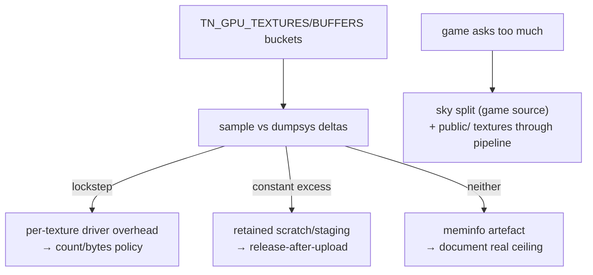

# PRD-213 — GPU memory is bounded at the source and the driver gap is measured, not guessed

**Status:** PARTIAL — Phase 1 attribution executed on a physical Pixel 8 and Phase 3 landed;
Phase 2's game-side sky split landed but its device before/after is queued behind the PRD-214
device lease. Evidence: `docs/verification/prd-213-2026-08-23.md`.

**Complexity:** +2 for multi-package changes (sandbox game + assets/build pipeline guidance),
+2 investigation system = **4 → MEDIUM mode**. Investigation-first: Phase 1 is measurement with
instrumentation that already exists.

Owns bug 8 from `docs/bugs/mobile-stability-2026-08-23.md`. Explicitly *not* the FPS lever — the
2026-08-23 profile showed the frame is CPU-bound in JS (bug 3), and texture compression was
recorded as the wrong lever for it. This PRD's stake is memory (which feeds bug 4's pressure
hypothesis) and honest accounting.

## Context

Measured on the Pixel 8 (`docs/verification/mobile-stability-2026-08-23.md` §7):

| Source | Amount |
| --- | --- |
| Textures (72) | 379 MB |
| Buffers (2,976) | 14 MB |
| Game total requested | **393 MB** |
| Driver held (`GL mtrack`) | **849 MB** — a 2.16× amplification |
| Process RSS | 1.5–1.6 GB (one exit observed at 2.3 GB) |

Two distinct problems:

**(a) The game asks for too much.** `src/render/sky.ts` assigns one 3072×1536 equirect JPEG to
both `scene.background` and `scene.environment` → the 54 MB cubemap conversion *plus* IBL scratch;
the measured IBL-off experiment (18.3 → 24.8 fps, 849 → 738 MB mtrack) corrected an earlier
inference — the surviving 54 MB cubemap is the background equirect→cubemap conversion, not PMREM.
Separately ~146 MB sits in uncompressed 1024²/2048²/512² textures under `public/`, which would be
~18 MB as ETC2/ASTC — the pipeline can produce those formats but loose `public/` textures never
enter it. Note the layering rule from the bug doc: sky.ts lives in the out-of-repo sandbox game,
so its fix is game-side work guided by this PRD, not engine edits.

**(b) The driver more than doubles what the game asked.** Which component holds the extra ~456 MB
is unknown: retained staging/upload heaps, wgpu-native internal copies or mip-generation scratch,
Mali per-allocation overhead, or a meminfo categorization artefact (`GL mtrack` absorbing graphics
allocations for a Vulkan app). No prior investigation exists beyond the bug-doc table; this is
greenfield with instrumentation ready — `TN_GPU_TEXTURES`/`TN_GPU_BUFFERS` bucket markers beside
the present tick landed yesterday (`bindings.cpp`, commit `d6e21511`, permanent). A differential
lever also already exists: `WGPU_REGRESSION_VERSIONS = ['v24.0.3.1', 'v25.0.2.2']`
(`download-deps.mjs:52-53`).

## Solution

- **Phase 1 attributes the 456 MB** by walking TN_GPU_* buckets while sampling
  `dumpsys meminfo` deltas: if mtrack grows in lockstep with engine-tracked bytes → per-texture
  driver overhead scaling with count/bytes; if it exceeds by a constant → retained scratch/staging.
  One rung on the wgpu regression version as differential evidence.
- **Phase 2 fixes what attribution names**, bounded to what the framework owns: if staging/scratch
  → runtime-side release policy after upload completes (mechanism only); if categorisation →
  document the true ceiling honestly instead of chasing mtrack.
- **Game-side guidance ships as generated-source change**: the sandbox Bayview fix (sky split:
  background keeps the equirect; environment gets a deliberately chosen, smaller IBL source) plus
  routing loose `public/` textures through compression for native builds — recorded here because
  every native game repeats it; the pipeline-routing half lands in `packages/create-threenative`
  build staging where bug 211's preflight already runs.

## Integration Ledger

| # | New thing | Live caller (`file:line`, non-test) | Replaces | Old path removed? | Negative control |
|---|-----------|-------------------------------------|----------|-------------------|------------------|
| 1 | Attribution record + decision | `docs/verification/prd-213-attribution.md` feeding whichever Phase-2 site applies | guessing | n/a | re-run attribution on regression wgpu version → numbers must move or match, recorded either way |
| 2 | public/-texture compression route (if attribution warrants) | build staging step beside `assertAndroidAssetsDecodable` (`package-android.mjs:513`) | uncompressed pass-through | pass-through removed for compressible formats | plant an oversized PNG → packaged size drops / gate fires |
| 3 | Sky split (Bayview sandbox source) | `sandbox/fps-framework/src/render/sky.ts` setupSky callers | dual background+environment assignment | replaced in game tree | IBL-off numbers above are the baseline twin |

### Reachability

**How is this reached?** Every native run already emits the bucket markers each present tick; the
build stage runs inside every `--target android` packaging.

**User-facing?** Memory ceiling and battery on device; build output size.

**Full flow:** game requests resources → markers report exact bytes → attribution explains the
driver multiple → policy/guidance bounds both halves → next run's table shows the delta.

**What does this replace?** Inference-by-arithmetic from `dumpsys` alone (the pre-d6e21511 state).

## Execution Phases

#### Phase 1: attribute the 849 − 393 MB

**Files (max 4):** probe extension in sandbox `gpuMemoryProbe.ts` if finer buckets needed (EDIT),
attribution script/note (NEW), evidence record (NEW), this file (EDIT).

- [x] Steady-state walk of buckets vs meminfo samples on device — executed on the physical
      Pixel 8 at 29.9 °C, 53 % battery, discharging over Wi-Fi ADB. Table in the record §3.
- [ ] One rung on wgpu v24.0.3.1 as differential — **not executed**; needs an Android dependency
      rebuild and install, and the device is leased to PRD-214.
- [x] Deliverable is a named holder, or a demonstrated categorisation artefact with arithmetic.
      Delivered as: the artefact hypothesis is **refuted** (`RssFile` minus `smaps` file `Rss`
      agrees with `GL mtrack` to 0.7 %, record §2), and the excess is proved to be a **~480 MiB
      floor rather than a 2.11x multiplier** — the driver grew by 0.885x of what the game
      requested across the whole asset load (record §3). 70.9 MiB of it is named exactly as the
      surface BufferQueue (record §4). The floor's own component is still unnamed and is the one
      open thread, queued as a `GL mtrack` reading at each rung of PRD-214's resolution sweep.

#### Phase 2: act on what attribution named

**Files (max 5):** determined by Phase 1 — runtime release policy OR docs-only honesty record,
plus the two certain items regardless:

- [x] Game-side sky split executed in the sandbox tree. `bayview-sky-ibl.jpg` (1024x512) now
      feeds `scene.environment` while `scene.background` keeps the full 3072x1536 equirect.
      **Before** table is measured on the physical Pixel 8; **after** is a prediction until
      PRD-214's APK — which carries the split — reports its `TN_GPU_TEXTURES` line. The
      mechanism is measured in the desktop-Chrome lane: the PMREM pair steps 48 → 12 MiB, and
      the browser reproduces the device's `1536x2048 rgba16float` x2 = 48 MiB bucket exactly.
- [ ] public/ texture route through compression — **not decided here.** Attribution says it is
      no longer the lever it looked like: the driver does not amplify game textures, so ~146 MiB
      of uncompressed `public/` textures cost ~146 MiB, not ~316 MiB. It remains worth doing for
      its own sake and stays open for a later pass with its negative control per row 2.

#### Phase 3: the ceiling is documented where users read it

**Files (max 3):** doctor/health-report note or template AGENTS section naming realistic texture
budgets per target (EDIT), verification record (NEW).

- [x] Landed in `packages/create-threenative/agent-docs/performance-default.md`, the shared
      fragment all seven template `AGENTS.md` files already include, so one edit reaches every
      scaffolded game. It carries the measured Pixel 8 table, the "budget a ~500 MiB floor plus
      what you ask for, not a multiplier" framing that the attribution corrected, and the PMREM
      step table including the trap that 3072 and 2048 cost exactly the same.

## Verification Strategy

Record `docs/verification/prd-213-<date>.md`: attribution table, differential-version numbers,
sky-split before/after. Gates: `pnpm typecheck && pnpm lint && pnpm test`; any package-code
change carries its own red-green per house rules. Device runs named as physical Pixel 8, not
emulator.

## Acceptance Criteria

- [~] The extra memory has a named owner, or a proven measurement-artefact explanation with the
      same rigour. **Partly**: the artefact explanation is refuted with arithmetic, the shape is
      proved (floor, not multiplier), 70.9 MiB is named exactly — the floor's component is not.
      Note the figure is **435 MiB**, not 456: the bug doc's table mixed `kB/1000` with MiB.
- [ ] Bayview's requested GPU total drops by the sky-split amount, shown in TN_GPU_ markers.
      Split landed, device marker queued behind the lease.
- [x] The realistic per-target memory guidance exists where a cold agent reads it.
- [x] Nothing here claims FPS credit — no frame-rate claim appears in the record.

## Out of scope

- Texture-format migration of models already flowing through the asset pipeline (working).
- Any speculative wgpu fork/patch; the regression lane is used as measurement only.
- Bug 4's crash reproduction beyond noting that reduced memory pressure shrinks its trigger set.
