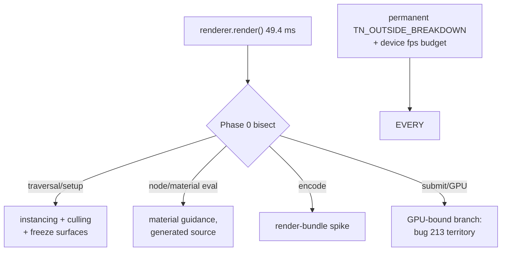

# PRD-214 — mobile frames are spent inside three.js render, and the budget says so out loud

**Status:** SCOPING — attribution measured on device 2026-08-23; fix levers need one more
bisection rung before phases harden.

**Complexity:** +3 for 10+ files across measurement and mechanism work, +2 complex performance
work, +2 multi-package = **7 → HIGH mode**, checkpoint after every phase.

Owns bug 3 from `docs/bugs/mobile-stability-2026-08-23.md`: 18.3 fps on a 60 Hz Pixel 8, with
"68% of the frame is JavaScript outside the render bindings".

## Context

**Attribution, measured 2026-08-23 20:18 on device** (`TN_OUTSIDE_BREAKDOWN`,
`sandbox/fps-framework/src/gpuMemoryProbe.ts` second-pass instrumentation wrapping rAF,
`renderer.render` and `renderOverlay`; steady-state windowed rings, 89 presented frames):

| Window | p50 ms | share of frame |
| --- | --- | --- |
| whole presented frame | 56.01 | — |
| `rafTotal` (one FixedStepLoop.stepFrame) | 54.44 | 97% |
| **`renderWorld` (three.js `renderer.render()`)** | **49.42** | **~88%** |
| `updateMatrixWorld` | 1.79 | 3% |
| `hostGap` (present wait + SDL/timers/microtasks) | 1.42 | 2.5% |
| `residual` (projection.reconcile, particles) | 0.04 | ~0% |
| `unaccountedRaf` | 0.00 | 0% |

Answers to the bug doc's open questions:

1. **Who owns the ~37 ms:** three.js's own JS — scene-graph traversal, material/node evaluation
   and WebGPU command encoding+submit executed by upstream `WebGPURenderer.render()`. The old
   "bindings ≈ 5.5 ms" figure covered six profiled binding calls, not the JS that builds the
   stream around them. Engine plumbing (loop, physics dispatch, present wait) is measured innocent.
2. **The percentile caveat is confirmed:** `substepsPerRaf` p50 = 3 — `markFrame` fired once per
   fixed-step substep, so old sectionP99 values were per-substep, as the doc suspected.
   `presentDelta` in the new probe is the honest per-presented-frame number.
3. **`worstMs: 27489` explained:** one 27.4 s hitch between presented frames
   (`TN_OUTSIDE_HITCH …"deltaMs":27445`), startup-shaped, now wall-clock-tagged and excluded from
   windows rather than polluting max().
4. ~~**Shadows are not the lever:** `TN_SHADOWS_KILLED` executed at 20:14:04; the post-kill
   breakdown still reads `renderWorld` p50 ≈ 49 ms.~~ **WITHDRAWN 2026-08-23 — the refutation was
   circular.** The bundle the 20:18 measurement ran from
   (`sandbox/fps-framework/.threenative/build/game.js`, mtime 20:13, shipped as
   `dist-native/bayview-noshadow.apk`) disables `shadowMap` and clears `castShadow` on every light
   *before the measurement window opens*, with the `KILL_SHADOWS` constant folded away as
   always-true by the bundler. So "the post-kill breakdown still reads ≈ 49 ms" compares a
   shadows-off build against a shadows-off build. The wording implies a pre-kill number existed;
   no such capture survives anywhere in the sandbox tree or `docs/` — `gpuMemoryProbe.ts` was
   untracked, so there is no history to date it by. **Shadows are untested, not refuted**, and
   Phase 0's rung list carries a shadows-ON baseline as R0 with shadows-off as R1.
5. Even spike frames attribute to the same owner (`spikeAvgPartsMs.render ≈ 45 ms`) — the
   distribution's bimodality is render-cost variance, not a second subsystem.

What remains unknown is the *internal* split of those 49 ms — projectObject and matrix updates are
measured small, so the bulk sits in material/node evaluation, bind-group/draw setup, and encode
inside the backend. That bisection decides which levers are real, hence Phase 0.

**The game's scene composition is measured innocent by static review** (asked explicitly:
"maybe some game code is broken?"): `sandbox/fps-framework/src/render/` merges facade and vehicle
geometry (`facade.ts:203`, `vehicles.ts:139`), instances repeated props (`palm.ts`, `decals.ts`),
carries one shadow-casting directional light (`lighting.ts:30-32`) and no post pass beyond ACES
tone mapping on the renderer (`postprocessing.ts`). Game callbacks are cheap on device
(`gameFrame` p99 5.72 ms). If Phase 0 shows a large draw-call or material count anyway, that is a
*counting* question answered by `renderer.info` on device — not an assumption that the game is
written badly.

## Solution

- **Phase 0 bisects inside `renderer.render()`** with the same game-side wrapping technique
  (per-draw-call timing hooks, backend-stage probes) on device. Deliverable: named sub-phase
  table (e.g. node/material update vs bind-group creation vs encode vs submit).
- **Mechanism levers land where they belong**, chosen by what Phase 0 names, all honouring rule 3
  (framework may pool/batch/dispatch/cull; never decide look):
  - draw-call and object-count reduction surfaces in core (instancing helpers, culling defaults,
    static-object freeze) *if* traversal/setup dominates;
  - material/node evaluation reduction *if* shader-node graphs dominate (template material
    guidance stays generated-source);
  - an evaluation spike for pre-recorded command streams (WebGPU render bundles through
    wgpu-native) for static geometry *if* encode dominates and upstream supports it — spike
    first, kill switch applies;
  - whatever Phase 0 refutes is recorded refuted (shadows are NOT already refuted — see 4).
- **The budget becomes public instrumentation**: `TN_OUTSIDE_BREAKDOWN`'s windowed attribution
  promoted from sandbox probe into the permanent device-lane tooling, plus an fps budget gate so
  a mobile regression is red, not anecdotal.

## Integration Ledger

| # | New thing | Live caller (`file:line`, non-test) | Replaces | Old path removed? | Negative control |
|---|-----------|-------------------------------------|----------|-------------------|------------------|
| 1 | Permanent outside-game breakdown markers | runtime-native present-tick emission beside `TN_PRESENTS_TICK` (`bindings.cpp:6362-6372` pattern); TS probe folded into playtest device tooling | temporary sandbox `gpuMemoryProbe.ts` (deleted when this lands) | replaced | zeroing render input → renderWorld share collapses in the marker output |
| 2 | Device fps budget gate | playtest scenario asserting ≥ N fps at named quality on `--target android` | nothing (no device perf gate existed for games) | n/a | cap rAF artificially → gate red |
| 3 | Chosen mechanism lever(s) | decided by Phase 0; each lands with its own caller row before implementation | per-game hand-rolling of the same trick | per adoption | disable lever → fps returns toward baseline |

### Reachability

**How is this reached?** Every native frame flows through the present tick the markers hang
beside; the budget gate runs in the playtest lane any change re-runs.

**User-facing?** The player feels 18 → 30+ fps; the agent sees a red gate instead of a vibe.

**Full flow:** game presents → breakdown markers print per-window attribution → budget gate
asserts fps floor on device → a regression names its subsystem instead of "it's slow".

**What does this replace?** The temporary probe (row 1) and silence about device fps (row 2).

## Execution Phases

#### Phase 0: bisect the 49 ms

**Files (max 5):** sandbox probe extension (EDIT), evidence record (NEW), this file (EDIT).

- [ ] Device run attributing renderWorld internals to named sub-phases; paste table.
- [ ] Re-rank the lever list above; record refuted candidates with numbers.

#### Phase 1–2: the winning levers (shaped after Phase 0)

Each lever lands as its own vertical slice with: consumer-scoped acceptance ("scene X holds N
fps at quality Q on device"), red-green against the new budget gate, kill-switch LOC scoring,
and rule-3 compliance review. No lever enters `packages/ui`.

#### Phase 3: permanent instrumentation + budget

**Files (max 5):** runtime-native marker emission (EDIT), playtest device-tooling home for the
probe logic (NEW/EDIT), budget-gate scenario (NEW), sandbox probe deleted (DELETE), evidence
(NEW).

- [ ] `gpuMemoryProbe.ts` deleted from the sandbox tree with its registration (the standing
      instruction in its header).
- [ ] Budget gate observed red once (artificial cap) before being trusted green.

## Verification Strategy

Record `docs/verification/prd-214-<date>.md`: Phase-0 table, each lever's before/after fps +
marker lines, gate red control. Physical Pixel 8 runs only for claims; emulator results labelled
as such. Gates: `pnpm typecheck && pnpm lint && pnpm test` plus the new budget scenario.

## Acceptance Criteria

- [ ] Bayview-class scene presents ≥ 30 fps sustained on the physical Pixel 8 at unchanged visual
      quality, or the gap is attributed line-by-line to upstream three.js work with the evidence
      filed — either outcome closes this honestly; neither does the current 18.3.
- [ ] A cold agent can see per-frame window attribution and an fps budget result in standard
      device-lane output.
- [ ] Every adopted lever survives the two questions and rule 3; refuted levers recorded with data.
- [ ] The temporary probe is gone from the sandbox tree.

## Out of scope

- Forking three.js or replacing WebGPURenderer (package contract forbids both).
- GPU-side memory work (PRD-213) beyond noting shared instrumentation.
- Desktop/web fps tuning without a device-proven mechanism first.
