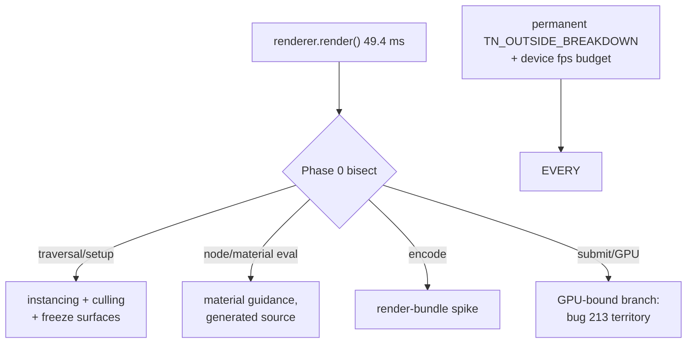

# PRD-214 — mobile frames are spent inside three.js render, and the budget says so out loud

**Status:** PARTIAL — **Phase 0 and Phase 3 are done**; Phases 1–2 (the levers) are not started.
The bisect executed on the physical Pixel 8 on 2026-08-23 and the permanent instrumentation and
budget gate have landed. Evidence: `docs/verification/prd-214-2026-08-23.md`.

**Complexity:** +3 for 10+ files across measurement and mechanism work, +2 complex performance
work, +2 multi-package = **7 → HIGH mode**, checkpoint after every phase.

Owns bug 3 from `docs/bugs/mobile-stability-2026-08-23.md`: 18.3 fps on a 60 Hz Pixel 8, with
"68% of the frame is JavaScript outside the render bindings".

## Context

**Attribution, measured 2026-08-23 20:18 on device** (`TN_OUTSIDE_BREAKDOWN`,
`sandbox/fps-framework/src/gpuMemoryProbe.ts` second-pass instrumentation wrapping rAF,
`renderer.render` and `renderOverlay`; steady-state windowed rings, 89 presented frames):

| Window | p50 ms | share of frame |
| --- | --- | --- |
| whole presented frame | 56.01 | — |
| `rafTotal` (one FixedStepLoop.stepFrame) | 54.44 | 97% |
| **`renderWorld` (three.js `renderer.render()`)** | **49.42** | **~88%** |
| `updateMatrixWorld` | 1.79 | 3% |
| `hostGap` (present wait + SDL/timers/microtasks) | 1.42 | 2.5% |
| `residual` (projection.reconcile, particles) | 0.04 | ~0% |
| `unaccountedRaf` | 0.00 | 0% |

Answers to the bug doc's open questions:

1. **Who owns the ~37 ms:** three.js's own JS — scene-graph traversal, material/node evaluation
   and WebGPU command encoding+submit executed by upstream `WebGPURenderer.render()`. The old
   "bindings ≈ 5.5 ms" figure covered six profiled binding calls, not the JS that builds the
   stream around them. Engine plumbing (loop, physics dispatch, present wait) is measured innocent.
2. **The percentile caveat is confirmed:** `substepsPerRaf` p50 = 3 — `markFrame` fired once per
   fixed-step substep, so old sectionP99 values were per-substep, as the doc suspected.
   `presentDelta` in the new probe is the honest per-presented-frame number.
3. **`worstMs: 27489` explained:** one 27.4 s hitch between presented frames
   (`TN_OUTSIDE_HITCH …"deltaMs":27445`), startup-shaped, now wall-clock-tagged and excluded from
   windows rather than polluting max().
4. ~~**Shadows are not the lever**~~ — **WITHDRAWN by Phase 0.** The build that produced the
   20:18 table (`dist-native/bayview-noshadow.apk`, and the bundle at
   `.threenative/build/game.js` mtime 20:13) already killed the shadow map at runtime, so the
   refutation compared a shadows-off scene against itself. Measured against a shadows-**ON**
   baseline on 2026-08-23, turning shadows off takes `render` p50 from 46.15 to 35.20 ms and
   16.89 to 20.37 fps, while drawing *more* objects. Shadows are a live lever.
5. Even spike frames attribute to the same owner (`spikeAvgPartsMs.render ≈ 45 ms`) — the
   distribution's bimodality is render-cost variance, not a second subsystem.

What remains unknown is the *internal* split of those 49 ms — projectObject and matrix updates are
measured small, so the bulk sits in material/node evaluation, bind-group/draw setup, and encode
inside the backend. That bisection decides which levers are real, hence Phase 0.

**The game's scene composition is measured innocent by static review** (asked explicitly:
"maybe some game code is broken?"): `sandbox/fps-framework/src/render/` merges facade and vehicle
geometry (`facade.ts:203`, `vehicles.ts:139`), instances repeated props (`palm.ts`, `decals.ts`),
carries one shadow-casting directional light (`lighting.ts:30-32`) and no post pass beyond ACES
tone mapping on the renderer (`postprocessing.ts`). Game callbacks are cheap on device
(`gameFrame` p99 5.72 ms). If Phase 0 shows a large draw-call or material count anyway, that is a
*counting* question answered by `renderer.info` on device — not an assumption that the game is
written badly.

## Solution

- **Phase 0 bisects inside `renderer.render()`** with the same game-side wrapping technique
  (per-draw-call timing hooks, backend-stage probes) on device. Deliverable: named sub-phase
  table (e.g. node/material update vs bind-group creation vs encode vs submit).
- **Mechanism levers land where they belong**, chosen by what Phase 0 names, all honouring rule 3
  (framework may pool/batch/dispatch/cull; never decide look):
  - draw-call and object-count reduction surfaces in core (instancing helpers, culling defaults,
    static-object freeze) *if* traversal/setup dominates;
  - material/node evaluation reduction *if* shader-node graphs dominate (template material
    guidance stays generated-source);
  - an evaluation spike for pre-recorded command streams (WebGPU render bundles through
    wgpu-native) for static geometry *if* encode dominates and upstream supports it — spike
    first, kill switch applies;
  - whatever Phase 0 refutes is recorded refuted (shadows are NOT refuted — see 4).
- **The budget becomes public instrumentation** — **done**, as `packages/core/src/frame-budget.ts`
  rather than device-lane tooling: the loop owns the phase boundaries, so the loop measures them.
  On by default on every platform, with `defineGame({ frameBudget: false })` as the named
  override, plus an fps budget gate so a mobile regression is red, not anecdotal.

## Integration Ledger

| # | New thing | Live caller (`file:line`, non-test) | Replaces | Old path removed? | Negative control |
|---|-----------|-------------------------------------|----------|-------------------|------------------|
| 1 | Permanent frame budget (`TN_FRAME_BUDGET`, `TN_FRAME_HITCH`) | `packages/core/src/loop.ts:stepFrame` drives it every frame; `packages/core/src/game.ts` builds it in `defineGame` and times the render and overlay phases | temporary sandbox `gpuMemoryProbe.ts` | **removed** — deleted in full with its registration | remove `markSimulationEnd` from the loop → the update phase reads 0 and `frame-budget.spec.ts` fails |
| 2 | fps budget gate | `packages/playtest/src/evaluators/render-evidence.ts` evaluates `minFps` and `maxPhaseMsP95` for `assert.performance`; live scenario `examples/abyss-framework/playtests/frame-budget.playtest.json` | nothing (no fps gate existed for games) | n/a | raise the floor to `minFps: 1000` → runner exits 1, observed |
| 3 | Chosen mechanism lever(s) | decided by Phase 0; each lands with its own caller row before implementation | per-game hand-rolling of the same trick | per adoption | disable lever → fps returns toward baseline |

### Reachability

**How is this reached?** Every native frame flows through the present tick the markers hang
beside; the budget gate runs in the playtest lane any change re-runs.

**User-facing?** The player feels 18 → 30+ fps; the agent sees a red gate instead of a vibe.

**Full flow:** game presents → breakdown markers print per-window attribution → budget gate
asserts fps floor on device → a regression names its subsystem instead of "it's slow".

**What does this replace?** The temporary probe (row 1) and silence about device fps (row 2).

## Execution Phases

#### Phase 0: bisect the 49 ms — **DONE 2026-08-23, physical Pixel 8**

**Files (max 5):** sandbox probe extension (EDIT), evidence record (NEW), this file (EDIT).

- [x] Device run attributing renderWorld internals to named sub-phases; table pasted in
      `docs/verification/prd-214-2026-08-23.md`. Eleven rungs, one build, 180 presented frames
      per measured window, a settle window discarded before each.
- [x] Lever list re-ranked, refuted candidates recorded with numbers.

**Re-ranked levers, from the measured rungs:**

| lever | status | evidence |
| --- | --- | --- |
| Material/node evaluation and per-material-**instance** work | **first** | at a fixed 830 visible meshes, real materials 52.47 ms vs one shared `MeshBasicMaterial` 27.21 ms; sharing duplicate instances of the same class alone gives 37.77 ms |
| Shadow pass | **second, newly live** | 46.15 → 35.20 ms render, 16.89 → 20.37 fps, against a shadows-ON baseline |
| Draw-call / object-count reduction | third, bounded | the visible sweep is real, but an empty scene still costs 13.68 ms of `render()` |
| Pre-recorded command streams (render bundles) | open, unrefuted | a second `render()` of the same scene costs what the first did, so the per-object stream is rebuilt every frame |
| Resolution / fill rate | **refuted** | quartering the pixels does not reduce render CPU |
| Fixed per-call setup a cache could absorb | **refuted** | same double-render result |
| Engine plumbing (loop, physics dispatch, present wait) | **refuted, re-confirmed** | `hostGap` p50 0.94–5.00 ms and `residual` p50 ≤ 0.03 ms in every rung |

#### Phase 1–2: the winning levers (shaped after Phase 0)

Each lever lands as its own vertical slice with: consumer-scoped acceptance ("scene X holds N
fps at quality Q on device"), red-green against the new budget gate, kill-switch LOC scoring,
and rule-3 compliance review. No lever enters `packages/ui`.

#### Phase 3: permanent instrumentation + budget — **DONE 2026-08-23**

Landed ahead of Phases 1–2 on purpose: the bisect needed the instrument, so building it first
paid for itself and the device session measured the permanent markers rather than a throwaway.

The probe logic did **not** go to playtest device tooling as this file guessed. It went to
`packages/core/src/frame-budget.ts`, driven by `FixedStepLoop`. The loop is the only place that
knows where the simulation phase ends and the render phase begins; a probe outside it has to
guess that boundary, which is exactly why the old one wrapped `requestAnimationFrame`. No
`runtime-native` change was needed — `console.log` already reaches logcat and desktop stdout.

- [x] `gpuMemoryProbe.ts` deleted from the sandbox tree in full, with its registration.
- [x] Budget gate observed red once before being trusted green — in the unit lane against the
      measured device frame, and end-to-end in the browser lane
      (`examples/abyss-framework/playtests/frame-budget.playtest.json`, exit 0 as shipped, exit 1
      with an artificial `minFps: 1000` cap).
- [x] `defineGame({ frameBudget: false })` is the named override, and it silences the marker
      without silencing the measurement. Named in the templates' shared `performance-default`
      fragment.

## Verification Strategy

Record `docs/verification/prd-214-<date>.md`: Phase-0 table, each lever's before/after fps +
marker lines, gate red control. Physical Pixel 8 runs only for claims; emulator results labelled
as such. Gates: `pnpm typecheck && pnpm lint && pnpm test` plus the new budget scenario.

## Acceptance Criteria

- [ ] Bayview-class scene presents ≥ 30 fps sustained on the physical Pixel 8 at unchanged visual
      quality, or the gap is attributed line-by-line to upstream three.js work with the evidence
      filed. **Not met.** Measured 16.89 fps with shadows on. The attribution is now filed to
      named phases rather than to "it's slow", which is what Phases 1–2 act on.
- [x] A cold agent can see per-frame window attribution and an fps budget result in standard
      device-lane output — `TN_FRAME_BUDGET` and `TN_FRAME_HITCH` print unprompted on every
      platform, and `assert.performance` reports `minFps` and `maxPhaseMsP95` per phase.
- [ ] Every adopted lever survives the two questions and rule 3; refuted levers recorded with
      data. **Refuted levers recorded** (see the Phase-0 table); no lever adopted yet.
- [x] The temporary probe is gone from the sandbox tree.

## Out of scope

- Forking three.js or replacing WebGPURenderer (package contract forbids both).
- GPU-side memory work (PRD-213) beyond noting shared instrumentation.
- Desktop/web fps tuning without a device-proven mechanism first.
