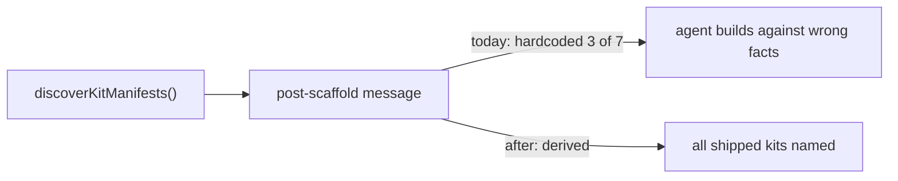

# PRD-201 — The scaffolder derives what it ships

**Status:** NOT STARTED

**Complexity:** +2 for 6–10 files, +2 cross-package (create-threenative ↔ core ↔ assets),
+1 config-surface = **5 → MEDIUM mode**.

## Context

Five scan findings live in or around `packages/create-threenative`, all one failure mode:
hand-maintained facts that drift from what is actually discovered/shipped.

- **#4 (high):** post-scaffold message prints a hardcoded "minimal, starter, platformer"
  list (`src/index.ts:495`) while `discoverKitManifests()` finds seven kits. The primary
  consumer — a cold agent — reads this message and builds against wrong facts.
- **#25:** the same 8-package list is enumerated twice (`index.ts:23` type union +
  `index.ts:457` flag table).
- **#26:** the template-variable substitution loop exists twice (`index.ts:178`, `:216`).
- **#19:** `IThreeNativeTexturesConfig` declared verbatim in `create-threenative/src/
  config.ts:74` ≡ `core/src/config.ts:27`, though the same file already re-exports core's
  other types.
- **#24:** two independent PNG parsers with copied `PNG_SIGNATURE` and duplicated tRNS
  alpha rule (`create-threenative/src/config.ts:190` vs `packages/assets/src/health.ts:57`).

Files analyzed: the five paths above.

## Solution

- Every printed list derives from the discovery function that found the truth (#4, #25).
- One substitution loop; both call sites use it (#26).
- The textures config type imports from core like its siblings (#19).
- One PNG parser owned by the package that carries the asset dependency; the other
  consumes it. If the dependency edge would be wrong-directioned, the parser moves to
  whichever package both already reach and the ledger names it.

## Integration Ledger

| # | Changed thing | Live caller | Replaces | Negative control |
| --- | --- | --- | --- | --- |
| 1 | Derived template list | scaffold completion message path `index.ts:495` | hardcoded string | add a scratch 8th kit manifest → message must name it |
| 2 | Single package enumeration | flag table consuming the union | twin literal at `index.ts:23/:457` | diverge one copy → typecheck/test red |
| 3 | Shared substitution helper | both template-write sites `index.ts:178/:216` | second loop body | revert one site → duplication grep test red |
| 4 | Core-owned textures type | create-threenative re-export | verbatim copy at `config.ts:74` | change core field → both packages must move together (typecheck) |
| 5 | One PNG parser | scaffolder validation + assets health check | second parser at `config.ts:190` | feed a tRNS PNG fixture → both consumers agree on alpha |

## Execution Phases

### Phase 1 — The scaffold message tells the truth

**Files (3):** `index.ts` (EDIT), scaffolder spec (EDIT), a fixture kit manifest for the
test (NEW).

- [ ] Message derives from `discoverKitManifests()` output, marking the default.
- [ ] Red first: paste today's message showing 3 of 7.

Mutation for red: hardcode the old string back → spec asserting all discovered kits are
named must fail.

### Phase 2 — Package list and substitution exist once

**Files (2):** `index.ts` (EDIT), scaffolder spec (EDIT).

- [ ] Flag table generated from (or typed by) the single enumeration.
- [ ] Both substitution sites call one helper; behaviour byte-identical on template
      fixtures.
- [ ] Red first: paste the duplicated-pair greps.

Mutations for red: reintroduce either duplicate → its test red.

### Phase 3 — Types and parsers come from their owner

**Files (4):** `create-threenative/src/config.ts`, `core/src/config.ts`,
`assets/src/health.ts` + the chosen shared home for the parser (EDIT), affected specs
(EDIT).

- [ ] Textures interface imported/re-exported from core only.
- [ ] One PNG parse implementation; both consumers pass the same tRNS/signature fixtures.
- [ ] Red first: paste the two verbatim declarations and both `PNG_SIGNATURE`s.

Mutation for red: edit one side's tRNS rule → fixture agreement test red.

## Verification

Record `docs/verification/prd-201-scaffolder-derives-<date>.md`.

1. Scaffolder specs per phase with mutations pasted red.
2. `pnpm build` then scaffold-smoke: scaffold every kit; each post-scaffold message names
   exactly the discovered set.
3. Grep proof: zero remaining verbatim duplicates (`IThreeNativeTexturesConfig`,
   `PNG_SIGNATURE`, substitution loop) outside their single homes.
4. `pnpm typecheck && pnpm lint && pnpm test` green.

## Acceptance Criteria

- [ ] A newly added kit appears in the scaffold message without editing prose.
- [ ] No string/type/parser in this PRD's scope has two independent definitions.
- [ ] Scaffold output bytes are unchanged for all existing templates (smoke diff).
- [ ] Each criterion states its mutation with pasted red above.
