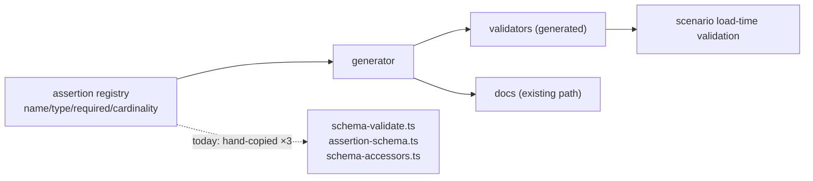

# PRD-204 — Assertion validators are generated from the registry

**Status:** NOT STARTED

**Complexity:** +2 for 5–10 files, +2 for codegen (new generation step), +1 for the
three-way schema consolidation, +1 for fail-closed generator = **6 → MEDIUM mode**.
Checkpoints after every phase regardless.

## Context

Scan finding #11: the assertion schema is declared three times — registry prose types
(`scenario/assertion-schema.ts`), a string→predicate map, and ~20 hand-written validators
carrying 106 inline type checks (`schema-validate.ts`), with accessors reading a third
copy (`schema-accessors.ts:505`). The package is deliberately dependency-free, so this is
not a zod question. The registry already carries name/type/required/cardinality and
already generates docs (`scripts/generate-assertion-reference.ts`). Every new assertion
field today costs edits in three places plus docs; until generated, drift between them is
silent.

Files analyzed: the four paths above plus the existing doc generator (the pattern to
extend).

## Solution

- The registry becomes the machine-readable owner: every assertion field carries
  type/required/cardinality constraints sufficient to generate validation.
- A generator emits validators (and accessor helpers where derivable) from it; the
  hand-written copies are deleted in the same phase that generates, never left alongside.
- Docs keep generating from the same registry — one source now feeds both.
- Generator fails closed: an entry missing constraints fails `pnpm build`; it never
  emits a permissive validator.

## Integration Ledger

| # | Changed thing | Live caller | Replaces | Negative control |
| --- | --- | --- | --- | --- |
| 1 | Generated validator module | scenario load path via `schema-validate.ts` entry points | ~20 hand-written validators | add bogus field to registry only → regenerated validator must reject it; delete generator output → build fails |
| 2 | Registry constraint completeness | the generator itself | prose-only entries | strip one field's constraints → build red (fail-closed proof) |
| 3 | Single-source docs | `generate-assertion-reference.ts` | any doc-side duplication | mutate a constraint → emitted docs change in same commit |

## Execution Phases

### Phase 1 — The registry can say everything the validators know

**Files (3):** `assertion-schema.ts` (EDIT), generator input types (EDIT), completeness
spec (NEW).

- [ ] Every field across all assertion kinds carries machine-readable constraints; gaps
      found by a completeness audit spec, not by eye.
- [ ] Red first: paste the audit's initial gap list (fields whose checks live only in
      hand-written code).
- [ ] No behaviour change yet — validators untouched this phase.

Mutation for red: remove one field's new constraints → completeness spec red.

### Phase 2 — Generate, switch, delete

**Files (4):** generator script (NEW/EDIT beside `generate-assertion-reference.ts`),
generated validator module (GENERATED), `schema-validate.ts` (EDIT — consumes generated),
hand-written validator bodies (DELETED same phase).

- [ ] Generated validators pass every existing schema spec byte-for-byte in accept/reject
      behaviour (golden fixture matrix before/after).
- [ ] Accessor derivations switched or explicitly left with reason recorded.
- [ ] Old bodies gone — no dual live implementations.
- [ ] Red first: golden matrix captured on hand-written validators; introduce one
      deliberate mutation in a generated validator → matrix catches it.

### Phase 3 — Docs and drift guards close the loop

**Files (3):** doc generator (EDIT if needed), CI/test wiring asserting regeneration
(EDIT), spec (EDIT).

- [ ] A test regenerates and diffs: committed artifacts must match registry state.
- [ ] Docs regenerate from the same source with no manual sync step.

## Verification

Record `docs/verification/prd-204-generated-validators-<date>.md`.

1. Golden accept/reject matrix over all in-repo scenarios' assertion sets: identical
   pre/post, pasted diff summary.
2. Negative controls observed red: bogus-field, stripped-constraints, stale-artifact.
3. Add one new assertion field end-to-end as the friction proof: count edits required
   (target: registry + tests only). Paste the touch list.
4. Full `pnpm --filter @threenative/playtest test` green; one playtest run proving real
   scenarios still load and validate.

## Acceptance Criteria

- [ ] Adding an assertion field requires editing the registry once — not three places
      plus docs.
- [ ] Zero hand-written validator bodies remain for kinds the generator covers.
- [ ] An incomplete registry entry fails the build instead of emitting a permissive
      validator.
- [ ] Accept/reject behaviour is provably unchanged (golden matrix).
