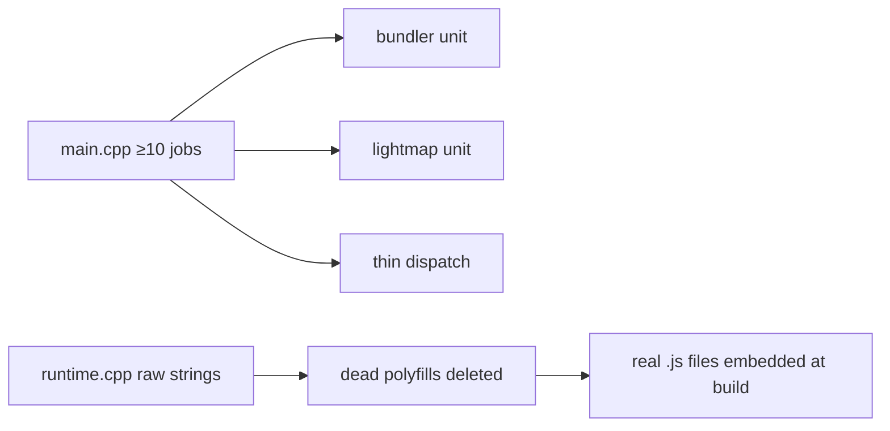

# PRD-207 — Native internals shed their shortcuts

**Status:** NOT STARTED

**Complexity:** +3 for 10+ files across the C++ host, +2 for the ownership API change
(`engine.h`), +2 for concurrency-sensitive rework, +1 for build-tool extraction = **8 →
HIGH mode**. Checkpoint review after every phase.

## Context

Four scan findings about structure inside the native host, none user-visible alone but
all compounding review and reliability cost:

- **#17:** `cli/main.cpp` does ≥10 jobs including a ~900-line bundler and lightmap
  baking — build-time tools living in the runtime binary.
- **#27:** ~2,900 of `runtime.cpp`'s 4,743 lines are embedded JS raw strings (fetch/gltf/
  draco polyfills) — gltf/draco persist even though native GLTF is deprecated; JS-in-C++
  is unlintable and unreviewable.
- **#28:** `JSValueHandle` is bare `void*` ownership-by-comment; QuickJS heap-allocates
  `new JSValue` with a "(caller must free)" convention and no free method on Engine
  (`include/mystral/js/engine.h`, `quickjs_engine.cpp:271`).
- **#29:** 11 sleep-poll(1 ms) loops instead of fences/condvars (`cli/main.cpp` ×5,
  `context.cpp`, `bindings.cpp`, `gpu_readback_recorder.cpp`) — latency burned per poll,
  timing-dependent behaviour.

Files analyzed: the paths above plus engine consumers of `JSValueHandle`.

## Solution

- Extract bundler and lightmap baking into their own translation units (or dev-only
  targets); `main.cpp` becomes dispatch over real units. No behaviour change — same CLI
  invocations produce identical artifacts.
- Delete dead polyfill weight first (gltf/draco behind the deprecated path), then move
  surviving embedded JS to real `.js` files embedded at build time — diffable, lintable,
  no raw-string escaping.
- Give `JSValueHandle` an explicit owner: creation/freeze/free on Engine, RAII guard at
  use sites; delete the by-comment convention.
- Replace polls with fence/condvar waits where the primitive exists; each replacement
  proves identical wakeup semantics with lower latency.

Order matters: #27's deletion first shrinks everything downstream.

## Integration Ledger

| # | Changed thing | Live caller | Replaces | Negative control |
| --- | --- | --- | --- | --- |
| 1 | Bundler/lightmap units | existing CLI invocations | inline bodies in `main.cpp` | run bundler/lightmap before+after → byte-identical artifacts |
| 2 | Build-embedded JS files | runtime bootstrap loading them | raw-string literals | mutate an extracted .js → runtime behaviour changes (proves it is live) |
| 3 | Owned `JSValueHandle` API | all handle consumers via `engine.h` | comment-convention frees | leak-count test: N handles created, N freed on teardown |
| 4 | Fence/condvar waits | readback/context/main loops | 11 sleep-polls | latency probe: wait-site wake time drops; timeout semantics preserved |

## Execution Phases

### Phase 1 — Dead polyfill weight leaves (#27a)

**Files (4):** `runtime.cpp`, its bootstrap/consumers, deprecation-path spec (EDIT).

- [ ] Confirm native GLTF deprecation coverage: what still reaches gltf/draco strings?
      Record callers; delete only what nothing live reaches.
- [ ] Red first: grep counts pasted; any live caller found blocks deletion and gets filed.

Mutation for red: none needed for pure deletion — instead the negative control is the
live-caller census (must be empty for every deleted string) plus suite green proving no
regression.

### Phase 2 — Surviving JS becomes files (#27b)

**Files (4):** extracted `.js` sources (NEW), embed/build step (EDIT), `runtime.cpp`
(EDIT), runtime contract spec (EDIT).

- [ ] Fetch polyfill and survivors load from embedded-at-build files.
- [ ] Byte-equivalent behaviour: existing contract specs green unchanged.
- [ ] Mutation control: perturb one extracted file → its contract test red.

### Phase 3 — main.cpp sheds its jobs (#17)

**Files (5):** new bundler + lightmap units (NEW), `cli/main.cpp` (EDIT), artifact-diff
check script/spec (EDIT).

- [ ] Identical CLI surface; artifacts byte-identical pre/post.
- [ ] `main.cpp` line count drops by the extracted bodies; paste counts.
- [ ] Red first: paste today's `main.cpp` job inventory (function list).

### Phase 4 — Handles own their lifetime (#28)

**Files (4):** `include/mystral/js/engine.h`, `quickjs_engine.cpp`, v8 counterpart if it
shares the seam, handle-lifetime test executable (NEW).

- [ ] Explicit create/free on Engine; use-site RAII guards; comment conventions deleted.
- [ ] Leak test: allocate/free churn under both engines reports zero outstanding handles.
- [ ] Red first: run leak counter against today's convention — paste outstanding count
      mechanism (instrumented or sanitizer).

### Phase 5 — Polls become waits (#29)

**Files (5 max per increment):** the 11 sites' files in two increments, latency probe
spec (NEW).

- [ ] Each site: fence/condvar with timeout semantics equal-or-better; no busy loop.
- [ ] Latency probe: mean/median wakeup delay per site before/after, pasted.
- [ ] Any site where a poll must remain gets a written reason here.

## Verification

Record `docs/verification/prd-207-native-internals-<date>.md`.

1. Per-phase proofs above; native contract proofs run as bindings test executables (no
   display required).
2. Desktop playtest naming executable + adapter after phases 2, 4, 5 (the ones that touch
   live runtime behaviour).
3. Sanitizer/leak pass over the handle churn test if toolchain provides one; else state
   the counting method used.
4. Artifact byte-diff for bundler/lightmap; LOC deltas for `main.cpp` and `runtime.cpp`.

## Acceptance Criteria

- [ ] The runtime binary contains no build-time tool bodies; artifacts unchanged.
- [ ] No live-behaviour JS lives in raw C++ strings; every extracted file is provably
      loaded.
- [ ] Handle lifetime is enforced by types/API, not comments; churn test shows zero
      leaks.
- [ ] Zero sleep-poll loops remain without a recorded justification; measured wakeup
      latency improved at every converted site.
