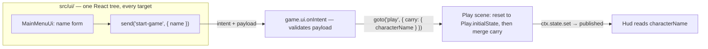

# PRD-218 — Scenes are the screens: the menu/start-screen flow, shipped as a convention

**Status:** PROPOSED 2026-08-24. Spike evidence: `docs/verification/menu-spike-2026-08-24.md`.

**Complexity:** +3 for 10+ files across four packages (core, playtest, create-threenative,
runtime-native), +2 multi-package, +1 state semantics (the goto reset) = **6 → MEDIUM mode**.

Owner's requirements, verbatim: *"What if we want to do like what react-router-dom does on
React? … games generally start with the start screen where some information can be presented
like create char and etc. Basically static forms and some art. Whats the best architecture to
do this here? … Should we make use of our react UI if available? What about if user opt for the
native route (no react?)"* and *"yeah, do some spikes and see how it goes, then use prd-creator
skill to create a prd"*.

## Context

The spike (`docs/verification/menu-spike-2026-08-24.md`) built a title screen + character
creation on the unmodified starter and proved the architecture in one afternoon of game code,
no framework changes: **the scene is the screen** (the 3D world behind the menu is a scene, so
the art is ordinary Three.js), **the chrome is React in `src/ui/`** (the same bundle on web and
in the native web view), **flow is intents + `game.goto()`** (the UI process can never hold the
game, so flow authority stays game-side by construction). A router library adds URL/history
semantics a game window does not have and a second router beside the one the framework already
ships; rejected. The spike's green evidence: menu renders as world-behind-chrome
(`menu-screen-web.png`), and Tab → type → Enter drives form → intent payload → `goto("play")`
with clean diagnostics on a real WebGPU adapter (`after-start-game-web.png`).

The same spike proved four framework defects that stand between that pattern and a cold agent
building it without stumbling:

1. **Per-run state cannot cross a scene switch.** `goto()` resets the store to `#initialState`
   captured once at construction **from the start scene** (`packages/core/src/game.ts:362-371`,
   `:421-423`). The typed character name dies at the menu→play transition
   (`run4-console.json`: PRE_GOTO `"axo"` → PLAY_ENTER `""`), and a menu-first game's restart
   resets to *menu* state. Games will hide data in module globals — the framework must own it.
2. **Playtest state samples don't observe across a `goto`.** The same run's report records
   `resources.state.after.screen === "menu"` while the live store logged `"playing"`. The
   framework's own rule — a playtest scenario proves the game — is unenforceable for the
   menu→play transition, the single most agent-built flow there is.
3. **Scenarios cannot click.** Step kinds are `aimAt | input | wait`
   (`packages/playtest/src/scenario/schema-base.ts:26`); driving a button is a Tab/Enter dance
   that breaks on focus-order changes and cannot reach pointer-only UI.
4. **The pattern is not in the templates.** The starter ships one scene and a pause bar; an
   agent asked for a start screen invents the shape (or a router) from scratch. Conventions
   ship on by default, and this one doesn't.

Setup findings, same source: scaffold-from-tarballs is broken three ways (`npm pack` leaves
`catalog:` in tarballs; template devDeps name unregistered packages; relative `file:` paths
that don't resolve), and the desktop Linux overlay refuses to attach on this machine's Wayland
session and under a compositor-less Xvfb — honestly, with named reasons, but only *after* a
build. The quad renderer has no text input (re-verified in `packages/core/src/react.ts`), so
forms are webview-only today; that is a documented constraint, not a work item here.

## Solution

- **No router.** Scenes stay the only screen vocabulary; the PRD ships the pattern, not a new
  one. `react-router-dom`-style URL routing is rejected in prose so the next agent doesn't
  relitigate it.
- **`goto()` becomes destination-scened and carry-capable.** `goto(name)` resets to the
  **destination** scene's `initialState`; `goto(name, { carry })` merges a serializable patch
  after the reset. Restart semantics are unchanged for the existing starter (its start scene is
  the play scene; its restart also sets state explicitly).
- **The harness observes the transition.** Fix the state-sample staleness, and add a `click`
  step that drives a real pointer-down through the page — which on web also exercises the
  `data-tn-interactive` hit-region protocol end to end.
- **The starter teaches it.** `MainMenu` scene + menu UI + `screen` state + intents + a
  `menu-flow` playtest ship in the template, with an `agent-docs` page for the recipe.
- **The tarball lane installs.** `pnpm pack` in `make-sandbox`, resolvable dep paths,
  tarball overrides for every in-repo package the template names.
- **Doctor names the desktop blocker before the build.** The host already fails honestly at
  runtime; `threenative doctor --text` runs the same probe pre-build. The overlay fix itself
  stays PRD-217's.

**Key decisions:** no new UI vocabulary (kill switch: every fix below deletes hand-rolled
workarounds — module-global carriers, Tab/Enter dances, build-then-fail overlay debugging);
fail-closed payload validation stays in game code where the meaning lives; the carry patch is
serializable state only, never entities or scenes.

**Data changes:** none (no schemas, no migrations).

## Integration Ledger

| # | New thing | Live caller (`file:line`, non-test) | Replaces | Old path removed? | Negative control |
|---|-----------|-------------------------------------|----------|-------------------|------------------|
| 1 | `goto(name, { carry })` merge | starter template `src/game.ts` start-game handler | module-global name carriers (the only alternative today) | n/a, nothing to remove | drop `carry` from the template handler → criterion 2's assertion goes red (observed red 2026-08-24, `run4-console.json`) |
| 2 | destination-scene reset in `goto` | `packages/core/src/game.ts` `goto()` itself; Play restart path | reset-to-start-scene behaviour | replaced in place | revert the destination lookup → the Phase 1 unit test goes red |
| 3 | post-goto state sampling fix | runner report `resources.state.after` | stale sample | replaced in place | revert the fix → `menu-flow` resources assertion goes red (observed red 2026-08-24, run 3/4 reports) |
| 4 | `click` scenario step | starter `playtests/menu-flow.playtest.json` | Tab/Enter focus dance | deleted from the template scenario | misspell the step kind → `invalidScenario` throws at load (fail-closed rule) |
| 5 | starter `MainMenu` scene + `MainMenuUi` | starter `src/game.ts` `scenes` + `src/ui/GameUi.tsx` | nothing — new convention, no incumbent exists (the starter had no menu scene) | n/a | remove the scene from `scenes` → scaffold spec + menu-flow scenario fail |
| 6 | doctor desktop-overlay probe | `threenative doctor --text` CLI output | build-then-fail discovery | n/a | run under compositor-less Xvfb → doctor names the blocker (observed 2026-08-24) |
| 7 | tarball-lane fixes in `make-sandbox` | `pnpm sandbox` → `sandbox/scaffold.sh` flow | hand-edited `file:` paths (what the spike needed) | hand-edits become unnecessary | `npm pack` a workspace package → install fails on `catalog:` (observed 2026-08-24) |

## Phases

#### Phase 1: `goto` carries state across scenes — a character name survives menu→play

**Files (max 5):**

- `packages/core/src/game.ts` - EDIT: destination-scene reset + optional `carry` merge
- `packages/core/src/__tests__/game.spec.ts` (or the existing game test file) - EDIT: red first

**Implementation:**

- [ ] Red unit test: `goto("b")` resets to `b`'s `initialState`, not the start scene's; `goto("b", { carry })` merges after the reset; `carry` is validated serializable or throws.
- [ ] Implement: look the destination's static `initialState` up at goto time; apply `{ ...destination, ...carry }`.
- [ ] Confirm the existing starter restart path is behaviour-identical (its restart sets state explicitly before goto).

**Wiring:** ledger rows 1–2. **Tests:** unit red-green as above. **Revert check:** revert the destination lookup → unit test red. **User verification:** in the spike project, `characterName` reaches the play HUD.

#### Phase 2: the harness sees the transition, and can click

**Files (max 5):**

- `packages/core/src/playtest.ts` - EDIT: state-sample path observes across `goto`
- `packages/playtest/src/scenario/schema-base.ts` - EDIT: `click` step kind, fail-closed validation
- `packages/playtest/src/runner/steps.ts` - EDIT: pointer-down/up driver
- `packages/playtest/__tests__/` - EDIT: wrong-typed `click` throws; sampling red-green

**Implementation:**

- [ ] Root-cause the stale sample (suspect: a per-scene binding or snapshot in the bridge path), fix, and prove with a two-scene unit fixture.
- [ ] `click` step: `{ kind: "click", at: { x, y } | entity, label }` in viewport pixels; CDP mouse on web; named error on targets without pointer transport — never a skip.
- [ ] New assertion types follow the house rule: a test proving the wrong-typed case fails, added beside `vacuous-assertion.spec.ts`.

**Wiring:** ledger rows 3–4. **Revert check:** revert the sampling fix → the two-scene fixture goes red. **User verification:** `menu-flow` scenario asserts `screen` changed via `resources` and passes.

#### Phase 3: the starter ships the pattern

**Files (max 5, plus generated mirrors):**

- `packages/create-threenative/templates/starter/src/scenes/MainMenu.ts` - NEW
- `packages/create-threenative/templates/starter/src/ui/MainMenuUi.tsx` - NEW
- `packages/create-threenative/templates/starter/src/game.ts` + `src/state.ts` + `src/ui/GameUi.tsx` - EDIT: `start: "menu"`, `screen` state, intents, carry
- `packages/create-threenative/templates/starter/playtests/menu-flow.playtest.json` - NEW
- `packages/create-threenative/agent-docs/references/menu-screens.md` - NEW; `STARTER_PATHS`, instruction budget, template AGENTS.md updated

**Implementation:**

- [ ] Port the spike's menu scene, form UI and intents into the starter, using Phase 1's `carry` and Phase 2's `click`.
- [ ] `pnpm sync:agents`, `pnpm budgets`, `scaffold.spec.ts` `STARTER_PATHS` green.

**Wiring:** ledger row 5. **Revert check:** drop `MainMenu` from `scenes` → scaffold spec and the template's own scenario fail. **User verification:** scaffold a fresh starter; it boots to the menu; the playtest drives menu→play.

#### Phase 4: the tarball lane installs unmodified

**Files (max 5):**

- `scripts/make-sandbox.ts` - EDIT: `pnpm pack` (catalog-resolved), absolute dep paths
- `packages/create-threenative/src/` scaffolder output path handling - EDIT as needed
- `scripts/__tests__/` - EDIT: packed manifests contain no `catalog:`

**Implementation:**

- [ ] Pack with `pnpm pack`; emit dep specifiers that resolve from the generated project; ensure every in-repo package the template names has a `--*-package` override path in the sandbox flow.
- [ ] Prove: a fresh sandbox scaffold installs and boots with zero hand-edits (this spike needed four).

**Wiring:** ledger row 7. **Revert check:** pack one workspace package with `npm pack` → install fails on `catalog:` (observed). **User verification:** `pnpm sandbox` output installs clean.

#### Phase 5: doctor names the desktop overlay blocker before the build

**Files (max 5):**

- `packages/create-threenative/src/doctor.ts` - EDIT: desktop probe (compositor / RGBA container), same named reasons the host emits
- `packages/create-threenative/__tests__/` - EDIT: probe reports both observed failure modes

**Implementation:**

- [ ] Probe before build; `doctor --text` prints the reason and the working lane (X11 session or composited display), never a skip.
- [ ] The overlay fix itself remains PRD-217's; this phase only makes the failure legible pre-build.

**Wiring:** ledger row 6. **Revert check:** stub the probe off → doctor output loses the reason (test red). **User verification:** on this machine's Wayland session, `doctor --text` names the transparent-container blocker.

## Acceptance criteria

1. **A cold agent can build a two-screen game.** Scaffold the starter, follow only in-template examples to add a settings screen, and a `--target web` playtest with a `click` step drives menu→settings→play asserting carried state through `resources`. Mutation: revert Phase 2's sampling fix → the assertion is red (already observed red 2026-08-24).
2. **The character name chosen at the menu is on the play HUD.** Mutation: remove `carry` from the starter's start-game handler → red (observed as the goto wipe, `run4-console.json`).
3. **Restart in a menu-first game resets to the played scene's state, not the menu's.** Mutation: revert the destination-scene lookup → Phase 1 unit red.
4. **A fresh tarball scaffold installs and boots unmodified.** Mutation: `npm pack` any workspace package → install fails on `catalog:` (observed).
5. **Desktop overlay failure is named before the build.** Mutation: probe disabled → doctor silent (test red); both real failure modes observed 2026-08-24.
6. **House gates stay green:** `pnpm typecheck && pnpm lint && pnpm test`, `pnpm budgets`, `pnpm test:templates`, instruction budget, `pnpm sync:agents --check`.

Named unverified at proposal time: Android and iOS executions of the template's menu flow (the webview mechanism itself is PRD-217's proven lane); the desktop overlay attach on this machine's Wayland session (PRD-217 scope). Constraint recorded, not scheduled here: `ui: { renderer: "native" }` has no text input, so form screens require the webview renderer, which Windows/macOS desktop do not host yet.
