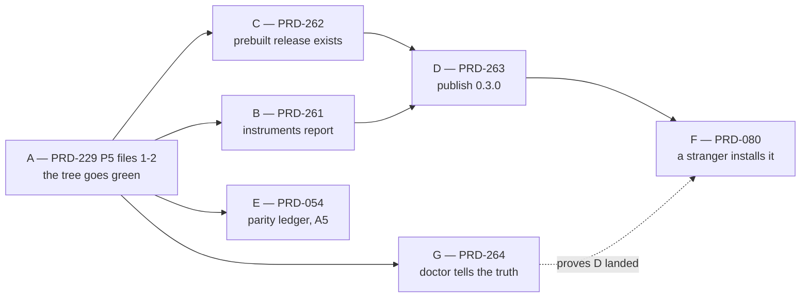

# Batch — what stands between this repository and a public release, 2026-08-29

**Status:** PARTIAL — filed 2026-08-29, measured at `8491c5d5`. **Lanes A, B and G are done**
and archived: A in `73e158c8`
([record](../../verification/prd-229-phase5-crash-policy-conversion-2026-08-29.md)), B and G in
`273672e1` ([PRD-261](../done/PRD-261-the-release-instruments-report-again.md),
[PRD-264](../done/PRD-264-doctor-answers-all-three-questions-a-game-author-has.md)). The bar now
reads **1 unmeasured, 2 failed** — A1 and A5 — where it read 3 unmeasured and 2 failed when this
batch was filed. **Lanes C through F remain, and every one of them is an owner action**: C and D
cannot start until 157 commits are pushed and CI goes green on the remote, E needs the phone, and F
needs a person who is not us. Every number in the sections below was measured when this batch was
filed, on a clean `main` (`git status` empty, `.claude/worktrees/` empty, so no sibling lane owned
these reds); the *Where the instruments stand now* section carries the current readings.

**The batch's whole shape: we cannot publish, and we cannot currently prove we could.** Three of the
seven alpha-bar rows are still not green, and CI is red on a remote `main` that is 157 commits
behind. This batch contains only work that moves a row on `pnpm alpha:bar` or unblocks something
that does. Nothing else was admitted, however tempting.

## Where the instruments stand now

Lanes A, B and G repaired the three instruments this batch is graded by, so the batch can now read
its own state. Run on `main` at `07dfaf63`:

| Command | Result | What it says |
| --- | --- | --- |
| `pnpm round:next` | **exit 0** | `close round 12` — computed from a genuine round ledger |
| `pnpm alpha:bar` | **exit 2** | A2/A3/A4/A7 pass, **A1 and A5 fail**, A6 unmeasured. "1 of 7 rows unmeasured, 2 failed. Not alpha." |
| `threenative doctor --text` | **exit 1** in `sandbox/last-harvest` | groups Craft/Test/Ship and names the `runtime-native-v0.3.0` `prebuilt-lock.json` 404 — the thing Lane C exists to fix |

The three rows still short of green are exactly the three owner actions: **A1** needs the publish
chain (Lanes C and D, gated on the push), **A5** needs the phone (Lane E), **A6** needs a stranger
(Lane F).

**The one suite red that stood between this tree and a release is closed.**
`packages/playtest/__tests__/generated-shooter-input.spec.ts` failed on `TN_CAPTURE_BLANK`
(bright-pixel ratio `0.04470`, floor `0.05`) and had been carried as a standing capture-lane fact.
It was not one: the scenario's `warmupFrames` was `10`, so it walked its input steps against a game
still on its loading screen and photographed that. The failing capture holds 1112 colours and the
template's progress bar; the same run's final frame holds 58573 and a rendered arena. Raising the
scenario to `60` — what every other screenshot-taking template scenario already uses — makes the
capture `0.8116`, sixteen times the floor, and the spec 3/3 green. Recorded in
[shooter-capture-blank-2026-08-29](../../verification/shooter-capture-blank-2026-08-29.md).

## What was true when this batch was filed

Five commands, run at filing time, in the order a release would run them.

| Command | Result | The finding |
| --- | --- | --- |
| `pnpm test` | **was red**, aborted in `package-test` — **fixed by Lane A** | 2 failed / 620 passed in `@threenative/runtime-native`. Both failures were source-text assertions, not behaviour. `scripts/run-test-suite.sh` runs `docs → build → package-test → unit`, so the **root `unit` phase had never run at all**. It has now: 2552 tests, 2550 pass, and the two failures are **timeouts, not assertions** — both pass alone with 4× headroom, so the suite's own parallelism exhausts their budget |
| `pnpm lint` | **was red**, now exit 0 | one error-severity diagnostic among 450 warnings, invisible at biome's default `--max-diagnostics=20`. `--diagnostic-level=error` is how you find it |
| `gh run list --repo ThreeNativeHQ/threenative` | **red on a stale tree** | CI run `33219211180` failed on `main` at `7ac47850`, which is **remote `main`'s tip and 157 commits behind local `main`**. Nothing has been pushed in a long time |
| `pnpm alpha:bar` | **exit 2** | A1 fail, A5 fail, A3/A6/A7 unmeasured. "3 of 7 rows unmeasured, 2 failed. Not alpha." |
| `pnpm publish:check` | **exit 1** | 56 findings. "This tree must not be published as it stands" |
| `pnpm round:next` | **exit 1** | `Round ledger is missing '## Notes'` — it is not reading a round ledger |

### The push gap is a release blocker nobody had named

`git ls-remote origin main` is `7ac47850` — the commit CI went red on. `git merge-base
--is-ancestor` confirms it is behind local `main`, by **157 commits**.

This is load-bearing for Lanes C and D. `.github/workflows/native-release.yml`'s `gates` job runs

```sh
gh run list --workflow ci.yml --commit "$GITHUB_SHA" ... --headBranch main
```

and refuses the build unless a **completed successful CI push run on `main`** exists for the release
commit. So no release can be cut from work that has not been pushed and has not gone green on the
remote. **Pushing 157 commits is the owner's call, not an agent's**, and it is the first thing Lane
C's Phase 2 asks for. Local green is necessary and nowhere near sufficient.

### The two reds are the same red

`packages/runtime-native/tests/crash-handler-policy.test.mjs` and
`tests/runtime-next-contract.test.mjs` both `assert.match` against the **text** of
`include/mystral/platform/crash_policy.h`:

```text
AssertionError: the decision must be a pure function so it can be proven without crashing a process
AssertionError: Android must preserve the original signal for debuggerd tombstones
```

Neither behaviour changed. Commit `8ff06738` added a third parameter (`bool sanitizerBuild`) to
`crashHandlerPolicy` and clang-format wrapped the ternary across two lines. Android still resolves
to `CrashHandlerPolicy::LeaveToPlatform` — line 51 of the header says so. The tests demand
`androidPlatform ? CrashHandlerPolicy::LeaveToPlatform` on one line and a two-argument signature.

**This is [PRD-229](../done/refactor-2026-08-28/PRD-229-the-native-host-is-provable-before-it-is-moved.md)
Phase 5's thesis reproducing itself in the wild**: a suite that reds on a safe reformat and would
sleep through a real break. So the repair is the conversion, not a wider regex.

### The registry, queried today

| Package | Registry latest | Workspace | Gap |
| --- | --- | --- | --- |
| `@threenative/core` | 0.2.0 | 0.3.0 | one minor |
| `@threenative/physics` | 0.2.1 | 0.3.0 | one minor |
| `@threenative/ui` | 0.2.1 | 0.3.0 | one minor |
| `@threenative/playtest` | 0.2.0 | 0.3.0 | one minor |
| `@threenative/runtime-native` | 0.2.0 | 0.3.0 | one minor |
| `create-threenative` | 0.2.2 | 0.2.3 | one patch |
| `@threenative/assets` | **E404** | 0.3.0 | never published |
| `threenative-engine-mcp` | **E404** | 0.2.0 | never published |

Two consequences neither the README nor the alpha bar states in one place:

1. **All eight templates pin all eight packages.** Two of those pins can never resolve, so the
   current tree's scaffold is uninstallable for a stranger regardless of what else we fix. A2
   passes only because it tests `create-threenative@0.2.2`, whose templates predate those pins.
2. **`threenative-engine-mcp` is the capability-search path.** `packages/core/mcp/servers.mjs:35`
   names it as the `npx` fallback for the `threenative-engine` server that `ensure-mcp.mjs` writes
   into every consumer's `.mcp.json`. The repository's own first rule — *ask what exists before you
   write a system* — is unreachable from the registry today.

### The native release has never happened

`gh api repos/ThreeNativeHQ/threenative/releases` returns **0**. Five `runtime-native-v*` tags exist
(`v0.1.10` through `v0.1.14`) and `.github/workflows/native-release.yml` fires on exactly that tag
pattern, so the workflow either never ran or never produced a release. `prebuilt-lock.json` is HTTP
404 for **both** `v0.2.0` and `v0.3.0`.

`@threenative/runtime-native@0.2.0` is nevertheless published. Its `install` hook degrades on
purpose — `install-prebuilt.mjs` treats `PREBUILT_RELEASE_MISSING` as a packaging-state fact and
records it in `prebuilt/install-status.json` rather than failing the install — which is correct
behaviour and also means **no installed user has ever had a working native runtime, and nothing
told them so at install time.** Every native claim we make is currently unreachable from npm.

## Scope

Only rows that move the bar. Each names the command that decides it.

| Lane | PRD | Moves | Device | Gate that decides it |
| --- | --- | --- | --- | --- |
| A | ~~[PRD-229](../done/refactor-2026-08-28/PRD-229-the-native-host-is-provable-before-it-is-moved.md) Phase 5, files 1–2~~ **DONE `73e158c8`** | nothing on the bar; unblocked every other lane | none | `pnpm lint` exit 0; `package-test` 89/89; `unit` 2550/2552, the two remainders being timeouts that pass alone |
| B | ~~[PRD-261](../done/PRD-261-the-release-instruments-report-again.md)~~ **DONE `273672e1`** | **A3** pass, **A7** pass, and `round:next` | none | `pnpm round:next` exit 0; `pnpm alpha:bar` A3/A7 pass, A1 and A5 the only reds |
| C | [PRD-262](./PRD-262-the-runtime-native-prebuilt-release-exists.md) | unblocks A1 | none (CI runners) | `curl -sI .../runtime-native-v0.3.0/prebuilt-lock.json` → 200 |
| D | [PRD-263](./PRD-263-version-0-3-0-is-installable-by-a-stranger.md) | **A1**, re-proves **A2** | none | `pnpm publish:check` exit 0, then `pnpm release --yes` |
| E | [PRD-054](../BLOCKED/requires-parity-rerun/PRD-054-write-once-run-anywhere.md) | **A5** | Pixel 8 / emulator | `pnpm parity:ledger` exit 0 on a ledger dated today |
| F | [PRD-080](../BLOCKED/requires-external-person/PRD-080-five-minute-stranger-test.md) | **A6** | none | an `alpha-bar` block for A6, sourced from a session |
| G | ~~[PRD-264](../done/PRD-264-doctor-answers-all-three-questions-a-game-author-has.md)~~ **DONE `273672e1`** | no row — the diagnostic a stranger runs | none | `threenative doctor` fails naming `threenative-engine-mcp` when the server cannot resolve |

Lane F is an owner action, not an agent lane — it needs a person who is not us, and it cannot start
before D publishes something for them to install. It is listed so the bar's last row has a name
against it, not so it gets scheduled.

**Lane G moves no row and is in the batch on purpose.** `threenative doctor` is the only diagnostic
a user with just the library installed can run, and it currently answers *ship* well, *test* with a
file-existence check, and *craft* with a `files.has(".mcp.json")` that would print a green tick over
the E404 that Lane D exists to fix. A release whose own doctor cannot see its worst failure ships
that failure to everyone who installs it.

## Order, and why



**A is first and is not negotiable.** `pnpm release` refuses on a red `publish:check`, CI is red on
`main`, and the `unit` phase has not executed on this HEAD. Publishing off a tree whose root suite
never ran is the 0.2.0 mistake with a different mechanism.

**B is second because it is cheap and it tells us whether the rest worked.** Every lane after it is
graded by `pnpm alpha:bar`, and the bar cannot currently write its own table.

**C before D** because `publish:check` fails `@threenative/runtime-native` outright without a
prebuilt release, and D publishes one consistent tree in one run by design.

**E is independent of the publish chain** and can run in parallel with C on a different lane —
it needs the phone, nothing else does.

**G is independent of everything after A** and is best run *before* D publishes, so the repaired
doctor is what a stranger gets. Its headline acceptance criterion — doctor fails on an unresolvable
`threenative-engine-mcp` — is checkable today precisely because that package is still E404; once D
lands, the only way to test it is to break something on purpose.

## Try these blocked reasons before believing them

Two of the six lanes sit in `BLOCKED/` under reasons that may have expired. Per
[the filing rules](../AGENTS.md), attempt the blocked step once and record what happened.

- **PRD-054 — `requires-parity-rerun`.** Blocked 2026-08-10 partly on "no online emulator/device".
  The Android emulator lane runs on this machine now. Do one `adb` attempt and record the outcome
  either way before re-filing.
- **PRD-060 — `requires-release-credentials`.** Its blocked text says `create-threenative` and
  `@threenative/runtime-native` return npm `E404`. Both resolve today (0.2.2 and 0.2.0). At least
  part of that reason is stale; re-read it against the registry table above before citing it.

## Traps carried into this batch

- **`pnpm release` is dry by default and `--yes` cannot be undone.** npm versions are immutable; a
  broken publish can be deprecated, never replaced. Nothing in this batch runs `--yes` without the
  owner saying so in the same session.
- **Registry commands take the untracked local `.npmrc` explicitly** (`npm --userconfig .npmrc
  <command>`), and it is never printed.
- **`pnpm test` aborts the whole recursive run at the first failing package**, so a green
  `runtime-native` is a precondition for learning anything about the root suite. Resume a single
  phase with `bash scripts/run-test-suite.sh --resume --phase unit` rather than re-running all four.
- **A5 is failing partly on paths, not on physics.** Two of its four findings name reports under
  `/home/joao/projects/threejs-webgpu/...`, a checkout that no longer exists. A fresh ledger from a
  fresh run answers those; arguing about the numbers does not.

## Explicitly out of scope

Named so they are not silently absorbed:

- **PRD-229 Phase 5's remaining 25 files.** Only the two that are red today are in this batch. The
  rest belong to the [refactor batch](../done/refactor-2026-08-28/README.md) and gate PRD-230, not the
  release.
- **PRD-230 through PRD-235.** No release row depends on them.
- **The Android 60 FPS work** ([PRD-222](../PRD-222-return-from-background-resumes-instead-of-reloading.md),
  [PRD-224](../PRD-224-webgpu-binding-tables-install-once-per-class.md)) and the
  night batch (its README was removed in `ee63eea9`) lanes. Performance is not on the alpha bar.
- **PRD-259 and PRD-260** (filed 2026-08-29 in `feature-mining/`). New capability, not release
  readiness.
- **The starter-kits batch** ([PRD-087](../starter-kits/PRD-087-genre-borrow-ledger.md),
  [PRD-122](../starter-kits/PRD-122-specialized-agent-roles.md),
  [PRD-236](../starter-kits/PRD-236-sailing-starter-kit.md)). PRD-087 is executed, PRD-236 is a new
  kit, and PRD-122 (two agent roles in every scaffold) is the only one touching the authoring
  pipeline. None moves an alpha-bar row.
- **[PRD-185](../package-naming/PRD-185-package-naming-law.md), except one decision.** The naming
  law is cosmetic while the package it renames is E404 — a rename produces a differently-named
  E404. But **its decision 3 is a required input to Lane D**: npm versions are immutable, so
  publishing `threenative-engine-mcp` under the unscoped name and renaming afterwards means
  deprecating a name we created the same week. [PRD-263](./PRD-263-version-0-3-0-is-installable-by-a-stranger.md)
  Phase 1 therefore settles the published name; the doc gate, the waivers and the example
  directories stay in PRD-185.
- **Round 13.** `round:next` is repaired by Lane B; running another paired round is not a release
  blocker, and A4 already passes on Round 9.
