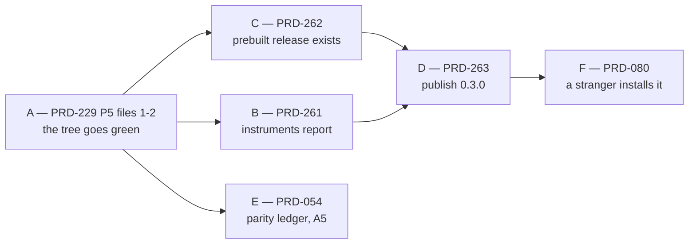

# Batch — what stands between this repository and a public release, 2026-08-29

**Status:** PROPOSED — filed 2026-08-29, planned only, nothing executed. Every number below was
measured today at `8491c5d5` on a clean `main` (`git status` empty, `.claude/worktrees/` empty, so
no sibling lane owns these reds).

**The batch's whole shape: we cannot publish, and we cannot currently prove we could.** Four of the
seven alpha-bar rows are not green, the test suite is red on `main`, CI is red on `main`, and the
one instrument that answers "what next" throws. This batch contains only work that moves a row on
`pnpm alpha:bar` or unblocks something that does. Nothing else was admitted, however tempting.

## What is actually true today

Five commands, run today, in the order a release would run them.

| Command | Result | The finding |
| --- | --- | --- |
| `pnpm test` | **red**, aborts in `package-test` | 2 failed / 620 passed in `@threenative/runtime-native`. Both failures are source-text assertions, not behaviour. `scripts/run-test-suite.sh` runs `docs → build → package-test → unit`, so the **root `unit` phase never ran at all** |
| `gh run list --repo ThreeNativeHQ/threenative` | **red** | CI run `33219211180` on `main`, 2026-08-28, failure. Four consecutive `Native platform evidence` failures before it |
| `pnpm alpha:bar` | **exit 2** | A1 fail, A5 fail, A3/A6/A7 unmeasured. "3 of 7 rows unmeasured, 2 failed. Not alpha." |
| `pnpm publish:check` | **exit 1** | 56 findings. "This tree must not be published as it stands" |
| `pnpm round:next` | **exit 1** | `Round ledger is missing '## Notes'` — it is not reading a round ledger |

### The two reds are the same red

`packages/runtime-native/tests/crash-handler-policy.test.mjs` and
`tests/runtime-next-contract.test.mjs` both `assert.match` against the **text** of
`include/mystral/platform/crash_policy.h`:

```text
AssertionError: the decision must be a pure function so it can be proven without crashing a process
AssertionError: Android must preserve the original signal for debuggerd tombstones
```

Neither behaviour changed. Commit `8ff06738` added a third parameter (`bool sanitizerBuild`) to
`crashHandlerPolicy` and clang-format wrapped the ternary across two lines. Android still resolves
to `CrashHandlerPolicy::LeaveToPlatform` — line 51 of the header says so. The tests demand
`androidPlatform ? CrashHandlerPolicy::LeaveToPlatform` on one line and a two-argument signature.

**This is [PRD-229](../refactor-2026-08-28/PRD-229-the-native-host-is-provable-before-it-is-moved.md)
Phase 5's thesis reproducing itself in the wild**: a suite that reds on a safe reformat and would
sleep through a real break. So the repair is the conversion, not a wider regex.

### The registry, queried today

| Package | Registry latest | Workspace | Gap |
| --- | --- | --- | --- |
| `@threenative/core` | 0.2.0 | 0.3.0 | one minor |
| `@threenative/physics` | 0.2.1 | 0.3.0 | one minor |
| `@threenative/ui` | 0.2.1 | 0.3.0 | one minor |
| `@threenative/playtest` | 0.2.0 | 0.3.0 | one minor |
| `@threenative/runtime-native` | 0.2.0 | 0.3.0 | one minor |
| `create-threenative` | 0.2.2 | 0.2.3 | one patch |
| `@threenative/assets` | **E404** | 0.3.0 | never published |
| `threenative-engine-mcp` | **E404** | 0.2.0 | never published |

Two consequences neither the README nor the alpha bar states in one place:

1. **All eight templates pin all eight packages.** Two of those pins can never resolve, so the
   current tree's scaffold is uninstallable for a stranger regardless of what else we fix. A2
   passes only because it tests `create-threenative@0.2.2`, whose templates predate those pins.
2. **`threenative-engine-mcp` is the capability-search path.** `packages/core/mcp/servers.mjs:35`
   names it as the `npx` fallback for the `threenative-engine` server that `ensure-mcp.mjs` writes
   into every consumer's `.mcp.json`. The repository's own first rule — *ask what exists before you
   write a system* — is unreachable from the registry today.

### The native release has never happened

`gh api repos/ThreeNativeHQ/threenative/releases` returns **0**. Five `runtime-native-v*` tags exist
(`v0.1.10` through `v0.1.14`) and `.github/workflows/native-release.yml` fires on exactly that tag
pattern, so the workflow either never ran or never produced a release. `prebuilt-lock.json` is HTTP
404 for **both** `v0.2.0` and `v0.3.0`.

`@threenative/runtime-native@0.2.0` is nevertheless published. Its `install` hook degrades on
purpose — `install-prebuilt.mjs` treats `PREBUILT_RELEASE_MISSING` as a packaging-state fact and
records it in `prebuilt/install-status.json` rather than failing the install — which is correct
behaviour and also means **no installed user has ever had a working native runtime, and nothing
told them so at install time.** Every native claim we make is currently unreachable from npm.

## Scope

Only rows that move the bar. Each names the command that decides it.

| Lane | PRD | Moves | Device | Gate that decides it |
| --- | --- | --- | --- | --- |
| A | [PRD-229](../refactor-2026-08-28/PRD-229-the-native-host-is-provable-before-it-is-moved.md) Phase 5, **files 1–2 only** | nothing on the bar; unblocks every other lane | none | `pnpm test` exit 0, including the `unit` phase |
| B | [PRD-261](./PRD-261-the-release-instruments-report-again.md) | **A3**, **A7**, and `round:next` | none | `pnpm round:next` exit 0; `pnpm alpha:bar` shows A3 and A7 measured |
| C | [PRD-262](./PRD-262-the-runtime-native-prebuilt-release-exists.md) | unblocks A1 | none (CI runners) | `curl -sI .../runtime-native-v0.3.0/prebuilt-lock.json` → 200 |
| D | [PRD-263](./PRD-263-version-0-3-0-is-installable-by-a-stranger.md) | **A1**, re-proves **A2** | none | `pnpm publish:check` exit 0, then `pnpm release --yes` |
| E | [PRD-054](../BLOCKED/requires-parity-rerun/PRD-054-write-once-run-anywhere.md) | **A5** | Pixel 8 / emulator | `pnpm parity:ledger` exit 0 on a ledger dated today |
| F | [PRD-080](../BLOCKED/requires-external-person/PRD-080-five-minute-stranger-test.md) | **A6** | none | an `alpha-bar` block for A6, sourced from a session |

Lane F is an owner action, not an agent lane — it needs a person who is not us, and it cannot start
before D publishes something for them to install. It is listed so the bar's last row has a name
against it, not so it gets scheduled.

## Order, and why



**A is first and is not negotiable.** `pnpm release` refuses on a red `publish:check`, CI is red on
`main`, and the `unit` phase has not executed on this HEAD. Publishing off a tree whose root suite
never ran is the 0.2.0 mistake with a different mechanism.

**B is second because it is cheap and it tells us whether the rest worked.** Every lane after it is
graded by `pnpm alpha:bar`, and the bar cannot currently write its own table.

**C before D** because `publish:check` fails `@threenative/runtime-native` outright without a
prebuilt release, and D publishes one consistent tree in one run by design.

**E is independent of the publish chain** and can run in parallel with C on a different lane —
it needs the phone, nothing else does.

## Try these blocked reasons before believing them

Two of the six lanes sit in `BLOCKED/` under reasons that may have expired. Per
[the filing rules](../AGENTS.md), attempt the blocked step once and record what happened.

- **PRD-054 — `requires-parity-rerun`.** Blocked 2026-08-10 partly on "no online emulator/device".
  The Android emulator lane runs on this machine now. Do one `adb` attempt and record the outcome
  either way before re-filing.
- **PRD-060 — `requires-release-credentials`.** Its blocked text says `create-threenative` and
  `@threenative/runtime-native` return npm `E404`. Both resolve today (0.2.2 and 0.2.0). At least
  part of that reason is stale; re-read it against the registry table above before citing it.

## Traps carried into this batch

- **`pnpm release` is dry by default and `--yes` cannot be undone.** npm versions are immutable; a
  broken publish can be deprecated, never replaced. Nothing in this batch runs `--yes` without the
  owner saying so in the same session.
- **Registry commands take the untracked local `.npmrc` explicitly** (`npm --userconfig .npmrc
  <command>`), and it is never printed.
- **`pnpm test` aborts the whole recursive run at the first failing package**, so a green
  `runtime-native` is a precondition for learning anything about the root suite. Resume a single
  phase with `bash scripts/run-test-suite.sh --resume --phase unit` rather than re-running all four.
- **A5 is failing partly on paths, not on physics.** Two of its four findings name reports under
  `/home/joao/projects/threejs-webgpu/...`, a checkout that no longer exists. A fresh ledger from a
  fresh run answers those; arguing about the numbers does not.

## Explicitly out of scope

Named so they are not silently absorbed:

- **PRD-229 Phase 5's remaining 25 files.** Only the two that are red today are in this batch. The
  rest belong to the [refactor batch](../refactor-2026-08-28/README.md) and gate PRD-230, not the
  release.
- **PRD-230 through PRD-235.** No release row depends on them.
- **The Android 60 FPS work** ([PRD-222](../PRD-222-return-from-background-resumes-instead-of-reloading.md),
  [PRD-224](../PRD-224-webgpu-binding-tables-install-once-per-class.md)) and the
  [night batch](../night-batch-2026-08-27/README.md) lanes. Performance is not on the alpha bar.
- **PRD-259 and PRD-260** (filed 2026-08-29 in `feature-mining/`). New capability, not release
  readiness.
- **Round 13.** `round:next` is repaired by Lane B; running another paired round is not a release
  blocker, and A4 already passes on Round 9.
