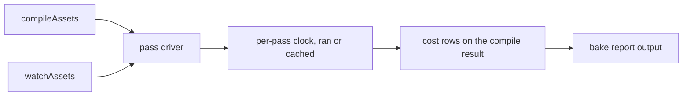

# PRD-318 — the asset compile says what each pass cost

**Status: PROPOSED, 2026-09-01.** Evaluated against engine `HEAD` bedbcb80.

**Complexity:** +1 touches fewer than 10 files, +1 changes a reported artifact schema,
+1 crosses the assets package and its CLI surface = **3 → STANDARD mode.** One automated
checkpoint per phase; no manual checkpoint required, because nothing here is visual.

## 1. Context

**Problem.** The owner is "not confident performance is all good" in the asset pipeline. Nobody
can be, because the pipeline does not measure itself. `grep -n
"durationMs\|elapsed\|performance.now" packages/assets/src/compile.ts` returns zero hits across
1,480 lines. The bake report knows the *size* of everything it wrote and the *cost* of nothing.

The FAB lane makes this urgent rather than academic: PRD-295's own subject is a 274-file,
6.8 GB Unreal pack. When that takes a long time, the current pipeline offers no way to say
whether the time went to Basis transcoding, to `gltf-transform` graph work, to xatlas, to
lightmap baking, or to reading files off disk.

**Files and systems analyzed.**

- `packages/assets/src/compile.ts` (1,480 lines) — the pass driver and the compile cache
- `packages/assets/src/report.ts` (163 lines) — `ITextureSizeRow`, `IEmbeddedTextureRow`,
  `IVirtualRow`, `ISimplifyRow`, `IModelSizeRow`; five row types, no cost field on any of them
- `packages/assets/src/passes/{model,model-textures,texture,shared-images,lightmap,lightmap-bake}.ts`
  — the six passes that own real wall clock
- `packages/assets/src/index.ts` — the public export surface a report schema change must cross
- `packages/assets/src/watch.ts` — the incremental path, which must report costs too or the
  watch loop stays blind

**Current behavior.** `compileAssets` runs its passes and emits a report of sizes. A pass that
is skipped by the compile cache (landed in 61c1c22c) is indistinguishable in the report from a
pass that ran and happened to be fast.

**Non-goals.** No optimisation lands in this PRD. This PRD only builds the instrument. PRD-319
is the one allowed to change what the numbers say.

## 2. Integration Ledger

`→impl` becomes a real non-test `file:line` during implementation. A row still containing it at a
phase boundary fails that phase.

| # | New thing | Live caller and reachability | Replaces or rejects | Negative control |
|---|---|---|---|---|
| 1 | Per-pass cost record on the compile result | `compile.ts:→impl`, populated by the pass driver, not by each pass reporting itself | Rejects a per-pass opt-in — a pass that forgets to report must be a failure, not a silence | Delete the record for one pass; the completeness assertion fails |
| 2 | Cost rows in the emitted report | `report.ts:→impl`, rendered by the existing report formatter | Rejects a second sidecar artifact; the bake report is the one place | Emit a report with a pass missing its row; the schema test fails |
| 3 | `cached` vs `ran` distinction per pass | `compile.ts:→impl`, read from the existing compile-cache decision | Rejects inferring "cached" from a low duration | Force a cache hit; a row claiming `ran` fails |
| 4 | Cost reporting on the incremental path | `watch.ts:→impl` | Rejects instrumenting the full bake only | Trigger a watch rebuild; a missing cost record fails |
| 5 | Per-asset attribution inside the model pass | `passes/model.ts:→impl` | Rejects one aggregate number for 274 assets | Bake two models; a single fused row fails |

### Reachability

## 3. Phases

**Phase 0 — the red.** Bake the existing repo fixture assets and paste the current report. It
contains no cost. Write the assertion that a compile result carries one cost record per pass
executed or skipped; paste it failing. This is the mutation: the assertion must fail on `HEAD`
before any instrument exists.

**Phase 1 — the clock in the driver.** The pass driver, not the passes, records start and end.
A pass cannot opt out and cannot lie about being cached, because the driver already owns the
cache decision. Fail closed: a pass that returns without the driver having closed its record
throws rather than emitting a partial report.

**Phase 2 — the report schema.** A sixth row type joins `report.ts`, exported through
`index.ts`, formatted by the existing formatter. Reported in stable order so two bakes of the
same input diff cleanly.

**Phase 3 — per-asset attribution in the model pass.** One row per model, not one row for the
pass, so a 274-file pack names its expensive members.

**Phase 4 — the watch path.** Same records on the incremental rebuild.

**Phase 5 — the baseline record.** Bake the repo fixture set and the largest pack available on
this machine; write the numbers to `docs/verification/` as the number PRD-319 must beat. Name
the machine and the input; a cost with no named input is not a measurement.

## 4. Acceptance criteria

- [ ] **AC1 — every pass reports.** A bake emits exactly one cost record per pass, each marked
      `ran` or `cached`. Deleting one pass's record fails the completeness assertion, and that
      red is pasted.
- [ ] **AC2 — cached is not inferred.** A forced cache hit reports `cached` with the cache's own
      decision as the source. A row that derives `cached` from a duration threshold fails review.
- [ ] **AC3 — per-asset, not per-pass, inside the model pass.** Two models in one bake produce
      two rows.
- [ ] **AC4 — the watch loop reports too.** An incremental rebuild emits the same record shape.
- [ ] **AC5 — the report is stable.** Two bakes of unchanged input produce byte-identical cost
      rows apart from the duration fields; ordering does not float.
- [ ] **AC6 — fail closed.** A pass that ends without a closed record throws; the compile does
      not emit a report with a hole in it. Red pasted.
- [ ] **AC7 — nothing got slower.** The instrumented bake's total wall clock is within noise of
      the uninstrumented one on the same input, and the noise band is named.
- [ ] **AC8 — the baseline exists.** `docs/verification/` carries the pre-PRD-319 numbers with
      the machine and the input named.
- [ ] **AC9 — gates.** `pnpm typecheck && pnpm lint && pnpm test` green, output pasted. No new
      `noExcessiveCognitiveComplexity` warning is added to `compile.ts`, which already carries
      one.

## 5. Decline conditions

Close as DECLINED with no product code if the driver cannot own the clock without each pass
reporting itself — a per-pass opt-in instrument is exactly the kind that certifies whatever it
happens to measure, and this repository has retired one of those already.

---

## 6. Integration litmus

**Delete the new code. Does something pre-existing break?** Yes: the bake report formatter loses
a row type it renders, and the Phase 5 baseline assertion in `docs/verification/` no longer has
an input. If PRD-319 has landed, its speedup gate loses its comparison entirely.

**Have I watched this gate fail?** Phase 0 requires the completeness assertion pasted red on
`HEAD` before any instrument exists.

**Reachability.**
- Entry point: `compileAssets`, called by the CLI bake and by `watchAssets`.
- Pre-existing file edited to call it: `packages/assets/src/compile.ts` (driver), then
  `report.ts` and `index.ts`.
- Registration: none needed — the driver already runs; this changes what it records.
- User-facing: no. The trigger is every bake.
- Replaces: nothing. Genuinely new; no incumbent exists, which is the problem.

**Per-phase pre-existing edit.** P1 `compile.ts`, P2 `report.ts` + `index.ts`, P3
`passes/model.ts`, P4 `watch.ts`, P5 `docs/verification/`. No phase adds only new files.

**Negative controls, recorded in this form:**
- `every pass reports` — PASS; goes red when one pass's record is deleted
- `cached is not inferred` — PASS; goes red when the row derives `cached` from a duration
- `fail closed` — PASS; goes red when a pass returns with an open record

**Anti-pattern scan for this PRD.** The named risk is *manufactured evidence*: a cost record that
reports a literal instead of measuring. The driver-owned clock exists specifically so no pass can
self-report.

## 7. Done gates

- [ ] Integration Ledger has zero `→impl` cells
- [ ] Every new exported symbol has a non-test consumer (caller census pasted)
- [ ] Revert check passed: removing the records breaks the report formatter
- [ ] Every gate has an observed red, pasted
- [ ] Proved on the real subject: the largest asset pack available on this machine, not the
      three-file fixture set
