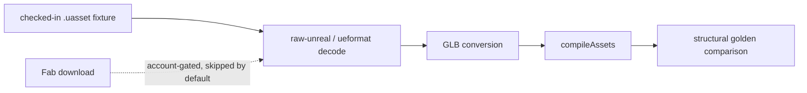

# PRD-320 — the Fab import replays without a Fab account, and PRD-295's stale claim is retired

**Status: PROPOSED, 2026-09-01.**

**Complexity:** +2 crosses this workspace and the external asset-MCP repository, +1 introduces a
fixture corpus, +1 changes a CI-visible test lane, +1 touches an external toolchain that
auto-installs = **5 → STANDARD-plus mode.** A reviewer checkpoint at Phase 0 and at the final
phase.

## 1. Context

**Problem.** PRD-295 shipped the Fab→Unreal→GLB path and it works. It has two properties that
make it fragile:

1. **It cannot be re-run by anyone without the owner's Fab entitlements.** `fab_list_owned`
   exists precisely because a free search cannot surface a paid listing. That means the only
   proof this lane still works is a human logging in and doing it again.
2. **Its status block is already stale.** PRD-295 says "IMPLEMENTED 2026-08-31, two gates not
   green", and names `pnpm lint` red in ~20 files as one of them. Measured on `HEAD` bedbcb80 on
   2026-09-01: `pnpm lint` exits **0** with 513 warnings and 0 errors. The 20
   `noExcessiveCognitiveComplexity` diagnostics are warnings, across 14 files, and the gate is
   green. The second cited gate — `pnpm test` not run whole because another lane's uncommitted
   work sat in `template-runtime-cost.spec.ts` — is a condition that expires, and nobody has
   checked whether it has.

This is the `BLOCKED/` lesson from `docs/PRDs/AGENTS.md` applied to a status line rather than a
folder: attempt the blocked step once before believing it.

**Files and systems analyzed.**

- `docs/PRDs/tooling/PRD-295-fab-unreal-to-threenative-assets.md` and
  `docs/verification/PRD-295.md`
- `packages/core/mcp/{assets.mjs,servers.mjs,install.mjs}` — the live shim and the pinned
  external asset-MCP version
- `packages/create-threenative/asset-mcp-tools.json` and `agent-docs/asset-mcp-loop.md` — the
  recorded agent-visible tool surface
- `packages/raw-unreal/` and `packages/ueformat/` — the in-repo `.uasset` decode path (b14b27b9,
  c5163352), which unlike the Fab download needs no account at all
- `packages/assets/src/compile.ts` — the consumer the import feeds

**The key asymmetry.** *Downloading* from Fab needs an account. *Decoding* a `.uasset` and
*converting* it to GLB does not. The second half is the half that breaks silently when
`gltf-transform`, the texture passes, or the UE header parsing changes — and it is fully
testable offline from a checked-in fixture.

## 2. Integration Ledger

| # | New thing | Live caller and reachability | Replaces or rejects | Negative control |
|---|---|---|---|---|
| 1 | A small checked-in `.uasset` fixture corpus with a licence that permits redistribution | `packages/raw-unreal/__tests__/→impl` | Rejects committing any Fab Standard asset — the licence gate PRD-295 added exists for a reason and applies to this repo too | Corrupt a fixture header; the decode assertion fails |
| 2 | An offline replay of decode → convert → compile | `→impl` spec, run by `pnpm test` | Rejects a test that needs network or a Fab login | Break the UE5 header path; replay fails |
| 3 | Golden GLB comparison, structural not byte | `→impl` | Rejects byte comparison, which `gltf-transform` version bumps break for no real reason | Drop a material; the structural gate fails |
| 4 | An account-gated lane, clearly separated and skipped by default | `→impl` | Rejects mixing account-gated and offline proof in one lane, which is how a lane becomes unrunnable | Run it without credentials; it must skip loudly, not pass quietly |
| 5 | A refreshed PRD-295 status from a real run | `docs/PRDs/tooling/PRD-295...md` and `docs/verification/` | Rejects inheriting the stale two-gates claim | — |

### Reachability

## 3. Phases

**Phase 0 — re-run the stale claim.** Run `pnpm lint` and `pnpm test` whole on a clean tree.
Paste both. Update PRD-295's status to what is actually true today, and archive it to
`docs/PRDs/done/` in that same commit if both are green and its criteria hold. If a gate is
genuinely red, name the real reason rather than the 2026-08-31 one.

**Phase 1 — the fixture corpus.** Source `.uasset` files whose licence permits redistribution in
an MIT repository. If none can be found, author them: a minimal static mesh made for the purpose
is a better fixture than a borrowed one, because it can be shrunk to the shapes the decoder
actually branches on. Keep the corpus small — this batch also files PRD-323 about doc and
artifact bloat, and a fixture corpus is exactly the kind of thing that grows to 200 MB without
anyone deciding it should.

**Phase 2 — the offline replay.** Decode, convert, compile, compare structurally.

**Phase 3 — the account-gated lane.** Explicitly separated, skipped with a named reason when
credentials are absent. A skip must be visible in the output; a silent pass is a failure mode
this repository has been bitten by before.

**Phase 4 — the record.** One verification file, following PRD-323's retention rules if that PRD
has landed first.

## 4. Acceptance criteria

- [ ] **AC1 — PRD-295's status is true.** Its status block reflects a run performed in this PRD,
      with output pasted, not the 2026-08-31 claim.
- [ ] **AC2 — the offline replay runs in `pnpm test`.** No network, no credentials, no
      auto-installed executable required for the offline half.
- [ ] **AC3 — the replay goes red for the right reason.** Breaking the UE5 header path fails it;
      that red is pasted. A replay that survives the decoder's removal proves nothing.
- [ ] **AC4 — structural, not byte.** A `gltf-transform` patch bump does not fail the gate; a
      dropped material does.
- [ ] **AC5 — the account lane skips loudly.** Without credentials it reports a named skip and
      does not report a pass.
- [ ] **AC6 — the fixture corpus is licence-clean and small.** Every fixture's licence is named
      in the corpus README; total size is recorded and justified.
- [ ] **AC7 — gates.** `pnpm typecheck && pnpm lint && pnpm test` green, output pasted.

## 5. Decline conditions

Close as DECLINED if Phase 1 cannot produce a redistributable fixture and cannot author one —
but authoring one is nearly always possible, so this decline should be rare and must name
exactly what stopped it.

---

## 6. Integration litmus

**Delete the new code. Does something pre-existing break?** The offline replay is a gate, not a
product path, so this question needs care. The honest answer: deleting the replay breaks nothing
at runtime — and that is acceptable *only* because the replay's subject is a pre-existing product
path (`raw-unreal` → `ueformat` → `compileAssets`) that currently has no end-to-end coverage.
The integration being proved is the decoder's, not the test's. AC3 enforces this: breaking the
UE5 header path must fail the replay. A replay that survives the decoder's removal is the
*vacuous fixture* anti-pattern and fails the PRD.

**Have I watched this gate fail?** AC3.

**Reachability.**
- Entry point: `pnpm test`, already in CI.
- Pre-existing files edited: `packages/raw-unreal/` test setup, and
  `docs/PRDs/tooling/PRD-295-fab-unreal-to-threenative-assets.md`.
- Registration: the existing package test script (landed in 1e129654 / 1330230d).
- Replaces: PRD-295's manual, account-gated, one-time proof.

**Per-phase pre-existing edit.** P0 PRD-295's status block, P1 the corpus README and package
manifest, P2 the package test setup, P3 the CI lane config, P4 `docs/verification/`.

**Negative controls:**
- `offline replay` — goes red when the UE5 header path is broken
- `structural comparison` — goes red when a material is dropped; stays green across a
  `gltf-transform` patch bump
- `account lane skips loudly` — asserting a known-false condition must be reported, not skipped

**Anti-pattern scan.** Three named risks: *vacuous fixture* (a fixture that does not contain the
features under test — AC3 catches it), *uncompiled test* (a spec the runner never collects — check
the reported test count, not exit 0), and *toy proof* (a fixture so minimal it exercises none of
the decoder's real branches — the corpus README must name which branch each fixture covers).

## 7. Done gates

- [ ] Integration Ledger has zero `→impl` cells
- [ ] The replay appears in the runner's collected test count, verified by inserting a
      deliberate failure and seeing it reported
- [ ] PRD-295 is either archived to `done/` with a fresh gate run pasted, or its real blocker is
      named — the 2026-08-31 claim does not survive this PRD
- [ ] Every gate has an observed red, pasted
