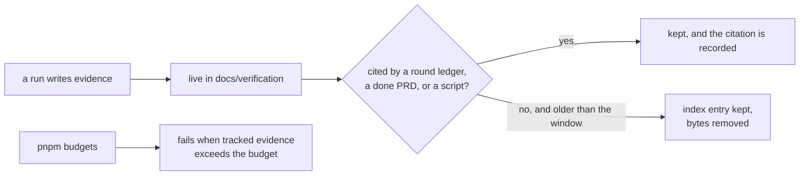

# PRD-323 — evidence has a retention policy, and the policy is a gate

**Status: PARTIAL, 2026-09-02 — every non-deletion phase landed.** Phase 0: the evidence
budget gate (`scripts/check-evidence-budget.ts`, wired into `pnpm budgets`), red observed at a
tight cap. Phase 1: the citation scanner (`scripts/evidence-citations.ts`) — total, fail-closed,
its flip control observed. Phase 2: the retention index is generated
(`scripts/generate-retention-index.ts` → `docs/benchmark/SCREENSHOT-RETENTION.md`), `--check`
wired into `pnpm budgets`, hand-edit red observed. Phase 6: the history decision is recorded
with the measured 194.01 MiB packed size behind it — declined. What remains open needs the
owner's manual checkpoint by this PRD's own rule: **Phase 3** (deleting the uncited artifacts —
1,793 named by the index) and **Phase 4** (untracking the 268 MB sweep tree), both of which
move tracked bytes; Phase 5 (consolidating the 4,050-line record) is unblocked by the scanner
but unstarted. Fresh measurement: `docs` 369 MB, benchmark 213 MB tracked / 781 uncited,
verification 74.7 MB / 1,012 uncited.

**Complexity score:** +3 touches 10+ files, +2 new gate/module from scratch, +2 multi-package
(scripts, docs tooling, CI), +1 external integration (`git` history rewrite is evaluated and
likely declined) = **8 → HIGH mode.** Automated `prd-work-reviewer` checkpoint after every
phase; a manual checkpoint on any phase that deletes tracked bytes.

---

## 1. Context

**Problem:** the evidence record has grown faster than anything reads it, and no rule says what
may be deleted, so nothing ever is.

**Measured on `HEAD` bedbcb80, 2026-09-01:**

| Thing | Measurement | Command |
|---|---:|---|
| `docs/` on disk | **289 MB** | `du -sh docs` |
| `docs/benchmark` | **287 MB**, 5,362 tracked files | `du -sh docs/benchmark`, `git ls-files docs/benchmark \| wc -l` |
| — of which `docs/benchmark/sweeps` | **268 MB** | `du -sh docs/benchmark/*` |
| — tracked `.ts` files inside `docs/` | **2,963** | `git ls-files docs/benchmark \| sed 's/.*\.//' \| sort \| uniq -c` |
| `docs/verification` | **73 MB**, 776 tracked files, 493 entries | `du -sh`, `git ls-files \| wc -l` |
| — markdown | 378 files, **58,105 lines** | `find docs/verification -name '*.md' \| xargs wc -l` |
| — PNG | 235 files | `find docs/verification -type f \| sed 's/.*\.//' \| sort \| uniq -c` |
| All markdown under `docs/` | **168,400 lines** | `find docs -name '*.md' \| xargs wc -l` |
| Packed git history | **194 MB** | `git count-objects -vH` |
| Largest single evidence file | `docs/verification/PRD-251-phase0.md`, **4,050 lines** | `wc -l` |
| Second largest | `docs/verification/runtime-perf-state.md`, **1,739 lines** | `wc -l` |

Three consequences, each of which has already cost this repository something:

1. **2,963 `.ts` files live under `docs/`.** These are generated sweep-arm game sources. Every
   repo-wide grep an agent runs crosses them. The root `AGENTS.md` already had to add a rule
   telling agents never to search `.worktrees/`; `docs/benchmark/sweeps` is the same hazard with
   five times the file count and no such rule.
2. **A 4,050-line phase-0 record is not readable evidence.** `docs/PRDs/AGENTS.md` says a gate
   result that lives only in a commit message does not exist. The inverse now also holds: a
   result buried in a 4,050-line file that nobody opens does not exist either.
3. **Deletion is not free, because tooling reads these trees.** `grep -rln
   "docs/benchmark\|docs/verification" scripts/` names **12 scripts** including
   `scripts/round-ledger.ts`, `scripts/round-deletions.ts`, `scripts/alpha-bar.ts`,
   `scripts/arm-census.ts` and `scripts/check-doc-links.ts`. `pnpm round:next` resumes the
   self-improvement loop from `docs/verification/round-*.md`. A naive cleanup breaks the loop.

**Files analyzed.**

- `docs/benchmark/SCREENSHOT-RETENTION.md` — **the incumbent.** Dated 2026-08-16, it counted
  105 archives, 506 PNGs, 100.84 MiB, and ran a citation scan over `docs/verification/round-*.md`
  and `docs/PRDs/done/**/*.md`. It found 22 archives cited and the rest uncited. It then
  explicitly deleted nothing. This PRD does not invent the citation scan; it finishes it.
- `scripts/check-doc-links.ts` — the existing link gate, the natural home for a retention gate
- `scripts/round-ledger.ts`, `scripts/round-deletions.ts`, `scripts/alpha-bar.ts` — consumers
  that constrain what may move
- `docs/PRDs/AGENTS.md` — the filing rules, and the `runtime-perf-state.md` consolidation
  exception the owner already granted on 2026-08-27, which is the precedent this PRD generalises
- `.gitignore` — `docs/benchmark` is **not** ignored (`git check-ignore` returns nothing)

**Current behavior.**

- Every run writes a new evidence file; nothing is ever retired.
- One consolidation exception exists (`runtime-perf-state.md`) and it works.
- Screenshot retention was analysed once and never enforced.
- No gate bounds file count, byte count, or line count anywhere under `docs/`.

**What this PRD is not.** It is not a documentation rewrite, and it does not touch
`docs/architecture/CHARTER.md`, the README, or package `AGENTS.md` files — those are governed by
`scripts/__tests__/primary-docs.spec.ts` and are deliberately out of scope.

---

## 2. Solution

**Approach.**

- Evidence gets a **lifecycle**: live → cited → archived-index-only → deleted. Today it has one
  state, forever.
- Retention is decided by **citation**, not by age. `SCREENSHOT-RETENTION.md` already proved the
  citation scan works; this PRD makes it a script and a gate.
- The 287 MB `docs/benchmark` tree is treated as **build output, not documentation** — moved out
  of the grep path, with its index and its cited artifacts kept.
- A **budget gate** in `pnpm budgets` bounds tracked evidence bytes and file counts, so the next
  289 MB fails at the commit that causes it rather than being discovered in six months.
- Git history rewrite is **evaluated and expected to be declined** — 194 MB of packed history is
  survivable, and rewriting it on a repository with concurrent agent lanes and a published remote
  is a hazard out of proportion to the win.

**Key decisions.**

- [ ] Citation scan extends `scripts/check-doc-links.ts` rather than becoming a thirteenth
      script that reads these trees.
- [ ] The retention index is one generated file, in the shape `SCREENSHOT-RETENTION.md` already
      established — this repository has learned that hand-maintained parallel lists drift.
- [ ] Errors are explicit: an artifact that cannot be classified fails the gate rather than
      defaulting to "keep" or "delete". Fail closed everywhere.
- [ ] Nothing is deleted by a path built from a shell variable, and nothing uses `rm` in a
      generated path.

**Data changes.** One generated retention index; one budget entry. No schema.

---

## 3. Integration Ledger

`→impl` becomes a real non-test `file:line` during implementation. A row still reading `→impl` at
a phase boundary fails that phase.

| # | New thing | Live caller (`file:line`, non-test) | Replaces | Old path removed? | Negative control |
|---|---|---|---|---|---|
| 1 | Citation scanner over evidence trees | `scripts/check-doc-links.ts:→impl`, run by `pnpm budgets` | the one-off manual scan recorded in `SCREENSHOT-RETENTION.md` | that file becomes generated in Phase 2 | Cite a file, then remove the citation; its classification must flip |
| 2 | Generated retention index | `scripts/→impl` writes it; the gate reads it | hand-maintained `SCREENSHOT-RETENTION.md` table | replaced in Phase 2 | Hand-edit the index; regeneration must overwrite and the gate must notice |
| 3 | Evidence budget in `pnpm budgets` | `scripts/→impl`, invoked by the existing budgets entry point | nothing — no bound exists today | n/a, new behavior | Add a 50 MB file under `docs/verification`; budgets must fail |
| 4 | `docs/benchmark/sweeps` moved out of the tracked grep path | `.gitignore:→impl` and `scripts/arm-census.ts:→impl` updated to the new location | 268 MB of tracked sweep sources | removed from tracking in Phase 4 | Run `pnpm sweep:capture`; it must still work from the new location |
| 5 | Retention rules in `docs/PRDs/AGENTS.md` | the file itself, mirrored by `pnpm sync:agents` | the ad-hoc `runtime-perf-state.md` exception, generalised | the exception becomes one case of the rule | Delete the rule; the instruction-budget spec must notice the doc changed |
| 6 | `PRD-251-phase0.md` consolidated | `docs/verification/→impl` | a 4,050-line file | reduced, with its cited results preserved | Grep every result the round ledgers cite from it; each must still resolve |
| 7 | Round-loop continuity proof | `scripts/round-next.ts` and `round-deletions.ts` unchanged and passing | nothing | n/a | Run `pnpm round:next` before and after; identical output |

### Reachability

**How is this reached?** Entry point: `pnpm budgets`, already in CI.
**Pre-existing file edited to call it:** `scripts/check-doc-links.ts` and the budgets entry.
**Registration:** the existing budgets runner; no new CI job.

**Full flow.**
1. An agent finishes a run and writes an evidence file.
2. `pnpm budgets` runs, as it already does in CI.
3. The citation scanner classifies every evidence artifact.
4. Uncited artifacts past the window, or a tree over budget, fail the gate with the specific
   paths named.
5. The outcome is observable in the generated retention index and the gate's output.

**What does this replace?** `docs/benchmark/SCREENSHOT-RETENTION.md`'s manual scan, and the
absence of any bound. Both are removed in the phases that replace them.

---

## 4. Execution phases

Each phase edits at least one pre-existing file. Max 5 files per phase.

### Phase 0 — the red, and the decline check

**Files:** `scripts/__tests__/→impl` (NEW), `scripts/check-doc-links.ts` (EDIT).

**Implementation.**
- [ ] Re-measure every number in section 1 on a clean tree and paste the raw output. A stale
      measurement is how this repository has previously parked lanes on conditions that had
      expired.
- [ ] Write the budget assertion — tracked bytes under `docs/verification` and `docs/benchmark`
      are under a stated cap — and **paste it red on `HEAD`**. It must be red: 289 MB is over any
      sane cap. That is the mutation.
- [ ] Confirm the 12 script consumers by name and record what each reads.

**Decline check.** If `pnpm round:next`, `pnpm round:deletions` and `pnpm alpha:bar` turn out to
depend on artifacts this PRD would remove in a way that cannot be satisfied by an index entry,
scope drops to the budget gate alone and the deletion phases are declined. Record that decision
here, not silently in a later phase.

**Tests required.**

| Test file | Test name | Assertion | Negative control (observed red) |
|---|---|---|---|
| `scripts/__tests__/evidence-budget.spec.ts` | `should fail when tracked evidence exceeds the budget` | gate returns non-zero, naming the trees | Red on `HEAD` at 289 MB — pasted in Phase 0 |

**Revert check.** Remove the budget entry → the budgets run stops reporting evidence size.

---

### Phase 1 — the citation scanner

**Files:** `scripts/check-doc-links.ts` (EDIT), `scripts/→impl` (NEW), `scripts/__tests__/→impl`
(NEW).

**Implementation.**
- [ ] Classify every artifact under `docs/verification` and `docs/benchmark` as cited by a round
      ledger, a `done/` PRD, an open PRD, a script, or nothing.
- [ ] An artifact that cannot be classified **throws**. It does not default.

**Wiring.**
- [ ] Caller edited: `scripts/check-doc-links.ts:→impl`
- [ ] Registration: the existing `pnpm budgets` entry
- [ ] Old path: `SCREENSHOT-RETENTION.md`'s manual scan, removed in Phase 2

**Tests required.**

| Test file | Test name | Assertion | Negative control |
|---|---|---|---|
| `→impl` | `should classify an artifact as cited when a round ledger names it` | classification is `cited` | Remove the citation; must flip to `uncited` |
| `→impl` | `should throw when an artifact cannot be classified` | throws | Make it classifiable; the throw must stop |

**Revert check.** Disable the scanner → `pnpm budgets` fails to produce the index the gate reads.

---

### Phase 2 — the generated retention index

**Files:** `docs/benchmark/SCREENSHOT-RETENTION.md` (EDIT → generated), `scripts/→impl` (EDIT),
`scripts/__tests__/→impl` (EDIT).

The index becomes generated output in the shape the hand-written file already established. Its
header says it is generated, exactly as every `CLAUDE.md` in this repository does.

**Negative control.** Hand-edit the index; regeneration overwrites it and a `--check` mode fails,
mirroring `pnpm sync:agents --check`.

---

### Phase 3 — the budget gate goes green by deletion, not by raising the cap

**Files:** the uncited artifacts themselves, `scripts/→impl` (EDIT), `docs/PRDs/AGENTS.md`
(EDIT).

**Implementation.**
- [ ] Delete only artifacts classified `uncited` and older than the stated window.
- [ ] Every deletion is listed in the commit body by path.
- [ ] No deletion path is constructed from a shell variable.

**Manual checkpoint required** — this phase deletes tracked bytes.

**Revert check.** `pnpm round:next` output before and after must be byte-identical. If it is not,
something cited was deleted; restore and reclassify.

---

### Phase 4 — `docs/benchmark/sweeps` leaves the grep path

**Files:** `.gitignore` (EDIT), `scripts/arm-census.ts` (EDIT), `docs/benchmark/PROTOCOL.md`
(EDIT), root `AGENTS.md` (EDIT).

268 MB and 2,963 `.ts` files of generated sweep-arm sources are build output. They move to an
ignored location; the index and any cited capture stay tracked. Root `AGENTS.md` gains the rule,
alongside the existing `.worktrees/` rule.

**Negative control.** Run `pnpm sweep:capture` and `pnpm sweep:judge` from the new location; both
must work. A sweep that cannot run after the move fails this phase.

---

### Phase 5 — the 4,050-line record is consolidated

**Files:** `docs/verification/PRD-251-phase0.md` (EDIT), `docs/PRDs/AGENTS.md` (EDIT).

The `runtime-perf-state.md` consolidation exception becomes a general rule: an evidence file over
a stated line cap consolidates in place. Every result cited from `PRD-251-phase0.md` by a round
ledger must still resolve afterwards — that grep is the gate.

---

### Phase 6 — the git-history decision, recorded either way

**Files:** `docs/verification/→impl` (NEW), `docs/PRDs/AGENTS.md` (EDIT).

Measure packed size after Phases 3–5. Recommend against rewriting 194 MB of history on a
repository with a published remote and concurrent agent lanes, unless the measured win is large
and the owner asks for it. Record the decision so the question is not reopened blind.

---

## 5. Acceptance criteria

Written about the consumer, not the artifact.

- [ ] **AC1 — the gate was red first.** The evidence budget fails on `HEAD` at 289 MB, and that
      red is pasted in the PRD before any deletion.
- [ ] **AC2 — a new bloat commit fails.** Adding a 50 MB uncited artifact under
      `docs/verification` makes `pnpm budgets` fail, naming the path. Red pasted.
- [ ] **AC3 — the self-improvement loop is unharmed.** `pnpm round:next`, `pnpm round:deletions`
      and `pnpm alpha:bar` produce byte-identical output before and after every deletion phase.
      Both outputs pasted.
- [ ] **AC4 — an agent's repo-wide grep no longer crosses generated sweep sources.** A grep for a
      common identifier returns measurably fewer hits, and the before/after counts are recorded.
- [ ] **AC5 — every cited result still resolves.** For each artifact deleted or consolidated,
      every round-ledger and `done/` PRD citation of it still resolves to a real result. The
      resolving grep is pasted.
- [ ] **AC6 — classification fails closed.** An artifact the scanner cannot classify throws; it
      is never silently kept or silently deleted. Red pasted.
- [ ] **AC7 — the index is generated, not maintained.** A hand edit is overwritten and a
      `--check` mode fails, exactly as `pnpm sync:agents --check` does.
- [ ] **AC8 — the rule is written where filing decisions are made.** `docs/PRDs/AGENTS.md` states
      the retention lifecycle and the line cap; its mirror is regenerated. The
      `runtime-perf-state.md` exception reads as one case of the rule rather than a one-off.
- [ ] **AC9 — the numbers moved.** Post-PRD `du -sh docs`, tracked file count, and total markdown
      line count are recorded next to the Phase 0 figures. A reduction under 50% is reported as
      such, not reframed.
- [ ] **AC10 — the history decision is recorded.** Rewrite performed or declined, with the
      measured packed size behind the decision.
- [ ] **AC11 — no `rm` in a generated path.** Every deletion is an explicit tracked path in the
      commit body; no path is built from a shell variable.
- [ ] **AC12 — gates.** `pnpm typecheck && pnpm lint && pnpm test && pnpm budgets`, output
      pasted. `pnpm sync:agents --check` green.

## 6. Decline conditions

Close as DECLINED with no deletion, keeping only the budget gate, if:

- the round-loop scripts cannot survive any deletion the citation scan proposes; or
- the citation scan cannot classify a material share of the tree, meaning the classification is
  guesswork wearing a script.

Shipping only the budget gate would still be a win: the bloat stops growing even if none of it
is reclaimed.
