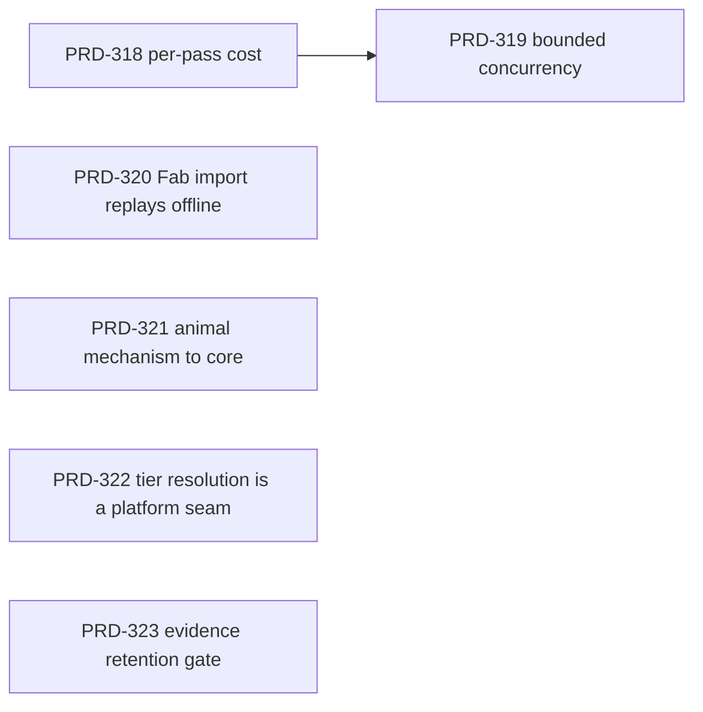

# batch-2026-09-01 — the asset pipeline tells the truth, and Wildwood gives back its mechanism

Filed 2026-09-01. Six PRDs, three themes, one run order. Every gate in this batch is provable on
this machine with no device and no human in the loop, which is why it is the overnight batch.

## Why these five

The FAB extraction lane landed and works. What it did not land is a way to know whether the
pipeline behind it is *fast*, whether it stays correct when made faster, or whether the Fab→GLB
path still works tomorrow without an owner sitting at a Fab login. Separately, `sandbox/wildwood`
now contains two pieces of mechanism that every animal game and every quality-tiered game will
otherwise rewrite by hand.

Three grounding facts, measured on `HEAD` (bedbcb80) on 2026-09-01 before filing:

1. **`pnpm lint` is green.** `exit=0`, 513 warnings, 0 errors, 20
   `noExcessiveCognitiveComplexity` warnings across 14 files. PRD-295's "Status: IMPLEMENTED,
   two gates not green" cites a red lint that no longer exists. PRD-320 owns re-running the
   claim rather than inheriting it.
2. **The asset compile has no timing instrumentation at all.** `grep -n
   "durationMs\|elapsed\|performance.now" packages/assets/src/compile.ts` returns nothing. The
   bake report (`packages/assets/src/report.ts`) carries five row types — texture sizes,
   embedded textures, virtual, simplify, model sizes — and not one of them carries a cost.
   Nobody can say which pass owns the wall clock, so nobody can say the pipeline is fine.
3. **The compile is effectively sequential.** Two `Promise.all` sites exist in 1,480 lines
   (`compile.ts:949`, `compile.ts:1405`); there is no worker pool, no bounded concurrency and no
   per-asset fan-out. A 274-file Unreal pack goes through it one asset at a time.

## Run order

PRD-318 is a hard dependency of PRD-319 — you cannot prove a speedup you cannot measure, and a
concurrency change with no before-number is an unfalsifiable claim. The rest are independent.

| PRD | Theme | Blocked by | Estimated |
|---|---|---|---|
| [PRD-318](../done/PRD-318-the-asset-compile-says-what-each-pass-cost.md) (archived 2026-09-02) | asset pipeline | — | ~2h |
| [PRD-319](../done/PRD-319-the-asset-compile-runs-independent-work-concurrently.md) (archived 2026-09-02) | asset pipeline | 318 | ~4h |
| [PRD-320](../done/PRD-320-the-fab-import-replays-without-a-fab-account.md) (archived 2026-09-02) | asset pipeline | — | ~3h |
| [PRD-321](../done/PRD-321-the-animal-state-machine-is-mechanism-the-animals-are-the-game.md) (DECLINED) | Wildwood extraction | — | — |
| [PRD-322](../done/PRD-322-quality-tier-resolution-is-a-platform-seam.md) (DECLINED 2026-09-04) | Wildwood extraction | — | ~2h |
| [PRD-323](../done/PRD-323-evidence-has-a-retention-policy-and-a-gate.md) (archived 2026-09-04) | doc and evidence bloat | — | ~5h |

## The third theme: the evidence record outgrew its readers

PRD-323 was filed after the batch started, on measured numbers: `docs/` is **289 MB**, of which
`docs/benchmark` is 287 MB across **5,362 tracked files including 2,963 `.ts`**;
`docs/verification` holds 493 entries and **58,105 lines of markdown**, its largest single file
being 4,050 lines. Twelve scripts read those trees, so this is a retention *policy with a gate*,
not a delete. Its decline condition keeps the budget gate even if nothing can be reclaimed —
stopping the growth is worth landing on its own.

If PRD-323 runs first, PRD-318's baseline record and PRD-320's fixture corpus should follow its
retention rules rather than adding to the pile they exist to bound.

## The rule that governs the two extraction PRDs

`AGENTS.md` rule 3 and its (b) veto decide both, and both were filed against it explicitly:

- **PRD-321 takes only mechanism.** The state machine's transitions, the skeleton-safe clone, the
  bind-pose normalisation and the anatomical-forward measurement are mechanism; the clip names,
  the speeds, the radii, the species and every appearance parameter stay in the game.
- **PRD-322 takes only the seam.** *Which* tier a machine gets is a platform question a portable
  game cannot answer. *What a tier means* is a look decision and stays in generated
  `src/render/quality.ts`, unchanged.

If either PRD's Phase 0 finds it cannot hold that line, it closes as DECLINED with no product code.
That outcome is a success for this batch, not a failure — it is the kill switch working before the
code lands, rather than `scripts/count-loc.ts` scoring it out afterwards.

**Both of them did.** PRD-321 declined in Phase 0 for want of a second consumer. PRD-322 declined
on 2026-09-04 because the seam it proposed to build already ships: `getPlatform`/`isWeb`/`isMobile`
in `packages/core/src/platform.ts` handles web and native, and all ten templates plus Wildwood
already call it at the boot path. What is left in `resolveQualityTier` reads no platform source at
all, and its one platform-to-tier line — `mobile === true ? "low" : "high"` — is a look decision the
(b) veto keeps in the game. Audit:
[`docs/verification/PRD-322-phase0-boundary-audit.md`](../../verification/PRD-322-phase0-boundary-audit.md).
Two kill-switch saves out of two extraction PRDs is the result this section was written to allow.
