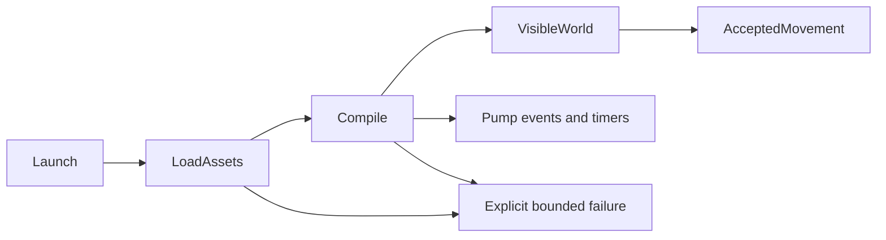
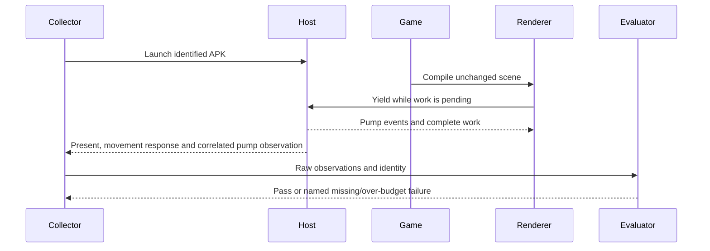

# PRD-360 follow-up — finish startup performance on the working Bayview build

**Status:** PARTIAL — three measured optimization experiments were executed and all missed the acceptance gates. PRD-360 remains PARTIAL.
**Parent:** [PRD-360](PRD-360-android-launch-is-playable-within-eight-seconds.md).
**Reference record:** [runtime performance state](../../verification/runtime-perf-state.md) — canonical measurements and receipt pointers.
**Complexity:** 6 → MEDIUM: async startup across core/native, approximately 6–10 implementation files.
**Execution budget:** Start with a 60-minute profiling task. At most three measured optimization experiments before reporting results or escalating. No speculative rewrite.
**Delegate:** A cheaper coding model can execute the bounded tasks below. Escalate a demonstrated GPU scheduling or cross-thread ownership problem with evidence, not an open-ended debugging transcript.

## Objective and current truth

Make the real Bayview game playable within **8,000 ms median across three qualified physical Android cold launches**, with **no event-pump silence above 250 ms**. Preserve the world, effects, assets, UI and accepted movement. First frame alone does not establish first playable.

The startup crashes are fixed; performance is not. [PR #136](https://github.com/ThreeNativeHQ/threenative/pull/136) contains the repairs. Inspect its current status before branching; do not assume it merged. Repair commits: `dad33852` and `ebfbb085`.

| Executed observation, September 7 | Result |
| --- | --- |
| Corrected APK, physical Pixel 8 / Android 17 | Starts, world and HUD visible |
| Native movement / diagnostics | 2.146719 m, pass / no console errors |
| First frame, one uninterrupted run | **16,020.007 ms**; not a three-run median or an 8-second acceptance result |
| Pipeline compilation before that frame | **8,404.781 ms / 93 calls** |
| Unattributed portion of the measured frame stall | **4,917.275 ms** |

The same raw log reports `maxGapMs:15708.693` in pump observations. That is a diagnostic observation, not a completed endpoint-correlated acceptance evaluation. Do not reuse the historical 103-call/8.3-second baseline as if it described this repaired APK.

## Bounded experiment result — 2026-09-08

The three-experiment budget is exhausted. All arms used the preserved Bayview scene, effects,
assets, UI and Android configuration on the qualified Pixel 8; every movement run reached the
world and moved the player about **2.1467 m** with clean diagnostics. None met the 8,000 ms or
250 ms gates.

| Experiment | Change | First frame | Warm-up | Correlated pump result | Disposition |
| --- | --- | ---: | ---: | ---: | --- |
| 1 | Explicit game `warmUp` configuration | 16,151.642 ms | `compiled:0`, timed out at 15,344 ms | 15,767.082 ms max gap | Rejected |
| 2 | Core startup cover recognizes the ready UI (`337a7d36`) | 18,562.037 ms | 13,515 ms, 494 pipelines | 2,665.103 ms max gap; 2,426.070 ms at movement endpoint | Rejected and reverted |
| 3 | Native compile pool cap 2 → 4 workers | 19,022.717 ms | 14,007 ms, 494 pipelines | 2,618.676 ms max gap; 2,394.758 ms at movement endpoint | Rejected and reverted |

Experiment 3 was worse than experiment 2 on warm-up and first-frame time, so the native source was
restored. Experiment 2 was also reverted because it regressed the retained-package launch and did
not meet either budget. Raw receipts remain in the local sandbox under
`/home/joao/projects/threenative/sandbox/prd360-bayview-live/artifacts/experiment-{1,2,3}-movement/`;
the experiment-3 APK is `5f6ac0106868013437b97b00854e50ec69b8162187006cc2693378449b1855df` and
the unchanged game bundle is `b11c5753e1b7a4570dfb7e4bf176b52ebb59b89b73cbac9ea36332d69e33c7c0`.

The black screen seen while the UI appeared first is the game-owned loading surface, not a failed
final render. Bayview's `Hud` returns a full-screen dark panel while `ready` is false, and the
native UI surface is opaque. The captured `experiment-3-movement/after.png` shows the authored
world and HUD after startup; hiding the loading surface or changing the scene to satisfy a timing
number would violate this follow-up's unchanged-content constraint.

Per the stop rule, no fourth experiment is started. The remaining doubtful assumption is that the
measured pipeline warm-up and pump gap are the dominant launch cost; the records show a large
unattributed stall, so a future attempt needs a new attribution hypothesis before editing code.

Evidence: [repair report](../../verification/findings-2026-09-07-bayview-fix/README.md), [APK identities](../../verification/findings-2026-09-07-bayview-fix/proof.json), [scenario](../../verification/findings-2026-09-07-bayview-fix/manifest.playtest.json), [visible world](../../verification/findings-2026-09-07-bayview-fix/android-world.png).

## Resume here — do not rebuild the investigation

Working engine checkout:
`/home/joao/projects/threenative/threenative-engine/.worktrees/findings-asset-resolution`

Working game:
`/home/joao/projects/threenative/sandbox/prd360-bayview-manifest-fix`

Within that engine checkout, `artifacts/findings-fix/` contains:

- `green.apk`, SHA-256 `2f4ceac5441b1aa5bda67a9cd44d9948729ddc5d350e621cb4d220bce282a145`; app ID **`com.threenative.bayview.manifestfix`**.
- `green/main.js`, SHA-256 `400a0ab3ba14039138a6eb105b5e601dedfbddffcae4eac7411fedb8c51a7f25`.
- `green-host-uninterrupted.log`, SHA-256 `b74636ec5c3e6b164ed22e32c55a6b68c8d5284bf9ab839551f26792e0dfde1a`.
- `package-proof.ts`, `staging-worker-prepare.mjs`, `staging-worker-verify.mjs` and `host-identity.json`: exact packaging, asset conversion and native-host provenance.
- `green-playtest-uninterrupted/`: console, response observations and automated screenshot. These local artifacts must be located and preserved before worktree cleanup.

The APK reused checksum-locked native binaries from the previous failed candidate; it is **not** proof of a C++ rebuild from the repair branch. A native-code optimization must rebuild the host and record its new identity. The game currently resolves its own unpatched Three.js copy; keep that constant across A/B arms or explicitly rebuild both arms with the same patch configuration.

## Constraints — do not undo the repairs

The missing asset manifest was a game override selecting absent `raw-assets.manifest.json`. It was removed; legacy assets now enter the compiled manifest. All 57 logical requests resolve. `assets.audio: "none"` preserves all 30 audio cues. Three interleaved models require a verified vertex-layout conversion in the Android staging source; do not rename bytes under existing hashes or bypass preflight.

The UI build deduplicates React/ReactDOM; the native game bundle deduplicates Three.js. Do not revert these fixes, reintroduce duplicate shader state, or patch copies under `node_modules`.

Do not remove effects, reduce scene content, change resolution, disable validation, raise the acceptance budget, hide the loading state, or substitute a toy scene. Persistent cross-launch pipeline caching and publishing runtime releases remain separate work. Keep the original `com.threenative.bayview` baseline app untouched. A previous phone run was invalidated by another app taking the foreground: coordinate a 60-second idle window before device runs. The existing Android compatibility dialog must be dismissed for visual inspection; its dimming is not a lighting defect.

## Integration ledger

| Change/gate | Existing live caller | Replaces | Old path disposition | Negative control |
| --- | --- | --- | --- | --- |
| Trustworthy timing and movement proof | `packages/runtime-native/scripts/measure-cold-start.mjs`; playtest Android runner; existing PRD-360 collector/evaluator | Historical/stale-arm interpretation | Reuse collectors; no competing timing framework | Missing endpoint, wrong APK hash or known-false movement fails |
| Responsive compilation | `packages/core/src/game.ts:881,915` → `warmUpScene`; `packages/core/src/renderer.ts:389` → upstream `compileAsync` | Only the measured blocking path | Existing caller delegates to the repaired path in the same phase | Reverting the fix restores the measured stall |
| Native pump, only if profiling requires a repair | `packages/runtime-native/src/runtime.cpp:1256` → `pollEvents`; scheduler installation → `scheduler-yield.js` | Only the demonstrated blocking mechanism | No parallel scheduler | Held presentation still permits timers/yields; deliberate blocking fails gap gate |

Resolve final line anchors before each implementation checkpoint. No new exported module is planned. Any added export must have a real caller and an observed removal failure.





## Phase 1 — establish where the 16 seconds go

**Outcome:** Launch the real game and obtain an attributable, reproducible baseline before editing production behavior.

**Files:** READ existing game startup and render configuration. EDIT only if necessary: `packages/runtime-native/scripts/measure-cold-start.mjs`, its `tests/measure-cold-start.test.mjs`, existing stall instrumentation in `include/mystral/stall_budget.h`, and `docs/verification/runtime-perf-state.md` (maximum five edited files).

1. Verify the APK/bundle hashes above and inspect the repair PR. Freeze an internally consistent baseline from the working game. Record source, configuration, native libraries and Three.js patch identity for both arms.
2. Inspect existing `TN_COLD_START`, `TN_STALL_SEGMENTS`, `TN_PUMP_SILENCE` and `TN_PUMP_ENDPOINT` records. Trace whether `game.ts` actually invokes the default warm-up path; a comment or installed scheduler does not prove invocation.
3. Reuse the existing cold-start collector and the PRD-360 collector/evaluator retained under `docs/verification/prd-360-startup-2026-09-05/`. The archived collector hardcodes an old app ID and APK hash: adapt its staged configuration, never run it blindly against the preserved baseline.
4. Obtain three qualified baseline launches: battery at least 50%, discharging, acceptable thermal state, screen on and game foreground. Separate native startup time from coordinator setup, mailbox polling, screenshot transfer and teardown. The historical roughly 50-second harness bound does not isolate game latency. Do not subtract guessed overhead or relabel first-frame time as first-playable time.
5. Produce one ranked bottleneck table and select one lever. If the remaining stall cannot be attributed, report that uncertainty before changing scheduling.

**Checkpoint:** Existing timing tests plus `should reject a measurement when its APK identity or movement endpoint is missing`; prove the negative with a copied receipt. User verification: visible Bayview world and accepted movement. Independent review must confirm distinct arms, observed timing and no substituted workload.

## Phase 2 — optimize one measured blocking path

**Outcome:** The same Bayview world becomes usable sooner without freezing input/event pumping.

**Files, choose one route per experiment:**

- Core route: EDIT `packages/core/src/game.ts`, `warmup.ts`, `renderer.ts`, `packages/core/__tests__/warmup.spec.ts`, and the existing performance record.
- Native route, only with evidence: EDIT `packages/runtime-native/src/runtime.cpp`, `src/runtime-scripts/scheduler-yield.js`, the identified existing compile binding, its existing focused test, and the performance record.

Search engine capabilities and inspect every hit before introducing a helper or changing a render stage, as required by repository instructions. Reuse upstream Three.js compilation, existing granularity, bounded failure behavior and the native scheduler. Do not introduce a new scheduler or thread model by guesswork.

For each experiment: state a predicted improvement; record the baseline red; make one bounded change through the existing caller; build/reinstall; repeat three candidate cold launches; compare unchanged content and configuration. Record actual pipeline count/time, residual, first playable and maximum pump silence. Revert an ineffective experiment instead of accumulating it.

**Tests:** `should keep timers progressing when presentation is held`; `should report bounded failure when compilation does not settle`; and a real Bayview run that fails the target with the change reverted. Do not invent a red for a behavior the incumbent already satisfies. Preserve passing existing scheduler tests.

**Stop rule:** After three failed experiments or 60 minutes without a trustworthy bottleneck, stop and hand the supervising model the hypothesis, diff, raw measurements and doubtful assumption. Do not widen scope silently.

## Phase 3 — acceptance and closure

**Outcome:** The actual game meets every parent criterion; otherwise PRD-360 remains PARTIAL.

**Files:** EDIT the existing game startup scenario, applicable existing timing/evaluator tests, `docs/verification/runtime-perf-state.md`, this follow-up and the parent PRD (maximum five). Preserve raw receipts in the existing proof location and cite them.

- [ ] Three qualified physical Android cold launches: median **first playable ≤8,000 ms**, with visible world and input-driven displacement **≥0.25 m**.
- [ ] Correlated pump observations prove **no gap >250 ms**, including startup and the movement endpoint. Missing or malformed observations fail; first-present-only markers are insufficient.
- [ ] Same scene, effects, asset content, render settings and native/Three.js configuration across baseline and candidate; no warm-cache substitution for the required cold launch.
- [x] Browser WebGPU movement/visual proof passes and records the actual adapter. The Vite dependency identity repair passed the unchanged repaired game's four assertions on NVIDIA/Turing: 2.146736 m movement, visible world, and zero console/network/runtime errors. Source, dependency and artifact hashes plus the scenario are retained in [browser verification](../../verification/browser-dependency-identity-2026-09-07/README.md). This does not establish the Android timing or pump criteria.
- [ ] Focused red/green and revert controls, full repository checks, independent checkpoint review, and final parent acceptance audit all pass.

Use these existing commands; run from the retained engine worktree:

```sh
pnpm typecheck && pnpm lint && pnpm test
pnpm build && pnpm budgets
node packages/playtest/dist/runner/cli.js doctor --text --device 192.168.1.192:5555
node packages/playtest/dist/runner/cli.js docs/verification/findings-2026-09-07-bayview-fix/manifest.playtest.json --target android --device 192.168.1.192:5555 --package com.threenative.bayview.manifestfix --activity com.threenative.runtime.MystralActivity --timeout 60000 --artifacts artifacts/prd360-followup/movement
```

Rediscover the device serial with `adb devices -l` if the recorded Wi-Fi address changes. The 60-second command timeout is a failure-detection bound, **not** the performance criterion. That movement scenario proves functional behavior, not eight-second startup or the full pump contract; run the correlated collector/evaluator as well.

For browser proof use the same scenario against the game's actual dev server with `--browser-recipe webgpu`; record `adapter.info`. Do not claim Android performance from an emulator or desktop run. Rebuild a changed native host from its identified source; do not accidentally package the retained prebuilt libraries after a C++ edit.

## Verification evidence and completion

| Phase | Required evidence | Current result |
| --- | --- | --- |
| 1 | Three qualified baseline receipts, identity checks, ranked attribution and negative measurement control | NOT RUN in this follow-up |
| 2 | One-lever A/B, real caller anchors, red/green/revert outputs, unchanged appearance | NOT RUN |
| 3 | Three candidate receipts, ≤8-second median, ≤250-ms pump silence, browser proof, full gates and independent review | NOT RUN |

After each implementation phase, an independent reviewer checks integration, actual observations and the negative control. The implementer cannot approve its own phase. Keep summaries to five bullets; put raw output in artifacts. Record new performance findings in `docs/verification/runtime-perf-state.md`, not a new competing performance ledger.

Do not close this follow-up or move PRD-360 to `done/` while any acceptance item is unproven. A successful build, a first frame, or a movement pass alone is not completion.

## Copy/paste handoff

> Read this follow-up and the linked repair evidence. Execute Phase 1 only first, using the real working Bayview candidate. Preserve the APK and native-library identities. Return a ranked timing breakdown, three qualified baseline results, and one proposed experiment. Do not change visuals, rewrite the engine, or claim PRD-360 complete. Escalate after three failed experiments. Use a cheaper worker for bounded edits and an independent reviewer at checkpoints.
