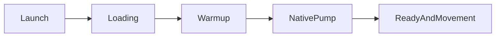
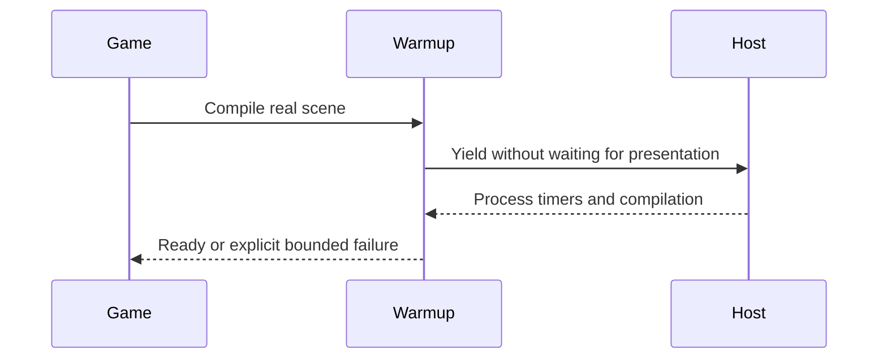

# PRD-360 — Android launch is playable within eight seconds

**Status:** PARTIAL — implementation/proof in progress; acceptance remains open
**Priority:** 1 — start today, September 5, 2026.
**Complexity:** 2 (6–10 files) + 2 (async startup) + 2 (core/native) = 6 → MEDIUM mode.
**Estimate:** 6–10 engineering hours plus native build/device time.
**Parent:** [Existing owning PRD](../performance/critical/PRD-339-the-compile-walk-leaves-the-main-thread.md). This document is its bounded delivery slice, not a competing implementation.

## Problem, scope and grounding

The September 3 physical Android runs recorded first presentation at 14,776 ms, including 8,300 ms across 103 synchronous pipeline compiles. Enabling warm-up regressed launch to roughly 35 seconds. A player cannot use a game that freezes before its first frame.

Evidence: [inspected source or dated measurement](../../verification/runtime-perf-state.md). Historical device results were not rerun during planning.

Deliver the responsive compile walk and startup integration portion of PRD-339, also advancing PRD-327's failed device acceptance. Persistent cross-launch pipeline caching remains outside this slice. Core/native own scheduling and compilation; the game owns loading appearance.

Files analyzed and incumbents: `packages/core/src/warmup.ts`, `packages/runtime-native/src/runtime-scripts/scheduler-yield.js`, PRD-339 and the recorded PRD-327 device runs. Existing scene/object granularity, timeouts and native async compile bindings are incumbents to reuse.

## Integration ledger

| Change | Existing live caller | Replaces | Old path removed/delegates | Negative control |
| --- | --- | --- | --- | --- |
| Responsive startup yield | Existing runtime installation of `scheduler-yield.js` → Three.js compilation | Frame-coupled fallback | Repair existing installer/pump in phase 1 | Hold presentation: reverting fix stalls yields |
| Bounded compile walk | Existing startup readiness → `packages/core/src/warmup.ts` | Uninterrupted whole-scene walk where reproduced | Existing object/scene path delegates in phase 2 | Restoring synchronous path misses launch budget |
| Playable startup | Real Bayview loading/config caller → warm-up | Recorded opt-out workaround | Remove only after device proof | Remove wiring: real cold-start scenario fails |

Resolve final non-test `file:line` references during implementation; phase completion requires them.
No new service or package. The user-facing flow is the actual game, not a new dashboard.
Data changes: no persistent schema; extend existing runtime reports only where necessary.

## Phase 1 — Loading remains responsive during compilation

**Files:** EDIT native scheduler shim, its installer in `packages/runtime-native/src/runtime.cpp`, `packages/runtime-native/tests/scheduler-yield.test.mjs`, native test registration if required, and `docs/verification/runtime-perf-state.md` (maximum 5).

1. Read native instructions, resolve the real Bayview checkout/build and reproduce its launch on a thermally qualified physical phone. Record build hash, serial, first presentation, first accepted movement and longest event-pump gap.
2. Add a red test through the real host with presentation held: repeated yields, timers and compilation completion must still progress. Verify Three.js takes the intended yield path, not merely that the shim exists.
3. Fix the measured installer/pump defect. Temporarily revert the fix, observe the same test fail, restore and review.

## Phase 2 — The real game becomes playable within the launch budget

**Files:** EDIT `packages/core/src/warmup.ts`, `packages/core/__tests__/warmup.spec.ts`, Bayview's actual loading/config caller, its startup playtest, and the performance record (maximum 5).

1. Exercise existing object granularity before adding machinery. Bound the expensive walk without raising timeout budgets or omitting scene/effect work.
2. Reinstall built engine artifacts in Bayview and integrate the working startup path. Test three baseline and three candidate cold launches on the same qualified device.
3. Assert a visible world plus input-driven player displacement, not just a ready flag. Verify the same game on browser WebGPU. Reverting the compile-path fix must fail the real launch criterion.

## Current evidence and unresolved baseline — September 5, 2026

The installer exists at `packages/runtime-native/src/runtime.cpp:3178`. A real-host probe held
presentation, made 32 explicit calls to Three.js's `yieldToMain`, observed a timer, and completed
`WebGPURenderer.compileAsync`. Deleting `globalThis.scheduler` instead reached the bounded
15-second deadline with zero completed yields. Screenshot-mode host runs exited 0 in both cases;
the semantic positive/deletion expectations are evaluated separately. This supports the existing
scheduler path; no installer defect or production scheduler fix is claimed. A saturated Bayview
compile walk, maximum event-pump gap and first accepted movement remain unmeasured.

The original `prd329-bayview-20260905` source was removed by concurrent sandbox cleanup and is
absent from tracked history. The exact installed APK was preserved read-only with SHA-256
`007e1dc247b58cc13126f44c52cff97f230934bcc2f305c83e35805bcba9077e`. The surviving
`fps-framework` is a different 240-FPS/0.44-scale arm; it has not been substituted for the installed
120-FPS/0.55-scale baseline. A source choice is pending. The latest battery observation was 29%,
discharging, below the required 50% measurement threshold. No qualified candidate launch is
claimed. Retained source, exact commands and observations are in the
[batch ledger](../../verification/batch-2026-09-05-execution.md). Both phases remain open.

## Acceptance and checkpoint protocol

- [ ] Median first playable frame ≤8 seconds over three physical Android cold launches; no event-pump silence >250 ms.
- [ ] Loading progresses; warm-up failures remain bounded and honestly reported; no scene/effect removal manufactures the result.
- [ ] Actual movement succeeds on browser and native Android, with build, adapter, serial, thermal state and raw output recorded.
- [ ] Each phase has observed red/green output, final caller anchors and independent checkpoint review; update the parent with the delivered criteria.
- [ ] `pnpm typecheck`, `pnpm lint`, `pnpm test` and affected real playtests pass with copied outputs.

At each phase, use an independent PRD checkpoint reviewer to check integration, replaced paths,
test collection and negative controls before proceeding. Tests that only call a new helper are
insufficient: deleting the change must break an existing game flow. Read the closest package/game
instructions before editing and use existing harness commands after resolving the target and device.

Record performance findings in `docs/verification/runtime-perf-state.md`; other live proof belongs
in a dated `docs/verification/` record. Link exact commands, outputs and artifact identities here.
Unrun platform gates remain unverified. These plans do not claim implementation or measured improvement.

Next action (under 2 minutes): Run `adb devices -l` and locate Bayview's recorded build subject.
