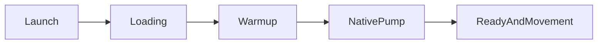
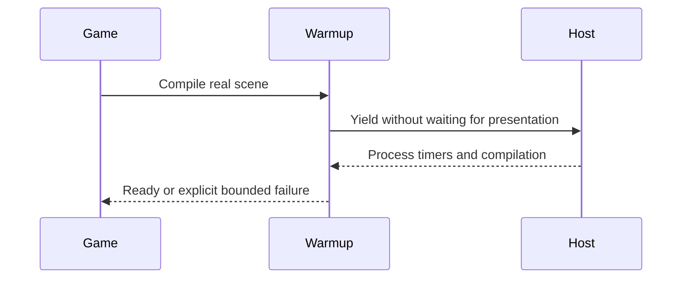

# PRD-360 — Android launch is playable within eight seconds

**Status:** PARTIAL — the baseline is measured and decomposed; the criterion is unmet by the 2026-08-30 build and **unmeasured on current `main`**. Three preflight-qualified cold launches on a physical Pixel 8 give a 49,788.7 ms median bound, but the probe shows that is mostly harness: the game's own cold start is ~15 s, of which **8.3 s is 103 synchronous pipeline compiles** and 4.5 s is unattributed residual, with ~0.6 s of real init and a healthy p50 16.3 ms frame period once running. The measured APK predates both startup fixes (`0d0565fc` 2026-09-03, `befc1094` 2026-09-04), so this characterises the problem rather than judging the fix. Evidence: [prd-360-device-2026-09-07](../../verification/prd-360-device-2026-09-07/README.md).
**Priority:** 1 — start today, September 5, 2026.
**Complexity:** 2 (6–10 files) + 2 (async startup) + 2 (core/native) = 6 → MEDIUM mode.
**Estimate:** 6–10 engineering hours plus native build/device time.
**Parent:** [Existing owning PRD](../performance/critical/PRD-339-the-compile-walk-leaves-the-main-thread.md). This document is its bounded delivery slice, not a competing implementation.

## Problem, scope and grounding

The September 3 physical Android runs recorded first presentation at 14,776 ms, including 8,300 ms across 103 synchronous pipeline compiles. Enabling warm-up regressed launch to roughly 35 seconds. A player cannot use a game that freezes before its first frame.

Evidence: [inspected source or dated measurement](../../verification/runtime-perf-state.md). Historical device results were not rerun during planning.

Deliver the responsive compile walk and startup integration portion of PRD-339, also advancing PRD-327's failed device acceptance. Persistent cross-launch pipeline caching remains outside this slice. Core/native own scheduling and compilation; the game owns loading appearance.

Files analyzed and incumbents: `packages/core/src/warmup.ts`, `packages/runtime-native/src/runtime-scripts/scheduler-yield.js`, PRD-339 and the recorded PRD-327 device runs. Existing scene/object granularity, timeouts and native async compile bindings are incumbents to reuse.

## Integration ledger

| Change | Existing live caller | Replaces | Old path removed/delegates | Negative control |
| --- | --- | --- | --- | --- |
| Responsive startup yield | Existing runtime installation of `scheduler-yield.js` → Three.js compilation | Frame-coupled fallback | Repair existing installer/pump in phase 1 | Hold presentation: reverting fix stalls yields |
| Bounded compile walk | Existing startup readiness → `packages/core/src/warmup.ts` | Uninterrupted whole-scene walk where reproduced | Existing object/scene path delegates in phase 2 | Restoring synchronous path misses launch budget |
| Playable startup | Real Bayview loading/config caller → warm-up | Recorded opt-out workaround | Remove only after device proof | Remove wiring: real cold-start scenario fails |

Resolve final non-test `file:line` references during implementation; phase completion requires them.
No new service or package. The user-facing flow is the actual game, not a new dashboard.
Data changes: no persistent schema; extend existing runtime reports only where necessary.





## Phase 1 — Loading remains responsive during compilation

**Files:** EDIT native scheduler shim, its installer in `packages/runtime-native/src/runtime.cpp`, `packages/runtime-native/tests/scheduler-yield.test.mjs`, native test registration if required, and `docs/verification/runtime-perf-state.md` (maximum 5).

1. Read native instructions, resolve the real Bayview checkout/build and reproduce its launch on a thermally qualified physical phone. Record build hash, serial, first presentation, first accepted movement and longest event-pump gap.
2. Add a red test through the real host with presentation held: repeated yields, timers and compilation completion must still progress. Verify Three.js takes the intended yield path, not merely that the shim exists.
3. Fix the measured installer/pump defect. Temporarily revert the fix, observe the same test fail, restore and review.

## Phase 2 — The real game becomes playable within the launch budget

**Files:** EDIT `packages/core/src/warmup.ts`, `packages/core/__tests__/warmup.spec.ts`, Bayview's actual loading/config caller, its startup playtest, and the performance record (maximum 5).

1. Exercise existing object granularity before adding machinery. Bound the expensive walk without raising timeout budgets or omitting scene/effect work.
2. Reinstall built engine artifacts in Bayview and integrate the working startup path. Test three baseline and three candidate cold launches on the same qualified device.
3. Assert a visible world plus input-driven player displacement, not just a ready flag. Verify the same game on browser WebGPU. Reverting the compile-path fix must fail the real launch criterion.

## Current evidence and unresolved baseline — September 5, 2026

The installer exists at `packages/runtime-native/src/runtime.cpp:3178`. A real-host probe held
presentation, made 32 explicit calls to Three.js's `yieldToMain`, observed a timer, and completed
`WebGPURenderer.compileAsync`. Deleting `globalThis.scheduler` instead reached the bounded
15-second deadline with zero completed yields. Screenshot-mode host runs exited 0 in both cases;
the semantic positive/deletion expectations are evaluated separately. This supports the existing
scheduler path; no installer defect or production scheduler fix is claimed. A saturated Bayview
compile walk, maximum event-pump gap and first accepted movement remain unmeasured.

The original `prd329-bayview-20260905` source was removed by concurrent sandbox cleanup and is
absent from tracked history. The exact installed APK was preserved read-only with SHA-256
`007e1dc247b58cc13126f44c52cff97f230934bcc2f305c83e35805bcba9077e`. The surviving
`fps-framework` is a different 240-FPS/0.44-scale arm; it has not been substituted for the installed
120-FPS/0.55-scale baseline. A source choice is pending. The latest battery observation was 29%,
discharging, below the required 50% measurement threshold. No qualified candidate launch is
claimed. Retained source, exact commands and observations are in the
[batch ledger](../../verification/batch-2026-09-05-execution.md). Both phases remain open.

Pump-silence measurement mechanism (desktop proof only, 2026-09-05):
`mystral::PumpSilenceObserver` (`packages/runtime-native/include/mystral/pump_silence.h`)
stamps `pollEvents()` entries, retains the unfiltered maximum gap, and emits one
`TN_PUMP_SILENCE` line at first-present/loop-exit/shutdown plus a
displacement-correlated `TN_PUMP_ENDPOINT` on mailbox `respond()`. Desktop proof
(vitest 11/11, evaluator 32/32, collector flow with mocked adb only) is retained
with byte-identical proof sources in
[prd-360-startup-2026-09-05](../../verification/prd-360-startup-2026-09-05/README.md)
(host `50144dc9…`). Full Android end-to-end is unexecuted; the rebuilt candidate
APK `20da12fa…` has not been run on a device. The earlier `403bd10c…` candidate
predates the observer. No phase accepted; no device claim.

## Android CI lane evidence — September 6, 2026

The Android emulator CI lane had never reached the emulator. On run 34078916876 the step "Install
Android build prerequisites" exited 1 with `Failed to download stb: Failed to download: 429 Too
Many Requests` from raw.githubusercontent.com. Consequences: "Run checksum-locked APKs on the
emulator" was skipped, "Verify captured parity ledger" failed with TN_PARITY_ANDROID_REPORT_MISSING,
and "Collect bounded Android performance evidence from the emulator build" reported success while
writing status BLOCKED, because it runs under `set +e`.

The cause is a missing cache, not a missing token. `android-emulator-parity` was the only
compiling native leg without a `packages/runtime-native/third_party` cache restore — `desktop-parity`,
`desktop` and `starter-linux` all have one under the same key — so it re-fetched every Android
dependency on every run, `stb` included. `download-deps.mjs` skips `stb` outright when the three
headers are already on disk, so restoring that cache removes the fetch that failed.

**The fix:** the cache restore is added to this leg, and `downloadFile` now retries
429/500/502/503/504 with exponential backoff from 1000 ms, capped at 30 s, honouring `Retry-After`
and never retrying a non-transient status such as 404. The retry only has to survive the
cold-cache run that still reaches the network. Proof is
`packages/runtime-native/tests/download-retry.test.mjs`, 6 cases: red before the fix (5 failed),
green after (6 passed). Mutation control: removing 429 from `TRANSIENT_STATUSES` reproduces the
exact CI error `Failed to download: 429` and fails 3 cases; restoring it returns green.

**No `Authorization` header is sent, deliberately.** An earlier revision of this work passed
`secrets.GITHUB_TOKEN` to the fetch on the assumption that it lifts the anonymous rate limit.
Measured against `nothings/stb` on 2026-09-07, it does the opposite: an anonymous GET returns
`200`, while the same GET carrying a bearer token the host cannot validate for that repository
returns `404` — the one status the retry refuses to retry. A repo-scoped token has no grant on
these upstreams, so sending it would have converted a recoverable 429 into a hard first-try
failure worded as a deleted upstream file. The test now pins the header's absence.

A new CI step, "Assert PRD-360 pump observer emits on Android (structural, non-timing)", captures
logcat inside the emulator-runner script (the action tears the emulator down when its script
returns) and runs the tracked evaluator
`docs/verification/prd-360-startup-2026-09-05/evaluate-first-playable.mjs.txt` over it. **This step
deliberately does not judge the 8-second or 250-millisecond budgets:** it calls `evaluatePumpSilence`
with `maxGapMs` set to `Infinity`, so only the marker's presence, JSON shape, `observed:true` and
finite non-negative timestamps can fail; the timings are recorded with status UNVERIFIED, because the
lane is x86_64 SwiftShader on `-accel auto`, has booted in 474 seconds without KVM, and the
evaluator's own 50% battery preflight has no meaning on an emulator.

The step distinguishes what it cannot judge from what it can. adb's stderr is captured to its own
file and the conformance exit status is recorded beside the log, because a dead device or a lane
that exited 2 (rows blocked, the app possibly never launched) both leave a marker-free log that
would otherwise read as "the observer emitted nothing". Those cases record `BLOCKED` or
`TN_PUMP_ANDROID_ADB_FAILED`; only a fully executed run with no marker fails against the observer.

At the time of writing this step had not yet executed on a real emulator run, so whether the
observer's markers actually appear in Android logcat is unproven; the step fails closed if they do
not. PRD-360's acceptance is unchanged and still open: it requires three physical Android cold
launches on a thermally qualified device, and no device result is claimed here.

The APK on disk at `packages/runtime-native/android/app/build/outputs/apk/debug/app-debug.apk`,
SHA-256 `1ca640655779c7745c93fea6612017c313dfc42533b9f93eac29cbf56da968a6`, does NOT carry the
observer: `strings` over its packaged `lib/x86_64/*.so` finds no `TN_PUMP_SILENCE` or
`TN_PUMP_ENDPOINT`. It predates the observer and must not be used as a measurement subject. The
vanished measurement subject has a recoverable substitute: the sandbox repository still holds
`prd259-bayview-current-20260830` (381 files, 314 MB) at commit `2bf7bd7^`, removed by `2bf7bd7
chore(sandbox): remove superseded game copies` — an older tree than the unrecoverable
`prd329-bayview-20260905`, so using it means both baseline and candidate must be rebuilt from it for
the A/B to be internally valid. It was deliberately not restored, because no measurement is possible
without the device.

## Acceptance and checkpoint protocol

- [ ] Median first playable frame ≤8 seconds over three physical Android cold launches; no event-pump silence >250 ms.
- [ ] Loading progresses; warm-up failures remain bounded and honestly reported; no scene/effect removal manufactures the result.
- [ ] Actual movement succeeds on browser and native Android, with build, adapter, serial, thermal state and raw output recorded.
- [ ] Each phase has observed red/green output, final caller anchors and independent checkpoint review; update the parent with the delivered criteria.
- [ ] `pnpm typecheck`, `pnpm lint`, `pnpm test` and affected real playtests pass with copied outputs.

At each phase, use an independent PRD checkpoint reviewer to check integration, replaced paths,
test collection and negative controls before proceeding. Tests that only call a new helper are
insufficient: deleting the change must break an existing game flow. Read the closest package/game
instructions before editing and use existing harness commands after resolving the target and device.

Record performance findings in `docs/verification/runtime-perf-state.md`; other live proof belongs
in a dated `docs/verification/` record. Link exact commands, outputs and artifact identities here.
Unrun platform gates remain unverified. These plans do not claim implementation or measured improvement.

## A second blocker, independent of the device — 2026-09-07

The device is not the only thing preventing this measurement, and this was not previously recorded.
The documented subject is a sandbox game, and a sandbox game **cannot carry the pump observer at
all today**.

Established by inspecting the packed artifact, not by inference:

- `pnpm --filter ./packages/runtime-native pack` produces a tarball containing `android/` Gradle
  glue and `scripts/` only. It ships **zero** `src/**/*.cpp` or `*.h` — `pump_silence.h` and
  `runtime.cpp` are not in it. A consumer therefore cannot compile the observer.
- `scripts/install-prebuilt.mjs` is how a consumer gets a runtime instead: it resolves
  `https://github.com/ThreeNativeHQ/threenative/releases/download/runtime-native-v<version>/prebuilt-lock.json`
  and fails closed with `No prebuilt release asset is recorded for '<key>'` when there is none.
- There is none. `gh api repos/ThreeNativeHQ/threenative/releases` returns exactly one release,
  `quiche-owned-v1`; no `runtime-native-v*` tag exists. This is the release lane
  `packages/runtime-native/AGENTS.md` already records as never having run, and which PRD-078 owns.

So the acceptance as written — three cold launches of a real game built the way a user builds one —
needs the prebuilt release lane before it needs a phone. The only Android binaries that carry the
observer today are ones compiled from this repository, which is why CI's conformance APK emitted
`TN_PUMP_SILENCE` while the sandbox APK on disk (`1ca64065…`) carries neither marker.

This also explains, rather than repeats, the candidate confusion recorded above: `403bd10c…`
predates the observer and `20da12fa…` was rebuilt from the workspace and never run on a device.

Two routes, and the choice belongs to the owner because it changes what the number means: publish
the runtime-native prebuilt release (PRD-078's subject) and measure a real sandbox game, or measure
a workspace-built APK and state plainly that it is not the artifact a user would install.

## The observer emits on Android — first executed evidence, 2026-09-07

Run 34104583517, `android-emulator-parity`, x86_64 emulator. The captured logcat carries one
well-formed observation, verbatim:

```text
TN_PUMP_SILENCE:{"observed":true,"pumpCount":1,"firstPumpAtMs":1204.780,"lastPumpAtMs":1204.780,
"maxGapMs":0.000,"maxGapAtMs":-1.000,"trailingGapMs":28.052,"longGaps":[],"droppedLongGaps":0}
```

**What this closes.** `PumpSilenceObserver` compiles into an Android build, runs there, and emits a
line the tracked evaluator parses — `observed:true`, finite non-negative stamps. Until this run that
path existed only on desktop and against a mocked adb transport, and this document recorded it as
unexecuted. It is no longer.

**What it does not close, and none of it is a near miss.**

- **Not a budget result.** `firstPumpAtMs` of 1204.78 ms is a conformance harness launching on a
  software-emulated x86_64 device, not a game cold start on a phone. It is not evidence against the
  250 ms criterion and must not be quoted as such. The structural step that read this log recorded
  `status: BLOCKED`, `pass: false`, because conformance exited 1 — it asserts nothing about the
  observer when the app may never have finished launching.
- **`TN_PUMP_ENDPOINT` did not appear** (0 occurrences in 1,534 lines). Expected: the endpoint is
  stamped on mailbox `respond()`, which needs a playtest driving movement, and the conformance run
  drives none. The displacement-correlated half of the contract stays unexecuted on Android.
- **Not a device.** An emulator is a separate result from a phone, and this repository's own native
  contract says a green on one does not carry to the other.

The acceptance criteria are unchanged and none is ticked.

## What closing this actually requires — verified 2026-09-07

The device lane was attempted, not assumed: `adb devices -l` empty, no phone on USB, and a sweep of
the local `/24` on 5555 and 5037 found no adb listener. It is genuinely unreachable, so no device
result is claimed.

The remaining chain was walked as far as it goes without hardware, and the order matters — steps 1
to 3 are **not** blocked by the device:

1. **Choose the measurement subject.** The exact `prd329-bayview-20260905` tree was never tracked
   and is unrecoverable. A substitute is recoverable: `prd259-bayview-current-20260830`, 381 files,
   314 MB, at sandbox `2bf7bd7^`. It is an older tree, so both arms must be rebuilt from it for the
   A/B to be internally valid. Deliberately left to the owner: the choice changes what the number
   means.
2. **Build both arms from that source, carrying the observer.** The APK on disk
   (`app-debug.apk`, `1ca64065…`) does **not** carry it — `strings` over its packaged
   `lib/x86_64/*.so` finds neither `TN_PUMP_SILENCE` nor `TN_PUMP_ENDPOINT`. The earlier
   `403bd10c…` predates the observer. Gradle needs JDK 17.
3. **Stage the harness.** `measure-first-playable.mjs` and `evaluate-first-playable.mjs` are
   retained beside their proof and resolve repository paths four levels up, so they run from
   `artifacts/batch-2026-09-05/startup-repack-preparation/first-playable/`, with the candidate APK
   at `../bayview-candidate.apk`. Confirmed by executing the dry-run path: with the scripts staged
   elsewhere it fails resolving `device-preflight.mjs`; staged correctly it proceeds to the APK it
   needs.
4. **Then the device.** Three cold launches per arm at >=50% battery on a thermally qualified
   phone: `node measure-first-playable.mjs --arm <frozen|candidate> --device <serial> --out
   runs/<arm>/<a|b|c>`, each into its own run directory, then `evaluate-first-playable.mjs`.

Next action (under 2 minutes): decide step 1, since steps 2 and 3 need no hardware.
