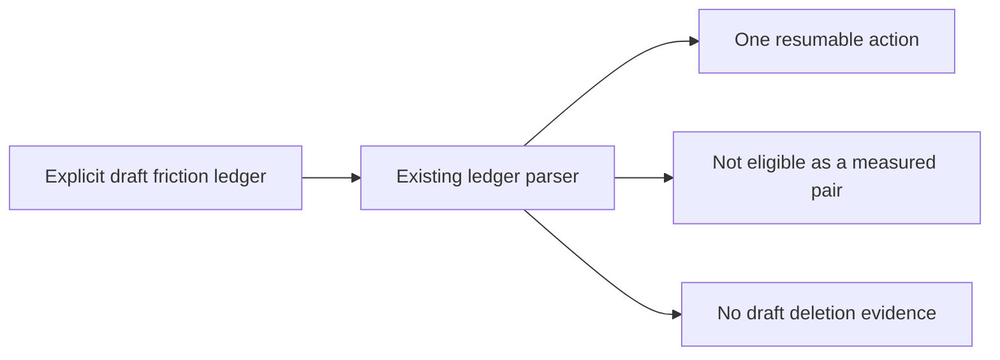
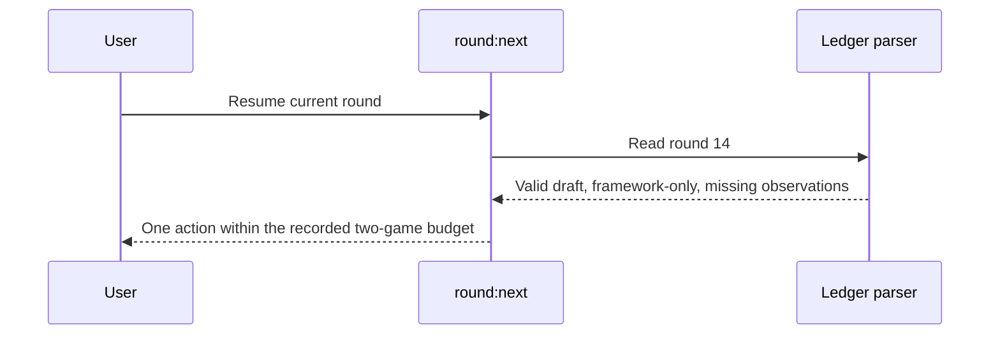

# PRD-360 — Unfinished friction rounds remain resumable

**Status:** PROPOSED
**Priority:** 1 — address today, September 5, 2026.
**Complexity:** 2 (6–10 files) + 2 (state logic) = **4 → MEDIUM mode**.
**Estimate:** 3–5 engineering hours. **Owner layer:** repository measurement tooling and evidence.

## Problem and evidence

The latest owner-authorized round is a two-game, framework-only friction experiment, but its
unfinished ledger is unreadable by the tools used to resume work. `pnpm round:next` exits 1 with
`Round ledger section 'Dispositions' has no table.` Alpha A4 becomes unmeasured for the same reason.
See the [batch command output](README.md#evidence-collected-today).

Inspected: `scripts/round-ledger.ts:365` and `:402`, `scripts/round-next.ts:169`,
`scripts/alpha-bar.ts` (`pairedAndMeasured`, `pairedRoundRow`), their existing unit suites, and
`docs/verification/round-14-2026-09-04.md`. The parser always reads the disposition table; validation
also rejects pending gate values, unsupported stop states, and placeholder dispositions. Adding
one table alone does not establish a valid draft lifecycle.

The archived [PRD-261](../done/PRD-261-the-release-instruments-report-again.md) repaired file
selection; [PRD-164](../done/batch-26-08-19-night/PRD-164-the-round-loop-is-dead-again.md) repaired an
earlier round-loop failure. This scope is explicitly an unfinished, unpaired friction round.
[PRD-356](../astra-batch-2026-09-04/PRD-356-reinvention-is-a-scored-row-in-the-paired-sweep.md)
owns adding reinvention scores, which are out of scope.

## Solution and integration

Represent draft lifecycle and framework-only experiment mode explicitly in the existing ledger
model. Completed paired ledgers retain their current strict validation. Valid unfinished rounds
may be resumed but cannot count as a measured pair, satisfy close criteria, or create deletion
evidence. Malformed declared ledgers still fail closed; do not skip round 14 to select round 13.

No product UI or game change: the user-facing surface is the existing command output. No new
CLI vocabulary. Data changes are additive ledger metadata and honest draft values in round 14.
Choose and document exact field names in phase 1 beside the parser; do not infer mode from prose.

| New thing | Live caller / intended wiring | Replaces | Old path removed? | Negative control |
| --- | --- | --- | --- | --- |
| Explicit draft/friction parsing | `scripts/round-ledger.ts:365` → existing `readRoundLedger` callers | Treating every lifecycle as a finished pair | Delegate through one parser in phase 1 | Invalid completed ledger still throws |
| Draft next action | `scripts/round-next.ts:169`, invoked by `pnpm round:next` | Exception before any useful action | Replace in phase 1 | Remove draft branch: actual round 14 fails |
| Mode-aware evidence grading | `scripts/alpha-bar.ts` → `pairedRoundRow`; `scripts/round-deletions.ts` | Draft poisoning / accidental pair qualification | One grading path per consumer in phase 2 | Draft-only corpus never gives A4 pass |

Implementation must replace these planning anchors with final non-test `file:line` references.

## Phase 1 — The actual unfinished round yields a next action

Files (5, all existing): `scripts/round-ledger.ts`, `scripts/round-next.ts`,
`scripts/__tests__/round-ledger.spec.ts`, `scripts/__tests__/round-next.spec.ts`,
`docs/verification/round-14-2026-09-04.md`.

1. Reproduce the live failure with `pnpm round:next`; make a regression fixture from the actual
   ledger, retaining its missing proof, framework-only budget and incomplete attestations.
2. Add explicit draft/mode validation. Draft missing observations are unmeasured with reasons;
   evidence contradictions and unknown field values still fail. Finalization applies strict rules.
3. Migrate round 14 without inventing archives, results, attestations, dispositions or completion.
   Return one concrete next action that respects the two-game cap and does not request vanilla arms.
4. Record the failing and passing focused tests. Remove the draft branch temporarily and observe
   the same resume test fail; restore it before checkpoint review.

Tests: `should resume the actual framework-only draft`, `should reject malformed completed rounds`,
`should refuse closing a draft with missing evidence`, and `should not request unauthorized arms`.
Command: `pnpm exec vitest run scripts/__tests__/round-ledger.spec.ts scripts/__tests__/round-next.spec.ts`.
User check: `pnpm round:next` exits 0, selects round 14, and explains the missing observation.

## Phase 2 — Drafts do not manufacture evidence

Files (5, all existing): `scripts/alpha-bar.ts`, `scripts/round-deletions.ts`,
`scripts/__tests__/alpha-bar.spec.ts`, `scripts/__tests__/round-deletions.spec.ts`,
`docs/verification/alpha-bar.md`.

1. Consume the explicit mode in alpha and deletion grading. A4 may use a genuinely measured older
   pair, while identifying the current draft as ineligible; it must not describe round 14 as paired.
2. Prove a corpus containing only drafts has no measured pair and cannot advance unreached-round
   deletion counts. Prove truly malformed ledgers still surface as errors.
3. Regenerate the alpha table with `pnpm alpha:bar --write`; preserve independent A1 failures and
   A6 deferral. A nonzero aggregate exit is expected while unrelated requirements remain unmet.
4. Run `pnpm round:next`, `pnpm round:deletions`, and `pnpm alpha:bar`, recording their actual output.

Focused command: `pnpm exec vitest run scripts/__tests__/alpha-bar.spec.ts scripts/__tests__/round-deletions.spec.ts`.
Negative controls: treat a draft as a pair and assert A4 test fails; count a draft toward deletion
and assert its test fails. Existing paired-round cases must continue to pass.

## Completion and evidence

At each phase, an independent checkpoint reviewer checks the ledger, live callers, replaced paths
and observed negative controls before progression. Run `pnpm typecheck`, `pnpm lint`, `pnpm test`
before implementation completion; append exact results to a dated record in `docs/verification/`.
No game/runtime behavior changes, so browser/native playtests are not acceptance gates for this PRD.

- [ ] Round 14 yields a legal, useful next action without fabricating completed work.
- [ ] Drafts cannot satisfy paired evidence, closing, or deletion criteria; malformed records fail.
- [ ] Existing historical paired rounds retain their meaning and results.
- [ ] Final caller anchors, red/green outputs and checkpoint reviews are linked here.
- [ ] Required repository checks ran; any remaining failures keep implementation incomplete.

Next action (under 2 minutes): run `pnpm round:next` and save its current failure.
