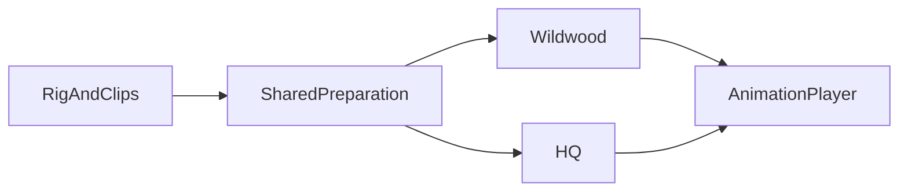
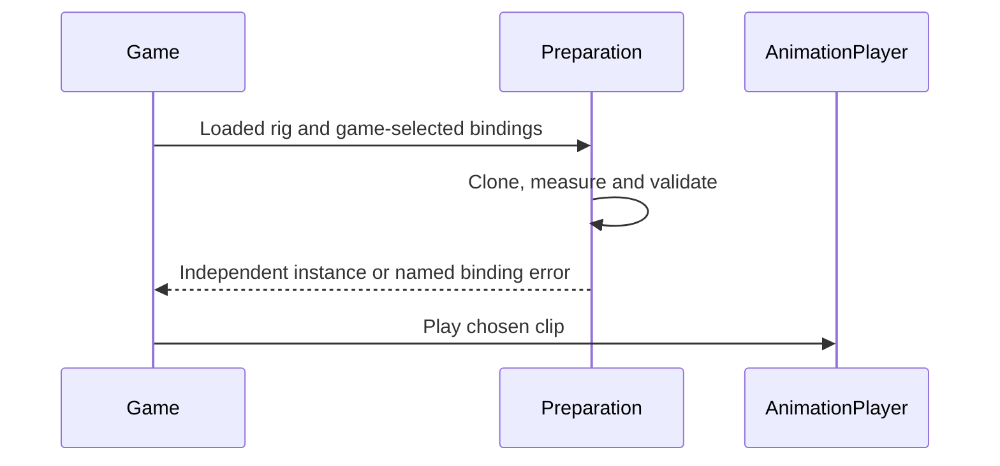

# PRD-361 — Two games share correct character setup

**Status:** PROPOSED
**Priority:** 2 — start today, September 5, 2026.
**Complexity:** 3 (10+ files) + 2 (core and consumers) = 5 → MEDIUM mode.
**Estimate:** 6–10 engineering hours plus platform proof.
**Parent:** [Existing owning PRD](../authoring/PRD-354-an-imported-rig-instances-and-poses-correctly-once.md). This document is its bounded delivery slice, not a competing implementation.

## Problem, scope and grounding

Three independent games repeat skeleton-safe cloning, bind-pose normalization and animation preparation. Wildwood and HQ even independently document the same stride-root trap. Agents should be able to instantiate an animated character without rediscovering these mistakes.

Evidence: [inspected source or dated measurement](../../verification/PRD-324-second-consumer-census.md). Historical device results were not rerun during planning.

Deliver PRD-354's remaining shared preparation and real-consumer adoption. Its original pose corruption is already fixed; do not reopen it. Core owns cloning, measurement and binding validation; games retain clips, states, appearance, sizes and fade policy.

Files analyzed and incumbents: `packages/core/src/animation.ts` (`AnimationPlayer`), `packages/core/src/scale.ts` (`normaliseToMetres`), the parent PRD and September 4 consumer census. Reuse Three.js skeleton-safe cloning and installed pose/binding measurements.

## Integration ledger

| Change | Existing live caller | Replaces | Old path removed/delegates | Negative control |
| --- | --- | --- | --- | --- |
| Shared preparation | Wildwood `Animal.ts` constructor, resolve from census | Inline clone/normalize/bind preparation | Delete matching private path in phase 1 | Removing core export breaks the real build |
| Second consumer | HQ's actual Worker/Visitor constructors | Independently repeated preparation | Delete matching private paths in phase 2 | Plain clone fails independent-skeleton test |
| Mandatory clip validation | Both constructors → existing binding measurements | Optional audit a caller can forget | Preparation invokes audit | Missing requested clip throws at load time |
| Discovery | Existing manifest generator and template instructions | Undocumented assembly traps | Existing discovery owner extended in phase 3 | Plain-words query must find a resolvable import |

Resolve final non-test `file:line` references during implementation; phase completion requires them.
No new service or package. The user-facing flow is the actual game, not a new dashboard.
Data changes: no persistent schema; extend existing runtime reports only where necessary.

## Phase 1 — Wildwood uses shared preparation

**Files:** Core preparation module, existing public export owner if needed, `packages/core/__tests__/animation.spec.ts`, Wildwood's actual `Animal.ts`, and its animal playtest (maximum 5; at least the consumer and test are existing).

1. Resolve both real game checkouts and their instructions. Search capabilities and read every hit before package additions. Count repeated code and choose the smallest composition of installed mechanisms.
2. Add red multi-primitive rig tests: clones animate independently, rendered size is skin-aware, and a missing requested clip fails during preparation. Include the historically bad doe clip map.
3. Implement and migrate Wildwood in the same slice. Delete replaced private plumbing. Prove the actual animal view, then revert to plain cloning or invalid clip binding and observe the intended failure.

## Phase 2 — HQ uses the same path without species-specific options

**Files:** The shared core module, its test file, actual HQ Worker source, Visitor source if required, and HQ's character playtest (maximum 5).

1. Migrate the independently authored humanoid setup; game-specific states and motion stay in HQ. Reconcile the parent's second-consumer clause to its already accepted independent sandbox games.
2. Prove two characters play different clips without changing each other's skeleton or root. Ensure stride measurement reads the motion root rather than the transform the mixer writes.
3. Delete the repeated setup and use the existing LOC scorer across core plus both consumers. Net growth over the direct implementation fails the kill switch. Run the real subject on browser and native, with an observed plain-clone negative control.

## Phase 3 — A cold agent can find the shipped path

Files (maximum 5): existing capability metadata owner, generated manifest, relevant template AGENTS source, its generated mirror, and a dated verification record. Use existing generation commands and query “put an animated character in the scene” and “my imported character renders deformed.” Require a real import and named overrides. Select borrowed vocabulary after the manifest census; no new wrapper just to rename Three.js. Record final caller lines and independent review.

## Acceptance and checkpoint protocol

- [ ] Wildwood and HQ consume the same preparation path; their replaced private copies are gone and aggregate code is smaller.
- [ ] Independent skinned instances measure correctly; missing requested clips fail at load time; existing pose fixes remain intact.
- [ ] The two-game browser proof and a real native subject pass, with negative controls and resolvable public imports.
- [ ] Each phase has observed red/green output, final caller anchors and independent checkpoint review; update the parent with the delivered criteria.
- [ ] `pnpm typecheck`, `pnpm lint`, `pnpm test` and affected real playtests pass with copied outputs.

At each phase, use an independent PRD checkpoint reviewer to check integration, replaced paths,
test collection and negative controls before proceeding. Tests that only call a new helper are
insufficient: deleting the change must break an existing game flow. Read the closest package/game
instructions before editing and use existing harness commands after resolving the target and device.

Record performance findings in `docs/verification/runtime-perf-state.md`; other live proof belongs
in a dated `docs/verification/` record. Link exact commands, outputs and artifact identities here.
Unrun platform gates remain unverified. These plans do not claim implementation or measured improvement.

Next action (under 2 minutes): Open the consumer census and locate Wildwood and HQ's constructors.
