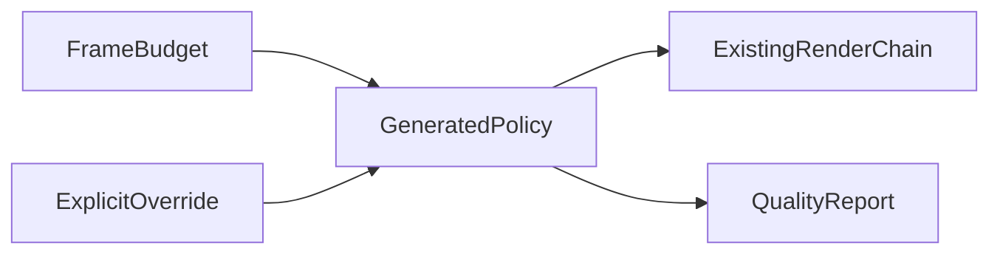
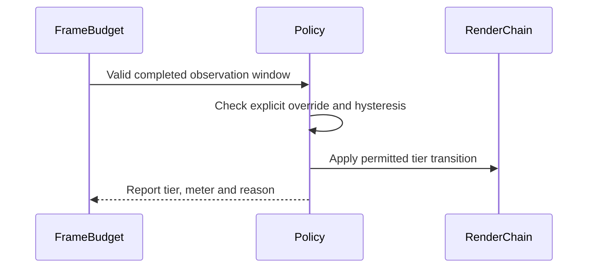

# PRD-362 — Starter quality adapts to measured load

**Status:** PROPOSED
**Priority:** 3 — start today, September 5, 2026.
**Complexity:** 2 (6–10 files) + 2 (adaptive state) + 2 (core/template integration) = 6 → MEDIUM mode.
**Estimate:** 6–8 engineering hours plus device measurement.
**Parent:** [Existing owning PRD](../useful-defaults/PRD-287-the-default-look-holds-the-phones-budget.md). This document is its bounded delivery slice, not a competing implementation.

## Problem, scope and grounding

The current starter chooses low quality when `mobile` is true and high otherwise, once at setup. It cannot respond to an overloaded desktop GPU or a changing scene. A new game should choose playable defaults from measured conditions while preserving explicit overrides.

Evidence: [inspected source or dated measurement](../../../packages/create-threenative/templates/starter/src/render/quality.ts). Historical device results were not rerun during planning.

Deliver the starter end-to-end slice of PRD-287. Other templates remain its follow-up, so one passing starter does not close the parent. Core owns timing observations; generated source owns visual quality policy, presets and appearance.

Files analyzed and incumbents: Starter `src/render/quality.ts` (`resolveQualityTier`) and `postprocessing.ts` (`setupPost`), plus PRD-287. Reuse `FrameBudget`, existing quality presets and the current render lifecycle. The parent's historical CPU≈5.5 ms/GPU≈14.7 ms example motivates GPU input; it is not a measurement of today's starter.

## Integration ledger

| Change | Existing live caller | Replaces | Old path removed/delegates | Negative control |
| --- | --- | --- | --- | --- |
| Measured selection | Starter `quality.ts` via existing `setupPost` | Platform-only automatic selection | Replace automatic path in phase 1 | GPU overload with cheap CPU render must trigger adaptation |
| Runtime transition | Starter `postprocessing.ts` → existing world/render lifecycle | One-shot setup | One active chain; dispose replacement in phase 2 | Repeated transitions expose resource leaks |
| Override/report | Existing quality/frame reports → performance scenario | Initial-only source reporting | Existing reports extended | Remove report: scenario fails closed |

Resolve final non-test `file:line` references during implementation; phase completion requires them.
No new service or package. The user-facing flow is the actual game, not a new dashboard.
Data changes: no persistent schema; extend existing runtime reports only where necessary.

## Phase 1 — Automatic quality reads the actual limiter

**Files:** Starter `quality.ts`, `postprocessing.ts`, existing template quality unit suite (resolve owner), and core `frame-budget.ts` plus its test only if a narrow public observation addition is necessary (maximum 5).

1. Search capabilities and inspect existing observation subscriptions and chain lifecycle. Add a red GPU-overload/CPU-under-budget test; reuse the current meter.
2. Keep platform classification as boot policy. Initially require two overloaded windows to step down, five healthy windows with 20% headroom to step up, and five seconds between changes. Keep these tunable policy values in generated source and validate them in phase 2.
3. Derive budget from configured FPS target. Ignore startup, stale and invalid GPU samples. Use available presentation/frame timing when GPU timing is unavailable, with a named limitation. Explicit tier always wins and remains observed. Prove noise, missing timing and lowest-tier cases; restore platform-only selection to observe red.

## Phase 2 — The real starter remains playable through transitions

**Files:** Starter `postprocessing.ts`, `worldEnvironment.ts` only if required, its existing performance playtest, generated-source instructions, and `docs/verification/runtime-perf-state.md` (maximum 5).

1. Wire decisions through one owned chain lifecycle. Prove disposal, bounded resource use and no repeated compilation of unchanged graphs.
2. Scaffold a static starter through the existing sandbox workflow. Run browser Android and native Android on the same qualified phone for 120 seconds after startup; discard the first measurement window and record buffer size, actual effects, tier, GPU time, FPS and thermal state.
3. Drive a controlled expensive interval and recovery; verify a real transition plus pinned-tier behavior. Capture each tier so gains cannot come from losing the world, controls or essential visibility. If low quality still misses the floor, fix measured generated policy without lowering that floor.

## Acceptance and checkpoint protocol

- [ ] Unpinned starter responds to sustained measured load and holds browser Android ≥30 FPS and native Android ≥55 FPS in every retained reporting window.
- [ ] Explicit overrides stay pinned and measured; fallback timing is named; transitions do not oscillate or leak resources.
- [ ] Actual phone playtests and tier captures preserve playable visibility and input; restoring platform-only selection fails the overload scenario.
- [ ] Each phase has observed red/green output, final caller anchors and independent checkpoint review; update the parent with the delivered criteria.
- [ ] `pnpm typecheck`, `pnpm lint`, `pnpm test` and affected real playtests pass with copied outputs.

At each phase, use an independent PRD checkpoint reviewer to check integration, replaced paths,
test collection and negative controls before proceeding. Tests that only call a new helper are
insufficient: deleting the change must break an existing game flow. Read the closest package/game
instructions before editing and use existing harness commands after resolving the target and device.

Record performance findings in `docs/verification/runtime-perf-state.md`; other live proof belongs
in a dated `docs/verification/` record. Link exact commands, outputs and artifact identities here.
Unrun platform gates remain unverified. These plans do not claim implementation or measured improvement.

Next action (under 2 minutes): Read `resolveQualityTier` and its call in the starter's `postprocessing.ts`.
