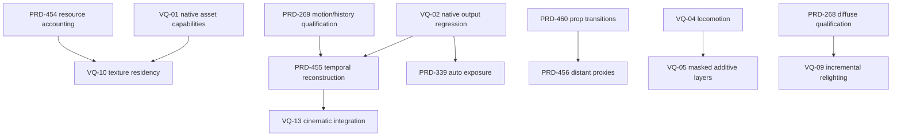

# Visual quality execution batch — 2026-10-01

**Purpose:** close the functional gaps that most visibly affect ThreeNative games, without rebuilding working engine systems or turning a visual audit into a second renderer.

**Contents:** 15 new bounded PRDs, 10 existing canonical execution owners in [EXISTING-PRDS.md](EXISTING-PRDS.md), companion-work links, and an [agent execution handoff](EXECUTE.md). Existing PRDs intentionally remain at their canonical paths; this folder is the single queue, not a second copy of their status/evidence.

**Baseline:** `ThreeNativeHQ/threenative` `develop` at [d72778382b134ef8763f58825cb4d4fd8cc0f6e3](https://github.com/ThreeNativeHQ/threenative/commit/d72778382b134ef8763f58825cb4d4fd8cc0f6e3); Three is pinned to 0.185.1. Reconcile against current `origin/develop` before each task. This is a planning snapshot, not a runtime qualification report or an exhaustive fresh line-by-line audit.

## Agreement with the audit, with corrections

The visual priorities are useful. Several literal absence claims were too broad:

- Current upstream has tiled/clustered lighting, volumetric material, DOF, additive animation and experimental skin-material primitives. Verify the installed pin and prefer integration/qualification over replacing them. Their existence upstream is not proof they are shipped in ThreeNative.
- [PR #375](https://github.com/ThreeNativeHQ/threenative/pull/375) and [PR #382](https://github.com/ThreeNativeHQ/threenative/pull/382) are merged. GPU-driven open-world work and rain/snow are not new greenfield tasks. Their remaining limitations must be separated from their completed work.
- A target-based compressed-asset guard remains in [build.ts](https://github.com/ThreeNativeHQ/threenative/blob/d72778382b134ef8763f58825cb4d4fd8cc0f6e3/packages/create-threenative/src/build.ts#L140-L202), but V8 alone does not prove Basis/Meshopt/Draco work in a packaged Android app. VQ-01 repairs and tests the complete capability contract rather than simply deleting the guard.
- The merged snow PR reports native bloom blanking the world. VQ-02 starts by reproducing that report; it does not pretend the root cause has already been found.
- Existing velocity and diffuse-probe source are not greenfield even though their older PRDs still say PROPOSED. Reconcile the proof, not just the headings. Likewise, animation crossfades exist, but the previous broad claim of interruption correctness must be tested for rapid reversals and returning to an already weighted action.
- Static probe relighting, texture residency, OIT, skin and hair are **gated extensions**, not mandatory replacements. No Lumen/Nanite/DLSS/Unreal-parity label is awarded by this folder.

## First execution wave

Start VQ-01 and VQ-02 independently. In parallel, qualify the unresolved PRD-269 motion/history cases. Then prioritize PRD-455 temporal reconstruction, PRD-339 exposure and PRD-460 visible prop transitions. For a character-heavy game, VQ-04/VQ-05 can run as a separate sequence; for reflective interiors, VQ-03 is the next lighting task.

| Wave | New PRD | Player-visible outcome | Main dependency |
|---|---|---|---|
| 0 / correctness | [VQ-01](PRD-VQ-01-native-asset-capabilities.md) | Native asset compatibility follows the selected runtime and actual decoders | Selected runtime/cohort truth |
| 0 / correctness | [VQ-02](PRD-VQ-02-native-postprocessing-parity.md) | A requested post-processing stage never turns the native world into a blank frame | Reproduce reported native bloom failure |
| 1 / lighting | [VQ-03](PRD-VQ-03-local-reflection-probes.md) | Off-screen specular reflections come from a complete local probe | PRD-381 local-probe child; existing SSR |
| 1 / character motion | [VQ-04](PRD-VQ-04-locomotion-blend-spaces.md) | Locomotion blends by speed and direction without restarting its gait | Existing animation/stride player |
| 1 / character motion | [VQ-05](PRD-VQ-05-masked-additive-animation.md) | Upper-body actions and additive reactions compose over locomotion | Coordinate with VQ-04; IK ordering |
| 2 / scalable lighting | [VQ-06](PRD-VQ-06-many-local-lights.md) | Many local lights use a qualified upstream tiled or clustered path | Installed upstream pin; PRD-457 for shadows |
| 2 / atmosphere | [VQ-07](../done/PRD-VQ-07-volumetric-fog.md) | Local volumetric fog composes with depth, lights and existing atmosphere | Existing atmosphere/kit and upstream volume path |
| 2 / atmosphere | [VQ-08](PRD-VQ-08-clouds-and-overhead-transmittance.md) | Clouds and their ground attenuation share one authored field | Merged rain kit; PRD-381 overhead field |
| 3 / gated GI extension | [VQ-09](PRD-VQ-09-incremental-diffuse-relighting.md) | Diffuse probes refresh bounded changed regions without a visible half-bake | Qualify PRD-268 first |
| 3 / memory-gated | [VQ-10](PRD-VQ-10-texture-mip-residency.md) | Texture residency releases real GPU memory rather than only biasing sampling | PRD-454 resource accounting; VQ-01 |
| 2 / high-payoff detail | [VQ-11](PRD-VQ-11-bounded-decals.md) | Impact and environment decals use a bounded portable lifecycle | Existing hit/base-geometry path |
| 3 / scene-gated transparency | [VQ-12](PRD-VQ-12-transparent-effects-composition.md) | Overlapping transparent effects have an explicit correct or bounded-approximate path | Demonstrated overlap artifact; temporal/output contract |
| 3 / optional cinematics | [VQ-13](PRD-VQ-13-cinematic-stage-integration.md) | Depth of field and motion blur are qualified optional stages, not a second camera pipeline | PRD-269/455; VQ-02 |
| 3 / character-quality gate | [VQ-14](PRD-VQ-14-skin-material-qualification.md) | Skin shading reuses upstream material support and preserves facial animation | License-clear animated head; upstream material |
| 3 / character-quality gate | [VQ-15](PRD-VQ-15-hair-card-material-qualification.md) | Hair cards preserve coverage, tangent highlights and shadow behavior across quality tiers | Hair-card fixture; temporal/alpha qualification |

The ten reused owners are **269, 455, 339, 460, 456, 457, 344, 268, 341 and 342**. Their full paths, residual work and companion PRDs are in [EXISTING-PRDS.md](EXISTING-PRDS.md). Read it before starting either a new or reused item. PRD-341 is now implemented and archived by [PR #392](https://github.com/ThreeNativeHQ/threenative/pull/392); reuse its tone gate rather than reopening that work.

## Dependency outline

These arrows are actual integration dependencies, not a claim that all independent features must wait for the entire preceding wave. Shared render and world files still require reconciliation before merging.

## Scope and admission rules

The deliverable is a **visible result with a lifecycle and a qualified platform path**, not a class name or an `applied` marker. Retain ordinary Three.js APIs. Shader/material choices, fog/cloud appearance, camera controls and animation state choices stay generated game source. Shared core code is limited to justified mechanisms. No animation graph editor/IR, new scene format, ECS, second frame loop or global material package is authorized.

Numbers in new PRDs are proposed fixture targets and must be pinned before implementation; none are measured results. Use matched input routes, the same adapter/cohort and separate CPU, GPU and presented-cadence observations. Effect-region and temporal-sequence checks complement human visual review; they do not replace it with an invented score.

No implementation is included. Open **one implementation PR per canonical PRD** when executing it; this collection's planning PR is not an umbrella implementation PR. Keep existing work and evidence intact and archive through the repository's established PRD lifecycle.

## Upstream references checked during filing

- [Tiled lighting](https://threejs.org/docs/pages/TiledLightsNode.html), [clustered lighting](https://threejs.org/docs/pages/ClusteredLightsNode.html), [dynamic analytic lights](https://threejs.org/docs/pages/DynamicLightsNode.html).
- [Temporal AA](https://threejs.org/docs/pages/TRAANode.html), [depth of field](https://threejs.org/docs/pages/DepthOfFieldNode.html), [decal geometry](https://threejs.org/docs/pages/DecalGeometry.html).
- [Volume material](https://threejs.org/docs/pages/VolumeNodeMaterial.html), [experimental skin material](https://threejs.org/docs/pages/MeshSSSNodeMaterial.html).

These links describe current upstream, not necessarily the pinned 0.185.1 distribution. Pin/patch compatibility is part of admission.
