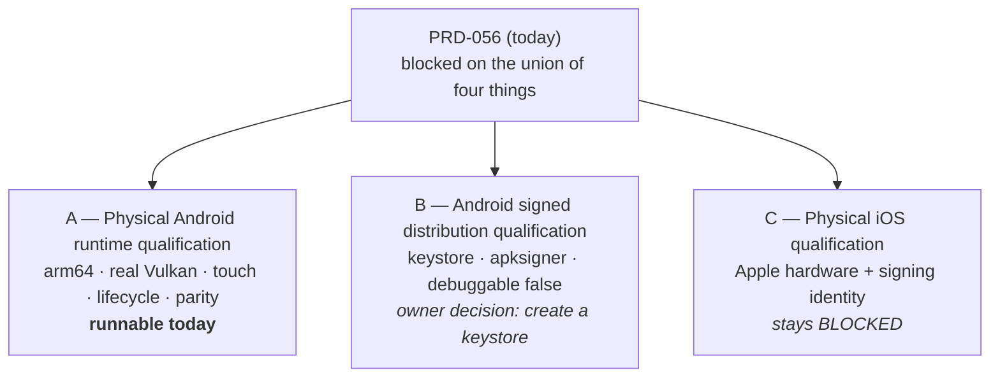

# PRD-128 — PRD-056 is blocked on the union of four things, three of which are not the same blocker

**Status: PHASE 0 EXECUTED, 2026-08-16 — a fifth blocker was found and no folder was moved.** The
kill switch in §9 fired as written. Nothing else below has executed. No physical-hardware, signing or
mobile-readiness claim is made by this file, and no device gate has run.

**What Phase 0 found**, in full in
[`docs/verification/prd-128-phase-0-2026-08-16.md`](../../verification/prd-128-phase-0-2026-08-16.md):

1. **On `main` the qualification command does not exist.** `pnpm native:qualify:physical` exits 254,
   `Command "native:qualify:physical" not found`. Four of the eight paths in the blast radius below
   are absent from the tree.
2. **It was built and never landed.** `linchpin/prd-056-physical-mobile-qualification` carries a
   1,277-line orchestrator, a 634-line evidence module, seven fixtures and a 573-line test file —
   2 commits ahead of `main`, **219 behind**.
3. **Run from that branch against the attached Pixel 8, it exits exactly where §2 predicted**:
   `TN_QUALIFY_SIGNING_REQUIRED`, exit 2, before reading a single property from the phone. **The
   split's premise is confirmed on evidence.**
4. **Recovery is not a cherry-pick.** Five files conflict, and one of them matters: the branch adds
   `webgpu_->resizeSurface(...)` to the Android resize path, and `main` carries a comment at that
   exact site recording that this was tried and **killed a Pixel 8 with signal 6**. That hunk must be
   dropped, not merged.
5. **A defect, not a blocker:** the script reports `TN_QUALIFY_SIGNING_TOOL_REQUIRED` because
   `apksigner` is not on `PATH`, while it sits in `~/Android/Sdk/build-tools/`. The engine load test
   solved this for `adb` at `scripts/engine-load-test/run-android.ts:39`; this script has no
   equivalent, so it reports a missing capability where the truth is a missing lookup.

**What that changes.** The split's direction is right and Phase 1 stands. Phase 2 is not the edit
described below — there is nothing on `main` to edit — and the cost line *"a split, three folder
moves, and then the runs"* is wrong. **Recovering the orchestrator should be its own PRD**, because
folding a C++ crash decision into a document about folder names hides it.

**Outcome:** the part of physical mobile qualification that a Pixel 8 can execute **today** stops
being blocked by an Apple signing identity nobody has. PRD-056 is split along its real dependency
lines, the runnable part moves out of `BLOCKED/`, and the two parts that are genuinely blocked
name their own blocker instead of sharing one.

**Depends on:** the physical Pixel 8 (`shiba`, arm64-v8a, Android 17, Mali-G715), already used by
PRD-066, PRD-070, PRD-117 and PRD-118.

**Related:** [PRD-127](./PRD-127-device-measurement-preflight.md) — any timing number the
qualification takes should pass through the shared condition gate. Not a hard dependency; the
functional gates here are pass/fail, not timings.

**Complexity: 6 → MEDIUM-HIGH mode.** No new capability. It is a split, three folder moves, and
then the runs. The runs are the cost.

**Blast radius: ~8 repository paths.** `docs/PRDs/BLOCKED/`, `docs/PRDs/`,
`packages/runtime-native/scripts/qualify-physical-mobile.mjs`,
`packages/runtime-native/tests/physical-mobile-qualification.test.mjs`,
`packages/runtime-native/package.json`, `packages/runtime-native/docs/G3-mobile-bring-up.md`,
`docs/PRDs/native/README.md`, `docs/verification/`.

---

## 1. Why this exists

[PRD-056](../BLOCKED/requires-physical-device/PRD-056-physical-mobile-qualification.md) is
`PLANNING COMPLETE; EXECUTION BLOCKED`, filed under `requires-physical-device`. Its own blocker
table lists four external dependencies:

| Blocker | Available today? |
| --- | --- |
| Named Android hardware (`ANDROID_SERIAL`, arm64, non-software Vulkan) | **Yes.** The Pixel 8 is attached and four PRDs have measured on it |
| Android signed artifact (`ANDROID_SIGNED_APK`, `apksigner`, `debuggable: false`) | **No** — and see below, this is an owner decision rather than a missing capability |
| Named Apple hardware (`IOS_DEVICE_ID`, physical iPhone/iPad) | No |
| Apple signing and provisioning | No |

Four blockers, one PRD, one folder. The PRD is `BLOCKED` on the **union**, so the row that is
satisfied buys nothing. A phone that can run arm64 with a real Vulkan adapter — the exact thing
the emulator lane cannot prove and the exact gap `G3-mobile-bring-up.md` records as open — sits
idle because nobody has an Apple provisioning profile.

**The signing blocker is smaller than it looks, and it is not the device's fault.**
`packages/runtime-native/android/app/build.gradle.kts:253` declares a `release` build type with
`isMinifyEnabled = false`, proguard files, and **no `signingConfig`**. There is no keystore in the
tree and none is referenced anywhere. So the repository cannot produce a signed non-debuggable APK
regardless of what hardware is attached — but creating a keystore is a decision, not a capability
somebody has to supply from outside. It is worth stating plainly because PRD-056's framing groups
it with the Apple credentials, and those are genuinely unobtainable here.

**And the two halves prove different sentences.** *"This runs correctly on real arm64 hardware
with a real GPU driver"* and *"this ships as a signed artifact a store would accept"* are separate
claims with separate evidence. Bundling them means the first cannot be earned until the second
can, which inverts the order they actually become true in.

## 2. The split

**A — Physical Android runtime qualification.** Everything PRD-056 asks of real Android hardware
that does not depend on a signature: the device identity assertions (`ro.kernel.qemu != 1`, arm64
ABI, non-software Vulkan adapter, recorded marketing name and OS build), lifecycle suspend/resume
and rotation continuity, the PRD-054 `android-hardware` parity report, the PRD-053 multitouch
report, the PRD-046 physics verifier, and the telemetry collectors (frame, memory, thermal,
battery) with their completeness controls. Installed from a **debug or unsigned build, explicitly
labelled as such**, on the named device.

**B — Android signed distribution qualification.** Signature verification, signer digest,
`android:debuggable == false`, artifact SHA matching its candidate source SHA, and install of the
signed artifact. Blocked on a keystore. Filed under a reason folder that names that and nothing
else.

**C — Physical iOS qualification.** Unchanged, stays in `BLOCKED/requires-physical-device/`, and
its blocker is stated as what it is: no Apple hardware and no signing identity.

**A does not license B's sentence and must not be written as though it does.** A run from an
unsigned debug build proves the runtime works on the hardware. It proves nothing about
distribution, and the qualification report must carry `signed: false` as data, not as a footnote,
so no aggregate can read it as a shipping claim.

## 3. What A actually buys

This is the first evidence the repository would hold that is neither emulator nor simulator.
PRD-056's own evidence-identity table says what today's lanes cannot cover:

> **Android emulator** — proves APK plumbing, QuickJS and emulator-driver behavior. Does not prove
> arm64, real Vulkan, touch hardware, thermal, battery, or phone frame behavior.

A covers every one of those except the ones that need a signature. It moves ROADMAP row 4 —
*web/native parity is checkable, not asserted* — onto hardware for the Android half, and it is the
only Tier 2 work this repository can do without buying an Apple device.

**It still does not license "mobile-ready".** One Android phone, one vendor, one GPU family, no
iOS. The sentence A earns is *"runs on a physical arm64 Android phone with a real Vulkan driver,
from an unsigned build, on one named device"*, and the qualification report should print exactly
that string rather than leaving a reader to compose it.

## 4. Phases

### Phase 0 — Confirm the split is real before moving any file — **DONE 2026-08-16, second outcome**

Run `native:qualify:physical --platform android` against the Pixel 8 as the command stands today
and record where it exits. Two outcomes, both pre-committed:

- **It exits on the signing check** — the split is exactly as described; proceed.
- **It exits earlier, on something else** — that something is a fifth blocker nobody has recorded,
  and it gets written down before any folder moves. **Do not move files first and discover this
  during the runs.**

Half a day, and it is the only phase that can invalidate the rest.

**Result: the second outcome, and then the first.** On `main` the command exits 254 because it does
not exist — the fifth blocker, written down above and in the verification record, with no folder
moved. Run from the branch where it does exist, it exits on the signing check exactly as predicted,
so the split's premise holds. Phase 0 both invalidated the cost and confirmed the direction.

### Phase 0.5 — Recover the orchestrator (**new, and it is now the long pole**) — scoped as [PRD-131](./PRD-131-recover-the-qualification-orchestrator.md)

Its own PRD, not a sub-phase of this one. Bring `qualify-physical-mobile.mjs`,
`physical-device-evidence.mjs`, the fixtures and the tests onto `main` from
`linchpin/prd-056-physical-mobile-qualification`; **drop the `runtime.cpp` resize hunk**, which
`main` rejected with a signal-6 crash on this phone; give `apksigner` the SDK fallback `adb` already
has. Nothing in Phases 2–3 can start before this.

### Phase 1 — Split the PRD, move the folders

Three files where there was one. A moves to an active batch folder; B moves to a reason folder
naming the keystore; C stays. Every inbound link is repaired and verified to resolve — PRD-056 is
referenced from `docs/PRDs/native/README.md` and `G3-mobile-bring-up.md`.

### Phase 2 — Separate the qualification command's Android path from its signing path

`qualify-physical-mobile.mjs` currently treats signature verification as a precondition of Android
install. It becomes a separately reported section that can be `skipped: unsigned build` with the
report stamped `signed: false`, and **cannot** be `passed` without a real signature.

### Phase 3 — Execute A on the Pixel 8

The runs. Every negative control observed red first.

## 5. Integration ledger

Filled with real non-test `file:line` during implementation. A `TBD` at phase end means the phase
is incomplete.

| # | Thing built | Caller edited so it is reached | What it replaces | When it may claim green | Negative control |
| --- | --- | --- | --- | --- | --- |
| 1 | Split PRDs A/B/C | `docs/PRDs/native/README.md`, `G3-mobile-bring-up.md` | one PRD blocked on a union | all three exist, every inbound link resolves | a link check finds a dangling reference → fix before the runs |
| 2 | `signed: false` as report data | `qualify-physical-mobile.mjs` report writer | signature as an install precondition | an unsigned run reports `signed: false` and still exercises the runtime gates | a report with signing `passed` and no signer digest is rejected |
| 3 | Unsigned-build qualification path | `native:qualify:physical --platform android` | a path that exits before touching the device | the device gates run and report from an unsigned build | pass a signed artifact → the signing section is `passed`, not `skipped` |
| 4 | Physical Android evidence rollup | `docs/PRDs/native/README.md:10` | "physical hardware open" prose with no schema | A's report passes validation and is committed | an emulator identity produces `blocked`, exit 2 — PRD-056's existing control, preserved |
| 5 | The earned-sentence string | the report writer | a reader composing the claim themselves | the report prints the exact sentence A licenses | edit it to say "mobile-ready" → a test fails | 

## 6. Acceptance criteria

- [x] Phase 0 is executed and its exit point recorded **before** any file moves.
      **2026-08-16: exit 254 on `main` (command absent), exit 2 `TN_QUALIFY_SIGNING_REQUIRED` on the
      branch where it exists. No folder moved.**
- [ ] PRD-056 is three PRDs. A is in an active folder, B names the keystore as its blocker, C names
      Apple hardware and signing as its own.
- [ ] Every inbound reference to PRD-056 resolves to the correct one of the three.
- [ ] `native:qualify:physical --platform android` completes on the named Pixel 8 from an unsigned
      build and produces a validated report.
- [ ] That report carries `signed: false`, the device's arm64 ABI, `ro.kernel.qemu != 1`, the
      non-software Vulkan adapter identity, the recorded marketing name and OS build.
- [ ] A report claiming signing `passed` without a signer digest is **rejected**, observed red.
- [ ] An emulator serial passed to the Android qualification path returns `blocked` with
      `TN_QUALIFY_PHYSICAL_DEVICE_REQUIRED` and exit 2 — PRD-056's existing control, still red.
- [ ] Lifecycle suspend/resume/rotation continuity passes on the physical device, with its
      negative control observed red.
- [ ] The report prints the exact sentence this evidence licenses, and **no file anywhere says
      mobile-ready**. A test fails if the string appears.
- [ ] `pnpm typecheck && pnpm lint && pnpm test && pnpm budgets` passes, and no native toolchain
      becomes part of the default gate.

## 7. Negative controls

Every row must be **observed red** with its exit code recorded before the matching pass is
written. A pass with no observed red is recorded `UNVERIFIED`.

| Control | Change | Expected | Status |
| --- | --- | --- | --- |
| `android-physical-identity` | pass `emulator-5554` | `blocked`, `TN_QUALIFY_PHYSICAL_DEVICE_REQUIRED`, exit 2 | exists in PRD-056; must stay red |
| `software-adapter` | a device reporting a software Vulkan adapter | refused before qualification | not built |
| `unsigned-claims-signed` | report signing `passed` with no signer digest | rejected, exit non-zero | not built |
| `signed-section-skipped-silently` | omit the signing section entirely | rejected as malformed — `skipped` must be explicit | not built |
| `lifecycle-relaunch` | resume by relaunching a new session instead of resuming | nonce/state continuity fails, exit 1 | exists in PRD-056; must stay red |
| `telemetry-completeness` | omit a memory sample | exit 1 | exists in PRD-056; must stay red |
| `mobile-ready-string` | write "mobile-ready" into any file | a test fails naming the file | not built |
| `dangling-prd-link` | leave one inbound PRD-056 reference unrepaired | link check fails | not built |

## 8. Non-goals

- **Not qualifying iOS.** No Apple hardware is attached.
- **Not creating a keystore.** That is an owner decision. This PRD names it as B's blocker and
  stops.
- **Not a store submission, release signing, or credential creation.** PRD-056's anti-scope is
  inherited verbatim.
- **Not a performance result.** A is functional qualification. Frame-rate work is PRD-066's, and
  any timing taken here goes through PRD-127's condition gate or is not reported.
- **Not a second device.** One phone, named, recorded.

## 9. Kill switches and rollback

- **If Phase 0 finds a fifth blocker**, stop and record it. A PRD split that leaves the work still
  blocked is worse than the union it replaced, because it spends the honesty of three folder names
  and buys nothing.
- **If the unsigned qualification path turns out to be indistinguishable from the signed one** —
  that is, if every gate A runs would pass identically on a debug build with no device attached —
  then A is not proving hardware and must be deleted rather than reported. The
  `android-physical-identity` control is what makes that detectable; if it cannot be observed red,
  A is not evidence.
- Rollback is `git mv` back to one file. Nothing here is a code change until Phase 2.
