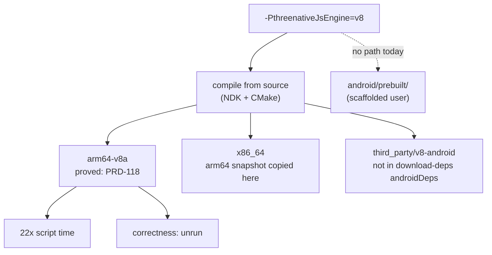

# PRD-130 — Make the Android engine default payable, then let the owner pay it or refuse it in writing

**Status:** PROPOSED, 2026-08-16. Nothing below has executed. No mobile-readiness, signing, or
second-device claim is made by this file. It does not decide that V8 becomes the default; it removes
the four things that make that decision unpayable today, and it makes a refusal cost the same
paperwork as an acceptance.

**Outcome:** `-PthreenativeJsEngine=v8` stops being a flag that works on one operator's machine, on
one ABI, on the one build path that compiles from source. Afterwards, either the Android default is
V8 and a scaffolded project gets it without knowing the flag exists, or the default is still QuickJS
and `docs/verification/` carries the price the owner looked at when refusing.

**Depends on:** [PRD-118](../done/PRD-118-android-js-engine.md), which measured the win and said in
its own §6 that the flip is the owner's call; the physical Pixel 8 (`shiba`, arm64-v8a) used by
PRD-066, PRD-070, PRD-117 and PRD-118; the x86_64 emulator lane recorded in
`packages/runtime-native/docs/G3-mobile-bring-up.md`.

**Related, not blocking:** [PRD-127](./PRD-127-device-measurement-preflight.md) — any timing this PRD
takes should pass its condition gate. [PRD-128](./PRD-128-android-qualification-split.md) — the
release build type has no `signingConfig`; that is PRD-128's problem and this PRD inherits it rather
than solving it.

**Complexity: 7 → HIGH mode.** No new capability and no framework surface. It is a build-graph
correction, a dependency-provisioning gap, a release-artifact addition, and then the runs. The runs
are the cost, and two of them need the phone.

**Blast radius: ~9 paths.** `packages/runtime-native/android/app/build.gradle.kts`,
`packages/runtime-native/scripts/download-deps.mjs`,
`packages/runtime-native/scripts/package-android.mjs`,
`packages/runtime-native/scripts/install-prebuilt.mjs`, `.github/workflows/native-release.yml`,
`.github/workflows/native-platforms.yml`, `packages/runtime-native/docs/G3-mobile-bring-up.md`,
`packages/runtime-native/AGENTS.md`, `docs/verification/`.

---

## 1. What is actually in the way

PRD-118 closed with a 22× script-time result and an unmade decision. The decision reads as a
size-versus-speed judgement — +25.6 MB of arm64 payload against 119.19 ms → 8.32 ms — and the owner
could make that call from the numbers alone. Except the flag it would flip does not survive contact
with any path but the one that produced those numbers. Four things, found by reading the build files
rather than by running them; Phase 1 through Phase 4 execute each one.

**One. The x86_64 slice would ship an arm64 snapshot.** `build.gradle.kts:49` copies
`third_party/v8-android/snapshot_blob/arm64-v8a/snapshot_blob.bin` to a single
`assets/v8/snapshot_blob.bin`, and `abiFilters` at line 200 ships `arm64-v8a` **and** `x86_64` in the
same APK. The tree carries an x86_64 snapshot next to the arm64 one and nothing reads it. Every V8
run so far has been on the phone, which is arm64, so nothing has caught this. The emulator lane is
x86_64 — G3 line 9 says so — and it is the lane a default would route through first.

**Two. A fresh checkout cannot obtain Android V8.** `download-deps.mjs:925` lists the Android
dependencies as `sdl3`, `wgpu-android`, `sdl3-android`, `quiche-android`. Its `v8` entry (line 130)
maps to desktop macOS/Linux/Windows archives. `third_party/v8-android/` exists on this machine
because somebody put it there. The package's own rule is that `download-deps.mjs` is the only
supported reconstruction path, so today the V8 Android build is not reconstructible by that rule.

**Three. The path a scaffolded user builds through carries no V8 at all.** When
`android/prebuilt/` is populated the Gradle build skips CMake entirely (`build.gradle.kts:21`), and
`package-android.mjs:26` populates it with exactly four files: SDL3 and `libmystral-runtime.so`, per
ABI. No `libv8android.so`, no `libc++_shared.so`, no snapshot. A user who never compiles the runtime
cannot run V8 whatever the default says, and flipping the CMake default without this would produce a
default that only operators with an NDK ever receive.

**Four. Nobody has measured what a user downloads.** There are no ABI splits, so every APK this repo
produces is universal and carries both ABIs: 218,349,795 B for QuickJS against 361,004,372 B for V8.
That +142.7 MB double-counts and PRD-118's retake says so. The arm64-only payload figure —
75,819,688 B → 101,390,028 B, **+25.6 MB** — is the right shape of number, but it is a sum over
uncompressed native libraries, not the size of an artifact this repository has ever built.

And one gap that is not a build defect: **PRD-118 proved speed under V8, not correctness.** No
conformance run, no playtest, no multitouch check has executed against a V8 build on the phone. A
default engine that renders 14× faster and gets one binding wrong is worse than the slow one.



## 2. What this PRD decides, and what it hands back

It decides that the four gaps above get closed regardless of the outcome, because each is a defect
in its own right: a build that ships a wrong-ABI asset, a dependency outside the supported
provisioning path, a release artifact that cannot express a supported build option, and a cost
nobody has measured on the artifact users receive.

It does not decide the default. Phase 6 lays the finished cost sheet in front of the owner —
per-ABI download size, correctness parity, both engines' numbers under PRD-127's condition gate —
and the owner flips it or refuses it. **Both outcomes are terminal and both are written down.** A
refusal recorded with the measured price is a finished PRD; a refusal recorded as "not now" is not.

## 3. Integration Ledger

Filled with real `file:line` during implementation. A `TBD` at phase end means the phase is open.

| # | New thing | Live caller (`file:line`, non-test) | Replaces | Old path removed? | Negative control |
|---|-----------|-------------------------------------|----------|-------------------|------------------|
| 1 | Per-ABI snapshot staging in `copyV8Snapshot` | `build.gradle.kts` — task wired into the existing `preBuild`/merge-assets chain that already consumes it | single arm64 copy at `build.gradle.kts:49` | yes, deleted in Phase 1 | stage the arm64 snapshot into the x86_64 slice → emulator launch fails with the existing snapshot error |
| 2 | `v8-android` dependency entry | `download-deps.mjs` `androidDeps` list (currently line 925) | manual placement of `third_party/v8-android/` | n/a, no code path to remove | delete `third_party/v8-android/`, run the Android dep download, build with `-PthreenativeJsEngine=v8` |
| 3 | V8 entries in `ANDROID_PREBUILT_ASSETS` | `package-android.mjs:26` map, consumed by `prepareAndroidPrebuilts` at line 208 | prebuilt path silently QuickJS-only | prebuilt completeness check widened, not duplicated | populate `android/prebuilt/` from a V8 release, build, assert logcat says V8 |
| 4 | Per-ABI size record | `docs/verification/android-engine-size-<date>.md`, cited from `G3-mobile-bring-up.md` | the universal-APK figure quoted in PRD-118 §4 | universal figure kept but labelled double-counting | none needed — it is a measurement, and its control is that the two engines' numbers differ |
| 5 | Engine identity assertion in the device gates | `verify-android-first-proof.mjs` / conformance runner, whichever already parses logcat | assumption that the installed APK is the engine you asked for | n/a | run the assertion against a QuickJS APK while asking for V8 → must fail |

**Reachability.** Entry point: `pnpm native:build` and `gradlew assemble*` for the source path,
`create-threenative`-scaffolded `pnpm native:package:android` for the prebuilt path; the observable
is `runtime.cpp:450`, which already logs `JS engine created: %s` to logcat on every launch. That line
is the one place the running process states which engine it is, and every gate below reads it rather
than inferring from the build flag.

**Replaces:** the current arm64-only snapshot copy (row 1) and the QuickJS-only prebuilt contract
(row 3). Nothing else.

## 4. Phases

Each phase edits at least one pre-existing file. No phase adds a new package or a public API.

### Phase 1 — The x86_64 emulator launches a V8 build, or the build refuses to produce one

**Files:** `android/app/build.gradle.kts` (EDIT), `packages/runtime-native/docs/G3-mobile-bring-up.md`
(EDIT).

- [ ] `copyV8Snapshot` stages one snapshot per ABI, keyed off the same ABI list `abiFilters` uses, so
      the two cannot drift.
- [ ] A missing snapshot for **any** shipped ABI throws at configure time, matching the existing
      failure for the arm64 one. Shipping an ABI with no snapshot is a build failure, never a runtime
      surprise.
- [ ] G3 gains a row for the engine the emulator lane ran.

**Wiring:** the task is already in the build graph; the edit changes what it stages, and the
completeness check is what makes the wrong state impossible.

**Verification:**

```sh
./gradlew assembleDebug -PthreenativeJsEngine=v8
adb -s emulator-5554 install -r <apk> && adb logcat -d | grep "JS engine created"
# Expected: V8, on x86_64
```

**Negative control (must be observed red):** stage the arm64 snapshot into the x86_64 slice by hand
and reinstall. The emulator must die with `V8 startup snapshot asset is missing` or an equivalent
refusal, not run. If it runs, the snapshot is not being read and the gate proves nothing.

**Revert check:** restore the single-copy staging → the emulator V8 launch fails.

### Phase 2 — A fresh checkout can build Android V8 through the supported path

**Files:** `scripts/download-deps.mjs` (EDIT), `packages/runtime-native/AGENTS.md` (EDIT).

- [ ] `v8-android` joins `androidDeps` with a pinned URL and checksum, in the same shape as
      `wgpu-android`.
- [ ] The entry provisions both ABIs' libraries and both snapshots — the thing Phase 1 now requires.
- [ ] AGENTS.md's V8 paragraph stops implying `third_party/v8-android` appears by itself.

**Verification:**

```sh
mv packages/runtime-native/third_party/v8-android /tmp/v8-android.bak
node packages/runtime-native/scripts/download-deps.mjs --android
./gradlew assembleDebug -PthreenativeJsEngine=v8   # must succeed
```

**Negative control:** run the build with the directory moved away and the dep script **not** run. It
must fail loudly at configure time. A build that quietly falls back to QuickJS here is the exact
silent-substitution failure PRD-118's §2 spent three checks ruling out.

### Phase 3 — The number a user downloads, for both engines

**Files:** `android/app/build.gradle.kts` (EDIT), `docs/verification/android-engine-size-<date>.md`
(NEW), `packages/runtime-native/docs/G3-mobile-bring-up.md` (EDIT).

- [ ] Per-ABI artifacts are producible (ABI splits or an equivalent per-ABI assemble), so a size can
      be read off an artifact rather than summed from libraries.
- [ ] Four numbers recorded: {QuickJS, V8} × {arm64-v8a, x86_64}, as built artifact bytes, plus the
      Play-delivery figure if the bundle path is available.
- [ ] PRD-118's universal figure is cited and labelled as double-counting, not deleted.

**Acceptance:** the record answers "how many extra megabytes does an arm64 phone download to get
V8" with an artifact size, not a sum. If the true delta lands materially below +25.6 MB, say so; if
it lands above, say that instead. The PRD does not have a preferred answer here.

### Phase 4 — V8 reaches the path a scaffolded user builds through

**Files:** `scripts/package-android.mjs` (EDIT), `scripts/install-prebuilt.mjs` (EDIT),
`.github/workflows/native-release.yml` (EDIT), `android/app/build.gradle.kts` (EDIT).

- [ ] Release artifacts gain the V8 runtime set per ABI: `libv8android.so` (29,919,888 B on arm64),
      `libc++_shared.so`, and the matching snapshot.
- [ ] `ANDROID_PREBUILT_ASSETS` and the prebuilt completeness check express both engines. A
      partially-populated prebuilt directory keeps failing loudly, as it does today.
- [ ] The prebuilt path can select an engine by the same flag name as the source path. Two names for
      one choice is how the flag gets forgotten.

**Negative control:** populate `android/prebuilt/` from a QuickJS release, request V8, build. The
build must refuse rather than produce an APK whose logcat says QuickJS.

**Revert check:** remove the V8 entries → a V8 prebuilt build fails the completeness check.

### Phase 5 — V8 is proved correct on the phone, not only fast

**Files:** `scripts/verify-android-first-proof.mjs` (EDIT), `conformance/registry.json` (EDIT),
`docs/verification/prd-130-v8-correctness-<date>.md` (NEW).

- [ ] The conformance run and the multitouch check execute on the Pixel 8 against a V8 APK, with the
      installed bytes proved by hash as PRD-118 §2 did.
- [ ] A playtest scenario drives the real build on device under V8 and asserts behaviour, not
      startup.
- [ ] Every gate records which engine the process reported at `runtime.cpp:450`, from logcat.

**Negative control:** run the engine-identity assertion against a QuickJS APK while asking for V8 —
it must fail. A parity gate whose two sides can be the same build measures nothing.

**Acceptance:** conformance rows that pass under QuickJS pass under V8 on the same device, and any
row that does not is named in the record. A blocked row is reported blocked, never omitted.

### Phase 6 — The owner decides, and the decision is written either way

**Files:** `CMakeLists.txt` (EDIT, only if flipping), `android/app/build.gradle.kts` (EDIT, only if
flipping), `packages/runtime-native/AGENTS.md` (EDIT), `docs/verification/` (NEW record),
`docs/PRDs/done/PRD-118-android-js-engine.md` (EDIT — its §6 open question gets an answer and a
link).

The cost sheet goes to the owner: per-ABI download delta (Phase 3), correctness parity (Phase 5),
both engines' frame numbers under PRD-127's condition gate, and the operational cost — a shared STL,
an external snapshot per ABI, and a 30 MB library in every release.

- **If flipped:** the Android default becomes V8 in the CMake platform block and the Gradle property
  default, `-PthreenativeJsEngine=quickjs` becomes the documented rollback, and both are exercised in
  the same commit. AGENTS.md and G3 stop saying "Android QuickJS+wgpu-native".
- **If refused:** `docs/verification/` gains a dated record naming the number the owner refused to
  pay and what would change the answer. AGENTS.md keeps its paragraph and gains the link. Phases 1
  through 5 stay; they are correctness work, not flip preparation.

**Acceptance (consumer-scoped, and it branches):**

- Flipped: a project scaffolded by `create-threenative` and built for Android with **no engine flag**
  launches on the Pixel 8 and logcat reports `JS engine created: V8`; the same project with
  `-PthreenativeJsEngine=quickjs` reports QuickJS and still launches.
- Refused: the same no-flag build reports QuickJS, and the dated record states the measured price of
  the alternative. In both branches the emulator lane launches whichever engine is default, on
  x86_64, from Phase 1's staging.

## 5. What this PRD will not claim when it closes

- **Not mobile-ready, whichever way it goes.** One Android phone and one x86_64 emulator are not
  mobile, and iOS has no physical evidence at all.
- **Not a signed-artifact claim.** The release build type still has no `signingConfig`; that is
  PRD-128's row and this PRD does not touch it.
- **Not a second-device result.** Every device number here comes from `shiba` unless another phone
  appears, and a second device would be a different PRD.
- **Not a re-measurement of QuickJS at 16,384.** That figure remains PRD-117's, with PRD-117's
  provenance, unless someone retakes it.

## 6. Done checks

- [ ] All six phases complete, or the PRD stays open with the unfinished phase named
- [ ] `pnpm typecheck && pnpm lint && pnpm test` green
- [ ] Integration Ledger has zero `TBD` cells; every live caller is a real non-test `file:line`
- [ ] Every gate above has a negative control that was **observed** failing, pasted, not summarized
- [ ] Revert checks pass: undoing Phase 1, 2 or 4 breaks a gate that now exists
- [ ] The engine each gate ran under is read from logcat, never inferred from the build flag
- [ ] G3 and AGENTS.md describe the default that is actually in the build files
- [ ] The owner's decision — flip or refusal — exists as a dated record, not as an implication
