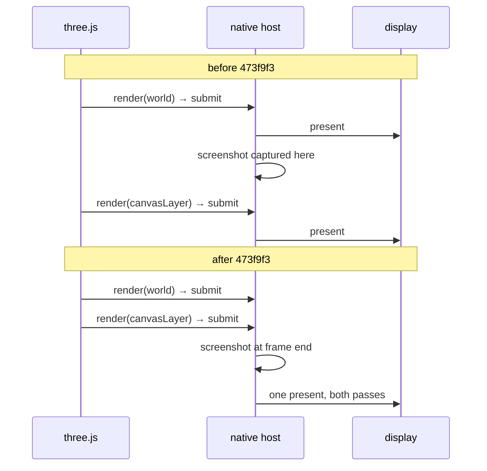

# PRD-155 — Rendering defect sweep, and native visual evidence that can fail

**Status:** PARTIAL, 2026-08-18. Phases 1, 3 and 4 executed; Phase 2 is enumerated but not re-run;
Phase 5 did not run. Results, evidence and what is still open:
`docs/verification/prd-155-2026-08-18.md`.

- **Phase 1 — DONE.** The overlay and one-present-per-frame gate runs on the Pixel 8 and goes red on
  the pre-fix runtime (`presented 120 times in 60 frames`) and green on the fixed one (960/960,
  4,096 overlay pixels). The iOS half is implemented and **unexecuted** — no Apple machine here.
- **Phase 2 — OUTSTANDING.** Enumerated, and narrowed: playtest `visual` assertions are never
  evaluated on `--target android|ios`, so no device `visual` result exists to retract. Three results
  are named as worth re-running first; none has been.
- **Phase 3 — D1 NOT REPRODUCED** on web, desktop native, or the Pixel 8. Roof and sails are present
  in all three.
- **Phase 4 — D2 and D3 REPRODUCED, and both FIXED.** They are one defect and it is a **game bug**,
  on every platform, not Android-only: the level lives in a `BundleGroup`, upstream three.js defaults
  `BundleGroup.static` to `true`, and a recorded render bundle replays frozen draws. Two smaller
  defects sat on top — `mergeLevelMeshes` detached the animated subtrees, and `waterfall()`
  overwrote one of its two streak groups. Fixed in `sandbox/fox-native`; on the Pixel 8 the windmill
  region now changes 12.3–12.6 % between frames where it changed 0 %, and the waterfalls 19–23 %
  where they changed 0.00 %. Nothing in `packages/` was changed, and nothing needed to be.
- **Phase 5 — NOT RUN.** The device was charging, at 24% battery, thermal status 1; all three of the
  PRD's own preconditions fail.

**Two corrections to §1 below, established by this work.** The present-once-per-frame fix landed in
`fc2eb93`, not `473f9f3` — `473f9f3` fixed the *screenshot capture* timing and added the present
counter. And a device screenshot (`adb screencap`, `simctl io`) reads the composited display and was
never affected by the mid-frame capture bug, so §3's "every native screenshot-based result is
suspect" holds only for the runtime's own `--screenshot` capture.

**Outcome:** the rendering defects a player can see in a real game on a real device are either
fixed or written down with a named layer and a failing test; and native visual evidence is
trustworthy, meaning a gate that reads a native screenshot is looking at a finished frame and can
go red when the screen is wrong.

**Depends on:** `473f9f3` (present once per frame, screenshot the finished frame). §3 and §4 are
meaningless before it, because every native screenshot taken before that commit was of a
half-drawn frame.

**Blocks:** any claim that native rendering is correct, and any native `visual` playtest evidence
recorded before `473f9f3`.

**Complexity: 6 → HIGH mode.** +2 for four unreproduced defects spanning game and engine, +2 for
device-lane gate work across Android and iOS, +1 for a re-audit of existing recorded evidence, +1
for changes that touch both `packages/runtime-native/` and generated/sandbox game source. Every
phase needs an automated checkpoint; §2 and §4 also need a manual device screenshot.

**Blast radius:** `packages/runtime-native/scripts/` device verifiers, `examples/native-smoke/`,
`packages/playtest/` visual assertions on `--target android|ios`, `scripts/verify-golden-path.ts`,
and `sandbox/fox-native/src/` (game source, not framework).

## 1. What already landed, and why the rest exists

Two engine defects were found by running a real game on a physical Pixel 8, not by any gate.

- The host presented the surface inside every `queue.submit`. three.js submits once per
  `renderer.render()`, and a frame that draws an overlay renders twice — the world, then
  `ctx.canvasLayer`. The overlay acquired a swapchain image of its own, and only the first present
  of the frame reached the display. The framework's own loading-screen seam did not work on native.
- The screenshot was captured inside that same submit, after the world pass and before the overlay
  pass. **Every native screenshot was of a half-finished frame.** This is why the desktop gate
  stayed green through the whole defect: it asserted the image was not blank, and a half-drawn
  world is not blank.

The gate that now covers this is a magenta canvas-layer quad in `examples/native-smoke`, asserted
by `verify-desktop-core.mjs` along with `TN_PRESENTS` equalling the frame count. On the unfixed
runtime it fails with `0 pixels of #ff00ff, expected at least 256`, while the blank-screenshot
check beside it passes either way — that contrast is the reason it is worth keeping.

That gate runs on desktop only. §3 is the same gate on device.

## 2. Defect census

Four defects reported by the owner while playing `sandbox/fox-native` on a Pixel 8 and on web.
None is fixed. For each, the layer is a claim to be proved in the phase, not an established fact.

| # | Defect | Reported on | Status | Suspected layer |
| --- | --- | --- | --- | --- |
| D1 | Windmill sails and roof do not render | web and native | **Unreproduced by instrumentation** | unknown |
| D2 | Windmill blades do not rotate | native | **Unreproduced; one measurement retracted** | unknown |
| D3 | Waterfalls may not animate | native | **Unverified — never measured** | unknown |
| D4 | Frame rate degrades as the level progresses | native | **Hypothesis only, unmeasured** | game |

### D1 — windmill sails and roof

The owner reports the white sails and the blue roof missing. Live inspection of the running web
build contradicts the simple explanations and is recorded here so the next session does not repeat
it: all four sails exist, all four spars exist, one roof exists, and every one of them reports
`visible: true`, `MeshToonMaterial`, `transparent: false`, `opacity: 1`, `side: FrontSide`, with
colours `#f6f0e2` (sail), `#9c6330` (spar) and `#3f7fbf` (roof). The scene held 1,477 meshes. Sail
world positions differ per arm, so the hub transform is being applied.

So the meshes are present and nominally drawable, and the defect is somewhere after that. Untried:
whether they are drawn and then overdrawn, whether they land off-frustum, and whether the
`BundleGroup` the level uses interacts with them. The windmill is built in `backdrop()`, which runs
regardless of the deferred-level path.

### D2 — blades do not rotate

**A measurement in the previous session was wrong and is retracted.** It reported that
`level.update(dt)` never ran, on the strength of a tick counter that stayed at zero. The counter
stayed at zero because the Chrome tab being inspected was hidden, so `requestAnimationFrame` never
fired at all — `document.visibilityState: "hidden"`, zero rAF callbacks in 1.5 s. When the tab was
made visible the hub rotation moved from `0` to `-0.06`. The updater is registered
(`level.updaters.length === 9`) and does run on web.

Nothing about the device has been measured. Do not re-measure animation through a background
browser tab; drive it through the playtest harness, which keeps the page visible.

### D3 — waterfall animation

Never measured on either platform. `updateWaterfall` is registered in `level.updaters`. A probe
looking for meshes with an animated texture `offset` found zero, so whatever the waterfalls animate,
it is not a texture offset, and the probe was looking for the wrong thing.

### D4 — frame rate degrades as the level progresses

The only defect here with real numbers, from a ~4-minute soak on the Pixel 8 with the owner
actually playing (touch events present, `foxX` moving from 14.7 to 86.7):

| Window | fps | worst frame (ms) |
| ---: | ---: | ---: |
| 0 | 46.8 | 58.0 |
| 1 | 47.8 | 33.2 |
| 2 | 45.4 | 86.0 |
| 3 | 38.8 | 345.0 |
| 4 | 39.3 | 66.9 |
| 5 | 54.7 | 66.3 |

Two things are ruled out. Game logic is not the cost: `avgMs` per update stayed between 0.125 and
0.240 ms against a frame of roughly 21 ms. And nothing is leaking: `sceneChildren` *fell* from 109
to 74 across the soak. Frame rate tracked where the fox was rather than how long it had been
running, which is why "as the game progresses" is better read as "as the level gets denser".

The untested hypothesis: `PROBE_SUN_FOLLOW` moves a shadow-casting directional light to the player
every frame, so a 2048×2048 shadow map re-renders every frame over a 68×68 world region
(`cam.left/right/top/bottom = ±34`), and acts 2 and 3 add casters inside that region as the fox
advances. The game already ships both switches needed to test it: `PROBE_SUN_FOLLOW` and
`__TN_PROBE_SHADOWS__`. This is a game-layer hypothesis — a game is allowed to move its own sun —
and the framework owes it a way to see the cost, not a fix.

## 3. Native visual evidence has never been able to fail

This is the part with consequences beyond one game.

Because the screenshot was captured mid-frame before `473f9f3`, **every native screenshot-based
result in this repository is suspect**, including `visual` playtest assertions run with
`--target android|ios` and any desktop screenshot evidence in `docs/verification/`. A gate that
reads a half-drawn frame is not merely imprecise; it is the failure mode this repo treats as the
dangerous one, a check reporting green while asserting something other than what it claims.

The desktop gate now covers this. The device lane does not: there is no Android or iOS equivalent
of the magenta-overlay assertion, and the `TN_PRESENTS` invariant is reported only by the desktop
CLI path.

## 4. Phases

Each phase writes its failing test first. A phase that cannot make its test fail on the current
tree has not found its defect yet and must say so rather than proceeding to a fix.

### Phase 1 — device overlay and present gate

Extend the magenta-overlay assertion and the one-present-per-frame invariant to Android and iOS,
reusing `examples/native-smoke` so no new example workspace is created. Emit the present count on
the device path as the desktop CLI does. Checkpoint: the gate goes red on a runtime built from the
parent of `473f9f3` and green on `473f9f3`, on a physical Pixel 8, with both logs kept.

### Phase 2 — re-audit recorded native visual evidence

Enumerate every recorded result that rests on a native screenshot, re-run what can be re-run on the
fixed runtime, and mark what cannot. A result that cannot be reproduced is relabelled, not deleted
and not quietly kept. Checkpoint: a dated verification record naming each re-run result, each
retracted one, and each one still outstanding.

### Phase 3 — D1, windmill sails and roof

Reproduce first, in a harness that can fail. Given §2, start by proving whether the sails reach the
framebuffer at all rather than re-checking that the meshes exist. Name the layer before fixing:
if the fix belongs in `packages/`, it is an engine bug and the sandbox game must not carry a
workaround for it. Checkpoint: a failing assertion, then the fix, then the same assertion green on
web and on the Pixel 8.

### Phase 4 — D2 and D3, animation on device

Measure blade rotation and waterfall animation through the playtest harness on `--target android`,
not through a browser tab. Checkpoint: an assertion that fails when the updater is stubbed out and
passes when it is not, so it is proved to be measuring animation rather than measuring nothing.

### Phase 5 — D4, the shadow cost

Measure, do not assume. Compare frame time with `PROBE_SUN_FOLLOW` on and off, and with
`__TN_PROBE_SHADOWS__` off, at a fixed point in the level with the device discharging, at least
50% battery and thermal `NONE`, reproduced twice as the earlier Pixel 8 results were. If the sun
following the player is the cost, the outcome is a documented number and a game-side decision, plus
whatever the framework needs to make that cost visible without a hand-rolled probe. If it is not
the cost, this phase's result is the number that rules it out.

## 5. Hardening carried by this PRD

- **`sandbox/fox-native` still annotates its own scene graph for the optimizer**, with
  `threeNativeDynamic`, `threeNativeTransformOwner` and `threeNativeTransformMode: 'translation'`.
  These date from the destructive `SceneCollapse` that PRD-152 removed. A game annotating its scene
  graph so the framework does not break it is the framework's bug wearing game code's clothes.
  Prove they are inert under `SceneRenderProjection` and delete them, or explain what still needs
  them. On this game the projection stands down entirely — `projecting: false`,
  `reasonCode: "notWorthwhile"`, 1,555 renderables, 0 batches — so the bar for keeping any of them
  is high.
- **`scripts/verify-golden-path.ts` fails with a raw `ENOENT`** when a directory under `packages/`
  has no `package.json`, which happens to anyone with a leftover build directory from another
  branch. It should skip the directory or fail with a sentence naming it.
- **The FPS probe in `fox-native` read `info` off the framework wrapper** and reported `-1`
  forever; it now reads `renderer.raw`. Check whether other probes in the sandbox and examples make
  the same mistake, since a probe that silently reports `-1` is worse than no probe.

## 6. Out of scope

Reopening the projection design, the `BundleGroup` decision in `fox-native` (a game's choice, now
that the HUD no longer shares its pass), and any performance work not motivated by a measurement
taken in Phase 5.
