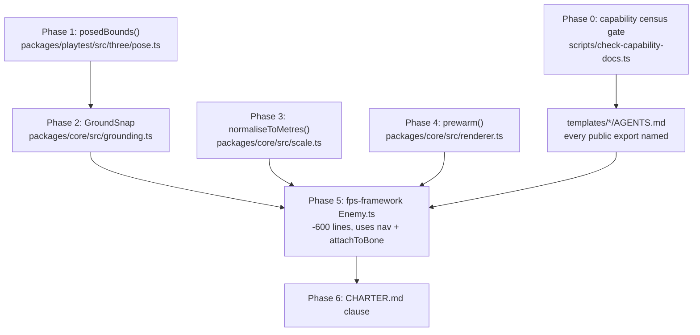

# PRD-156: Engine ships conventions by default

**Date:** 2026-08-18
**Status:** PROPOSED — nothing here has run
**Proving ground:** `~/projects/threenative/sandbox/fps-framework` (a real scaffolded game)

**Complexity: 9 → HIGH mode** (10+ files `+3`, new module from scratch `+2`, multi-package
`+2`, skinned-animation state logic `+2`). Mandatory checkpoint after every phase.

---

## 1. Context

**Problem:** When a game needed the ordinary shape of a shooter — a skinned enemy that walks a
level, holds a weapon, and dies — the agent wrote roughly 700 lines that the engine either
already shipped or should have. Two of those hand-rolled systems then produced a **9 FPS game
with no death animation**, and every gate in the project stayed green.

**This is not a hypothetical.** It is a measured incident, repaired on 2026-08-18. This PRD
exists to make the repair structural instead of local.

### The incident

`fps-framework/src/entities/Enemy.ts` grounded its soldier by calling
`measureThreePose(group, { bounds })` **three times per frame**. That helper takes the
*precise* `Box3` path, which runs `SkinnedMesh.applyBoneTransform` on every vertex — four
matrix multiplies each.

| Measurement | Observed |
|---|---|
| `applyBoneTransform` self-time, 5 s CPU profile | **2 433 ms** |
| Total precise-bounds cost in that window | **~4.2 s of 5 s** |
| Frame rate, before | **9.4 FPS** (median 106.6 ms) |
| Frame rate, after the game-side repair | **60.2 FPS** (median 16.6 ms) |

The same commit chain also froze the death animation: `Enemy.update()` never called
`#animation.update(dt)` while dead, because the `death-no-snap` scenario asserted
`deathAnkleDelta <= 0.02` and **a corpse that never moves passes that trivially**. The gate
went green by deleting the feature it was written to protect.

Both defects are the failure `AGENTS.md` already names — *"an engine bug wearing a game-code
costume"*, and *"each such workaround is a line the user has to write that the framework
promised to ship."* The rule is written down. Nothing ships it.

### Files analysed

Engine: `packages/core/src/index.ts`, `packages/core/src/skeleton.ts`,
`packages/core/src/animation.ts`, `packages/core/src/renderer.ts`,
`packages/physics/src/index.ts`, `packages/physics/src/navigation/index.ts`,
`packages/physics/package.json`, `packages/playtest/src/three/pose.ts`,
`packages/create-threenative/templates/*/AGENTS.md`, `AGENTS.md`.

Game: `src/entities/Enemy.ts` (1 419 lines), `src/entities/Rifle.ts`, `src/entities/FpsPlayer.ts`,
`src/scenes/Play.ts`, `src/render/scale.ts`, `src/render/tracers.ts`, `tools/scale-audit.mjs`,
`playtests/*.json`, `node_modules/@threenative/{core,physics}/`.

---

## 2. The finding: a capability census

Every row was verified against the **installed** packages in `fps-framework`, not against
engine source. "Reachable" means the game could have written the import that day.

| Capability | Ships in engine | Reachable from the game | In any template `AGENTS.md` | What the game wrote instead |
|---|---|---|---|---|
| Navigation (`recast()`, `NavigationAgent3D`, `NavigationRegion3D`, `NavigationObstacle3D`) | ✅ `packages/physics/src/navigation/` | ✅ `@threenative/physics/navigation`, v0.2.1, subpath export present | ❌ **0 of 7** | **206 lines** of grid A* — `Enemy.ts:725-930` |
| Bone attachment (`attachToBone`, `skeletonBones`) | ✅ `packages/core/src/skeleton.ts` | ✅ main export of `@threenative/core` | ❌ **0 of 7** | **240 lines** of weapon socket + per-clip pose recipe — `Enemy.ts:56-140`, `394-548` |
| `PathFollow3D` | ✅ | ✅ | ⚠️ 2 of 7 | n/a |
| `AudioBus`, `CanvasLayer`, `GPUParticles3D`, `ScenePicker` | ✅ | ✅ | ❌ **0 of 7** | not used |
| **Skinned-model grounding** | ❌ **gap** | — | — | **129 lines** — `Enemy.ts:549-677`; caused the 9 FPS |
| **Asset scale normalisation** | ❌ **gap** | — | — | `src/render/scale.ts` (171 lines) + `tools/scale-audit.mjs` (367 lines, 34 checks) |
| **GPU pipeline prewarm** | ❌ **gap** | — | — | rediscovered at **6 sites**; comment at `Rifle.ts:131` records *"measured at up to a 1.2 s freeze on the first shot"* |
| Cheap posed bounds | ❌ **footgun** | `measureThreePose` is precise-only | — | the 9 FPS |

### Root cause

`packages/create-threenative/templates/minimal/AGENTS.md:161` and
`templates/starter/AGENTS.md:162` both state:

> *"they are **properties on `ctx`, never imports** — grepping an existing file's imports will
> never surface them. This table is the complete list."*

The table lists six entries. The engine's public surface is roughly twenty. An agent that
trusts that sentence — and it is written to be trusted — **cannot discover navigation or bone
attachment**, and will write them by hand. That is exactly what happened.

**So the defect is not missing code. It is a convention surface that is not reachable by
default.** Shipping `GroundSnap` without fixing that produces one more capability nobody finds.

---

## 3. Charter clause

Add to `docs/architecture/CHARTER.md`, and restate in `AGENTS.md` under *What this is*:

> ### Engine ships conventions by default
>
> If a behaviour is the ordinary, expected answer for its situation — a character's feet meet
> the floor, a weapon stays in the hand that holds it, an agent walks around a wall, one metre
> is one metre — **the engine ships it working, on, and discoverable, before any game asks.**
> The game's agent should reach that behaviour by doing nothing.
>
> **Every convention carries a range, not a mandate.** A convention that cannot be turned off
> is a cage, and a game that has to fork the engine to differ has been failed twice. Each one
> ships with:
>
> 1. **A default that is correct for the ordinary case** — on, with no option passed.
> 2. **A named override on the same object** — a documented field or option, never a fork, a
>    patch, or a reimplementation. `grounded = false` is the convention working; a game
>    rewriting grounding is the convention failing.
> 3. **Honest reporting when overridden** — turning a convention off must not turn its
>    measurement off. A body that is deliberately airborne still reports its real clearance.
>
> **A convention that is not in the templates' `AGENTS.md` does not exist.** The agent's field
> of view is that file. Shipping a capability the doc omits is shipping nothing, and is a
> release defect, not a docs chore.

---

## 4. Solution

**Approach**

- Close the discoverability hole first, with a **gate**, not a doc edit. A doc edit rots by the
  next release; a gate that fails when a public export is undocumented does not.
- Fix the engine footgun that caused the incident: give `measureThreePose` a cheap posed-bounds
  mode so the correct call is also the fast one.
- Ship the three genuine gaps into `packages/core/`, each with an override per the charter clause.
- **Prove all of it by deleting the game's hand-rolled code**, not by adding an example. If
  `fps-framework/src/entities/Enemy.ts` does not shrink by ~600 lines, nothing was integrated.



**Key decisions**

- [ ] **`GroundSnap` lives in `packages/core/src/`, never on `CharacterBody3D`.** `CharacterBody3D`
      options already carry `snapToGround?: number` → Rapier's `enableSnapToGround(distance)`,
      which glues a **collider** to a surface during `moveAndSlide`. `GroundSnap` moves the
      **rendered model** so its lowest posed skin point meets the deck. Two different things one
      metre apart; sharing the name would be a permanent trap. It also cannot live in physics:
      it reads `SkinnedMesh` vertex and bone data, and physics stays backend-neutral for native.
- [ ] **Navigation is not rebuilt.** It exists and works. The only navigation work here is making
      it discoverable and proving a game consumes it.
- [ ] **The override name is `enabled`** on every convention object, defaulting `true`.
- [ ] **The proving subject is `fps-framework`**, not a new example. It is the real production
      subject: skinned enemy, weapon socket, A* nav, death sequence, 12 playtest scenarios,
      34 scale checks. A fresh example would exercise none of the hard requirements.

**Data changes:** None.

---

## 5. Integration Ledger

Fill every `TBD` with a real non-test `file:line` during implementation. A `TBD` at phase end
means the phase is **not** complete.

| # | New thing | Live caller (`file:line`, non-test) | Replaces | Old path removed? | Negative control |
|---|---|---|---|---|---|
| 1 | `scripts/check-capability-docs.ts` | TBD — `package.json` `budgets` script | nothing (new gate) | n/a | delete one capability line from a template `AGENTS.md` → gate goes red |
| 2 | `posedBounds()` in `packages/playtest/src/three/pose.ts` | TBD — `packages/core/src/grounding.ts` | precise-only `measureThreePose` bounds path | `measureThreePose` keeps precise mode, now documented as slow | feed a posed skeleton; result must differ from bind-pose `Box3` |
| 3 | `GroundSnap` in `packages/core/src/grounding.ts` | TBD — `fps-framework/src/entities/Enemy.ts` | `Enemy.ts:549-677` (129 lines) | deleted in Phase 5 | `enabled = false` → `enemy-foot-contact` goes red |
| 4 | `normaliseToMetres()` in `packages/core/src/scale.ts` | TBD — `fps-framework/src/entities/Enemy.ts` constructor | `fps-framework/src/render/scale.ts:68,81` | delegates in Phase 5 | pass a 2× model; assert measured height changes |
| 5 | `prewarm()` in `packages/core/src/renderer.ts` | TBD — `fps-framework/src/render/tracers.ts` | 6 hand-written prewarm sites | delegates in Phase 5 | skip prewarm → first-shot frame exceeds 25 ms |
| 6 | `@threenative/physics/navigation` consumed | TBD — `fps-framework/src/entities/Enemy.ts` | `Enemy.ts:725-930` (206 lines) | deleted in Phase 5 | `enemy-reaches-walkway` goes red if the agent is not stepped |
| 7 | `attachToBone` consumed | TBD — `fps-framework/src/entities/Enemy.ts` | `Enemy.ts:56-140`, `394-548` (240 lines) | deleted in Phase 5 | weapon detaches from the hand; `enemy-scale` rifle-length check goes red |
| 8 | Charter clause | TBD — `AGENTS.md` restatement | nothing | n/a | n/a (doc) |

### Reachability

**How will this feature be reached?**
- Entry point: `pnpm budgets` (Phase 0 gate), and the per-frame `update()` of a scaffolded
  game's entity (Phases 2-5).
- Pre-existing files EDITED to call it: `package.json` (root), `packages/core/src/index.ts`,
  `packages/playtest/src/three/pose.ts`, `packages/create-threenative/templates/*/AGENTS.md`,
  `fps-framework/src/entities/Enemy.ts`.
- Registration: new exports added to `packages/core/src/index.ts`; new gate added to the
  `budgets` script chain and to CI's `build → budgets` branch.

**Is this user-facing?** No UI. It is agent-facing: the observable outcome is that a scaffolded
game's agent finds and uses the convention instead of writing it.

**Full flow:**
1. Agent scaffolds a game and reads `AGENTS.md`.
2. The capability table now lists `GroundSnap`, navigation, `attachToBone`, `normaliseToMetres`,
   `prewarm` — because Phase 0's gate fails the build if it does not.
3. Agent writes `new GroundSnap(model)` instead of 129 lines.
4. Observable in: the character's feet touch the floor at 60 FPS, on the first try.

**What does this replace?** ~600 lines of `fps-framework/src/entities/Enemy.ts`, deleted in
Phase 5. See ledger rows 3, 6, 7.

---

## 6. Execution phases

### Phase 0: Capability census gate — an undocumented public export fails the build

**Files (max 5):**
- `scripts/check-capability-docs.ts` — NEW: the gate
- `package.json` — EDIT: add to the `budgets` script chain
- `packages/create-threenative/templates/minimal/AGENTS.md` — EDIT: the omissions + delete the
  false "This table is the complete list" claim at line 161
- `packages/create-threenative/templates/starter/AGENTS.md` — EDIT: same, line 162
- `scripts/__tests__/check-capability-docs.spec.ts` — NEW

**Implementation:**
- [ ] Read the public export list from `packages/core/src/index.ts`, `packages/physics/src/index.ts`,
      and every subpath in each package's `exports` map (this is how `@threenative/physics/navigation`
      is caught — it is a subpath, and subpaths are exactly what agents miss).
- [ ] For each exported **class or function** name, require a literal mention in every
      `packages/create-threenative/templates/*/AGENTS.md`.
- [ ] Maintain an explicit `INTERNAL` allowlist in the script for exports genuinely not meant for
      game authors. Each entry needs a one-line reason. **An empty reason fails the gate** — this
      is the escape hatch, and it must cost something to use.
- [ ] Report every miss with package, symbol, and the template files missing it. Exit 1.
- [ ] Update the two false "complete list" sentences to name what the table actually covers
      (`ctx` properties) and point at the full capability table.

**Wiring:**
- [ ] Caller edited: root `package.json` `budgets` script invokes the new gate
- [ ] Registration: CI's existing `build → budgets` branch picks it up with no workflow edit
- [ ] Old path: n/a — new gate
- [ ] Ledger rows filled: #1

**Tests Required:**
| Test File | Test Name | Assertion | Negative control (must be observed red) |
|---|---|---|---|
| `scripts/__tests__/check-capability-docs.spec.ts` | `should fail when a public export is missing from a template doc` | exit code 1, message names the symbol | run the gate on the **current** `main` — it MUST report `NavigationAgent3D`, `attachToBone`, `skeletonBones`, `AudioBus`, `CanvasLayer`, `GPUParticles3D`, `ScenePicker`. If it passes on today's tree, the gate measures nothing. |
| same | `should fail when an INTERNAL allowlist entry has an empty reason` | exit code 1 | give an entry a reason → passes |
| same | `should scan subpath exports, not only the main index` | `@threenative/physics/navigation` symbols appear in the scan set | delete the subpath-walking branch → `NavigationAgent3D` disappears from the scan and the gate passes wrongly |

> **Run this gate against the unmodified repository before writing the doc fixes.** Paste its
> output into the PRD. That output is the proof the problem exists; a gate that is green on
> arrival is measuring nothing.

### Recorded pre-change output

The capability gate was run on the unmodified repository before the template documentation was
repaired:

```text
Command: pnpm tsx scripts/check-capability-docs.ts
Exit: 1

CAPABILITY_DOCS_MISSING: 30 public class/function exports are undocumented
- @threenative/core/hot: acceptHotUpdate; missing from packages/create-threenative/templates/action-rpg/AGENTS.md, packages/create-threenative/templates/defense/AGENTS.md, packages/create-threenative/templates/racing/AGENTS.md, packages/create-threenative/templates/shooter/AGENTS.md
- @threenative/core: AnimationPlayer; missing from packages/create-threenative/templates/action-rpg/AGENTS.md, packages/create-threenative/templates/defense/AGENTS.md, packages/create-threenative/templates/racing/AGENTS.md, packages/create-threenative/templates/shooter/AGENTS.md
- @threenative/core: attachToBone; missing from packages/create-threenative/templates/action-rpg/AGENTS.md, packages/create-threenative/templates/defense/AGENTS.md, packages/create-threenative/templates/minimal/AGENTS.md, packages/create-threenative/templates/platformer/AGENTS.md, packages/create-threenative/templates/racing/AGENTS.md, packages/create-threenative/templates/shooter/AGENTS.md
- @threenative/core: AudioBus; missing from packages/create-threenative/templates/action-rpg/AGENTS.md, packages/create-threenative/templates/defense/AGENTS.md, packages/create-threenative/templates/minimal/AGENTS.md, packages/create-threenative/templates/platformer/AGENTS.md, packages/create-threenative/templates/racing/AGENTS.md, packages/create-threenative/templates/shooter/AGENTS.md, packages/create-threenative/templates/starter/AGENTS.md
- @threenative/core: CanvasLayer; missing from packages/create-threenative/templates/action-rpg/AGENTS.md, packages/create-threenative/templates/defense/AGENTS.md, packages/create-threenative/templates/minimal/AGENTS.md, packages/create-threenative/templates/platformer/AGENTS.md, packages/create-threenative/templates/racing/AGENTS.md, packages/create-threenative/templates/shooter/AGENTS.md, packages/create-threenative/templates/starter/AGENTS.md
- @threenative/core: createRandom; missing from packages/create-threenative/templates/action-rpg/AGENTS.md, packages/create-threenative/templates/defense/AGENTS.md, packages/create-threenative/templates/minimal/AGENTS.md, packages/create-threenative/templates/platformer/AGENTS.md, packages/create-threenative/templates/racing/AGENTS.md, packages/create-threenative/templates/shooter/AGENTS.md, packages/create-threenative/templates/starter/AGENTS.md
- @threenative/core: createReplayDriver; missing from packages/create-threenative/templates/action-rpg/AGENTS.md, packages/create-threenative/templates/defense/AGENTS.md, packages/create-threenative/templates/minimal/AGENTS.md, packages/create-threenative/templates/platformer/AGENTS.md, packages/create-threenative/templates/racing/AGENTS.md, packages/create-threenative/templates/shooter/AGENTS.md, packages/create-threenative/templates/starter/AGENTS.md
- @threenative/core: defineGame; missing from packages/create-threenative/templates/action-rpg/AGENTS.md, packages/create-threenative/templates/defense/AGENTS.md, packages/create-threenative/templates/racing/AGENTS.md, packages/create-threenative/templates/shooter/AGENTS.md
- @threenative/core: GPUParticles3D; missing from packages/create-threenative/templates/action-rpg/AGENTS.md, packages/create-threenative/templates/defense/AGENTS.md, packages/create-threenative/templates/minimal/AGENTS.md, packages/create-threenative/templates/platformer/AGENTS.md, packages/create-threenative/templates/racing/AGENTS.md, packages/create-threenative/templates/shooter/AGENTS.md, packages/create-threenative/templates/starter/AGENTS.md
- @threenative/core: GroundSnap; missing from packages/create-threenative/templates/action-rpg/AGENTS.md, packages/create-threenative/templates/defense/AGENTS.md, packages/create-threenative/templates/minimal/AGENTS.md, packages/create-threenative/templates/platformer/AGENTS.md, packages/create-threenative/templates/racing/AGENTS.md, packages/create-threenative/templates/shooter/AGENTS.md
- @threenative/core: normaliseToMetres; missing from packages/create-threenative/templates/action-rpg/AGENTS.md, packages/create-threenative/templates/defense/AGENTS.md, packages/create-threenative/templates/minimal/AGENTS.md, packages/create-threenative/templates/platformer/AGENTS.md, packages/create-threenative/templates/racing/AGENTS.md, packages/create-threenative/templates/shooter/AGENTS.md
- @threenative/core: PathFollow3D; missing from packages/create-threenative/templates/action-rpg/AGENTS.md, packages/create-threenative/templates/minimal/AGENTS.md, packages/create-threenative/templates/platformer/AGENTS.md, packages/create-threenative/templates/shooter/AGENTS.md, packages/create-threenative/templates/starter/AGENTS.md
- @threenative/core: prewarm; missing from packages/create-threenative/templates/action-rpg/AGENTS.md, packages/create-threenative/templates/defense/AGENTS.md, packages/create-threenative/templates/minimal/AGENTS.md, packages/create-threenative/templates/platformer/AGENTS.md, packages/create-threenative/templates/racing/AGENTS.md, packages/create-threenative/templates/shooter/AGENTS.md
- @threenative/core: replay; missing from packages/create-threenative/templates/action-rpg/AGENTS.md, packages/create-threenative/templates/defense/AGENTS.md, packages/create-threenative/templates/platformer/AGENTS.md, packages/create-threenative/templates/racing/AGENTS.md, packages/create-threenative/templates/shooter/AGENTS.md
- @threenative/core: Scene; missing from packages/create-threenative/templates/action-rpg/AGENTS.md, packages/create-threenative/templates/defense/AGENTS.md, packages/create-threenative/templates/racing/AGENTS.md, packages/create-threenative/templates/shooter/AGENTS.md
- @threenative/core: ScenePicker; missing from packages/create-threenative/templates/action-rpg/AGENTS.md, packages/create-threenative/templates/defense/AGENTS.md, packages/create-threenative/templates/minimal/AGENTS.md, packages/create-threenative/templates/platformer/AGENTS.md, packages/create-threenative/templates/racing/AGENTS.md, packages/create-threenative/templates/shooter/AGENTS.md, packages/create-threenative/templates/starter/AGENTS.md
- @threenative/core: Scheduler; missing from packages/create-threenative/templates/action-rpg/AGENTS.md, packages/create-threenative/templates/defense/AGENTS.md, packages/create-threenative/templates/minimal/AGENTS.md, packages/create-threenative/templates/platformer/AGENTS.md, packages/create-threenative/templates/racing/AGENTS.md, packages/create-threenative/templates/shooter/AGENTS.md, packages/create-threenative/templates/starter/AGENTS.md
- @threenative/core: skeletonBones; missing from packages/create-threenative/templates/action-rpg/AGENTS.md, packages/create-threenative/templates/defense/AGENTS.md, packages/create-threenative/templates/minimal/AGENTS.md, packages/create-threenative/templates/platformer/AGENTS.md, packages/create-threenative/templates/racing/AGENTS.md, packages/create-threenative/templates/shooter/AGENTS.md
- @threenative/physics/navigation: NavigationAgent3D; missing from packages/create-threenative/templates/action-rpg/AGENTS.md, packages/create-threenative/templates/defense/AGENTS.md, packages/create-threenative/templates/minimal/AGENTS.md, packages/create-threenative/templates/platformer/AGENTS.md, packages/create-threenative/templates/racing/AGENTS.md, packages/create-threenative/templates/shooter/AGENTS.md
- @threenative/physics/navigation: NavigationObstacle3D; missing from packages/create-threenative/templates/action-rpg/AGENTS.md, packages/create-threenative/templates/defense/AGENTS.md, packages/create-threenative/templates/minimal/AGENTS.md, packages/create-threenative/templates/platformer/AGENTS.md, packages/create-threenative/templates/racing/AGENTS.md, packages/create-threenative/templates/shooter/AGENTS.md
- @threenative/physics/navigation: NavigationRegion3D; missing from packages/create-threenative/templates/action-rpg/AGENTS.md, packages/create-threenative/templates/defense/AGENTS.md, packages/create-threenative/templates/minimal/AGENTS.md, packages/create-threenative/templates/platformer/AGENTS.md, packages/create-threenative/templates/racing/AGENTS.md, packages/create-threenative/templates/shooter/AGENTS.md
- @threenative/physics/navigation: recast; missing from packages/create-threenative/templates/action-rpg/AGENTS.md, packages/create-threenative/templates/defense/AGENTS.md, packages/create-threenative/templates/minimal/AGENTS.md, packages/create-threenative/templates/platformer/AGENTS.md, packages/create-threenative/templates/racing/AGENTS.md, packages/create-threenative/templates/shooter/AGENTS.md
- @threenative/physics: Area3D; missing from packages/create-threenative/templates/action-rpg/AGENTS.md, packages/create-threenative/templates/defense/AGENTS.md, packages/create-threenative/templates/shooter/AGENTS.md
- @threenative/physics: CharacterBody3D; missing from packages/create-threenative/templates/defense/AGENTS.md
- @threenative/physics: CollisionShape3D; missing from packages/create-threenative/templates/action-rpg/AGENTS.md, packages/create-threenative/templates/defense/AGENTS.md, packages/create-threenative/templates/racing/AGENTS.md, packages/create-threenative/templates/shooter/AGENTS.md
- @threenative/physics: interactionGroups; missing from packages/create-threenative/templates/action-rpg/AGENTS.md, packages/create-threenative/templates/defense/AGENTS.md, packages/create-threenative/templates/minimal/AGENTS.md, packages/create-threenative/templates/platformer/AGENTS.md, packages/create-threenative/templates/racing/AGENTS.md, packages/create-threenative/templates/shooter/AGENTS.md, packages/create-threenative/templates/starter/AGENTS.md
- @threenative/physics: Joint3D; missing from packages/create-threenative/templates/action-rpg/AGENTS.md, packages/create-threenative/templates/defense/AGENTS.md, packages/create-threenative/templates/minimal/AGENTS.md, packages/create-threenative/templates/platformer/AGENTS.md, packages/create-threenative/templates/racing/AGENTS.md, packages/create-threenative/templates/shooter/AGENTS.md, packages/create-threenative/templates/starter/AGENTS.md
- @threenative/physics: PhysicsDirectSpaceState3D; missing from packages/create-threenative/templates/action-rpg/AGENTS.md, packages/create-threenative/templates/defense/AGENTS.md, packages/create-threenative/templates/minimal/AGENTS.md, packages/create-threenative/templates/platformer/AGENTS.md, packages/create-threenative/templates/racing/AGENTS.md, packages/create-threenative/templates/shooter/AGENTS.md, packages/create-threenative/templates/starter/AGENTS.md
- @threenative/physics: rapier; missing from packages/create-threenative/templates/action-rpg/AGENTS.md, packages/create-threenative/templates/defense/AGENTS.md, packages/create-threenative/templates/minimal/AGENTS.md, packages/create-threenative/templates/platformer/AGENTS.md, packages/create-threenative/templates/racing/AGENTS.md, packages/create-threenative/templates/shooter/AGENTS.md, packages/create-threenative/templates/starter/AGENTS.md
- @threenative/physics: RigidBody3D; missing from packages/create-threenative/templates/action-rpg/AGENTS.md, packages/create-threenative/templates/defense/AGENTS.md, packages/create-threenative/templates/racing/AGENTS.md, packages/create-threenative/templates/shooter/AGENTS.md
```

**Revert check:** delete the gate from `package.json` → the capability-doc spec fails.

**User Verification:**
- Action: `pnpm budgets`
- Expected: before doc fixes, fails naming ≥7 undocumented symbols; after, passes.

---

### Phase 1: `posedBounds()` — the cheap measurement that should have existed

**Files:**
- `packages/playtest/src/three/pose.ts` — EDIT: add `posedBounds()`; document `measureThreePose`'s
  precise path as O(vertices × 4 matrix multiplies)
- `packages/playtest/src/three/index.ts` — EDIT: export it
- `packages/playtest/__tests__/posed-bounds.spec.ts` — NEW

**Implementation:**
- [ ] `posedBounds(root, meshes)` returns `{ min, max, size }` from a **skin envelope**: one
      sphere per bone, radius = furthest skin vertex that bone dominates, measured **once** at
      construction; per-frame cost is O(bones) with zero allocation.
- [ ] Calibrate a single bias term at construction so the envelope agrees **exactly** with the
      precise `Box3` in the bind pose.
- [ ] Read bone world Y from `bone.matrixWorld.elements[13]` — never `getWorldPosition()`, which
      allocates per bone per frame.
- [ ] Handle non-skinned child meshes with a static bounding sphere around their own origin.
- [ ] Add a doc comment on `measureThreePose`'s `bounds` option stating plainly: *"precise; walks
      every vertex; do not call this in a frame loop — see `posedBounds`."*

**Wiring:**
- [ ] Caller edited: `packages/playtest/src/three/index.ts` exports it; Phase 2's
      `grounding.ts` is the first live consumer
- [ ] Ledger rows filled: #2

**Tests Required:**
| Test File | Test Name | Assertion | Negative control |
|---|---|---|---|
| `posed-bounds.spec.ts` | `should track the posed skeleton, not the bind pose` | rotate a bone 90°; `posedBounds` min differs from the bind-pose `Box3` min by > 0.05 | use non-precise `expandByObject` → result does NOT change; test goes red |
| same | `should agree with the precise measurement within 2 cm across an animation` | sample 30 frames; `abs(posedBounds.min.y - preciseBox3.min.y) <= 0.02` | zero the calibration bias → error exceeds 2 cm |
| same | `should allocate nothing per call` | call 1 000×; heap delta below threshold | swap in `getWorldPosition()` → allocation count rises |

**Reference measurement (already observed on the real asset):** max envelope error **0.014 m**
across 60 samples of a walking 1.78 m soldier. The 2 cm assertion is that number with headroom.

**Revert check:** remove `posedBounds` → Phase 2's grounding spec fails to compile.

---

### Phase 2: `GroundSnap` — feet meet the floor, by default, with an off switch

**Files:**
- `packages/core/src/grounding.ts` — NEW
- `packages/core/src/index.ts` — EDIT: export `GroundSnap`, `IGroundSnapOptions`
- `packages/core/__tests__/grounding.spec.ts` — NEW
- `packages/create-threenative/templates/starter/AGENTS.md` — EDIT: document it

**Implementation:**
- [ ] `class GroundSnap { constructor(model: Object3D, options?: IGroundSnapOptions) }`.
- [ ] `enabled = true` — the charter override. When `false`, **still measure and still report**;
      apply no correction.
- [ ] `apply(group: Object3D, surfaceY: number, dt: number): void` — moves `group.position.y` so
      the lowest posed point rests on `surfaceY`.
- [ ] `clearance: number | null` — the real height above the surface, populated whether or not
      `enabled`.
- [ ] `maxRate?: number` (metres/second) — when set, the correction is damped. Leave unset while
      an authored fall clip is playing, or the body hovers above its own pose; set it once the
      clip ends so a resting body cannot twitch.
- [ ] Uses `posedBounds` from Phase 1. **Must not** call `measureThreePose` per frame.
- [ ] `audit(): number | null` — signed error against a real precise measurement, returning `null`
      unless explicitly requested. This is how a game proves its grounding metric is not agreeing
      with itself.

**Wiring:**
- [ ] Caller edited: `packages/core/src/index.ts`
- [ ] Registration: named in `templates/starter/AGENTS.md` capability table (Phase 0's gate
      enforces this — it will fail the build otherwise)
- [ ] Old path: `fps-framework/src/entities/Enemy.ts:549-677` deleted in Phase 5
- [ ] Ledger rows filled: #3

**Tests Required:**
| Test File | Test Name | Assertion | Negative control |
|---|---|---|---|
| `grounding.spec.ts` | `should rest the lowest posed point on the surface` | after `apply()`, `clearance <= 0.005` | `enabled = false` → clearance stays at the authored offset |
| same | `should keep reporting clearance when disabled` | `enabled = false`; `clearance` is a number, not `null` | return `null` when disabled → test goes red |
| same | `should not exceed maxRate when damping` | per-frame delta `<= maxRate * dt` | remove the clamp → delta exceeds |
| same | `should track a falling animation without hovering` | play a fall clip with `maxRate` unset; clearance stays `<= 0.02` every frame | set `maxRate = 0.01` → the body hovers, clearance exceeds 0.02 |

**Revert check:** rename `GroundSnap` → `fps-framework`'s `enemy-foot-contact` scenario fails.

**Manual checkpoint (HIGH, performance-sensitive):** capture a 5 s CPU profile of a scaffolded
game with a skinned character. `applyBoneTransform` must not appear in the top 10 self-time
frames. Paste the profile.

---

### Phase 3: `normaliseToMetres()` — one metre is one metre

**Files:**
- `packages/core/src/scale.ts` — NEW
- `packages/core/src/index.ts` — EDIT: export
- `packages/core/__tests__/scale.spec.ts` — NEW
- `packages/create-threenative/templates/starter/AGENTS.md` — EDIT

**Implementation:**
- [ ] Port `normaliseHeight` and `normaliseLongestAxis` from `fps-framework/src/render/scale.ts:68,81`.
- [ ] `normaliseToMetres(object, { metres, axis, top? })` — one entry point, `axis` selects
      `"height" | "longest"`. Returns the applied scale factor.
- [ ] For a skinned model, height must be measured from the **crown bone**, not a `Box3`: a
      `Box3` over a skinned mesh reports the bind pose transformed by the world matrix, which is
      how a 2.68 m soldier once stood beside a 1.66 m player with no gate noticing.
- [ ] **Do not port** `SCALE_EXPECTATIONS` or `tools/scale-audit.mjs`. Those encode one game's
      subject matter (target plates, jersey barriers). The primitive is engine work; the table of
      what a barricade should measure is game work. Say so in the doc entry.

**Wiring:**
- [ ] Caller edited: `packages/core/src/index.ts`; `fps-framework/src/render/scale.ts` delegates
      in Phase 5
- [ ] Ledger rows filled: #4

**Tests Required:**
| Test File | Test Name | Assertion | Negative control |
|---|---|---|---|
| `scale.spec.ts` | `should normalise a skinned model by its crown bone, not its bind-pose box` | pose the model so the bind box is wrong by > 20%; measured height still within 1% of target | measure with `Box3` instead → error exceeds 20% |
| same | `should return the applied factor` | 2× model → returns ~0.5 | return `1` unconditionally → red |

**Revert check:** remove the export → `fps-framework/src/render/scale.ts` fails to compile.

---

### Phase 4: `prewarm()` — no first-use pipeline stall

**Files:**
- `packages/core/src/renderer.ts` — EDIT: add and export `prewarm()`
- `packages/core/src/index.ts` — EDIT: export
- `packages/core/__tests__/prewarm.spec.ts` — NEW
- `packages/create-threenative/templates/starter/AGENTS.md` — EDIT

**Implementation:**
- [ ] `prewarm(object: Object3D | Object3D[]): void` — makes each mesh present in the render list
      at zero opacity so WebGPU compiles its pipeline during load.
- [ ] Document the rule it encodes, because six sites in one game rediscovered it: **never toggle
      `.visible` to hide a transient effect; keep it in the scene and drive `material.opacity`.**
      Same for lights — drive `intensity`, never `visible`. `fps-framework/src/entities/Rifle.ts:131`
      records the measured cost of getting this wrong: *up to a 1.2 s freeze on the first shot.*
- [ ] The doc entry must state the symptom plainly, since it is always misdiagnosed as a game bug:
      *one long frame the first time an effect appears, never again that session.*

**Wiring:**
- [ ] Caller edited: `packages/core/src/index.ts`; `fps-framework/src/render/tracers.ts` in Phase 5
- [ ] Ledger rows filled: #5

**Tests Required:**
| Test File | Test Name | Assertion | Negative control |
|---|---|---|---|
| `prewarm.spec.ts` | `should leave the mesh visible with zero opacity` | `mesh.visible === true && material.opacity === 0` | set `visible = false` instead → red |
| same | `should mark transparent so the material compiles its blended pipeline` | `material.transparent === true` | drop the flag → red |

**Manual checkpoint (HIGH, performance-sensitive):** measured on the real game — worst frame in
the 600 ms after the first shot must be **< 25 ms**. Reference: 30 ms before the fix, 17.6 ms after.

**Revert check:** remove `prewarm` from `tracers.ts` → the first-shot frame-time scenario fails.

---

### Phase 5: Delete the hand-rolled systems from `fps-framework`

**This is the phase that proves every phase above. If `Enemy.ts` does not shrink, nothing was
integrated and the PRD is not done.**

**Files:**
- `fps-framework/src/entities/Enemy.ts` — EDIT: **−~600 lines**
- `fps-framework/src/render/scale.ts` — EDIT: delegate to `normaliseToMetres`
- `fps-framework/src/render/tracers.ts` — EDIT: delegate to `prewarm`
- `fps-framework/src/scenes/Play.ts` — EDIT: register the navigation region
- `fps-framework/playtests/enemy-uses-engine-nav.playtest.json` — NEW

**Implementation:**
- [ ] Replace `Enemy.ts:725-930` (`#occupied`, `#blocked`, `#navBlocked`, `#segmentClear`,
      `#findPath`, `#beginPursuit`, `#step`, `#turn`) with `NavigationAgent3D` from
      `@threenative/physics/navigation`. Add `recast()` to the plugins array in `src/game.ts`
      **after** `rapier()` — `recast()` throws if it runs first.
- [ ] Build a `NavigationRegion3D` from the range geometry in `src/render/range.ts`. This also
      closes a standing defect: the hand-rolled nav treated the walkway deck 3.3 m overhead as
      ground-blocking, making a ~9 × 6 m region of the yard unreachable.
- [ ] Replace `Enemy.ts:56-140` + `394-548` (`WeaponRecipe`, `weaponPose`, `weaponTrack`,
      `interpolateWeaponPose`, `#equip`, `#alignWeaponGrip`, `#measureRenderedWeapon`,
      `#normaliseWeapon`) with `attachToBone(model, "mixamorigRightHand", weapon)` plus
      `normaliseToMetres`.
- [ ] Replace `Enemy.ts:549-677` with a `GroundSnap` instance. `Enemy.groundSnap` becomes a
      delegating accessor over `GroundSnap.enabled` — **not a second flag**.
- [ ] Delete `findBone()` in favour of `skeletonBones()`.

**Wiring:**
- [ ] Callers edited: all four game files above
- [ ] Old path: **deleted**, not left beside the new one
- [ ] Ledger rows filled: #3, #4, #5, #6, #7

**Tests Required:**
| Test File | Test Name | Assertion | Negative control |
|---|---|---|---|
| `playtests/enemy-uses-engine-nav.playtest.json` | enemy reaches a goal behind a wall | `enemy.position` within 1.0 m of goal within 600 ticks | remove the `NavigationRegion3D` → agent walks into the wall, scenario red |
| existing `enemy-foot-contact` | unchanged | `footClearance <= 0.03` | `GroundSnap.enabled = false` → red |
| existing `death-no-snap` | unchanged | `deathAnkleDelta <= 0.02` **and** `deathClipFrames >= 30` | freeze the animation → `deathClipFrames` red (this is the gate that was gamed; it must stay honest) |
| existing `enemy-scale` | unchanged | rifle length within tolerance | break `attachToBone` → red |

**Integration proof (paste the raw output, do not summarise):**
```bash
# 1. Enemy.ts actually shrank
git -C ~/projects/threenative/sandbox wc -l fps-framework/src/entities/Enemy.ts
# Expected: < 850 lines (was 1419)

# 2. The hand-rolled systems are gone, not parked
grep -nE "#findPath|#occupied|interpolateWeaponPose|#calibrateSkinEnvelope" \
  fps-framework/src/entities/Enemy.ts
# Expected: no output

# 3. The engine conventions are live callers
grep -n "NavigationAgent3D\|attachToBone\|GroundSnap\|normaliseToMetres\|prewarm" \
  fps-framework/src/ -r
# Expected: hits in Enemy.ts, Play.ts, scale.ts, tracers.ts

# 4. Frame rate held
node fps-probe.mjs http://127.0.0.1:5184/
# Expected: idle median <= 17 ms; first-shot worst < 25 ms
```

**Revert check:** revert `Enemy.ts` to the hand-rolled version → the new
`enemy-uses-engine-nav` scenario fails and the `GroundSnap` caller census returns zero hits.

**Manual checkpoint required** (visual + performance): boot the game, watch the soldier path
around the barricade, kill it, watch the fall play out and the body settle. Screenshot each.

---

### Phase 6: Charter clause

**Files:**
- `docs/architecture/CHARTER.md` — EDIT: add the clause from §3
- `AGENTS.md` — EDIT: restate under *What this is*, in plain clauses, no section citation
- `packages/create-threenative/templates/*/AGENTS.md` — EDIT: `pnpm sync:agents` regenerates mirrors

**Implementation:**
- [ ] Add the clause verbatim from §3 of this PRD.
- [ ] Run `pnpm sync:agents` and commit the regenerated `CLAUDE.md` mirrors.
- [ ] Per the repo's own rule: name `CHARTER.md` at most once, never with a section number.

**Wiring:**
- [ ] Caller edited: `AGENTS.md`
- [ ] Registration: `pnpm sync:agents --check` in CI already enforces mirror freshness
- [ ] Ledger rows filled: #8

**Revert check:** `pnpm sync:agents --check` fails if mirrors drift.

---

## 7. Acceptance criteria

Consumer-scoped. Each is checkable green **only** by a build a user could tell apart from the
previous one.

- [ ] Running the Phase 0 gate on the **pre-change** tree names ≥7 undocumented public exports,
      and its output is pasted into this PRD. *(If it passes on arrival, it measures nothing.)*
- [ ] A freshly scaffolded game's `AGENTS.md` names navigation, `attachToBone`, `skeletonBones`,
      `GroundSnap`, `normaliseToMetres`, and `prewarm` — and no template still claims a
      six-row `ctx` table is "the complete list".
- [ ] `fps-framework/src/entities/Enemy.ts` is **under 850 lines**, down from 1 419, and contains
      no `#findPath`, `#occupied`, `interpolateWeaponPose`, or `#calibrateSkinEnvelope`.
- [ ] The soldier walks a path around a barricade **using `NavigationAgent3D`**, and reaches the
      previously-unreachable region under the walkway.
- [ ] The soldier's planted foot touches the deck at **60 FPS**, with `applyBoneTransform` absent
      from the top 10 CPU self-time frames. Profile pasted.
- [ ] Killing the soldier plays `DeathFront` to completion — `deathClipFrames >= 30` — and the
      body settles with no visible leg snap.
- [ ] The first shot of a session costs a frame **under 25 ms**.
- [ ] Setting `GroundSnap.enabled = false` leaves the model where its animation puts it, and
      `clearance` still reports the real height.
- [ ] All 12 existing `fps-framework` playtest scenarios and all 34 scale checks still pass.
- [ ] `pnpm typecheck && pnpm lint && pnpm test && pnpm test:templates && pnpm budgets` pass.

**Integration gates (unchecked = NOT done):**

- [ ] Integration Ledger has zero `TBD` cells
- [ ] Every new exported symbol has a non-test consumer (caller census pasted)
- [ ] Revert check passed for rows 1-7
- [ ] Every `Replaces` row's old path is **deleted**, not living beside the new one
- [ ] Every gate has a negative control that was **observed red**
- [ ] Proved on `fps-framework`, the real production subject — not a new example

---

## 8. Explicitly out of scope

Named so an implementer does not widen the PRD:

- **Rewriting navigation.** It exists and works. Only discoverability and one game's consumption.
- **Porting `SCALE_EXPECTATIONS` / `tools/scale-audit.mjs`.** One game's subject matter.
- **The enemy's missing physics body** (it collides via a raycast proxy; the player walks through
  it). Real defect, separate PRD.
- **Mapping the remaining terrorist clips** (`DeathBack`, `DeathHeadshot`, `RifleCrouchWalk`,
  `RifleCrouchWalkToIdle` load but never play). Game work, tracked separately.
- **A skinned-mesh IK solver.** `GroundSnap` translates a group; it does not bend legs. A game
  that needs planted-foot IK still writes it.
