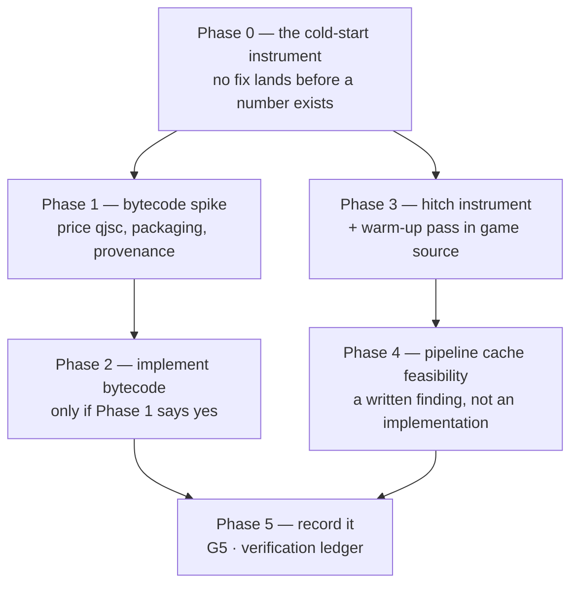

# PRD-070 — Cold start and first-frame hitches: the costs that are not frame rate

**Status: EXECUTED 2026-08-11.** Phase 0 closed with an instrument and a device number; Phases 1, 2
and 4 closed RECOMMEND-AGAINST or NOT REACHABLE on that number; Phase 3 delivered its hitch
instrument, the `compileAsync` surface it required, and — after the warm-up itself measured inside
run-to-run variance and was dropped — the fix that did work: `Ctx.startup` plus a loading screen
shipped in every template. Launch to a complete picture went **2,877 ms → 1,051 ms** and the worst
frame **3,474 ms → 2,712 ms**, because geometry hidden behind the loading screen is never drawn and
so its shaders are never compiled. Evidence:
`docs/verification/cold-start-and-hitches-2026-08-11.md`.

Launch on the physical Pixel 8 is **2,882 ms median / 3,031 ms p95** over five cold launches, and
**86.8% of it is the first rendered frame**. The parse-and-compile segment that Phases 1 and 2
were built to attack is **230 ms — 8.0%**, so precompiled bytecode is not worth its packaging and
provenance cost on this subject; the falsifier is a subject whose compile segment exceeds ~30% of
launch. Phase 4's persisted pipeline cache is confirmed unreachable through the API this host
binds. **What the instrument found instead is that the largest stall in the session was not in
launch at all**: `SceneCollapse` froze one frame for 3,608 ms. That is now 1,845 ms and reported as
`SceneCollapseReport.bakeMs`, and `TN_FRAME_HITCH` shows it lands at frame 43 of every launch
against a 9 ms median. **What remains is a loading-screen problem as much as a speed problem**: the
launch and the collapse are costs this device pays somewhere, and nothing yet lets a game wait on
them before showing the player a half-drawn map. That signal is the next piece of work.

The §2 numbers below were hand-read from logcat before the instrument existed and are superseded
by the measured breakdown. They are kept because the reasoning that led to building the instrument
still holds. This PRD makes no mobile-readiness claim and no iOS claim of any kind.

**Complexity: 6 → MEDIUM mode.** One instrument that does not exist, one packaging change with
a real toolchain consequence, one hitch fix that mostly is not framework code, and one
feasibility finding that contradicts the plan it came from.

**Blast radius: ~10 repository paths.** `packages/runtime-native/scripts/measure-cold-start.mjs`
(NEW), `packages/runtime-native/scripts/bundle.mjs`,
`packages/runtime-native/scripts/package-android.mjs`,
`packages/runtime-native/scripts/package-desktop.mjs`,
`packages/runtime-native/src/js/quickjs_engine.cpp`,
`packages/runtime-native/src/platform/android_main.cpp`,
`packages/runtime-native/CMakeLists.txt`, `packages/runtime-native/tests/`,
`packages/runtime-native/docs/G5-profiling.md`, `docs/verification/`.

**Depends on:** PRD-066 landed the `-O2` fix whose before/after the numbers below straddle, and
opened the device evidence lane on serial `37251FDJH0037Z`. PRD-058 owns performance
thresholds; this PRD supplies raw numbers and proposes an instrument, and must not set, tune or
waive a threshold. PRD-064 already defines a desktop cold-start budget (p95 ≤ 5,000 ms over five
independent launches) for the web-versus-native-desktop comparison; this PRD extends the same
idea to a device and does not redefine it.

**Siblings in this folder, deliberately not folded in:** PRD-068 owns the Android JavaScript
engine swap. PRD-069 owns per-draw JS and FFI cost. **This PRD owns launch time and one-off
stalls only.** Where the three touch — a different engine changes both parse cost and steady
frame time — the boundary is: PRD-070 owns anything measured once per launch, the other two own
anything measured per frame in steady state.

## 1. Why this exists

Frame rate is not the only way a native build feels worse than the browser. Two costs are paid
outside the steady-state loop and neither is measured anywhere:

1. **Launch.** Every native launch parses the whole game bundle as JavaScript source. For the
   `fox-native` subject that is **4,043,440 bytes** of JavaScript, re-parsed on every cold
   start, on an interpreter, on a phone.
2. **The first frames.** TSL and node materials build WGSL in JavaScript, and the pipeline is
   compiled on demand the first time a material is drawn. That cost lands inside a frame the
   player is watching.

Neither has a number anyone can regress against. `packages/runtime-native/docs/G5-profiling.md`
is **NOT STARTED**, and no gate in the tree asserts a launch time or a frame-time spike. That
is the actual defect this PRD opens on: PRD-066 showed a 50× frame-rate regression shipping
unnoticed because nothing measured frames; the same hole exists, unclosed, for launch and for
hitches.

## 2. What is known, and how well

### Indicative — hand-read, not gated

Physical Pixel 8 (`shiba`, serial `37251FDJH0037Z`, arm64-v8a, Android 17), 2026-08-10.
Measured by subtracting logcat timestamps between process start and the
`TN_NATIVE_SMOKE_FIRST_FRAME` marker. **There was no instrument; a human read two timestamps.**

| Subject | Build | Process start → first rendered frame | Confidence |
|---|---|---|---|
| `fox-native` | debug APK as shipped (`-O0`) | roughly **5 s** | indicative — hand-read logcat, one observation class |
| `fox-native` | same APK, native runtime at `-O2` | roughly **1.3 s** | indicative — same method |
| `examples/native-smoke` (2 meshes) | `-O0` | roughly **5 s** to its ready marker | indicative — same method |

The `-O0` versus `-O2` split is the build-flag change PRD-066 Phase 1 landed. **State which
build any later number came from**; a launch time quoted without its build type is unusable.

Two things about this table deserve saying plainly rather than being smoothed over:

- **No sample count, no percentile, no thermal state, no cold-versus-warm page-cache
  distinction was controlled for.** A p95 over five launches, which is what PRD-064 already
  asks of desktop, does not exist for a device.
- **A 2-mesh scene taking about as long as a 2,358-mesh game to reach its marker is the
  interesting row.** If it survives instrumentation, launch cost is dominated by something
  that is not scene size — parse, host bring-up, or surface creation — and scene complexity is
  a red herring for this PRD. If it does not survive, the `-O0` reading was noise. **Phase 0
  decides this; nothing downstream may assume either answer.**

### Measured facts about the tree, not about performance

- The `fox-native` native bundle is 4,043,440 bytes of JavaScript, parsed as source every launch.
- QuickJS-ng **0.11.0** is compiled from source by this repository's own `CMakeLists.txt:447`.
- `JS_WriteObject` / `JS_ReadObject` and the `JS_WRITE_OBJ_BYTECODE` / `JS_READ_OBJ_BYTECODE`
  flags exist in that version's `quickjs.h:1089–1104`. **Neither symbol appears anywhere in
  this repository.**
- The WebGPU header the host binds against —
  `third_party/dawn/dawn-headers/include/webgpu/webgpu.h` — contains **zero** occurrences of
  `PipelineCache`.

## 3. What the code actually does — three corrections to the hypothesis doc

`docs/architecture/NATIVE-PERF-BOTTLENECKS.md` opens by saying nothing in it is measured. It is
right to, and two of its rows are the subject of this PRD. Reading the code those rows point at
changed three things, and the PRD is built on the corrected version.

**Correction 1 — the host does not "only ever call `JS_Eval`". It already compiles and
evaluates in two steps.** `packages/runtime-native/src/js/quickjs_engine.cpp:264–304`
(`evalScript`, the function `android_main.cpp:151` uses to load the game) is:

```
JSValue compiled = JS_Eval(ctx, code, len, filename, JS_EVAL_TYPE_GLOBAL | JS_EVAL_FLAG_COMPILE_ONLY);
...
JSValue result = JS_EvalFunction(ctx, compiled);
```

That intermediate `compiled` value **is** the object `JS_WriteObject` serializes and
`JS_ReadObject` reconstructs. The seam already exists at exactly the right place, which makes
the runtime half of the change smaller than the hypothesis doc implies.

It also carries a constraint the doc does not mention: **this path compiles as
`JS_EVAL_TYPE_GLOBAL`, not `JS_EVAL_TYPE_MODULE`**, while the sibling `eval()` at `:208` and
`evalWithResult()` at `:247` use `JS_EVAL_TYPE_MODULE`. Script bytecode and module bytecode are
different objects with different reload requirements. **The writer must be told which eval type
the loader will use, and a mismatch must fail closed rather than be reinterpreted.**

**Correction 2 — the parse cost is already partly observable, and the instrument should start
there rather than inventing a marker.** `quickjs_engine.cpp` already logs
`evalScript compile begin: file=… bytes=…` at `:266`, `evalScript compile complete:` with a
`JS_ComputeMemoryUsage` dump at `:281`, `evalScript execute begin:` at `:285` and
`evalScript execute complete:` at `:297`. The compile-versus-execute split for a 4 MB bundle is
therefore readable from logcat **today**. Phase 0's job is to make those timestamped,
structured and asserted — not to add a new mechanism beside them.

**Correction 3 — a persisted pipeline cache is not reachable from where the doc says to put
it, and possibly not reachable at all through the API this host binds.** The doc says "no
pipeline cache in `src/webgpu/context.cpp`". That is true and misleading: `context.cpp` contains
no occurrence of the word *pipeline* at all. Pipelines are created in
`src/webgpu/bindings.cpp` — `:665`, `:2772`, `:5585`, and the JS-facing
`createRenderPipeline` at `:2361`. More importantly, **WebGPU as bound here exposes no
pipeline-cache handle**: `wgpuDeviceCreateRenderPipeline` takes a descriptor and nothing else,
and `webgpu.h` has no `PipelineCache` type. Vulkan's `VkPipelineCache` and Metal's binary
archives live *below* wgpu-native and Dawn, not in the surface this runtime calls.

**Consequence: "persisted pipeline cache" is not a 🟡 fix, it is an open feasibility
question**, and this PRD treats it as one (Phase 4) rather than scheduling it. The thing that
*is* reachable is a warm-up pass, and that is Phase 3.

## 4. Phases



Phases 1 and 3 are independent and may run in either order or in parallel. **Neither may start
before Phase 0 produces a number.** Phase 2 may not start before Phase 1 recommends it.

### Phase 0 — a cold-start instrument that fails closed

**Files:** `packages/runtime-native/scripts/measure-cold-start.mjs` — NEW;
`packages/runtime-native/src/js/quickjs_engine.cpp` — EDIT: make the four existing compile and
execute log lines carry a monotonic timestamp and a stable marker prefix;
`packages/runtime-native/src/platform/android_main.cpp` — EDIT: emit the same marker shape
around asset read and runtime creation; `packages/runtime-native/tests/` — EDIT.

The instrument reports a **phase breakdown**, not one number, because "launch is slow" without a
breakdown cannot choose between the two fixes in this PRD and the engine swap in PRD-068:

| Segment | Boundary markers | Why it is separated |
|---|---|---|
| process start → asset read complete | platform start → asset read done | OS and APK cost; no fix here is ours |
| asset read → compile begin | asset read done → `evalScript compile begin` | host and runtime bring-up |
| **compile begin → compile complete** | the two existing `quickjs_engine.cpp` lines | **the segment bytecode precompile targets** |
| compile complete → execute complete | `evalScript execute begin/complete` | module top-level work |
| execute complete → first rendered frame | → `TN_NATIVE_SMOKE_FIRST_FRAME` | first-frame cost, which is Phase 3's subject |

Fail-closed requirements, all mandatory:

- **A missing segment marker is a failure, never a skip.** An absent
  `evalScript compile complete` must exit non-zero naming the marker it looked for, never
  report a partial total.
- **An emulator serial is blocked, not measured.** Passing `emulator-*` must exit before any
  measurement with a named error code, matching how `verify-android-multitouch.mjs:43` and the
  physics device path already refuse to substitute one class of machine for another. An
  emulator launch time is not a phone launch time, and this instrument must not let anyone
  quote it as one.
- **A single launch is not a result.** The instrument takes a launch count, forces a cold start
  between launches, records every sample, and reports the distribution. One sample must be
  rejected as malformed input.
- **The build type is part of the output.** A report that cannot name `-O0` or `-O2` is a
  failure, because the §2 numbers differ by roughly 4× on that alone.

**Phase 0 sets no threshold.** It produces the number PRD-058 would need in order to set one.

### Phase 1 — spike: price QuickJS bytecode precompilation

Deliverable is a decision document with measured numbers, not an implementation. The runtime
seam is already in the right place (§3, correction 1); the cost is entirely in the packager and
in provenance.

**What the spike must establish:**

1. **The compiler.** Bytecode cannot be produced by Node. It requires a QuickJS compiler built
   from **byte-identical** QuickJS-ng 0.11.0 sources. `qjsc.c` is present in
   `third_party/quickjs/quickjs-0.11.0/`, so nothing new is vendored — but `third_party/` is
   untracked and reconstructed only by `scripts/download-deps.mjs`, and building it needs
   CMake. **This is the real cost, and it collides with a standing repository rule: native
   compilation is opt-in and the default gate must never require CMake, an NDK or Xcode.**
   The spike must state how the packager behaves on a machine with no toolchain. A source
   fallback that silently produces a slower app is acceptable only if it is *reported*, never
   silent.
2. **The gain.** Compile-segment milliseconds from Phase 0, before and after, on the Pixel 8 at
   `-O2`, for both `fox-native` and `examples/native-smoke`. A gain smaller than the launch
   variance is not a gain.
3. **The size delta.** QuickJS bytecode for a 4 MB source bundle may be larger than the source.
   `JS_WRITE_OBJ_STRIP_SOURCE` and `JS_WRITE_OBJ_STRIP_DEBUG` (`quickjs.h:1093–1094`) shrink it
   and cost stack-trace quality. The spike prices both and says what a game developer loses.
4. **The version lock.** Bytecode is tied to the exact QuickJS build that wrote it. Feeding
   mismatched bytecode to `JS_ReadObject` is not a graceful failure. **A version and checksum
   guard that refuses to load rather than crashing is a precondition of Phase 2, not a
   nice-to-have.**
5. **The eval-type match.** The writer must emit the object shape the loader reads —
   `JS_EVAL_TYPE_GLOBAL` for today's `evalScript` path. A mismatch fails closed.

**What it does to the one-file ESM rule.** The rule that the native bundle is one import-free
ESM file is asserted by string-grep on source:
`examples/native-smoke/scripts/verify-bundle.mjs` requires exactly one `.js` in `dist/`, greps
the text for `TN_NATIVE_SMOKE_READY` and friends, and rejects any `import`. Separately,
`scripts/verify-android-first-proof.mjs:379` and `:398` check the packaged bundle's SHA-256
against recorded metadata.

**Bytecode must therefore be a derived, additional artifact — never a replacement.** The single
import-free ESM file stays exactly as it is and stays the thing that is checksummed and
grepped; the `.qbc` (or equivalent) is emitted beside it, carries the source bundle's SHA-256 in
its metadata, and is loadable only when that digest matches the shipped source. The rule survives
intact because the rule is about the source graph having no imports and no code splitting — a
compiled form of that same single file splits nothing. **If the spike finds it cannot preserve
both the grep contract and the checksum contract, it recommends no.**

### Phase 2 — implement bytecode precompilation (conditional on Phase 1)

Scope is set by Phase 1's output. The parts that are fixed regardless:

- `quickjs_engine.cpp` gains a `JS_ReadObject` load path beside `evalScript`, selected by the
  loader when a valid, digest-matched, version-matched bytecode artifact is present.
- **Mismatch means fall back to source and say so on stderr, or refuse — never load anyway.**
- `scripts/bundle.mjs` and the packagers emit the artifact and record its provenance in the same
  metadata that already carries `outputSha256`.
- A test asserts that bytecode built against a different QuickJS version is rejected.

### Phase 3 — measure the first-frame hitch, then warm up before the first visible frame

**This kills hitches. It does not raise average frame rate.** A build with the same mean frame
time and no 400 ms spike at second three is the intended outcome. Anyone reading this as a
frame-rate fix has misread it; steady-state frame time belongs to PRD-068 and PRD-069.

**The instrument first.** Extend the Phase 0 reporting to record per-frame times for the first
N frames after `TN_NATIVE_SMOKE_FIRST_FRAME` and report the maximum and its frame index. A hitch
is a *distribution* claim — max and p99 over a named window — and a mean cannot see it. A
missing or malformed frame observation is a failure, not a skip.

**The fix is mostly not framework code.** Three.js 0.185.1 already ships
`WebGPURenderer.compileAsync(scene, camera)`, which builds and compiles the pipelines for a
scene ahead of drawing it. Calling it during load is a handful of lines, so by the rule that
anything a competent developer writes in under 20 lines does not go in the framework, **the
warm-up call belongs in the template's generated source and in `examples/native-smoke`, not in a
package.**

One framework-side finding blocks that: `packages/core/src/renderer.ts` wraps the renderer and
exposes `domElement, kind, raw, compute, dispose, render, setOutputNode, setSize` — **not
`compileAsync`**. A game must reach through `.raw` to warm up. This is the same wrapper-surface
gap PRD-066 §7 recorded for `renderer.info`. Phase 3 must either surface it or record that
reaching `.raw` is the supported way; **it must not leave a game unable to warm up without a
cast.** Whichever is chosen, it is one line of surface, justified here, and the kill switch
applies to it like anything else.

### Phase 4 — pipeline cache: a written feasibility finding, not an implementation

Phase 4 produces one honest paragraph in `G5-profiling.md`, backed by the header check in §2:

- `webgpu.h` as vendored exposes no pipeline cache, so there is nothing to persist through the
  API this runtime calls.
- Reaching a real cache means either a wgpu-native/Dawn-level extension, or relying on the
  platform driver's own on-disk shader cache — which exists on Android and is outside this
  repository's control.
- Whether the second one already absorbs most of the cost is **unknown and measurable**: a
  second cold launch of the same APK on the same device, compared against the first, is the
  experiment.

**If that experiment shows a warm second launch is already much cheaper, the persisted cache is
dead and Phase 3's warm-up is the whole fix.** Recording that is a successful outcome for this
phase.

### Phase 5 — record it

- `packages/runtime-native/docs/G5-profiling.md` — currently **NOT STARTED**; it gains the
  Phase 0 segment breakdown, the hitch distribution, the Phase 1 decision and the Phase 4
  finding, each naming target, hardware, scene, build, sample count and duration.
- `docs/architecture/NATIVE-PERF-BOTTLENECKS.md` — the two rows this PRD owns are corrected per
  §3: the `JS_Eval`-only claim, the `context.cpp` pointer, and the pipeline-cache effort rating.
- `docs/verification/` — one dated evidence file, per the ledger convention.
- `docs/product/PERFORMANCE-BUDGETS.md` — **not edited here.** PRD-058 owns thresholds; this PRD
  hands it raw numbers.

## 5. Platform reach — what each proposal touches, and what has executed

| Proposal | Platforms it touches | Evidence that exists today |
|---|---|---|
| Cold-start instrument (Phase 0) | desktop, Android, iOS | Desktop and the Android emulator execute. The **physical Pixel 8** has core smoke, physics parity and frame-rate evidence from PRD-066. **iOS has no physical evidence at all and no Apple hardware is attached** — the hosted `macos-15` simulator lane is the only Apple execution, and a simulator launch time is not a device launch time |
| QuickJS bytecode (Phases 1–2) | **Android only.** Desktop runs V8 and iOS runs JSC; neither uses `JS_ReadObject` | Android emulator executes; Pixel 8 executes. No iOS consequence, and the PRD claims none |
| Runtime SWC transpile | **Desktop only** — `src/cli/main.cpp:711` and `src/js/module_system.cpp:559`, behind `MYSTRAL_HAS_SWC` | Desktop executes. Shipped Android and iOS bundles are pre-transpiled by the packager, so this is a developer-loop cost, not a shipped-app cost. Named here so nobody folds it into the Android launch number |
| Warm-up pass (Phase 3) | all targets — it is upstream Three.js in game source | Desktop and browser execute; Pixel 8 executes for smoke. **No iOS device has run it** |
| Pipeline cache (Phase 4) | all targets in principle; blocked at the API level for all of them | Nothing has executed. It is a finding, not a build |

No sentence in this PRD licenses "mobile-ready", and nothing here is an iOS result.

## 6. Integration ledger

Filled with real non-test `file:line` during implementation. A `TBD` at phase end means the
phase is incomplete.

| # | Thing built | Caller edited so it is reached | What it replaces | When it may claim green | Negative control |
|---|---|---|---|---|---|
| 1 | `measure-cold-start.mjs` segment report | the device verification path, alongside `verify-android-first-proof.mjs` | two logcat timestamps read by a human | a multi-launch distribution exists on a named serial and named build type | delete a segment marker → exit non-zero naming it, never a partial total |
| 2 | Timestamped compile/execute markers | `quickjs_engine.cpp:266,281,285,297`; `android_main.cpp` asset read | untimed `LOGI` lines | the instrument parses them and the parse is asserted by a test | reword a marker → the test fails |
| 3 | Emulator refusal on the cold-start path | `measure-cold-start.mjs` argument parsing | nothing — this gate does not exist | an `emulator-*` serial exits before measuring | pass `emulator-5554` → blocked, exit non-zero, no number emitted |
| 4 | Bytecode artifact + `JS_ReadObject` load path | `bundle.mjs`, the packagers, `quickjs_engine.cpp` load path | a 4 MB source parse per launch | the compile segment shrinks measurably on device **and** the source bundle's grep and SHA-256 contracts still pass unchanged | mismatched QuickJS version or digest → refuses to load, names the artifact, never loads anyway |
| 5 | First-frame hitch distribution | the Phase 0 report, extended | no hitch measurement anywhere | max and p99 over a named frame window on a named serial | remove the frame observation → failure, never skip |
| 6 | Warm-up call | template generated source and `examples/native-smoke`, not a package | on-demand mid-frame pipeline compilation | the hitch max drops with mean frame time unchanged | remove the warm-up → the max returns; if it does not, the warm-up was doing nothing and must be deleted |
| 7 | Pipeline-cache feasibility finding | `G5-profiling.md`; the corrected bottleneck row | a 🟡 "yes, fixable" rating with no API behind it | the header check and the second-launch experiment are both recorded | TBD |

## 7. Acceptance criteria

Consumer-scoped: each is about a build or a report someone could tell apart, not about code
that exists.

- [ ] A cold-start report exists for a named build type on physical serial `37251FDJH0037Z`,
      over at least five independent cold launches, with a per-segment breakdown and a
      distribution — not a mean alone.
- [ ] Deleting any one segment marker makes the instrument **exit non-zero naming that marker**.
      A partial total is never reported.
- [ ] An `emulator-*` serial passed to the cold-start instrument is **blocked before
      measurement**, and the control was observed red with its exit code recorded.
- [ ] A single launch is rejected as malformed input.
- [ ] The report names `-O0` or `-O2`. A report that cannot name the build type fails.
- [ ] The 2-mesh-versus-2,358-mesh launch question from §2 is **answered with instrumented
      numbers**, either way, and written down.
- [ ] Phase 1 states, with numbers, the bytecode compile-segment gain, the artifact size delta
      with and without source stripping, and what a machine with no CMake does at package time.
- [ ] If Phase 2 ships: `examples/native-smoke/scripts/verify-bundle.mjs` and the
      `outputSha256` checks in `verify-android-first-proof.mjs` pass **unchanged**, and
      mismatched bytecode is refused rather than loaded.
- [ ] A first-frame hitch distribution exists for the same subject: max frame time and its frame
      index over a named window.
- [ ] The warm-up pass reduces the hitch max **without** improving mean frame time — and the PRD
      records the mean explicitly so nobody reports this as a frame-rate win.
- [ ] Phase 4's finding is written in `G5-profiling.md`, including the outcome where the
      persisted cache is unreachable and the answer is "warm-up only".
- [ ] `G5-profiling.md` is no longer NOT STARTED, and no file says mobile-ready.
- [ ] `pnpm typecheck && pnpm lint && pnpm test && pnpm budgets` passes, and no native toolchain
      becomes part of the default gate.

## 8. Negative controls

Every row must be **observed red** with its exit code recorded before the matching pass is
written. A pass with no observed red is recorded `UNVERIFIED`.

| Control | Change | Expected | Status |
|---|---|---|---|
| `missing-segment` | remove one compile/execute marker | exit non-zero naming the missing marker; no partial total | not built |
| `emulator-serial` | pass `emulator-5554` to the cold-start instrument | blocked before any measurement, exit non-zero | not built |
| `single-launch` | request one launch | rejected as malformed input | not built |
| `unlabelled-build` | strip the build-type field from the report | report rejected | not built |
| `stale-bytecode` | feed bytecode from a different QuickJS build | refuse and name the artifact; **never** load it | not built |
| `digest-mismatch` | ship bytecode whose recorded source digest does not match the shipped bundle | refuse and name both digests | not built |
| `bundle-shape` | run the existing `verify-bundle.mjs` against a bytecode-enabled build | still passes **unchanged** — one `.js`, no imports, markers present | not built |
| `no-warmup` | remove the warm-up call | hitch max returns. If it does not, the warm-up is inert and gets deleted | not built |
| `missing-frames` | remove the first-frame observations | failure, never skip | not built |
| `unreachable-target` | assert an impossible launch time | exit non-zero naming the measured value | not built |

The `bundle-shape` row is the one that protects the one-file rule from being quietly widened by
this PRD. The `no-warmup` row is the one that stops an inert fix from being recorded as a win —
the same failure mode as an assertion that asserts nothing.

## 9. Verification commands

| What | Command | Expected |
|---|---|---|
| Cold-start segments on device | `node packages/runtime-native/scripts/measure-cold-start.mjs --device 37251FDJH0037Z --launches 5` | exit 0, five samples, per-segment breakdown, build type named |
| Emulator refusal | `node packages/runtime-native/scripts/measure-cold-start.mjs --device emulator-5554` | non-zero, blocked before measurement |
| Bytecode symbols are actually wired | `grep -rn 'JS_ReadObject\|JS_WriteObject' packages/runtime-native/src` | non-empty only after Phase 2; empty today |
| Bundle shape unchanged | `node examples/native-smoke/scripts/verify-bundle.mjs` | exit 0, one `.js`, no imports |
| Device smoke still green | `node packages/runtime-native/scripts/verify-android-first-proof.mjs --device 37251FDJH0037Z` | exit 0, 300 frames, non-blank screenshot |
| Device physics parity still green | `node packages/runtime-native/scripts/verify-android-physics-parity.mjs --device 37251FDJH0037Z` | exit 0, zero-delta comparison |
| Repository gates | `pnpm typecheck && pnpm lint && pnpm test && pnpm budgets` | exit 0 |

## 10. Out of scope, and why

- **Steady-state frame rate.** PRD-068 (Android engine swap) and PRD-069 (per-draw JS and FFI
  cost) own it. If a bytecode or warm-up change moves mean frame time, that is a finding to hand
  them, not a result to claim here.
- **Performance thresholds.** PRD-058 owns them. This PRD proposes an instrument and supplies raw
  numbers; it sets no budget and waives none.
- **Desktop runtime SWC transpile as a shipping cost.** It is a developer-loop cost only —
  shipped mobile bundles are pre-transpiled by the packager. Named in §5 so it is not folded
  into an Android launch number; not fixed here.
- **Asset load and texture upload.** Real launch costs, and not the two rows this PRD was opened
  on. They need their own measurement before anyone guesses at them.
- **iOS.** No Apple hardware is attached, so no iOS cold-start or hitch number can be produced
  here. The simulator lane can prove plumbing and nothing about launch time on a phone.
- **16 KB page alignment and orientation.** PRD-066 §7 and PRD-067 own them.

## 11. Kill switch — the outcomes this PRD must be willing to reach

Three, and each is a success if it is what the numbers say:

1. **Phase 0 shows launch is already fine at `-O2`.** The roughly 1.3 s indicative reading is
   not obviously a problem. If instrumented launch lands comfortably inside what a player would
   accept, **Phases 1 and 2 are closed unbuilt** and the bottleneck doc's "do the bytecode
   precompile now, cheapest real win" row is corrected to say the win was already taken by the
   `-O2` fix.
2. **Phase 1 prices bytecode as a packaging toolchain dependency the repository will not pay.**
   Requiring CMake to package a game breaks the rule that native compilation is opt-in, and a
   silent source fallback breaks the rule that a build must not quietly differ by machine. If
   the gain does not justify that, the answer is no and it is written down.
3. **Phase 4 finds there is no pipeline cache to persist.** The vendored `webgpu.h` says there
   is not one at this layer. If the driver's own cache already absorbs the cost, the persisted
   cache is dead and the warm-up pass is the entire fix.

The failure mode this PRD exists to prevent is an optimization landing because a hypothesis doc
ranked it 🟢, with no instrument that could have told anyone whether it helped — and then a
launch-time regression shipping unnoticed exactly the way a 50× frame-rate regression already
did.
