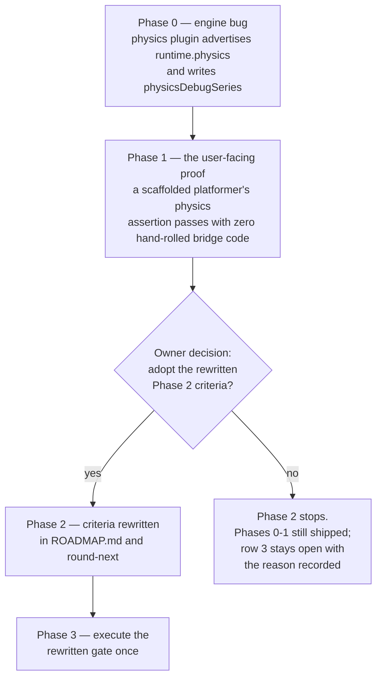

# PRD-079 — Phase 2's exit gate: the round-4 proof measured the harness, and the gate cannot be passed as written

**Status: COMPLETE, 2026-08-19 — and Phase 2 is still not green, which is the point.** This PRD's
deliverable was a Phase 2 exit gate that can be passed, decided with the owner. The owner adopted
the replacement gate on 2026-08-19 (recorded in [CONFLICTS.md](../../strategy/CONFLICTS.md) and
[ROADMAP.md](../../strategy/ROADMAP.md)), and it was executed once. **That execution is RED and
claims no score points**: the platformer composition it reproduced shipped in PRD-081 on
2026-08-12, before the decision, so it is consumer evidence and not new post-adoption evidence.
Beta row 3 stays open, now blocked on shipping a capability rather than on a gate nobody could
pass. Evidence: [`phase-2-2026-08-19.md`](../../verification/phase-2-2026-08-19.md).

Prior status: HALF ONE LANDED, HALF TWO OPEN — amended 2026-08-19.** Phase 0, the harness defect
below, was extracted into [PRD-081](../done/PRD-081-physics-assertions-a-user-can-write.md) and shipped
complete on 2026-08-12 (commit `0fe0e02b`, "compose physics with playtest assertions"), after this
file was written. On `HEAD` today: `packages/physics/src/plugin.ts:156` contributes
`["runtime.physics"]` through a generic observation seam, `packages/core/src/playtest.ts:184`
advertises `runtime.audio`, `runtime.world` and whatever a plugin contributed, and
`packages/core/__tests__/playtest.spec.ts:38` asserts the capability is *not* advertised without a
contributing plugin. **§1's third and fourth bullets are therefore stale and are kept for the
record, not as current state.** This is a read of the tree, not an executed run: nothing has
re-measured a paired arm. **The replacement gate was adopted and executed once on 2026-08-19. The
execution is RED, and Phase 2 remains open.** Relative links in this file were rewritten for its new folder; no
other line moved.

Original status, 2026-08-11: **PROPOSED. Nothing here is executed.** §1 and §2 are a read of
[`round-4-2026-08-10.md`](../../verification/round-4-2026-08-10.md) and of the tree at commit
`11bf82d`. No round has been run for this document, and none will be — the kill switch
prohibits a fifth genre or an arm rerun. No mobile-readiness, device or iOS claim is made.

**The round-4 ledger records its own next action, and nobody owns it:**

> Stop condition met: kill switch
> Next action: **Reopen Phase 2 win criteria**; do not run a fifth genre or rerun either arm

This PRD is that action. It has two halves, and they are independent enough that either can
land without the other.

**Half one — the harness defect that made round 4 measure nothing.** Both arms exited `1`
with `0/1` and the same error: `TN_PLAYTEST_CAPABILITY_MISSING` for `runtime.physics`.
Neither arm's physics was ever observed. The ledger's *"functional tie"* is a tie between two
runs that never reached their assertions.

The cause is three lines of framework code and one absence:

- `packages/core/src/playtest.ts:142-146` — `addRuntimeCapabilities` auto-advertises exactly
  two capabilities: `runtime.audio` and `runtime.world`. Nothing else.
- `packages/playtest/src/assertions.ts:56`, `:355`, `:369` — three assertion kinds
  (`settled`, `occluded`, and the fixed-step physics pair) require `runtime.physics`.
- `packages/physics/src/plugin.ts` and `packages/physics/src/index.ts` contain **zero**
  references to `playtest`, `bridge`, `capabilities` or `describe`. The physics package and
  the playtest package do not know each other exists.
- `physicsDebugSeries` is a defined protocol field the runner reads
  (`packages/playtest/src/protocol.ts:109`, `runner/runner.ts:319`) and **nothing in
  `packages/` ever writes.**

**So the framework's flagship 0→1 capability and its strongest-scoring capability do not
compose.** A user who builds a physics game with `RigidBody3D` and then writes a `settled`
assertion gets `TN_PLAYTEST_CAPABILITY_MISSING`, and must hand-roll both the capability
declaration and the observation channel. That is an engine bug, it is user-facing, and it is
worth fixing whether or not Phase 2 ever closes.

**Half two — the gate cannot be passed as written.** Phase 2 exits when *"hot reload/state
preservation or physics reach ships with consumer-scoped proof the paired vanilla arm cannot
match inside the same brief."* But
[VALUE-PROPOSITION.md](../../strategy/VALUE-PROPOSITION.md) states the benchmark's design
plainly: the paired benchmark **deliberately hands the vanilla arm the scaffolding and the
`playtest` bridge**, so axes 1 and 3 *"win no benchmark column by construction."* And the
same file's own scoring note says the hot-reload work is *"consumer-scoped, **not** the
paired proof row 3 needs."*

A gate that asks the paired instrument to demonstrate a capability the paired instrument is
designed to neutralise is not a hard gate. It is an unpassable one. Four rounds have been
spent against it. **That is a specification defect, and reopening it is engineering work, not
goalpost-moving** — which is precisely why the round-4 ledger named it as the next action
rather than authorising a fifth genre.

**Complexity: 7 → HIGH mode.** A cross-package capability contract that must stay fail-closed
while gaining a new provider; a physics package that has never had an observation surface and
must gain one without the framework owning the look; a gate rewrite that needs owner sign-off;
and a real hazard that the rewritten gate is satisfied by a measurement the project already
has.

**Blast radius (candidate, phase-gated).**
Phase 0: `packages/physics/src/plugin.ts`, `packages/core/src/playtest.ts`,
`packages/playtest/src/capabilities.ts`, `packages/core/__tests__/`,
`packages/physics/__tests__/`.
Phase 1: `packages/create-threenative/templates/platformer/`, one playtest scenario.
Phase 2: `docs/strategy/ROADMAP.md`, `docs/PRDs/done/PRD-021-the-improvement-round.md`,
`scripts/round-next.ts`.
Phase 3: `docs/verification/`.
**Phase 2 does not execute without an owner decision recorded in the PRD.**

**Depends on:** nothing. **Unblocks:** beta bar row 3, and the physics half of axis 3 in
`VALUE-PROPOSITION.md`.

---

## 1. What round 4 actually measured

From [`round-4-2026-08-10.md`](../../verification/round-4-2026-08-10.md), verbatim where it
matters:

| Arm | Proof | Reported |
|---|---|---|
| framework | 0/1 | exit `1`, `TN_PLAYTEST_CAPABILITY_MISSING` for `runtime.physics` |
| vanilla | 0/1 | exit `1`, same error |
| no-op control | 0/1 | reached assertion evaluation; `world.seed` passed, eight physics assertions and `diagnostics` failed |

And the ledger's own note: *"The real-arm preflight reports have empty `assertions` because
the fail-closed runner did not evaluate assertions; no assertion IDs or results were
synthesized."*

**Read the three rows together.** The no-op control — a project with no gameplay at all —
got *further* than either real arm. It reached assertion evaluation and failed on the merits.
The two real arms, both of which had working physics, never got there.

That is the harness being right in the small and useless in the large: `TN_PLAYTEST_BRIDGE_MISSING`
and `TN_PLAYTEST_CAPABILITY_MISSING` failing closed is the documented, correct behaviour, and
the repository's rule is explicit — *"Install the bridge or narrow the scenario; never delete
the assertion to get green."* **The right response is to install the bridge. The framework
should have been installing it.**

The round's remaining verdicts stand on their own evidence and are not disturbed here: the
framework won blind visual polish 4 to 3, and vanilla won fair authored cost by 2 LOC (354 vs
352), disposed of as below the 20-line threshold. Neither depended on the physics proof.

## 2. Why the gate cannot be passed as written

Three quotations, all from tracked documents, all pointing the same way.

1. **`ROADMAP.md` Phase 2:** exit requires *"hot reload/state preservation or physics reach
   ships with consumer-scoped proof the paired vanilla arm cannot match inside the same
   brief."*
2. **`VALUE-PROPOSITION.md`, "What the paired benchmark cannot show":** *"The benchmark
   deliberately gives the vanilla arm the scaffolding and the `playtest` bridge, so axes 1 and
   3 win no benchmark column by construction. That is a scoring artifact, not a verdict on
   their worth."*
3. **`ROADMAP.md` Done table, PRD-035:** hot reload is *"done — consumer-scoped, **not** the
   paired proof row 3 needs."*

The gate names two candidate capabilities. One of them is already shipped and already ruled
insufficient for this gate by the roadmap itself. The other must be demonstrated through an
instrument that, by design, gives the control arm the same harness.

Add the arithmetic from the same file — plumbing is already halved, gameplay is permanently
the user's, *"the ceiling on the cost axis alone is roughly 40/100"* — and the position is
that four rounds have run an instrument whose ceiling is known and whose design excludes the
two capabilities most worth showing.

**What this PRD does not conclude:** that the paired benchmark is bad. It is a good control
on cost and polish and it should keep running as the regression ratchet it is. **What it does
conclude:** it is the wrong instrument for "a capability vanilla does not have," and Phase 2's
exit criteria should name an instrument that can answer that question.

## 3. Solution



- **Fix the composition bug first, on its own merits.** `rapier()` should advertise
  `runtime.physics` and emit `physicsDebugSeries` the same way `playtest()` already
  auto-advertises `runtime.audio` and `runtime.world`. This is plumbing every physics game
  repeats and no game should write — the definition of package code.
- **Prove it on a scaffolded template, not on a fixture.** The consumer-scoped statement is
  *"a user's physics assertion passes without hand-rolled bridge code,"* and only a scaffold
  can show that.
- **Then, and only then, rewrite the gate** — with the owner, in the roadmap, with the reason
  recorded next to it.
- **Do not run a fifth genre.** The kill switch is respected literally. Nothing in this PRD
  invokes `sweep:pair`, `sweep:capture` or `sweep:judge` on a new genre or a rerun.

**Key decisions:**

- [ ] The capability is advertised by **`rapier()`**, the physics plugin, not by `playtest()`
      in core. Core must not gain a physics dependency; that is what the package boundary is
      for.
- [ ] Observations are **bounded and JSON-safe**, matching every neighbouring capability's
      description — *"Samples **bounded** application-owned physics observations"*
      (`capabilities.ts:53`). Unbounded body dumps are rejected.
- [ ] `physicsDebugSeries` keeps its existing protocol shape
      (`protocol.ts:109`: `{label, snapshot, tick}[]`). A second shape is a fork.
- [ ] The framework observes; it does not decide what the game's physics *is*. No option, no
      preset, nothing a screenshot shows.
- [ ] **The rewritten gate must not be satisfied by a measurement the project already has.**
      See §7's litmus.

**Data changes:** none. `physicsDebugSeries` and `runtime.physics` both already exist in the
protocol and the capability registry. This PRD supplies the missing producer.

## 4. Integration Ledger

| # | New thing | Live caller (`file:line`, non-test) | Replaces | Old path removed? | Negative control |
|---|---|---|---|---|---|
| 1 | `rapier()` advertises `runtime.physics` | `packages/physics/src/plugin.ts:70` `rapier()`, installed by every physics game's `defineGame` | hand-rolled capability declarations in game code | game-side declarations become unnecessary; the platformer template's, if any, is deleted | disable the advertisement → a `settled` assertion returns `TN_PLAYTEST_CAPABILITY_MISSING`, exactly as round 4 did |
| 2 | `physicsDebugSeries` producer in the physics plugin | the plugin's per-tick hook, reached by the frame loop; read by `playtest/src/runner/runner.ts:319` | nothing — the field had no writer in `packages/` | n/a; this is the absence being filled | stop emitting → `settled` fails with no samples, and `assertions.ts:1247`'s physics-evidence check goes false |
| 3 | Platformer template physics playtest scenario | `packages/create-threenative/templates/platformer/playtests/`, run by `pnpm test:templates` (root `package.json:17`) | no template asserts its own physics today | n/a | remove `rapier()` from the template's `defineGame` → the scenario fails, not skips |
| 4 | Rewritten Phase 2 exit criteria | `docs/strategy/ROADMAP.md` Phase 2; `scripts/round-next.ts` reads the round ledger's stop condition | the current unpassable criteria | the old wording is replaced, with the reason recorded beneath it | TBD — Phase 2 |
| 5 | The executed gate result | `docs/verification/phase-2-<date>.md`, cited by `ROADMAP.md` beta row 3 | four rounds of non-green paired evidence, which stay as history | predecessors retained, not deleted | TBD — Phase 3 |

**A test is not a caller.** Row 1's caller is `rapier()` inside a scaffolded game's
`defineGame`; row 2's is the frame loop; row 3's is `pnpm test:templates`.

### Reachability

**How is this reached?** A user writes `defineGame({ plugins: [rapier(), playtest()] })` and a
scenario with a `settled` or `contact` assertion. Today that returns
`TN_PLAYTEST_CAPABILITY_MISSING`.
**Pre-existing files edited:** `packages/physics/src/plugin.ts`,
`packages/create-threenative/templates/platformer/src/game.ts`, `docs/strategy/ROADMAP.md`.
**User-facing?** Yes. The observable difference is a physics assertion that passes instead of
erroring.
**What does it replace?** The hand-rolled bridge code a physics game currently must write —
and, in round 4's case, that neither builder knew to write.

## 5. Execution phases

### Phase 0 — Physics and playtest compose (engine bug)

**Outcome:** a game that installs `rapier()` can assert `settled` without writing a line of
bridge code.

**Files (max 5):**

- `packages/physics/src/plugin.ts` — EDIT: advertise `runtime.physics`; emit bounded
  `physicsDebugSeries` samples per labelled step
- `packages/core/src/playtest.ts` — EDIT: let a plugin contribute capabilities and
  observations through the existing `addRuntimeCapabilities` seam at `:142`, without core
  learning what physics is
- `packages/physics/__tests__/playtest-capability.spec.ts` — NEW
- `packages/core/__tests__/playtest.spec.ts` — EDIT: the plugin-contribution seam
- `packages/playtest/src/capabilities.ts` — READ ONLY; the capability already exists at `:53`
  and this phase fails if its description changes

**Implementation:**

- [ ] Widen the plugin-hook contract so a plugin may contribute capability names and an
      observation slice. Core stays physics-ignorant; the seam is generic.
- [ ] `rapier()` contributes `runtime.physics` and writes `{label, snapshot, tick}` samples
      matching `protocol.ts:109`.
- [ ] Bound the snapshot: a fixed maximum body count and a JSON-safe shape, with the excess
      **reported** rather than silently truncated. Silent truncation is the failure mode this
      repository fails builds over.
- [ ] Do not touch `capabilities.ts`. The registry entry is correct; it has simply never had
      a producer.

**Wiring:**

- [ ] Caller edited: `packages/core/src/playtest.ts` capability assembly
- [ ] Registration: `rapier()` contributes at plugin-install time
- [ ] Old path: none existed — recorded honestly as an absence, not as a replacement
- [ ] Ledger rows filled: #1, #2

**Tests required:**

| Test file | Test name | Assertion | Negative control (must be observed red) |
|---|---|---|---|
| `packages/physics/__tests__/playtest-capability.spec.ts` | `should advertise runtime.physics when rapier is installed` | `describe()` capabilities include `runtime.physics` | remove `rapier()` → absent, and a `settled` assertion returns `TN_PLAYTEST_CAPABILITY_MISSING` |
| `packages/physics/__tests__/playtest-capability.spec.ts` | `should emit a physicsDebugSeries sample per labelled step` | one sample per label, each with a monotonic `tick` | freeze the tick source → the monotonic assertion goes red |
| `packages/physics/__tests__/playtest-capability.spec.ts` | `should report rather than silently truncate beyond the body bound` | over-bound input produces an explicit overflow report | drop the report → the test passes on a silent truncation, proving the report is what holds it |
| `packages/core/__tests__/playtest.spec.ts` | `should not advertise runtime.physics without a contributing plugin` | capabilities are exactly `runtime.audio` + `runtime.world` + declared | hardcode `runtime.physics` in core → red, protecting the package boundary |

**Revert check:** remove the plugin's contribution → the platformer's new scenario (Phase 1)
fails with the round-4 error, and `packages/playtest`'s `settled` path has no producer again.

### Phase 1 — Prove it where a user would meet it

**Outcome:** the scaffolded platformer asserts its own physics, with no hand-rolled bridge
code anywhere in the generated project.

**Files (max 5):**

- `packages/create-threenative/templates/platformer/playtests/physics.playtest.json` — NEW
- `packages/create-threenative/templates/platformer/src/game.ts` — EDIT: `rapier()` alongside
  `playtest()`, if it is not already there
- `scripts/verify-template-playtests.ts` — EDIT: include the new scenario
- `docs/verification/physics-playtest-composition-2026-08-11.md` — NEW

**Proof subject:** the platformer template as generated — the framework's largest template
and the only one that ships physics gameplay.
**What this subject exercises that a unit test cannot:** a real WebGPU frame loop, the
scaffolded dependency graph, and the `playtest()`/`rapier()` install order a user actually
writes.

**Negative control (required, observed red):** scaffold the platformer, delete `rapier()`
from `defineGame`, run the scenario. It must fail with `TN_PLAYTEST_CAPABILITY_MISSING` —
**not** skip, and not pass.

**User verification:**

- Action: `pnpm create threenative demo --template platformer`, then
  `npx @threenative/playtest playtests/physics.playtest.json`
- Expected: exit `0`, physics assertions evaluated. Today: exit `2` or a capability error.

**Phase 1 is where this PRD delivers value even if Phase 2 never happens.** The composition
bug is fixed, the platformer asserts its own physics, and a user's physics playtest works.
Everything after this is about a gate, not about the product.

### Phase 2 — Rewrite the criteria, with the owner

**Outcome:** `ROADMAP.md` Phase 2 states an exit gate that a real result can satisfy and a
real result can fail.

**This phase does not execute without a recorded owner decision.** Rewriting a gate the
project has spent four rounds against is a product decision, and an agent doing it
unilaterally is the failure mode the gate exists to prevent. The PRD proposes; the owner
disposes; the decision and its date go in the roadmap next to the new wording.

**Files (max 5):**

- `docs/strategy/ROADMAP.md` — EDIT: Phase 2, and beta row 3
- `docs/PRDs/done/PRD-021-the-improvement-round.md` — EDIT: the round loop's stop condition
- `scripts/round-next.ts` — EDIT, only if the new criteria change what "next action" means
- `docs/strategy/CONFLICTS.md` — EDIT: record the tension between the old and new gate

**The proposal, for the owner to accept, amend or reject.** Phase 2 exits when **all three**
hold:

1. **A capability ships that vanilla Three.js has no answer for, proved consumer-scoped** —
   the user observes the outcome, not the artifact.
2. **The proof is taken on an instrument that does not hand the control arm the capability
   under test.** Where the paired benchmark's design neutralises the capability by giving both
   arms the same harness, a different control is named, and *why* is stated.
3. **The proof has a negative control that was observed red**, on the same subject, in the
   same run.

And the gate explicitly **retires** the requirement that the paired sweep be the instrument,
recording that four rounds established the paired sweep as a good cost-and-polish ratchet and
a poor capability instrument.

**The hazard, stated so the owner can weigh it:** the project already holds a measurement
that would satisfy a loosely written version of criterion 1 — *"the same source at ~106 fps
on a Pixel 8 versus 60 fps capped in Chrome on the same phone, with zero game-side lines,"*
with `SceneCollapse` doing the work. That is a genuine framework-only capability and it is
already measured. **A gate written so that an existing measurement closes it is the
"assertion already satisfied by the baseline" anti-pattern**, and it would close Phase 2 on
work that predates the gate. Criterion 3 exists to blunt this: an existing measurement with no
same-run negative control does not qualify. **If the owner decides that measurement should
close row 3, that is a legitimate decision — but it must be recorded as a decision, not
laundered through a rewritten criterion.**

### Phase 3 — Execute the rewritten gate once

**Outcome:** one result against the new criteria, green or red, recorded.

**Files (max 5):**

- `docs/verification/phase-2-<date>.md` — NEW
- `docs/strategy/ROADMAP.md` — EDIT: beta row 3 and the Phase 2 status line
- `docs/strategy/VALUE-PROPOSITION.md` — EDIT, only if an axis moved

**A red result is a valid Phase 3 outcome** and is recorded as one. It does not authorise a
second attempt inside this PRD.

## 6. Verification strategy

**Integration proof:**

```sh
# 1. Caller census — the capability has a producer outside its own tests
grep -rn "runtime.physics" packages/physics/src packages/core/src
# Expected: a contribution in physics/src/plugin.ts. Today: zero hits in either directory.

# 2. Producer census — physicsDebugSeries is written, not only read
grep -rn "physicsDebugSeries" packages/*/src
# Expected: a writer in physics/src, alongside the existing readers in playtest/src

# 3. Revert check — removing the contribution breaks a pre-existing flow
#    (delete rapier()'s capability contribution, run pnpm test:templates)
# Expected: the platformer physics scenario FAILS. If it skips, the assertion is not load-bearing.

# 4. Boundary check — core did not learn about physics
grep -rn "rapier\|Rapier\|RigidBody" packages/core/src
# Expected: no hit. Core gained a generic seam, not a physics dependency.

# 5. Kill-switch compliance — no fifth genre was run
git log --oneline -- docs/benchmark/sweeps/ | head
# Expected: no new sweep archive attributable to this PRD
```

**Evidence required:**

- [ ] `pnpm typecheck && pnpm lint && pnpm test` green
- [ ] `pnpm test:templates` green, including the new platformer physics scenario
- [ ] `pnpm budgets` green; the framework LOC trigger reported, never silenced
- [ ] Every gate has an observed negative control recorded red with its command
- [ ] The round-4 error reproduced on purpose — `TN_PLAYTEST_CAPABILITY_MISSING` for
      `runtime.physics` — and then observed absent after Phase 0

## 7. Acceptance criteria

Consumer-scoped.

- [ ] **A user who scaffolds the platformer and writes a `settled` assertion sees it
      evaluated**, with no hand-rolled bridge code in the generated project. Today they see
      `TN_PLAYTEST_CAPABILITY_MISSING`, which is what both round-4 arms saw.
- [ ] **Deleting `rapier()` from a scaffolded game makes its physics scenario fail**, not
      skip — proved by running it.
- [ ] **`packages/core` contains no reference to Rapier, `RigidBody3D`, or physics of any
      kind.** The seam is generic or the phase is rejected.
- [ ] **`ROADMAP.md` Phase 2 states a gate that a real result can fail**, with the owner's
      decision and date recorded beside it — or Phase 2 is explicitly declined and beta row 3
      records *why* it is open, which is better than a fifth round.
- [ ] **No new genre sweep and no arm rerun was performed.** The kill switch held.
- [ ] Round 4's evidence is retained unedited. Its *"functional tie"* is annotated with what
      the tie was between — two runs that never reached assertion evaluation — and the
      annotation cites this PRD.

**Litmus for the rewritten gate, applied before it is adopted:** *could this criterion be
checked green by a build a user could not tell apart from the previous one, or by a
measurement the project already holds?* If yes, it is rewritten again before Phase 3 runs.

**What this PRD may not claim:** that Phase 2 is green, that the framework beat vanilla on
anything, or that round 4's cost and visual columns were wrong. Those two columns stand on
evidence this PRD does not touch.
