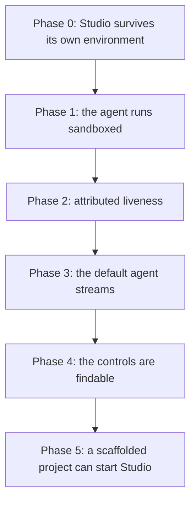

# PRD-085 — Studio tells the user it cannot see, and then cannot say why

**Status: DONE, 2026-08-12 — phases 0–5 executed and verified.** Results, controls and gate
output are in [`studio-wiring-2026-08-12.md`](../../verification/studio-wiring-2026-08-12.md).
§1 is a code read of `packages/studio/` at commit `2551b6d` plus six reproductions run on this
host the same day; every reproduction is quoted with its command. No native, mobile, or device
claim is made anywhere in this file — Studio has no native source.

**One acceptance criterion is open and it is the owner's call.** `@threenative/studio` is not
published, so a scaffold outside this repository cannot install the dependency the templates
now declare. `pnpm studio` was proved in a scaffolded project installed from a locally packed
tarball; it is unproved from a registry.

**A seventh defect was found while proving Phase 5 and fixed in it:** Studio's `bin` never
started when installed as a dependency. `pnpm studio` printed the pnpm banner and exited `0` in
silence, because the CLI guard compared `process.argv[1]` — the `node_modules/.bin` symlink —
against the module's real path using `path.resolve`, which does not resolve symlinks. Nothing in
the repository had ever run Studio the way a user would.

**The report that opened this.** The owner ran Studio and got three symptoms: the panel said
*"Studio status endpoint did not answer"*, the Project files column showed `[+]` and `-` where
icons belong, and Live activity looked inert enough that its functionality was in doubt. A
fourth arrived mid-investigation: no way to hide the bottom dock. A fifth is the owner's
requirement that Studio's agent **run as if in the sandbox** — a clean user project, with the
framework repository's own instructions nowhere near the agent's context.

Those are five symptoms of one defect class. **Studio's whole product claim is that it only
reports what it observed.** It honours that claim for the game and for git. It does not honour
it for itself: when Studio's own server dies, the browser prints one unattributed sentence and
keeps polling forever; when the agent is `claude` — the default — Studio observes no steps at
all and shows an empty activity column indistinguishable from a broken one; and the agent it
spawns silently inherits whatever `CLAUDE.md`, memory and hooks the directory above it
happens to carry.

**Complexity: 6 → MEDIUM mode.** No new package, no new dependency, no charter question. One
crash to fix, one streaming path that was never implemented for the default agent, one context
boundary that does not exist, one diagnosis surface that does not exist, and a set of controls
the user cannot find. The risk is scope: Studio is 1,379 source lines and the sibling
project's equivalent is 60,105. Every phase here is bounded by *make the existing claim true*,
never *add a feature*.

**Blast radius: 5 repository paths.**
`packages/studio/src/server.ts`, `packages/studio/src/app.tsx`,
`packages/studio/__tests__/studio.spec.ts`,
`packages/create-threenative/templates/*/package.json` (Phase 5 only),
`docs/verification/`.

**Depends on:** nothing. **Unblocks:** any Studio use outside this repository — Phase 5 is the
reason a scaffolded project cannot start Studio today.

---

## 1. What was observed, and what the code says

Six reproductions, run on this host on 2026-08-12 against
`examples/abyss-framework` and a scratch project.

### 1.1 A missing `pnpm` kills Studio outright — this is one path to the reported symptom

`startStudio` spawns the preview and attaches `exit`, `stdout` and `stderr` handlers
(`server.ts:552-576`). It attaches no `error` handler. Node throws on an unhandled `error`
event, so a spawn failure takes the whole server down before it can report anything.

```sh
cd examples/abyss-framework
env PATH=/usr/bin:/bin node --input-type=module -e '
import {startStudio} from ".../packages/studio/dist/server.js";
await startStudio({port:4292, previewPort:4293});'
```

```text
node:events:487
      throw er; // Unhandled 'error' event
Error: spawn pnpm ENOENT
    at ChildProcess._handle.onexit (node:internal/child_process:286:19)
```

Compare `spawnCaptured`, which does exactly the right thing at `server.ts:518`:
`child.once("error", reject)`. The preview spawn is the one child process in the file with no
such line.

**This is one confirmed way to reach the reported symptom; it is not proved to be the owner's
way.** Which is precisely the second defect.

### 1.2 The browser cannot tell a dead server from a 500 from a malformed body

`OFFLINE` (`app.tsx:433`) hard-codes the same string into three fields:

```js
const OFFLINE={agent:{available:false,reason:'Studio status endpoint did not answer.'}, ...}
```

`refresh()` (`app.tsx:484-492`) swallows the failure whole:

```js
try{const response=await fetch('/api/status');const body=await response.json();
    if(response.ok&&body&&body.agent&&body.preview&&body.git)next=body}catch{}
status=next||OFFLINE;render();
```

A refused connection, an HTTP 500, and a well-formed 200 with a missing key all produce the
identical sentence. The catch discards the error. No HTTP status, no attempt count, no elapsed
time, and no distinction between *Studio is gone* and *Studio answered badly* reaches the
screen. **A panel whose entire purpose is honest state reporting is, for its own liveness,
reporting a guess.**

The poll also never backs off: `setInterval(refresh,1500)` (`app.tsx:619`) keeps firing every
1.5 seconds against a socket that will never answer again, forever.

### 1.3 On the default agent, Studio streams nothing — Live activity is inert by construction

`detectAgent` prefers `claude` when no `--agent` is passed (`server.ts:88`). `agentStep`
(`server.ts:141-198`) parses exactly one event vocabulary: `item.started`, `item.completed`,
`turn.completed` — Codex's JSONL. `agentCommand` runs Claude Code with
`--output-format json` (`server.ts:121-122`), which emits **one** JSON object after the run
finishes. `agentStep` returns `undefined` for it.

Driven through the real `POST /api/chat`:

```text
0.0s done {"result":{"changedFiles":[],"durationMs":6873,"exitCode":0,
           "summary":"`a.ts:1` already reads `export const SPEED = 8;` …"}}
```

**Zero `step` events across a 6.873-second agent run.** The transcript shows a spinner and a
clock; "Steps observed" stays `0`; the Build and Problems panels stay empty. The owner's doubt
was correct, and the cause is not the UI — the server never sends anything to display. The
verification record for PRD-084 describes streaming as proved, and it was: on the Codex path,
which is the one that path was measured on.

The same run shows a second defect. `runAgent` reports
`after.filter((file) => !before.includes(file))` (`server.ts:315`). `a.ts` was already dirty
when the turn started, so editing it again reports `changedFiles: []`. **Every file the agent
touches twice is reported as untouched the second time** — Studio shows `0` files changed for
a turn that changed a file.

### 1.4 The controls exist and the user cannot find them

Screenshot of Studio at 1920×1080 against `examples/abyss-framework`, plus the computed
styles read from the live page:

- **Project files** renders `entry.directory?'[+]':'-'` (`app.tsx:501`). Two ASCII
  placeholders, no icon, and `-` for every file type from `.ts` to `.apk`.
- **The dock tab strip has one icon between four tabs.** Console has `#console-dot`; Build,
  Problems and Project have nothing (`app.tsx:129-140`).
- **The dock's hide control is not on the dock.** `#dock-toggle` reads "Hide panel" and sits
  in the stage head at `x:1831` — the far top-right corner of the window, 500px above and
  1000px right of the dock it collapses.
- **Below 1180px the Live activity column is deleted, with no way back.**
  `@media(max-width:1180px){….activity-column{display:none}}` (`app.tsx:417`). Steps, files
  changed, playtest assertions, working-tree state and the Run proof control all vanish on any
  window narrower than that, and nothing tells the user they exist.

### 1.5 The default proof scenario does not exist in the project being previewed

`#scenario` ships `defaultValue="playtests/play.playtest.json"` (`app.tsx:243`).
`examples/abyss-framework/playtests/` contains `loading-leak`, `movement-axis`, `navigation`,
`replay` and `terrain`. Studio already lists the real files in its own asset column, three
inches to the left. **Run proof fails on first press in any project that did not scaffold from
the starter template**, and the failure is a typo message rather than a choice.

`runPlaytest` also spawns the runner with `--headed` and no display wrapper
(`server.ts:382`). On a headless host that fails; the repository's own instruction for headed
Chromium is `xvfb-run -a -s '-screen 0 1600x900x24'`.

### 1.6 The agent inherits the framework's instructions — it is not running in a sandbox

`agentCommand` isolates MCP (`--strict-mcp-config --mcp-config '{"mcpServers":{}}'`,
`server.ts:118-120`) and session persistence, and Codex gets `--ignore-user-config`. **Nothing
isolates instruction context.** `spawnCaptured` sets `cwd` to the project, and Claude Code
walks upward from there.

Run with Studio's exact flag vector from `examples/abyss-framework`:

```text
Three files: /home/joao/projects/threejs-webgpu/CLAUDE.md (root),
/home/joao/projects/threejs-webgpu/examples/CLAUDE.md, and my memory index
.../memory/MEMORY.md — mantra: "build a system that builds itself."
```

The same prompt with `--safe-mode` added:

```text
No project instruction files (CLAUDE.md/AGENTS.md) are in my context right now,
and I see no repo mantra.
```

**The agent that is supposed to edit a user's game was reading this repository's framework
rules, the examples rules, and the operator's personal memory index.** It would inherit hooks,
skills, plugins and output styles by the same route. A user's game project has its own
`AGENTS.md` — the templates ship one — and that is the only instruction file Studio's agent
should ever see.

Two consequences, and the second is the product boundary:

1. **Isolation has a named mechanism on both agents.** `claude --safe-mode` disables
   `CLAUDE.md`, skills, plugins, hooks, MCP, custom commands and output styles while leaving
   auth, model selection and permissions working normally — the flag help says so and the
   run above confirms the context effect. The stronger `--bare` also drops `CLAUDE.md`
   auto-discovery but restricts auth to `ANTHROPIC_API_KEY`, which would break every
   OAuth-authenticated user, so it is the wrong default here. Codex's project-doc loading is
   governed by config rather than a flag; `--ignore-rules` and a `project_doc_max_bytes`
   override are the candidates, and Phase 1 measures which one actually empties the context
   rather than assuming.
2. **Studio is being pointed at the wrong kind of directory.** `--project` defaults to
   `process.cwd()` and accepts any directory holding a `package.json` (`server.ts:536-539`),
   so Studio started at this repository's root would hand an agent write access to
   `packages/`. Studio's subject is a **game project** — one scaffolded by
   `create-threenative` or an existing project the user opens — never the framework
   repository. Nothing in the code distinguishes the two.

### 1.7 Smaller fail-closed gaps in the same file

| Where | What it does now |
| --- | --- |
| `parseStudioArgs` (`server.ts:58`) | Unknown flags are ignored silently. `--porte 4200` starts on 4190 and says nothing. |
| `startStudio` (`server.ts:552`) | `startPreview` has no CLI flag; only a programmatic caller can disable the preview. |
| `POST /api/checkpoint`, `POST /api/restore` (`server.ts:664-675`) | Do not check `busy`. Only the disabled button stops a commit landing mid-agent-turn. |
| Preview exit (`server.ts:558`) | `previewExit` is recorded and shown; the process is never restarted and there is no restart control. |
| `POST /api/chat` | A 15-minute agent run has no cancel. Closing the tab leaves the subprocess running to term. |

---

## 2. Solution

Two rules decide every item below.

1. **Studio may only display state it observed, and when it cannot observe, it must say what
   it tried and what happened.**
2. **The agent runs against the user's game and nothing else** — its context is that project's
   own files, and its subject is a scaffolded or opened project, never this repository.

Nothing here adds a capability Studio does not already claim.



Phase order is a dependency chain, not a preference. Phase 1 changes the agent's flag vector,
so Phase 3's streaming work must be built on the isolated vector rather than retrofitted onto
it. Phase 2's diagnosis surface is untestable until Phase 0 stops the process from dying
silently, and Phase 3's step stream has nowhere honest to appear until Phase 2 can distinguish
*no steps* from *no server*.

---

## 3. Execution phases

### Phase 0 — Studio survives its own environment

**Blast radius:** `server.ts`, `__tests__/studio.spec.ts`.

1. Attach `preview.once("error", …)` and record the failure in `previewExit`-adjacent state,
   the same way an exit is recorded. A preview that cannot start is a reported condition, not
   a crash.
2. Reject unknown flags in `parseStudioArgs` with the flag name and the accepted list.
3. Add `--no-preview` so the existing `startPreview: false` path is reachable from the CLI.
4. Enforce `busy` on `POST /api/checkpoint` and `POST /api/restore` server-side, answering
   `409` exactly as `/api/chat` and `/api/proof` already do.

**Exit criteria.** `startStudio` with `PATH` stripped of `pnpm` returns a listening server,
`GET /api/status` answers `200`, and `preview.reason` names `ENOENT`. A test asserts the
process is still alive after the failed spawn — the assertion the current suite does not make.

### Phase 1 — The agent runs sandboxed, against a game project

**Blast radius:** `server.ts`, `__tests__/studio.spec.ts`.

1. **Measure first, then pick the flags.** Run each agent with Studio's current vector inside
   this repository and ask it to name the instruction files in its context; repeat with each
   candidate isolation flag. Record the transcripts. The chosen vector is the one whose answer
   is *none* — for `claude` the run in §1.6 already points at `--safe-mode`, and for `codex`
   the candidates are `--ignore-rules` and a `project_doc_max_bytes` override, neither of which
   has been measured.
2. Add the winning flags to `agentCommand`, keeping auth working — a vector that empties the
   context and also breaks an OAuth-authenticated user is a regression, not an improvement.
3. **The user project's own `AGENTS.md` must survive.** Isolation that also blinds the agent
   to the game's own instructions has overshot; if the chosen flag drops both, the project's
   file is supplied explicitly instead, by the mechanism that agent provides.
4. **Refuse the framework repository as a subject.** `startStudio` already requires a
   `package.json`; it additionally refuses a project that is this repository — detected by the
   workspace marker, not by a hard-coded path — with a message naming the two supported
   subjects: a project scaffolded by `create-threenative`, or an existing game project opened
   with `--project`. An explicit override flag may exist for framework development, and must
   be explicit.

**Exit criteria.** Studio started inside `examples/` and asked, through its own chat box, to
name the instruction files in its context, answers *none* on both agents — while the same
question inside a scaffolded starter names that project's `AGENTS.md` and nothing above it.
Both transcripts go in `docs/verification/`. Studio started at this repository's root refuses
with the two-subject message.

### Phase 2 — Attributed liveness

**Blast radius:** `app.tsx`, `server.ts`, `__tests__/studio.spec.ts`.

1. `refresh()` captures why it failed: a thrown fetch (`error.message`), a non-2xx status
   (the code), or a well-formed 200 whose body is missing a key (which key). The message
   replaces the three copies of the current sentence.
2. The header carries one Studio-liveness chip distinct from the agent, git and preview chips.
   Reachable, or unreachable with the reason and the number of consecutive failures.
3. The poll backs off — 1.5s while healthy, doubling to a 30s ceiling while unreachable, and
   resetting on the first success. A dead Studio must not spend the user's CPU.
4. `GET /api/status` reports the preview's own failure reason (Phase 0's error state), so
   `spawn ENOENT` reaches the browser as text rather than as silence.

**Exit criteria.** Killing the Studio process with the tab open changes the panel within one
backoff interval to a message naming the connection failure. Returning a hand-crafted `500`
produces a different message naming `500`. Both are asserted; a test that cannot tell the two
apart fails.

### Phase 3 — The default agent streams

**Blast radius:** `server.ts`, `__tests__/studio.spec.ts`.

1. Run Claude Code with its streaming output format instead of the single-blob
   `--output-format json`, and extend `agentStep` to map its event vocabulary to the same
   `IAgentStep` shape Codex already produces. One step type per existing kind — `command`,
   `file`, `message`, `thought`, `error`, `usage` — and nothing new invented.
2. `agentStep` stays fail-closed: an unrecognised line returns `undefined`, never a fabricated
   step. Unit tests pin one real captured line per kind, per agent.
3. Report changed files by comparing content, not set membership, so a file dirty before the
   turn and edited during it is reported. The `before`/`after` diff at `server.ts:315` is the
   defect; a per-file status comparison replaces it.
4. Add a cancel path for a running turn: `DELETE /api/chat` terminates the child, the SSE
   stream emits a terminal event, and `busy` clears.

**Exit criteria.** A real `claude` turn that edits one file streams at least one `command` or
`file` step before `done`, and reports that file in `changedFiles` when it was already dirty.
Recorded with timings in `docs/verification/`, on both agent paths — **the missing control in
the PRD-084 record was that only Codex was ever measured for streaming.**

### Phase 4 — The controls are findable

**Blast radius:** `app.tsx`.

1. Replace the `[+]` / `-` placeholders with real glyphs — inline SVG in the page, no font
   dependency and no network fetch, since Studio serves one self-contained HTML file. A folder
   mark, and a file mark that distinguishes at minimum source, scenario, config and binary.
2. Give Build, Problems and Project the same icon treatment Console has, so the tab strip
   reads as one row rather than one labelled tab and three words.
3. Put a collapse control **on the dock**, at the end of its own tab strip, in addition to the
   existing stage-head button. Both write the same `localStorage` key.
4. Below 1180px, Live activity collapses into the dock's tab strip as a fifth tab rather than
   `display:none`. Nothing the user was told exists may vanish without a route back.
5. `#scenario` becomes a select populated from the project's own `playtests/*.json` — Studio
   already reads that tree for the asset column. An empty list disables Run proof with a
   reason, and never with a default that does not exist. **Built without the free-text
   fallback the first draft asked for:** the select already carries every scenario the project
   has, and an unused input is a control the user has to read past.

**Exit criteria.** A Playwright pass at 1920×1080 and at 1100×800 under
`xvfb-run -a -s '-screen 0 1600x900x24'`: every control listed above is reachable at both
widths, and the scenario select contains the five scenarios that exist in
`examples/abyss-framework/playtests/`.

### Phase 5 — A scaffolded project can start Studio

**Blast radius:** `packages/create-threenative/templates/*/package.json`, template docs.

Studio is reachable today only as `node packages/studio/dist/server.js` from inside this
repository. No template lists `@threenative/studio`, no template has a `studio` script, and the
root `package.json` has none either — grep over
`packages/create-threenative/templates/*/package.json` returns nothing. **The package proved in
PRD-084 against a packed consumer is not installed by the thing that scaffolds consumers.**

1. Each template gains `@threenative/studio` as a devDependency at a real version — templates
   ship literal versions, never `catalog:` — and a `"studio": "threenative-studio"` script.
2. The template `AGENTS.md` gains one line saying what `pnpm studio` does and what it needs
   (an installed `claude` or `codex`).
3. `runPlaytest` wraps the runner for headless hosts, or states in the returned reason that a
   display is required. Silence when no display exists is the failure this repository has
   already paid for once.

**Exit criteria.** `pnpm test:templates` still passes, the scaffold smoke asserts no
`catalog:` survives, and a scaffolded starter runs `pnpm studio`, reaches its own preview, and
answers `GET /api/status` with `200`.

---

## 4. Verification strategy

```sh
# 1. Studio survives a preview that cannot spawn — the Phase 0 assertion
#    Expected: listening server, status 200, preview.reason names ENOENT

# 2. Context isolation — ask the agent, through Studio, what instructions it holds
#    Inside examples/: expected "none", on both agents.
#    Inside a scaffolded starter: expected that project's AGENTS.md, and nothing above it.
#    A run that names this repository's CLAUDE.md fails the phase.

# 3. Isolation revert check — the flags are load-bearing
#    Remove the isolation flags from agentCommand and re-run check 2 inside examples/.
#    Expected: the repo CLAUDE.md is named again. If it is not, check 2 asserts nothing.

# 4. Subject check — Studio refuses the framework repository
#    Expected: startStudio at the repo root throws and names the two supported subjects.

# 5. Liveness is attributed — kill the server, then hand it a 500
#    Expected: two different messages. One message for both cases fails the phase.

# 6. The claude path streams — a real turn, counted
#    Expected: >= 1 step event before `done`. Zero fails the phase.

# 7. Incumbent check — no second status shape, no second step shape
grep -n "did not answer" packages/studio/src/app.tsx
#    Expected: no output. The unattributed string is gone, not supplemented.

# 8. Streaming revert check — the streaming path is load-bearing
#    Point agentCommand back at --output-format json and re-run check 6.
#    Expected: FAILS. If it still passes, the test is asserting nothing.

# 9. Scope check — no operation registry, no project format, no scene format
grep -rn "operationRegistry\|planHash\|applyPlan\|sceneFormat" packages/studio/
#    Expected: no output.
```

Repository gates, all of which must be run and pasted, never asserted:
`pnpm typecheck`, `pnpm lint`, `pnpm test`, `pnpm budgets`, `pnpm test:templates` (Phase 5).
Studio contributed 698 non-test lines when PRD-084 closed and the framework trigger was
uncrossed at 10,216/15,000; this PRD must re-report both numbers and justify the delta in
this file if the trigger is approached.

---

## 5. Acceptance criteria

1. A preview that cannot spawn leaves Studio running and reports the reason in the browser.
2. The agent holds no instruction file from outside the project it is editing, on both agent
   paths, and still holds the project's own `AGENTS.md`. Transcripts recorded, with the
   flags-removed control observed red.
3. Studio refuses this repository as a subject and names the two it supports: a scaffolded
   project, or an existing project opened with `--project`.
4. Studio's own unreachability is reported with what was tried and what happened, and the two
   distinct causes — no connection, bad response — produce distinct messages.
5. A `claude` turn streams steps, and the activity column moves during it. Measured on both
   agents, with timings, in `docs/verification/`.
6. A file already dirty before a turn and edited during it appears in that turn's changed
   files.
7. The dock is collapsible from the dock, the project tree has icons, and Live activity is
   reachable at 1100px width.
8. Run proof's default scenario exists in the project, or Run proof is disabled with a reason.
9. `pnpm studio` works in a freshly scaffolded starter.
10. No new package, no new runtime dependency, no operation registry, no project format.

---

## 6. What this PRD deliberately does not do

- **No editor, no scene format, no IR, no preset system.** Those are closed with evidence and
  a wiring PRD does not reopen them.
- **No FPS counter and no game-console readout.** The preview is cross-origin; Studio cannot
  observe them, and the current copy correctly says so.
- **No multi-turn agent session or chat history persistence.** That is a product decision, not
  a wiring gap, and it belongs in its own PRD with its own evidence.
- **No native claim.** Studio has no native source and this PRD adds none.
