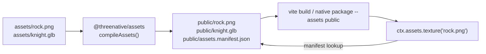
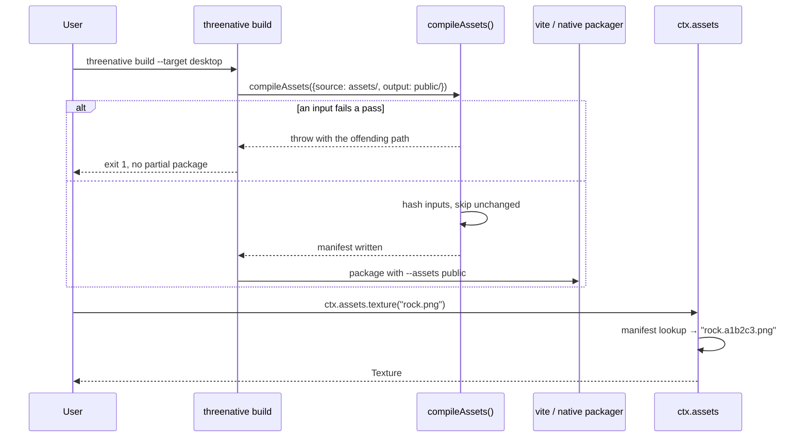

# PRD-094 — The asset compile step: `assets/` becomes an input, not a `.gitkeep`

**Status: DONE, 2026-08-22.** All phases executed and gated; evidence in
docs/verification/asset-pipeline-prd-094-2026-08-22.md.
**Parent:** [the series README](./asset-pipeline/README.md).
**Blocks:** [PRD-095](./PRD-095-texture-compression.md),
[PRD-096](./PRD-096-mesh-optimization.md).

**Complexity: 8 → HIGH mode.** New package, multi-package change, new build stage, and a
CLI that native builds already depend on. Checkpoints are mandatory every phase.

**Gate disposition.** [`docs/product/ASSET-PIPELINE.md`](../../product/ASSET-PIPELINE.md)
deferred the build-time pipeline behind a two-part trigger. On 2026-08-22 the product owner
ordered execution directly, superseding the deferral; neither trigger condition was met, and
that fact stands recorded here rather than being argued into having fired.

This PRD ships **no compression**. It ships the stage that later PRDs plug compressors into, and
it proves that stage end-to-end on a real template with a real playtest. A pipeline with one
pass-through transform that is genuinely wired beats four compressors nothing calls.

---

## 1. Context

**Problem:** ThreeNative has no asset build step. Every template creates an `assets/` directory
containing only `.gitkeep`, ships its real art in `public/`, and loads it raw.

**Files analysed:**

- `packages/core/src/assets.ts` — `createAssetLoader`, the only asset code in the framework
- `packages/core/src/game.ts:443` — the single live construction site, `ctx.assets`
  (line 130 holds the `defineGame` `assets?: IAssetLoaderOptions` config key)
- `packages/core/src/index.ts` — `createAssetLoader` and `IAssetLoader` are **not** exported
- `packages/create-threenative/src/build.ts:233` — `const assets = path.join(cwd, "public")`,
  passed as `--assets` to the native packager at three call sites below it
- `packages/create-threenative/templates/starter/` — the one template whose game loads real
  files through `ctx.assets`: `src/scenes/Play.ts:49-50,78` loads `native-proof.png`,
  `native-proof.glb`, `pickup.ogg` out of `public/`. All three templates still carry
  `assets/.gitkeep`; `platformer` is fully procedural and loads no files.
- `packages/runtime-native/src/gltf/gltf_loader.cpp` — cgltf, reached from JS as `__loadGLTF`
  (`runtime.cpp:2785`)

**Current behaviour:**

- `ctx.assets.model(path)` dynamically imports stock `GLTFLoader` and loads the URL as-is.
- `ctx.assets.texture(path)` uses `TextureLoader`, or a `createImageBitmap` path when `Image` is
  undefined — the native shim route.
- No decoder is ever configured. A `.glb` using `EXT_meshopt_compression` or
  `KHR_texture_basisu` **fails to load today**, silently on some paths.
- `threenative build --target desktop|android|ios` copies `public/` verbatim into the package.
- The `assets/` directory is inert. Nothing reads it, nothing writes it.

---

## 2. Solution

**`assets/` becomes the source directory. `public/` becomes generated output.** One new
build-time package compiles the first into the second and writes a manifest. The runtime keeps
loading ordinary URLs and does not learn a new API.

- `packages/assets` — new, `@threenative/assets`. Node-only. Carries the encoder dependencies
  that `core` must never inherit. In this PRD it carries only `@gltf-transform/core` and
  performs an identity transform; PRD-095 and PRD-096 add the real passes.
- `compileAssets({ source, output })` walks `assets/`, runs each file through the registered
  passes for its kind, writes results to `public/`, and emits `public/assets.manifest.json`.
- `threenative build` calls it before Vite, for every target including `web`.
- `ctx.assets` gains manifest awareness: given `"rock.png"` it resolves the compiled output
  recorded in the manifest. With no manifest, it resolves the path unchanged — the fallback that
  keeps every existing game running.



**Key decisions:**

- [x] `@gltf-transform/core` (MIT) for glTF I/O — never a hand-rolled parser.
- [x] The compiler is **content-addressed and incremental**: output name embeds a hash of
  (input bytes + pass configuration). A changed pass invalidates output without a clean step.
- [x] **Fail closed.** An unreadable input, a pass that throws, or a manifest that does not
  parse aborts the build with the offending path. A skipped asset is never a warning.
- [x] Configuration lives in the existing `threenative` config object read by
  `create-threenative/src/config.ts`, under `assets`. No new config file.
- [x] Idempotent: recompiling committed output is a no-op, so a user may commit `public/` or
  gitignore it, and both work.

**Data changes:** one generated file, `public/assets.manifest.json`:

```json
{
  "version": 1,
  "entries": {
    "rock.png": { "output": "rock.a1b2c3.png", "kind": "texture", "bytes": 184320, "passes": [] }
  }
}
```

### Budget disclosure

`packages/assets/src` counts toward the 15,000-line framework review trigger, which stood at
**10,637 lines on 2026-08-12** (`pnpm budgets`). This PRD's own target is **under 400 lines** — a directory walk, a pass registry, a manifest writer and a hash.
The series total across PRD-094 to PRD-099 is expected to land near 1,500. That is a real
increase and it is recorded here rather than argued away. The kill-switch justification is that
none of it is code a game could write in under 20 lines: it is encoder orchestration, and the
alternative is every game author running `toktx` and `gltfpack` by hand.

---

## 3. Sequence flow



---

## 4. Integration Ledger

| # | New thing | Live caller (`file:line`, non-test) | Replaces | Old path removed? | Negative control |
|---|---|---|---|---|---|
| 1 | `compileAssets()` in `packages/assets/src/compile.ts` | `create-threenative/src/build.ts:86` (before the Vite spawn; again at `:229` before native packaging) | nothing — no compile step exists | n/a | deleting `assets/rock.png` and rebuilding must fail the playtest that loads it |
| 2 | manifest resolution in `core/src/assets.ts` | `core/src/game.ts:399` via `createAssetLoader(this.#config.assets)` | the bare `resolvePath()` branch | `resolvePath` becomes the no-manifest fallback in the same phase | corrupting a manifest entry's `output` must break the load, not silently fall through |
| 3 | `assets` key in the `threenative` config | `create-threenative/src/config.ts:877` (`validateAssets`) | nothing | n/a | an unknown key under `assets` must throw at config load |
| 4 | `public/assets.manifest.json` | read at runtime by ledger row 2; consumed as a build input by nothing | nothing | n/a | delete it and re-run — it must regenerate, never pass on the stale copy |
| 5 | `runHealthReport()` in `packages/assets/src/health.ts` | `assets/src/compile.ts:410`, after the passes (empty-inputs branch at `:374`) | nothing | n/a | return a literal count instead of measuring → two different models must not report the same number |

### Reachability

**How is this reached?**

- [x] Entry point: the `threenative` CLI bin, `packages/create-threenative/src/threenative.ts`
- [x] Pre-existing file edited to call it: `packages/create-threenative/src/build.ts`
- [x] Registration: none needed — `build.ts` is a straight-line script

**Is it user-facing?** Indirectly. There is no UI; the observable outcome is that files appear in
`public/`, the manifest lists them, and the game renders from the compiled copies.

**Full flow:**

1. User drops `rock.png` into `assets/`
2. Runs `threenative build --target web` (or `pnpm dev`, see Phase 4)
3. `build.ts` calls `compileAssets` before Vite
4. `public/rock.<hash>.png` and the manifest appear
5. `ctx.assets.texture("rock.png")` resolves through the manifest and the rock renders

**What does this replace?** Nothing for the compile step. The manifest lookup replaces the
unconditional `resolvePath` return in `assets.ts`, which becomes the fallback branch in Phase 2.

---

## 5. Execution phases

#### Phase 1: The package compiles one file and the CLI runs it — a PNG placed in `assets/` appears in `public/` after `threenative build`

**Files (max 5):**

- `packages/assets/package.json` - NEW: `@threenative/assets`, `test` = build + `publint`
- `packages/assets/src/compile.ts` - NEW: walk, hash, identity pass, manifest write
- `packages/assets/src/index.ts` - NEW: exports `compileAssets`, `IAssetCompileOptions`
- `packages/create-threenative/src/build.ts` - EDIT: call `compileAssets` before the Vite spawn
- `packages/create-threenative/src/config.ts` - EDIT: parse and validate the `assets` key

**Implementation:**

- [x] Walk `assets/` recursively; classify by extension into `texture | model | audio | other`
- [x] Hash input bytes plus the serialised pass configuration; emit `<name>.<hash8><ext>`
- [x] Write `public/assets.manifest.json` last, after every output is on disk
- [x] Throw on: unreadable input, duplicate logical path, pass exception, unknown config key
- [x] Skip work when the hashed output already exists and the manifest agrees

**Wiring:**

- [x] Caller edited: `build.ts` invokes `compileAssets` for every target, before Vite
- [x] Registration: `@threenative/assets` added to `create-threenative` dependencies
- [x] Old path: n/a
- [x] Ledger rows filled: #1, #3, #4

**Tests required:**

| Test file | Test name | Assertion | Negative control (must be observed red) |
|---|---|---|---|
| `packages/assets/__tests__/compile.spec.ts` | `should write a hashed output and a manifest entry when an input exists` | manifest `entries["rock.png"].output` matches `/^rock\.[0-9a-f]{8}\.png$/` | delete the input mid-run → throws |
| `packages/assets/__tests__/compile.spec.ts` | `should throw when a pass throws` | rejects with the offending path in the message | stub the pass to succeed → the test goes red |
| `packages/assets/__tests__/compile.spec.ts` | `should not rewrite an output whose hash is unchanged` | second run leaves `mtime` untouched | touch the pass config between runs → rewrite happens, assertion fails |
| `packages/create-threenative/__tests__/build.spec.ts` | `should compile assets before invoking vite` | spy ordering: compile call index < vite spawn index | remove the `build.ts` edit → red |

**Revert check:** remove the `compileAssets` call from `build.ts` → `build.spec.ts` ordering test
fails, and Phase 3's playtest fails to find the compiled file.

**User verification:** drop a PNG in `assets/`, run `threenative build --target web`, see the
hashed file and the manifest entry.

---

#### Phase 2: The runtime resolves through the manifest — a game asks for `rock.png` and gets the compiled file

**Files (max 5):**

- `packages/core/src/assets.ts` - EDIT: manifest fetch, cache, resolution; `resolvePath` demoted
  to the no-manifest fallback
- `packages/core/src/game.ts` - NO EDIT NEEDED: `defineGame`'s `assets?: IAssetLoaderOptions`
  already flows whole into `createAssetLoader`, so the new `manifest` field threads through
  untouched (confirmed at execution)
- `packages/core/src/index.ts` - EDIT: export `createAssetLoader` and `IAssetLoader`, which are
  currently unexported despite being live
- `packages/core/__tests__/assets.spec.ts` - EDIT: manifest cases

**Implementation:**

- [x] Fetch `assets.manifest.json` once, lazily, on first asset request; memoise the promise
- [x] A 404 is the documented no-manifest case → fall back to `resolvePath`, do not throw
- [x] A 200 that fails to parse, or has an unknown `version`, **throws** — fail closed
- [x] A manifest present but missing the requested logical path throws, naming the path

**Wiring:**

- [x] Caller edited: `game.ts:399` already constructs the loader; it now passes the manifest URL
- [x] Registration: n/a
- [x] Old path: `resolvePath` retained as the explicit fallback, not a second implementation
- [x] Ledger rows filled: #2

**Tests required:**

| Test file | Test name | Assertion | Negative control |
|---|---|---|---|
| `core/__tests__/assets.spec.ts` | `should resolve a logical path to the manifest output when a manifest exists` | fetch called with `rock.a1b2c3.png` | drop the manifest → falls back, assertion red |
| `core/__tests__/assets.spec.ts` | `should load the raw path when no manifest is served` | fetch called with `rock.png` | serve a manifest → red |
| `core/__tests__/assets.spec.ts` | `should throw when the manifest is present but the path is absent` | rejects naming `rock.png` | add the entry → red |
| `core/__tests__/assets.spec.ts` | `should throw when the manifest version is unknown` | rejects | set `version: 1` → red |

**Revert check:** revert `assets.ts` → three of the four tests above fail, and the Phase 3
playtest loads the uncompiled path.

---

#### Phase 3: The starter template ships real source assets and proves it in a browser

**Proof subject:** `templates/starter` — updated 2026-08-22 from the originally-proposed
`platformer`, which has since become fully procedural and loads no files, so it would prove
nothing about loading. Starter is the shipped template whose game already loads files through
`ctx.assets` (`src/scenes/Play.ts:49-50,78`); its `public/native-proof.glb`, `.png` and
`pickup.ogg` move to `assets/` and become compiler inputs.

**Files (max 5):**

- `packages/create-threenative/templates/starter/assets/` - EDIT: real inputs replace `.gitkeep`
- `packages/create-threenative/templates/starter/.gitignore` - EDIT: ignore generated `public/`
  outputs and the manifest
- `packages/create-threenative/templates/starter/package.json` - EDIT: `predev`/`prebuild`
  runs the compile
- `packages/create-threenative/templates/starter/playtests/assets.playtest.json` - NEW
- `packages/create-threenative/src/index.ts` - EDIT: scaffold no longer emits an empty `assets/`

**Implementation:**

- [x] Move the model, texture and pickup audio from `public/` into `assets/`
- [x] Assert in the scaffold smoke test that a fresh project compiles assets on first `dev`
  (scaffold spec pins sources-shipped / no `.gitkeep` / no committed manifest; the
  verify-one-template lane proves a fresh tarball-scaffolded project compiling at first
  `pnpm dev` with the raw files gone)
- [x] The playtest asserts the mesh is **visible**, not merely that a request returned 200

**Wiring:**

- [x] Caller edited: `create-threenative/src/index.ts` (installs the template's dotless
  `gitignore` under its real name — pnpm pack strips `.gitignore` — and writes a pnpm
  override per local package source, so the packed CLI's own `@threenative/assets`
  dependency installs offline). Template `package.json` needs no compile scripts: phase 4's
  serve plugin compiles on dev start and `threenative build` compiles before every target.
- [x] Old path: the raw copies in `public/` are deleted in this phase — not left as a fallback
- [x] Ledger rows filled: all rows now carry real `file:line`

**Tests required:**

| Test file | Test name | Assertion | Negative control |
|---|---|---|---|
| `playtests/assets.playtest.json` | compiled model is visible | `visibility` assertion on the model node | point the game at a nonexistent asset → exit 1 |
| `playtests/assets.playtest.json` | no console error during load | console assertion, zero errors | corrupt a manifest entry → red |
| `create-threenative/__tests__/scaffold.spec.ts` | `should not scaffold an empty assets directory` | no `.gitkeep` in output | revert the index edit → red |

**Revert check:** restore the raw files to `public/` and delete `assets/` → the playtest fails
with a missing asset, because there is no longer an uncompiled copy to fall back to.

**User verification:** `pnpm --filter starter dev`, open the page, see the model. Delete
`public/` and re-run — it regenerates.

---

#### Phase 3b: The asset health report — the part with value before any compression exists

The deferral doc calls this the day-one value, so it ships in the same PRD as the stage rather
than trailing the compressors. With every pass still an identity transform it already tells a
user why their game is slow.

**Files (max 5):**

- `packages/assets/src/health.ts` - NEW: per-asset findings against a declared target
- `packages/assets/src/compile.ts` - EDIT: run health after the passes, print the report
- `packages/create-threenative/src/config.ts` - EDIT: `assets.targets` (triangle, texture,
  material budgets)
- `packages/assets/__tests__/health.spec.ts` - NEW

**Implementation:**

- [x] Per model: triangles, materials, texture count and dimensions, animation clips, whether a
      collider is present, whether root motion is detected
- [x] Per texture: dimensions, whether it is power-of-two, alpha presence
- [x] License and attribution carried through from the discovery MCP's metadata when present, and
      reported as **unknown** when absent — never blank
- [x] Each finding is `ok`, `warn` or `fail` against `assets.targets`; **`fail` fails the build**
      only when the user set a target, so the report is informational until opted into
- [x] `--json` for the machine-readable form the round ledger consumes

**Wiring:**

- [x] Caller edited: `compile.ts` runs it unconditionally
- [x] Ledger rows filled: this phase adds a fifth row for `runHealthReport`

**Tests required:**

| Test file | Test name | Assertion | Negative control |
|---|---|---|---|
| `health.spec.ts` | `should report a triangle count that fails a declared target` | finding is `fail` | raise the target → `ok`, assertion red |
| `health.spec.ts` | `should report license as unknown when no metadata exists` | literal `"unknown"` | attach metadata → red |
| `health.spec.ts` | `should not fail the build when no target is declared` | exit 0 with warnings | declare a target → exit 1 |
| `health.spec.ts` | `should report a count that changes with the asset` | two different models give different counts | return a literal → red |

**Revert check:** remove the health call from `compile.ts` → the report tests fail and
`--json` emits nothing.

**User verification:** run the build on a heavy model, read the report, see the triangle count and
the missing collider.

---

#### Phase 4: Dev-mode compilation, so the loop is not "rebuild to see a texture"

**Files (max 5):**

- `packages/assets/src/watch.ts` - NEW: watch `assets/`, recompile changed inputs
- `packages/assets/src/index.ts` - EDIT: export `watchAssets`
- `packages/create-threenative/templates/*/vite.config.ts` - EDIT: a small plugin calling
  `watchAssets` in `serve` mode

**Implementation:**

- [x] Recompile only the changed input; rewrite the manifest atomically
- [x] Debounce; a write that fails a pass logs the path and leaves the previous output intact
- [x] Never watch in `build` mode

**Wiring:**

- [x] Caller edited: each template's `vite.config.ts`
- [x] Old path: n/a
- [x] Ledger rows filled: n/a — this phase adds no ledger row, it makes row #1 reachable in dev

**Tests required:**

| Test file | Test name | Assertion | Negative control |
|---|---|---|---|
| `packages/assets/__tests__/watch.spec.ts` | `should recompile only the changed input` | one output rewritten, others untouched | touch two files → red |
| `packages/assets/__tests__/watch.spec.ts` | `should keep the previous output when a pass throws` | old bytes still on disk | make the pass succeed → red |

**Revert check:** remove the plugin → editing a source asset during `dev` no longer updates the
page, caught by the watch spec.

---

## 6. Verification strategy

**Integration proof (required, and not satisfied by any test above):**

```bash
# 1. Caller census — every new exported symbol has a non-test consumer
grep -rn "compileAssets\|watchAssets" packages --include='*.ts' | grep -v __tests__ | grep -v node_modules
# Expected: at least one hit in packages/create-threenative/src/ or a template vite.config.ts

# 2. Revert check — removing the compile call must break something pre-existing
#    (comment out the compileAssets call in build.ts, then:)
pnpm test && pnpm test:templates
# Expected: build.spec.ts ordering test and the platformer asset playtest both fail

# 3. Incumbent check — no second resolution path survives
grep -n "resolvePath" packages/core/src/assets.ts
# Expected: ONE definition. Three call sites are structurally required — the default manifest
# URL join, the no-manifest fallback, and the manifest-output join each reapply basePath.
# What must not exist is a second resolver implementation or an unconditional resolvePath
# ahead of the manifest lookup (updated from "one call site" at execution: the spec itself
# requires the extra joins).

# 4. Stale-artifact control
rm -rf packages/create-threenative/templates/starter/public/assets.manifest.json
pnpm --filter starter build
# Expected: the manifest regenerates; the build must not pass on the deleted copy
```

Gates:

```sh
pnpm typecheck && pnpm lint && pnpm test
pnpm test:templates
pnpm budgets                 # the 15k trigger report is expected to move; record the new number
sh scripts/xvfb.sh pnpm test:playtest
```

---

## 7. Acceptance criteria

Consumer-scoped. Each is false today.

- [x] A user drops a PNG into `assets/`, runs `dev`, and the texture appears on screen without
      touching `public/`
- [x] Deleting `public/` entirely and rebuilding produces a game that runs identically
- [x] A scaffolded project has no empty `assets/.gitkeep`; the directory holds real inputs or
      does not exist
- [x] A corrupt manifest entry makes the game fail loudly at load, naming the asset — it never
      silently renders an untextured mesh
- [x] The desktop native package built by `threenative build --target desktop` contains the
      compiled outputs, not the sources
- [x] Building a project containing a heavy model prints an asset health report naming the
      triangle count, the material count, the texture dimensions and the missing collider —
      before any compression pass exists

**Integration gates:**

- [x] Integration Ledger has zero `TBD` cells
- [x] Every new exported symbol has a non-test consumer (census pasted above)
- [x] Revert check passed: disabling the compile step fails a pre-existing template playtest
- [x] The raw copies in `templates/starter/public/` are deleted, not kept as a fallback
- [x] Every gate has an observed negative control recorded red
- [x] Proved on `starter`, the one shipped template whose game loads real asset files — not on a
      fixture

## 8. Risks

| Risk | Why it is real here | Mitigation |
|---|---|---|
| The compile step becomes a second source of truth for `public/` | Users hand-place files in `public/` today | Only manifest-listed paths are managed; unlisted files in `public/` are left alone and documented as hand-owned |
| Watch mode fights Vite's own watcher | Both watch the project tree | `assets/` is outside Vite's root inputs; the plugin writes to `public/` which Vite already treats as static |
| The manifest fetch adds a round trip to first load | Every game pays it | One request, memoised, issued in parallel with the first asset; a 404 costs nothing on games that opt out |
| A generated `public/` breaks users who commit it | Both habits exist | Output is content-addressed and idempotent, so committing it is safe and recompiling is a no-op |
