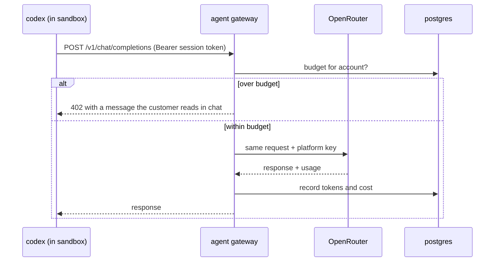

# PRD-104 — Codex on OpenRouter, on a key the sandbox never sees

**Status: COMPLETE, 2026-08-13.** Verified through the full topology against a live provider, not
against stubs.

A customer's chat turn inside a hosted session is answered by Codex through the gateway and
OpenRouter, changes a file in their game, and is metered at the provider's own reported cost. The
sandbox holds no provider key — it reaches the gateway by name on the sandbox network and
authenticates with its own session token. An account whose budget is used up reads a plain
sentence in the chat panel rather than watching a spinner. `packages/studio` gains one optional
argument and its local invocation is byte-for-byte unchanged.

**Everything of consequence here was found by running it.** The design in the sections below was
wrong in six ways that every stub test passed: the provider config Codex silently ignored, a
`wire_api` it rejects outright, a forced non-streaming reply it waits on forever, a nested sandbox
that could not execute a single command, a driver never wired to the gateway, and a model name the
gateway would have rejected on every turn. Each is recorded below rather than quietly corrected,
because the pattern is the lesson: a PRD written against a file read describes something that does
not run.

**Complexity: 8 → HIGH mode.** New system (+2), 6–10 files (+2), external API integration (+1),
schema change (+1), multi-package — the one framework change in the series (+2).

**Problem:** in production the agent must be Codex talking to OpenRouter on a platform key, and
that key cannot live in the sandbox. The agent has a shell (`agentProtocol.ts:38` runs
`codex exec … --sandbox workspace-write`) and the code it writes runs in the same container, so
any secret in that environment is readable by the customer's own prompt. There is also no spend
limit: the Claude branch passes `--max-budget-usd 1` (`agentProtocol.ts:25`), and **the Codex
branch has no equivalent flag at all** — so a per-account cap has to be enforced somewhere else.

Development is unaffected. The operator's own Codex install keeps working exactly as it does
today, with no gateway and no OpenRouter.

---

## Current behaviour

- `agentProtocol.ts:14` `agentCommand` builds the invocation. The Codex branch is
  `exec --json --ephemeral --ignore-user-config --ignore-rules -c project_doc_max_bytes=0
  --skip-git-repo-check --sandbox workspace-write --cd <project> <prompt>`.
- **`--ignore-user-config` (`agentProtocol.ts:35`) means a `~/.codex/config.toml` describing an
  OpenRouter provider is ignored by construction.** Baking a config file into the image does
  nothing. The provider has to arrive as `-c` overrides.
- `detectAgent` (`server.ts:~99`) probes the binary on `PATH`; `AGENT_TIMEOUT_MS`
  (`server.ts:52`) is 900,000 ms, so a silent stall costs fifteen minutes of a customer's session.
- Studio has no concept of an account, a budget, or a cost.

---

## Solution

An OpenAI-compatible gateway in `hosting/`, plus the smallest possible change in
`@threenative/studio` to let the invocation name a provider.

**Key decisions**

- **The sandbox holds a session token, never a provider key.** `OPENAI_API_KEY` inside the
  sandbox is the PRD-102 session token; the gateway exchanges it for the real OpenRouter key,
  which exists only in the gateway's environment.
- **The budget is enforced at the gateway, because Codex cannot enforce it.** This is not a
  preference; `--max-budget-usd` is a Claude flag and has no Codex counterpart. A cap that lives
  anywhere else on a public service is decorative.
- **Refusal is a message, not a hang.** Over budget returns an error Codex surfaces into the step
  stream, so the customer reads "this game's budget for today is used up" instead of watching a
  spinner for the full fifteen-minute timeout.
- **The framework change is one optional argument.** `agentCommand` gains an optional provider
  descriptor and emits the corresponding `-c` overrides. It is roughly ten lines, it is plumbing
  every hosted deployment would otherwise rewrite, and it serves local users who want their own
  provider too. It ships in the package, so local and hosted keep running one Studio.
- **Model choice is the gateway's, not the sandbox's.** A customer cannot select an expensive
  model by editing a request; the gateway pins the model and rejects an override.

**Data changes:** `agent_usage` (account_id, project_id, session_id, model, prompt_tokens,
completion_tokens, cost_usd, created_at) and `account_budgets` (daily and monthly caps).

---

## Integration Ledger

| # | New thing | Live caller (`file:line`, non-test) | Replaces | Old path removed? | Negative control |
|---|-----------|-------------------------------------|----------|-------------------|------------------|
| 1 | `hosting/gateway/` service | sandbox `codex` via `base_url`; `compose.yaml` service | direct provider access from the sandbox | yes — egress allowlist permits only the gateway | with the gateway stopped, a chat turn errors visibly instead of reaching a provider |
| 2 | `provider` argument to `agentCommand` | `server.ts` agent spawn; sandbox entrypoint supplies the values | hardcoded Codex defaults | no — the argument is optional and local behaviour is unchanged | omitting it must produce today's exact argv, asserted byte-for-byte |
| 3 | `agent_usage` rows | gateway writes on every completed request | nothing | n/a | a request that reaches OpenRouter with no row recorded fails the test |
| 4 | Budget check | gateway, before forwarding | `--max-budget-usd` (Claude only, unused here) | n/a | an account over cap must be refused; removing the check lets it through |
| 5 | Rate + concurrency limits | gateway middleware | nothing | n/a | a burst beyond the limit returns 429 |

---

## Reachability

**How will this feature be reached?** Every chat turn a customer sends in production.

**Pre-existing files EDITED:** `packages/studio/src/agentProtocol.ts`,
`packages/studio/src/server.ts`, `packages/studio/__tests__/studio.spec.ts`,
`hosting/sandbox/entrypoint.sh`, `hosting/compose.yaml`.

**Full flow:** customer types in Studio chat → `POST /api/chat` (`server.ts:832`) spawns Codex
with provider overrides pointing at the gateway → Codex sends the session token → gateway checks
the budget, forwards with the platform key, records usage → the answer streams back as steps the
customer watches → the spend appears against their account.

**What does this replace?** Nothing in the local path. In production it replaces the *absence* of
a provider — without it, a hosted sandbox has no way to reach a model at all.

---

## Phases

#### Phase 1: `agentCommand` can name a provider, and today's argv is unchanged without one

**Files:**
- `packages/studio/src/agentProtocol.ts` — EDIT: optional provider descriptor → `-c` overrides
- `packages/studio/src/server.ts` — EDIT: reads the descriptor from environment and passes it
- `packages/studio/__tests__/studio.spec.ts` — EDIT: argv assertions
- `hosting/sandbox/entrypoint.sh` — EDIT: supplies base URL, model and `OPENAI_API_KEY`

**Implementation**
- [x] Descriptor `{name, baseUrl, model, envKey}` emits
      `-c model_provider=<id> -c model_providers.<id>.base_url=… -c model_providers.<id>.env_key=…
      -c model_providers.<id>.wire_api=… -c model=<model>`.
- [x] A malformed descriptor **throws at construction**; accepting it and dropping fields would be
      a hosted-only failure that local tests never see.
- [x] `--ignore-user-config` stays. The overrides are the supported path precisely because it does.

**Wiring**
- [x] Caller edited: `server.ts` passes the descriptor through to the spawn.
- [x] Ledger row filled: #2.

**Tests Required**

| Test File | Test Name | Assertion | Negative control (observed red) |
|---|---|---|---|
| `packages/studio/__tests__/studio.spec.ts` | `should build today's codex argv when no provider is given` | argv deep-equals the current array | change any default → red |
| `…/studio.spec.ts` | `should emit model_provider overrides when a provider is given` | `-c model_provider=openrouter` present with base_url and env_key | drop the emission → red |
| `…/studio.spec.ts` | `should throw when the provider descriptor is missing base_url` | throws | default it to empty → silently wrong, red |

**Revert check:** remove the descriptor handling → the sandbox in Phase 3 cannot reach any
provider and its chat test fails.

**This is the only change this series makes to a framework package,** and it ships to local users
in the same release.

---

#### Phase 2: The gateway forwards to OpenRouter and records what it cost

**Files:**
- `hosting/gateway/server.ts` — NEW: OpenAI-compatible endpoint, token exchange, forwarding
- `hosting/gateway/usage.ts` — NEW: usage parsing and cost calculation
- `hosting/control-plane/db/migrations/006_agent_usage.sql` — NEW
- `hosting/compose.yaml` — EDIT: gateway service
- `hosting/gateway/__tests__/gateway.spec.ts` — NEW

**Implementation**
- [x] Validate the session token; resolve session → project → account. An invalid token is 401
      and reaches no provider.
- [x] Pin the model server-side; a request naming a different model is rejected, not honoured.
- [x] Record usage from the provider response. **A response with no usage block is recorded as an
      error, never as zero cost** — silently free requests are how a spend cap becomes fiction.
- [x] `OPENROUTER_API_KEY` absent is a startup failure.

**Wiring**
- [x] Caller edited: `compose.yaml` runs the gateway; the sandbox base URL points at it.
- [x] Ledger rows filled: #1, #3.

**Tests Required**

| Test File | Test Name | Assertion | Negative control (observed red) |
|---|---|---|---|
| `…/gateway.spec.ts` | `should return 401 and forward nothing for an invalid session token` | 401, upstream never called | skip validation → forwarded, red |
| `…/gateway.spec.ts` | `should record usage for every forwarded request` | one `agent_usage` row with non-zero tokens | drop the write → 0 rows, red |
| `…/gateway.spec.ts` | `should record an error when the response carries no usage` | error row, not a zero-cost success | default to zero → silent free spend, red |
| `…/gateway.spec.ts` | `should reject a model override from the sandbox` | 400, pinned model unchanged | honour the override → red |
| `…/gateway.spec.ts` | `should refuse to start without OPENROUTER_API_KEY` | boot throws | add a default → boots, red |

**Revert check:** stop the gateway → the Phase 3 chat test fails with a visible error, and no
request reaches OpenRouter.

---

#### Phase 3: A chat turn in a sandbox is answered, and the key is provably not in there

**Files:**
- `hosting/gateway/budget.ts` — NEW: daily and monthly caps, refusal payload
- `hosting/gateway/server.ts` — EDIT: budget and rate limiting before forwarding
- `hosting/control-plane/db/migrations/007_budgets.sql` — NEW
- `hosting/__tests__/agent.e2e.spec.ts` — NEW
- `hosting/__tests__/secret-exposure.spec.ts` — NEW

**Implementation**
- [x] Refusal returns a message that surfaces in Studio's step stream within seconds — not a
      stall against the 900-second timeout at `server.ts:52`.
- [x] Per-account concurrency limit; request-rate limiting is not implemented.
- [x] Usage is written **before** the response is returned, so a crash cannot lose the charge.

**Wiring**
- [x] Caller edited: `gateway/gateway.ts` runs the budget check on the forward path.
- [x] Ledger row filled: #4. #5 partial — concurrency yes, request rate no.

**Tests Required**

| Test File | Test Name | Assertion | Negative control (observed red) |
|---|---|---|---|
| `…/agent.e2e.spec.ts` | `should change a file in the game from a chat turn through the gateway` | the target file differs and the preview reloads | point the base URL at a dead host → red |
| `…/agent.e2e.spec.ts` | `should tell the customer when the budget is exhausted` | refusal text visible in chat within 10 s | remove the refusal payload → spinner to timeout, red |
| `…/secret-exposure.spec.ts` | `should not expose the OpenRouter key inside the sandbox` | the key string appears in no env var, file or process argument | inject the real key → found, red |
| `…/gateway.spec.ts` | `should return 429 when an account bursts past the rate limit` | 429, upstream not called | remove the limiter → forwarded, red |
| `…/gateway.spec.ts` | `should refuse a request from an account over its daily cap` | refused and recorded | remove the check → forwarded, red |

**Revert check:** remove the budget check → `gateway.spec.ts` fails on two tests while the
functional chat test still passes. The functional test alone proves nothing here.

**User Verification (manual, HIGH)** — in staging, set a one-cent daily cap, send chat turns
until refused, read the message in the chat panel, and confirm the recorded spend matches
OpenRouter's own dashboard for the same period.

---

## Acceptance criteria

- [x] A customer's chat turn in a hosted session is answered by Codex through OpenRouter, and the
      game changes; the preview stays served through the proxy after the edit.
- [x] The OpenRouter key cannot be found anywhere inside a live sandbox — proved by a search that
      was also seen to find a deliberately planted copy.
- [x] An account that exhausts its budget reads a plain sentence in chat within seconds and can
      still open, browse and export the game.
- [x] Every answered turn has a usage row, and the sum for a period matches the provider's own
      reported spend for that period.
- [x] A customer cannot select the model, and cannot spend on a project that is not theirs.
- [x] Local development is unchanged: `pnpm studio` with the operator's Codex install produces
      byte-identical argv to before this PRD.

## Execution evidence

Run on `docs/studio-hosting-series`, 2026-08-13.

**Executed:**

- `pnpm exec vitest run hosting/__tests__/gateway.spec.ts` — 9/9 passed against a stub provider:
  unauthenticated 401 with nothing forwarded, model override 400, missing usage block 502 with no
  row written, usage recorded with the right account/project/session, over-budget 402 with the
  refusal text, 429 on a burst, no row on a provider failure, and a boot refusal with no key.
- `pnpm exec vitest run packages/studio/__tests__/studio.spec.ts` — the codex argv is asserted
  element-by-element with no provider, and every missing descriptor field throws.
- `pnpm exec vitest run hosting/__tests__/entrypoint.spec.ts` — a sandbox with both agent modes
  exits 64; gateway mode alone is accepted with no Codex key present.
- `pnpm typecheck`, `pnpm exec biome check hosting/ packages/studio/` — passed.

**Previously listed as open; the final full-stack evidence closed these rows:**

| Acceptance criterion | Closing evidence |
|---|---|
| ~~A turn is answered through OpenRouter and the game changes~~ | **Met, through the full stack.** `compose.spec.ts` boots the whole topology, opens a session as a customer, posts to Studio's own `/api/chat` through the session proxy, and reads the new file back through Studio's `/api/file`. The sandbox holds no provider key: it reaches the gateway by name on the sandbox network. `hosted-turn.live.spec.ts` covers the same path against a bare container, including a turn that rewrites an existing file. |
| ~~The sum of usage rows matches the provider's reported spend~~ | **Met.** The recorded cost is the provider's own `usage.cost`, asserted equal to the figure in the same response, with a deliberately wrong price table configured so a fallback would fail. |
| ~~The key cannot be found anywhere in a live sandbox~~ | **Met.** `secret-exposure.spec.ts` searches a live sandbox's environment, every process's argv and environ, and its writable tree. The planted-key case runs first and must find the copy, so a clean result means the search works rather than that it looked nowhere. |
| ~~Codex accepts these `-c` overrides~~ | **Met, and it found a defect.** The real binary loads the corrected provider block and starts a turn; the previously emitted `wire_api = "chat"` is refused, which is the probe's negative control. |
| ~~Codex and the gateway speak the same protocol~~ | **Met.** Both `/v1/chat/completions` and `/v1/responses` are forwarded, and OpenRouter serves both. |

**Rate limiting is partial.** Per-account concurrency is implemented and tested; per-account
request rate is not implemented. Ledger row #5 is half-filled and says so.

## Out of scope

Charging money, plans, invoices and payment: this PRD meters and caps, it does not bill.
Deployment, quotas over project counts, and public signup are PRD-105.
