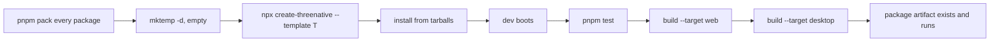

# PRD-112 — The golden path runs from packed artifacts, or it is not a path

**Status: PARTIAL — 2026-09-23.** The action-rpg failure this PRD was blocked on is resolved and
re-verified on the packed path (see the repair PRD's 2026-09-23 evidence): the five non-visual
action-rpg scenarios pass from packed artifacts on the GPU and under a forced SwiftShader adapter,
and a mid-run page death is now named `TN_PLAYTEST_PAGE_NAVIGATED` / `TN_PLAYTEST_PAGE_CRASHED`
rather than `TN_PLAYTEST_RUNNER_FAILED` (`9c361c43c`, `982d6913f`, `229313859` on `develop`).
**The exact packed seven-template gate is still red, but at `racing` layer `test`** — a
sequence/load-dependent template-scenario fault (`racing-finish-behind-rival-is-dnf` resource
assertions) that passes when racing runs alone and is unrelated to the packed-artifact contract.
See `PRD-112-repair-golden-path-contract.md`. Sliced from
`docs/strategy/PRODUCTION-READINESS.md` item 3.

**Complexity: 5 → MEDIUM mode.** One reproduction, one resolver fix, one CI matrix, one error-text
pass.

**LOC:** `packages/create-threenative/src/` **does** spend framework headroom (14741/15000, 259
lines left). Keep the resolver fix small and say what it cost in §6.

---

## 1. Context

**Problem.** The required journey is `create → dev → test → build web → build native → package`.
Two things are known to interrupt it, one measured and one reported.

**Reported, not reproduced here.** The strategy review hit `TN_CONFIG_TRANSPILER_MISSING` from
`threenative build --target web` while a direct `vite build` in the same project succeeded. The
code that emits it is `packages/create-threenative/src/config.ts:164-183`:

```ts
function resolveEsbuild(cwd: string): string {
  const require = projectRequire(cwd);        // createRequire(cwd/package.json)
  try { return require.resolve("esbuild"); }
  catch {
    try { const vite = require.resolve("vite"); return createRequire(vite).resolve("esbuild"); }
    catch {
      try { return createRequire(import.meta.url).resolve("esbuild"); }
      catch { fail("TN_CONFIG_TRANSPILER_MISSING", …); }
    }
  }
}
```

Three fallbacks, and the message says *"install Vite or esbuild"* — advice that is already wrong
if `vite build` works in that directory. Either the resolution differs from what Vite itself does
(pnpm's non-hoisted layout is the obvious suspect), or the CLI was invoked from a different `cwd`
than the project root. **Neither is confirmed.** Do not write the fix from the report.

**Measured, and already recorded elsewhere.** The 2026-08-14 adopter pilot
(`docs/verification/adopter-pilot-2026-08-14.md`) found `./scaffold.sh` could not install at all:
templates pin `@threenative/studio` and `create-threenative` as registry dependencies and neither
is published. An adopting developer's session ends in its first two minutes on that. It is fixed
per the memory record as of 2026-08-14 — **re-verify rather than assume**, and if it is fixed,
the fix has no gate holding it in place. This PRD adds the gate.

**The structural gap.** Nothing in CI exercises the published commands from a clean temporary
directory against packed tarballs. `.github/workflows/ci.yml` runs a scaffold smoke job that packs
local packages and boots a starter — closer than nothing, but it does not walk the whole journey,
and it does not cover every template.

**Files analysed.**

- `packages/create-threenative/src/config.ts:160-210` — `resolveEsbuild`, `importConfig`
- `packages/create-threenative/templates/*/package.json` — the pinned dependency set
- `.github/workflows/ci.yml` — the existing scaffold smoke job
- `docs/verification/adopter-pilot-2026-08-14.md` — the recorded install failure

## 2. Approach

Reproduce first, fix the resolver only if the reproduction says the resolver is wrong, then hold
the whole journey with a CI matrix that runs from packed artifacts in a clean directory — the only
environment where workspace resolution cannot cover for a broken manifest.



**Key decisions.**

- **Packed, not linked.** A workspace symlink hides a missing dependency; a tarball does not.
- **Clean `mktemp -d`, no repo ancestry.** Running inside the repo lets `createRequire` walk up to
  the workspace's `node_modules` and pass for the wrong reason.
- **The matrix is `template × target`.** Native targets stay opt-in — the default gate must never
  require CMake, an NDK or Xcode — so the native columns run in the separate native workflow.
- **CI minutes are scarce on this plan.** Build the matrix as a script that runs locally first
  (`scripts/verify-golden-path.ts`), then wire it. Do not iterate by pushing.

## 3. Integration Ledger

| # | New thing | Live caller (`file:line`, non-test) | Replaces | Old path removed? | Negative control |
| --- | --- | --- | --- | --- | --- |
| 1 | `scripts/verify-golden-path.ts` | `package.json` script `verify:golden-path`; `.github/workflows/ci.yml` job | the partial scaffold smoke job | smoke job folds into it or is kept as the fast lane, stated in Phase 3 | delete a template's `esbuild`/`vite` dep → the matrix goes red on that template |
| 2 | resolver fix in `config.ts` | `config.ts:195` (`importConfig`) | the current `resolveEsbuild` chain | replaced in Phase 2 | the Phase 0 reproduction command exits 0 after, 1 before |
| 3 | CLI `--help` coverage test | `packages/create-threenative/__tests__/cli.spec.ts` | — | n/a, new | remove a command's help text → fails |
| 4 | error text carrying layer + searched paths + fix command | `config.ts:176-179` and siblings | the current one-line message | replaced in Phase 2 | assert the message names at least one searched path |

**Reachability.** Entry points are `npx create-threenative`, `threenative dev|build|test|ship`,
and CI. No new entry point.

## 4. Phases

### Phase 0 — Reproduce `TN_CONFIG_TRANSPILER_MISSING` (blocking)

**No code.** From a clean `mktemp -d`, with packed tarballs:

- [x] scaffold each template
- [x] run `threenative build --target web`
- [x] run `pnpm exec vite build` in the same directory
- [x] record `cwd`, the resolved `esbuild` path (or the failure at each of the three fallbacks),
      and the pnpm store layout

Recorded in `docs/verification/prd-112-golden-path-2026-08-15.md`: not reproduced across all seven
templates, both builds exit 0 for every row, and `./scaffold.sh` installs from packed artifacts in a
clean directory. Re-verified 2026-09-23 for action-rpg from a fresh packed workspace (exit 0).

**Outcome written into this PRD before Phase 2:** either *"reproduced on template T; fallback N
fails because …"*, or *"not reproduced across all seven templates"*. If it does not reproduce,
**Phase 2 is deleted, not weakened** — and Phases 1 and 3 still stand on their own, because the
matrix is what would have caught it.

Also re-verify the adopter-pilot install failure in the same run: does `./scaffold.sh` install
today, from tarballs, in a clean directory?

### Phase 1 — The matrix exists and runs locally

**Files:**

- `scripts/verify-golden-path.ts` — NEW: pack → `mktemp -d` → scaffold → install → dev → test →
  build web → assert artifact
- `package.json` — EDIT: `verify:golden-path` script
- `scripts/__tests__/verify-golden-path.spec.ts` — NEW: the step list is data, and a missing step
  throws rather than being skipped

**Wiring:**

- [x] Caller edited: root `package.json` (`"verify:golden-path": "sh scripts/xvfb.sh tsx scripts/verify-golden-path.ts"`)
- [x] Ledger row filled: #1

**Fail-closed requirement.** A step that cannot run **fails**; it never skips. A template the
matrix does not know about **fails**; the template list is derived from the templates directory,
never hardcoded. This is the same rule the playtest package holds and the same rule the sweep
archive broke for three rounds by silently dropping a file.

**Negative control (must be observed red):** remove `vite` from one template's
`devDependencies` → that template's column goes red with a message naming the template and the
missing dependency.

### Phase 2 — Fix what Phase 0 found, and make the error text usable

**Only if Phase 0 reproduced something.**

**Files:**

- `packages/create-threenative/src/config.ts` — EDIT: the resolution, and the message
- `packages/create-threenative/__tests__/config.spec.ts` — EDIT/NEW

Every error this journey can emit must name: the failing layer, the locations searched, and the
corrective command. `"threenative.config.ts needs project-resolved esbuild; install Vite or
esbuild."` names none of the three.

**Ledger rows filled:** #2, #4. **Report the LOC delta** against the 259-line headroom.

### Phase 3 — The matrix runs in CI, and `--help` is reliable

**Files:**

- `.github/workflows/ci.yml` — EDIT: replace or subsume the scaffold smoke job
- `packages/create-threenative/__tests__/cli.spec.ts` — NEW/EDIT: `--help` for every public
  command, and template/genre selection reachable without editing a generated shell script

**Ledger rows filled:** #1 (`Old path removed?`), #3.

Run it locally before pushing. One CI run, not an iteration loop.

## 5. Criteria

| # | Criterion | Met? |
| --- | --- | --- |
| 1 | Every supported template completes `create → dev → test → build web` from clean packed artifacts in an empty directory, with no manifest edits, no workspace symlinks, no undocumented env vars | No — action-rpg, defense, minimal, platformer and puzzle pass; `racing` reds at layer `test` in the full sequence (2026-09-23) |
| 2 | The matrix is red when a template's dependency set is broken — observed, with the command | Yes — packed mutation control, `verify-golden-path.spec.ts` + scoped gate |
| 3 | `TN_CONFIG_TRANSPILER_MISSING` is either reproduced-and-fixed, or recorded as not reproduced across all seven templates with the commands run | Yes — not reproduced; recorded in `docs/verification/prd-112-golden-path-2026-08-15.md` |
| 4 | `./scaffold.sh` installs today from a clean directory, re-verified rather than assumed | Yes — all seven installed, 2026-08-15, re-verified for action-rpg 2026-09-23 |
| 5 | `--help` returns usable text for every public CLI command | Yes — `cli.spec.ts` passes |
| 6 | Template and genre selection are reachable from CLI flags — no generated shell script needs editing | Yes — `--template` drives every packed scaffold |
| 7 | Every error on the journey names the failing layer, the searched locations, and the corrective command | Yes — `verify-golden-path.spec.ts` executes each recorded corrective command |
| 8 | `pnpm typecheck && pnpm lint && pnpm test` green; framework LOC delta reported | Partial — focused suites pass (3 files, 122 tests); full typecheck/lint/test/budgets not run 2026-09-23 |

## 6. Evidence

| Gate | Command | Result |
| --- | --- | --- |
| Phase 0 reproduction | packed workspace + `./scaffold.sh <template>` + `threenative build --target web` + `vite build` | Not reproduced across all seven; all exit 0 (`docs/verification/prd-112-golden-path-2026-08-15.md`) |
| Golden path, action-rpg | `TN_GOLDEN_PATH_TEMPLATES=action-rpg TN_PLAYTEST_ALLOW_SOFTWARE=1 pnpm verify:golden-path` (self-packs + builds, and again adopting current packs) | exit 0 both ways, 5/5 scenarios, mutation control included (2026-09-23) |
| Golden path, all templates | `TN_GOLDEN_PATH_ARCHIVES=<packs> TN_PLAYTEST_ALLOW_SOFTWARE=1 pnpm verify:golden-path` | exit 1 — action-rpg…puzzle green, `racing` layer `test` reds twice; racing alone exit 0 |
| Negative control | remove `vite` from one template → `pnpm verify:golden-path` | red at `scaffold` naming the missing dependency (`docs/verification/prd-112-golden-path-2026-08-15.md`) |
| CLI help | `pnpm exec vitest run packages/create-threenative/__tests__/cli.spec.ts` | pass |
| Focused suites | `pnpm exec vitest run packages/create-threenative/__tests__/cli.spec.ts scripts/__tests__/verify-golden-path.spec.ts packages/create-threenative/__tests__/config.spec.ts` | pass: 3 files, 122 tests |
| Typecheck / lint / test | `pnpm typecheck && pnpm lint && pnpm test` | not run 2026-09-23 |
| Budgets | `pnpm budgets` | not run 2026-09-23 |

## 7. What this does not do

- **It does not claim a native target.** `build --target desktop|android|ios` and `package` stay
  in the separate native workflow; desktop and the iOS simulator are green, the Android emulator
  is red on the hosted lane, and physical hardware is untested. Nothing here says mobile-ready.
- **It does not publish anything.** No tags, no registry publishes. The published-artifact path is
  beta row 5 and is blocked outside this repository.
- **It does not add CLI surface.** Four commands, ever: `dev`, `build`, `test`, `ship`.
