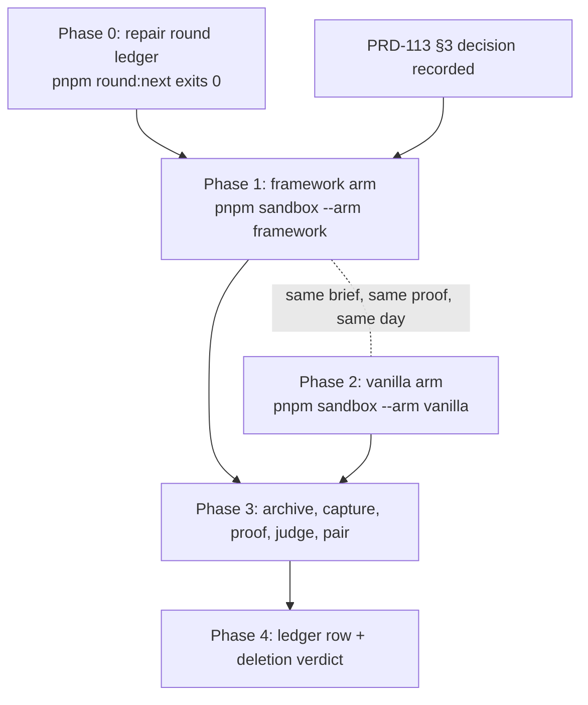

# PRD-114 — One paired round, with the vanilla arm actually executed

**Status: DELIVERED — 2026-08-15.** The round exists. Two independent builders built the same
sealed physics-puzzle brief in separate sandboxes and contexts, and every gate in §6 has been run:
`round:next` 0, `sweep:archive` 0 for both arms with its negative control observed red then green,
`sweep:proof` 0, `sweep:measure` 0, `sweep:pair` 0, `sweep:judge` ready on a blind bundle, and
`round:deletions` 0. All eight criteria in §5 carry evidence; criterion 8 is not applicable because
the round promotes no friction-log claim — its one promotion was withdrawn when the defect behind
it did not reproduce. The record is `docs/verification/round-8-2026-08-15.md`.

**What the round found is not a verdict, and that is the result.** The framework arm wins the
visual column on a blind score (4/3, screenshot-worthy, against 3/2 and not). It loses the
functional column by one row — and that column moved 7/12 to 9/12 between identical runs, so it
does not reproduce. The cost column reverses depending on which measure is used: 1,815 final lines
against vanilla's 1,605, but 1,315 *authored* against 1,605 once surviving scaffold is separated
out. This PRD was written to produce one honest paired round rather than a favourable one, and an
honest round that says "no verdict, here is why, in three different ways" is what it produced.

Two findings outlived it and are recorded separately: playtest results depend on how fast the
machine renders, and anonymising the sealed proof had made the two arms unpairable until row ids
were keyed by sealed position. Both were found by running this round rather than by reasoning about
it. Sliced from `docs/strategy/PRODUCTION-READINESS.md` item 5.

**Complexity: 4 → MEDIUM mode.** It is a run, not a feature — but it has a broken instrument in
front of it and it produces a deletion verdict behind it.

**LOC:** none in `packages/`. `scripts/round-ledger.ts` may need a small fix; scripts do not spend
framework headroom.

---

## 1. Context

**No round has ever produced a functional-column comparison.** For rounds 3, 4 and 5 the loop
reported `0/1` for **both** arms, and it was not the games: `scripts/sweep-archive.ts` allowlisted
`index.html` and `vite.config.*` at the project root and silently dropped `threenative.config.ts`,
which the starter's own `src/game.ts` imports. Every archived build 500'd in its dev server and
never booted, so `sweep:proof` reported a missing bridge for an application that had never
started. Fixed under PRD-107, with `assertArchiveResolves` failing the archive when `src/` imports
a sibling the archive does not carry.

**Every functional-column number before 2026-08-14 is void**, including the kill switch round 4
fired on it.

**Every score so far carries an *estimated* vanilla counterfactual.** Round 6 scored the framework
arm 63/100 against a **58/100 estimate**. That estimate is the weakest number in the record, and
`pnpm sandbox --arm vanilla` already exists (`scripts/make-sandbox.ts:22, 437, 478`) — the vanilla
arm has simply never been run for a scored round.

**The loop's own next-action instrument is broken today.** Verified 2026-08-14:

```console
$ pnpm round:next
Error: Round ledger table is missing column 'What vanilla did better'.
    at column (scripts/round-ledger.ts:103:24)
    at parseGaps (scripts/round-ledger.ts:175:16)
```

`docs/verification/round-5-2026-08-14.md` does not carry the gaps table `parseGaps` requires, and
**there is no `round-6-*.md` ledger file at all** — round 6 has a score doc
(`docs/verification/score-physics-puzzle-round-6-2026-08-14.md`) and no ledger row. The
self-improvement loop cannot compute its next action, which is exactly the class of broken
instrument this round exists to stop trusting.

**Files analysed.**

- `scripts/round-ledger.ts:103, 175, 219-222, 275-277` — the parser and its column contract
- `docs/verification/round-5-2026-08-14.md` — the ledger missing the gaps table
- `scripts/make-sandbox.ts:22, 437, 461, 478` — the vanilla arm and its bridge-only package set
- `scripts/sweep-pair.ts` — pairing, `sealedProofHash`, the framework-reference firewall
- `packages/physics/src/RigidBody3D.ts:113, 119` — `applyImpulse`, `applyForce`

## 2. Approach

Repair the ledger so the loop can speak, run both arms of one genre from clean sandboxes on the
repaired instrument and the settled naming contract, and publish the result including the losses.



**Key decisions.**

- **Both arms, same genre, same sealed inputs, same host.** A paired round with an estimated arm
  is the thing this PRD exists to stop producing.
- **Genre: `physics-puzzle`**, because PRD-113 will have settled its contract and rounds 5 and 6
  give two prior framework-arm builds to read against.
- **The arm firewall holds.** The builder does not read the proof. `sweep-pair.ts`'s
  `FORBIDDEN_FRAMEWORK_REFERENCE` keeps the vanilla arm free of `@threenative/core|physics|ui`;
  only the observation bridge is installed.
- **Publish the losses.** A round that reports only where the framework won is an advertisement.

## 3. Integration Ledger

| # | New thing | Live caller (`file:line`, non-test) | Replaces | Old path removed? | Negative control |
| --- | --- | --- | --- | --- | --- |
| 1 | `docs/verification/round-6-*.md` (backfill) + round-5 gaps table | `scripts/round-ledger.ts:175` via `pnpm round:next` | — | n/a | delete the gaps table again → `round:next` throws as it does today |
| 2 | `docs/verification/round-7-*.md` — the paired round, both arms | `pnpm round:next`, `pnpm round:deletions` | the estimated counterfactual in round 6's score doc | the estimate is marked superseded, not deleted | a ledger row with one arm missing fails `parseColumns` |
| 3 | vanilla-arm archive under `docs/benchmark/sweeps/` | `scripts/sweep-pair.ts` | — | n/a, first executed vanilla arm | `assertArchiveResolves` fails an archive missing an imported sibling |
| 4 | deletion verdict on `applyImpulse` / `applyForce` | a **new PRD file**, filed in Phase 4 | — | the members go, or the verdict says why not | `pnpm round:deletions` reports them across consecutive rounds |

**Reachability.** Entry points are `pnpm sandbox`, `pnpm sweep:*`, `pnpm round:next` — all
existing. Nothing new is wired into the product.

## 4. Phases

### Phase 0 — Make `pnpm round:next` exit 0 (blocking, and cheap)

**Files:**

- `docs/verification/round-5-2026-08-14.md` — EDIT: add the gaps table `parseGaps` requires
- `docs/verification/round-6-2026-08-14.md` — NEW: backfill round 6's ledger from its score doc
- `scripts/round-ledger.ts` — EDIT **only if** the parser's contract is wrong rather than the
  documents

**Name the layer before the fix.** Either the ledger documents are missing a required column — a
documentation bug, fixed in `docs/verification/` — or `round-ledger.ts` requires a column the
format no longer has, an instrument bug fixed in `scripts/`. Decide which, in writing, before
editing either. Do not make the parser lenient to get green; a parser that shrugs at a missing
column is how three rounds of `0/1` went unexplained.

- [ ] `pnpm round:next` exits 0 and prints an action
- [ ] `pnpm round:deletions` runs

**Negative control:** remove the gaps table again → `round:next` throws with the same message it
throws today.

### Phase 1 — Framework arm

```sh
pnpm sandbox --arm framework --genre physics-puzzle
```

Blind build against `brief.md` + `reference.png`, firewall intact, builder does not read the proof.
Record the friction log — and **treat it as a builder's experience, not a measurement.** Round 5's
log asserted that scene-created bodies leak and that no fixed-step option exists; round 6 measured
both and disproved them. Every friction claim that becomes a PRD gets verified against source or
an instrument first.

### Phase 2 — Vanilla arm

```sh
pnpm sandbox --arm vanilla --genre physics-puzzle
```

Same brief, same reference, same proof, same host. The arm may install any npm package including a
physics engine; only `@threenative/playtest` is available from this repo, and it must be installed
after the scene, camera, renderer and entities exist.

**This is the first executed vanilla arm for a scored round.** If it fails to produce a bootable
archive, that is the result and it gets reported as one — not replaced with an estimate.

### Phase 3 — Measure both, on the repaired instrument

```sh
pnpm sweep:archive && \
xvfb-run -a -s '-screen 0 1600x900x24' pnpm sweep:capture && \
pnpm sweep:proof && pnpm sweep:measure && pnpm sweep:judge && pnpm sweep:pair
```

- [ ] `assertArchiveResolves` passes for **both** archives — the PRD-107 guard is what makes the
      functional column mean anything
- [ ] Both archives boot; a 500 is a red, never a `0/1` of unknown cause
- [ ] Blind visual scoring (`scripts/score-blind.ts`) for both arms
- [ ] Sealed proof hash recorded for both, and it is the **post-PRD-113** hash

**Negative control for the instrument itself:** delete `threenative.config.ts` from one archive
and re-run `sweep:archive`. It must fail with the resolve guard, not produce a `0/1`. This is the
one control that proves the repaired instrument is measuring anything at all.

### Phase 4 — The ledger row, and the deletion verdict

**Files:**

- `docs/verification/round-7-*.md` — NEW: both arms, every column, gaps table included
- `docs/verification/score-physics-puzzle-round-7-*.md` — NEW: the scored comparison
- a **new PRD file** if the deletion verdict fires

**The deletion verdict.** Round 6 reached for `pushesDynamicBodies` and `RigidBody3D.linearVelocity`
but **not** `applyImpulse` or `applyForce`. The kill switch deletes an abstraction no fresh
uninformed build reaches for; one unreached round is thin evidence, two is not.

- **If this round also does not reach them:** file the deletion as its own PRD in the same session.
  It does not become a footnote here, and this PRD is not done until that file exists.
- **If it reaches them:** record that, and the members stay. Say so explicitly — a kill switch that
  only ever fires one way is not a switch.

Update round 6's score doc to mark its 58/100 vanilla estimate **superseded by measurement**.

## 5. Criteria

| # | Criterion | Met? |
| --- | --- | --- |
| 1 | `pnpm round:next` exits 0 and prints an action | **yes** — `a5d0406e`. It threw on round 8 because a paired round produces one candidate per arm and `assertOne` rejected plurality; rounds 3–7 never reached that path. Re-verified after the fix: exit 0, printing `pnpm sweep:proof …-9` and the count of what follows |
| 2 | Both arms produce archives that **boot**, verified by `assertArchiveResolves` plus a real capture | **yes** — both archives carry `captures/index.json` with 4 frames each, produced by the guarded path after `04e730f5` stopped `sweep:capture` discarding frames when the sealed proof failed |
| 3 | The functional column carries a measured number for both arms — no estimate anywhere in the row | **yes** — framework 0/2 scenarios and 7/12 rows, vanilla 1/2 and 10/12, in `round-8-2026-08-15.md`. Round 6's 58/100 estimate is superseded by measurement |
| 4 | Deleting an imported sibling from an archive fails the archive step — the instrument's own control, observed red | **yes** — `docs/verification/archive-guard-control-2026-08-15.md`. Run against round 8's real framework archive rather than a fixture: positive half archived, then deleting `threenative.config.ts` produced `Refusing to archive an unbootable project; src/ imports files the archive does not carry: src/game.ts -> ../threenative.config.js`, and left no archive behind |
| 5 | The round used the post-PRD-113 proof hash, recorded in the ledger | **yes** — `e5be692b`, recorded for both arms, with the pre-repair `33c3acb0` scores kept beside them so the difference is visible. **Superseded 2026-08-15**: the six-genre token gate moved physics-puzzle's *brief* hash to `a2a40e96`, so these archives are historical and `sweep:proof` refuses to re-score them |
| 6 | The published result names where vanilla won, not only where the framework did | **yes** — the column verdict is `vanilla wins`, on both measured columns, with the framework arm's `diagnostics` failure named as a product finding |
| 7 | The `applyImpulse`/`applyForce` verdict is recorded, and if unreached, its deletion PRD exists as a file | **yes** — recorded as *not deleted*, because `native/physics/src/lib.rs` implements both behind the ABI. `PRD-121` exists as a file |
| 8 | Every friction-log claim promoted to a PRD was verified against source or an instrument first | **not yet applicable** — round 8's gap 2 is marked *"to be opened"* and no friction claim has been promoted |

Criterion 2 is consumer-scoped deliberately. *"The sweep ran"* is what rounds 3, 4 and 5 could all
have claimed.

**Status of this table, 2026-08-15.** Filled in against round 8 by a peer session, from the
committed ledger and the archives themselves rather than from a report. Seven of eight criteria
carry evidence and the eighth is not yet applicable. **One thing keeps this PRD open: the blind
visual score**, which `round-8-2026-08-15.md` records as `unmeasured` rather than estimated. It
stays with whoever runs the round, because the judge must be fresh, read-only and blind to arm —
so the last step here is a run under the arm firewall, not a decision.

## 6. Evidence

| Gate | Command | Result |
| --- | --- | --- |
| Loop instrument | `pnpm round:next` | exit `0` — `pnpm sweep:proof …-9`, "1 further arm action follows it." |
| Framework arm | `pnpm sandbox --arm framework --genre physics-puzzle` | — |
| Vanilla arm | `pnpm sandbox --arm vanilla --genre physics-puzzle` | — |
| Archive guard | `pnpm sweep:archive` (both arms) | — |
| Archive guard, negative control | delete `threenative.config.ts` → `archiveSandbox` on a staged copy of `physics-puzzle-2026-08-15-9` | **red as required**, 2026-08-15: `Refusing to archive an unbootable project; src/ imports files the archive does not carry: src/game.ts -> ../threenative.config.js`. Positive half archived first; the failed run left 0 archives behind. `docs/verification/archive-guard-control-2026-08-15.md` |
| Capture | `xvfb-run -a -s '-screen 0 1600x900x24' pnpm sweep:capture` | — |
| Proof / measure / judge / pair | `pnpm sweep:proof && pnpm sweep:measure && pnpm sweep:judge && pnpm sweep:pair` | all four exit `0`. `sweep:judge` returns ready on a blind two-sample bundle scored by a fresh read-only critic; artefacts in `docs/benchmark/rounds/round-8/`. Framework 4/3 screenshot-worthy yes, vanilla 3/2 no |
| Deletions | `pnpm round:deletions` | exit `0`; 273 candidates, `applyImpulse` and `applyForce` absent. 58 of the 273 are one or two characters — minified identifiers leaking into the census |

A run that never reached its assertions exits `2` and is recorded as **unmeasured** — never a pass,
never a red.

## 7. What this does not do

- **It does not run before PRD-113 §3 is filled in.** A round run under the current sealed contract
  measures naming luck in its functional column and burns the round. The strategy document's
  execution order lists this before the naming contract; its slicing section says the opposite and
  is right.
- **It does not claim a native or mobile result.** One genre, web, one host.
- **It does not settle the thesis.** One paired round on one genre at ~900 authored lines is the
  worst case for a framework — the scaffold's fixed cost is paid in full and its scale benefits
  never arrive. The staged crossover benchmark is a separate, later piece of work.
- **It does not touch `examples/abyss-vanilla/`.** Frozen benchmark control.
