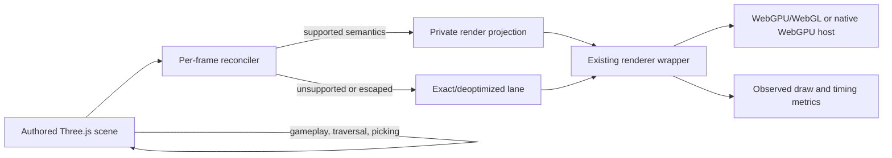

# PRD-152 — Scene optimization must be invisible without changing the game it optimizes

**Status:** EXECUTED 2026-08-18. All six phases landed. `SceneRenderProjection` replaces the
destructive `SceneCollapse`: the authored scene is never modified, the renderer is handed a private
mirror, and the projection deoptimizes fail-open when it cannot preserve semantics — or when
batching would make the scene worse. Evidence is
`docs/verification/prd-152-transparent-scene-optimization-2026-08-18.md`, which names every cell
that executed and every cell that did not. Physical Pixel 8 numbers are in that record and were
reproduced twice; the 16,384-object rung and the fox-native visual sign-off both ran on hardware.

**Outcome:** a developer writes ordinary Three.js, never opts into batching and never annotates an
object for the optimizer. The authored scene remains a normal, live Three.js scene, while eligible
work still collapses to the same small draw count and holds the same load-test knee as the current
fast path.

**Depends on:** nothing. PRD-074's diagnostics and load-test instrumentation are reused; this PRD
replaces the unsafe rendering behavior that PRD-074 measured rather than reopening its metrics
contract.

**Blocks:** unrestricted claims that a normal ThreeNative game automatically receives the reported
collapse performance.

**Complexity: 9 → HIGH mode.** +3 for 10+ files, +2 for a replacement rendering system, +2 for
continuous mutation/deoptimization state, and +2 for core/playtest/load-test integration.

**Blast radius: approximately 14 files.** The current collapse and game-loop wiring, a new internal
render projection, core semantic tests, one web/desktop playtest subject, and the existing native CPU
load-test runner and workload definitions. No package, public game abstraction or appearance preset
is added.

## Integration Ledger

The `TBD` locations are filled with real lines during implementation. A phase cannot close with a
`TBD` in one of its rows.

| # | New thing | Live caller (`file:line`, non-test) | Replaces | Old path removed? | Negative control |
| --- | --- | --- | --- | --- | --- |
| 1 | internal `SceneRenderProjection` | `packages/core/src/game.ts:TBD`, immediately before the existing world render | destructive graph rewrite in `SceneCollapse` | Phase 4 | disabling projection restores thousands of renderer draw candidates in the load test |
| 2 | per-frame reconcile/deoptimize path | `packages/core/src/game.ts:TBD` calls it before every render | eight-frame motion guess and absent watchdog | Phase 3 | a transform or material mutation after frame 600 renders stale when reconciliation is disabled |
| 3 | semantic stress scenario | existing playtest CLI loads `examples/prd140-picking/src/game.ts:TBD` through its normal web/desktop path | narrow count-only collapse fixtures | n/a, gate | re-enable source detachment and the graph/raycast/late-motion assertions fail |
| 4 | projection mode in the native CPU load test | `examples/native-cpu-load-test/src/main.ts:TBD`, selected by `scripts/profile-native-cpu.ts:TBD` | `scene-collapse` candidate arm | Phase 5 renames old arm to `legacy-scene-collapse` for the frozen comparison only | bypassing projection makes draw count and frame-time thresholds fail |
| 5 | bounded optimizer diagnostics | existing startup/playtest diagnostics at `packages/core/src/game.ts:TBD` | current applied/rejected report with no deoptimization result | Phase 4 | report a collapsed draw count without using the projection and the observed renderer-count gate fails |
| 6 | post-change Android engine load-test gate | `examples/engine-load-test/src/game.ts:TBD` runs the shipping projection in L3; `scripts/engine-load-test/cli.ts:TBD` collects the physical-device artifact | pre-change Android collapse result | n/a, release gate | run the final APK with projection bypassed and the Android L3 draw/knee thresholds fail |

## 0. The two questions, answered before anything else

Rule 1 says both questions must pass before the framework owns a thing, and this PRD keeps a
1,823-line subsystem in `packages/core`. It has to answer them out loud rather than inherit the
incumbent's answer.

**(b) Does it decide how anything looks?** No, if and only if the projection is pixel-identical.
That is the whole correctness contract below, so (b) passes exactly to the degree this PRD
succeeds. It fails the moment a projected frame differs from the authored one.

**(a) Could the game write this portably itself?** Partly yes, and that is the uncomfortable part.
`mergeGeometries` is stock `three/addons/utils/BufferGeometryUtils.js`; `templates/starter/src/render/shapes.ts`
already imports from that module. A game that knows which of its props are static can merge them in
about three portable lines. What a game *cannot* write portably is the invisible part: batching
without being told what is static, and staying correct when arbitrary later code mutates a source.

So the framework's claim is not "batching". It is **"batching you never have to know about."** That
distinction is the entire justification for this code existing, which means the following alternative
is a real competitor and not a strawman.

### Considered and rejected: opt-in merge as generated source

Delete `SceneCollapse`. Ship a `mergeStatic(objects)` helper in `templates/*/src/render/` as
ordinary Three.js the user owns. The game declares what is static; nothing guesses, nothing
reconciles, nothing can go stale, and it cannot lose a performance race because it does no per-frame
work at all. Framework cost drops by roughly 1,800 lines.

It is rejected **only** because "the user's agent must not have to know" is a product commitment,
and an agent that forgets to call `mergeStatic` ships a slow game with no signal. That is a
defensible reason. It is not a free one: it is why this PRD is allowed to spend 14 files and a
complexity-9 rewrite where three lines of generated source would also work.

**This alternative is the named fallback in §7.** If the candidate design is killed, the answer is
not "return to architecture work" indefinitely — it is to ship the opt-in helper and retract the
automatic claim.

## 1. Decision

Keep the set-and-forget product requirement. Replace the implementation strategy.

Automatic optimization is possible only if **correct rendering is unconditional and optimization is
opportunistic**. It is impossible to prove from eight startup frames that arbitrary JavaScript will
never again move a mesh, toggle it, mutate its material, reparent it, raycast it or inspect its
parent. Therefore the engine must not consume or detach the authored scene based on that guess.

The replacement maintains an internal render projection while leaving the game's scene graph intact.
It synchronizes supported changes before the frame draws. If it cannot preserve an object's Three.js
semantics, it deoptimizes that object, group or whole scene before drawing that frame. Deoptimization
is a correct slow path, not an error and not something the developer configures.

This is an **engine bug**. A game cannot implement an invisible renderer projection portably across
browser WebGPU and the owned native host, and the mechanism decides nothing about appearance. It
belongs in `packages/core`, with proof through both web and native paths.

### What “set and forget” means

1. No option, annotation, `userData` convention, static marker, special base class or optimizer API
   appears in generated game code.
2. Game code, picking and scene lifecycle always use the authored objects. Their identity, `parent`,
   `children`, names, traversal, visibility and later mutation remain ordinary Three.js behavior.
3. The engine may optimize only its private renderer input. Unsupported or escaped semantics fall
   back automatically before they can produce a wrong frame.
4. A complex game may receive less optimization than a simple one. It may never receive different
   gameplay or pixels in exchange for a higher benchmark score.
5. Eligible load-test and platformer workloads must retain the current collapse result and frame-time
   gain. Correctness without the performance gain does not complete this PRD.

### What “any game” can honestly mean

Every game remains correct. Not every object in every game is guaranteed to batch. Skinned meshes,
custom render hooks or a continuously changing material may use the exact path while thousands of
ordinary props beside them remain projected. If isolation cannot preserve the exact object, the
whole scene falls back for that frame.

## 2. Reproduced defects in the incumbent

Files analyzed:

- `packages/core/src/collapse.ts`
- `packages/core/src/game.ts`
- `packages/core/src/renderer.ts`
- `packages/core/src/picking.ts`
- `packages/core/__tests__/collapse*.spec.ts`
- `examples/native-cpu-load-test/src/main.ts`
- `scripts/profile-native-cpu.ts`
- the PRD-074 and native load-test verification records

The current path is unconditional in `game.ts` and removes source objects from their parents. Four
small executable fixtures on 2026-08-18 established:

| Ordinary Three.js input | Current result |
| --- | --- |
| `Mesh.visible = false` before collapse | replacement merged mesh is visible |
| one indexed geometry with two materials/groups | output has one material and no groups |
| `InstancedMesh` with three matrices | output is one ordinary mesh with one copy of the geometry |
| ordinary mesh starts moving after the observation window | source moves while rendered geometry remains frozen |

**Those four fixtures are not checked in, so the table above is currently an unverifiable claim.**
Phase 1's first task is to land them as real failing tests and paste the red output, not to cite
this table. Until that lands, the row contents are a hypothesis about the incumbent.

The focused incumbent suite still passes: 34 tests across `collapse.spec.ts`,
`collapse-baseline.spec.ts` and `collapse-picking.spec.ts`. Those tests describe the scenes the pass
was built against; they do not establish transparency for ordinary Three.js semantics.

Other accepted-but-unpreserved inputs include skin weights/bones, morph targets, geometry draw
ranges, custom attributes, runtime material mutation, object identity without `userData`, LOD
visibility, and custom depth/distance materials. The PRD does not fix these one by one with more
skip heuristics. It changes the ownership model so a missed heuristic deoptimizes instead of
corrupting the game.

## 3. Architecture



### 3.1 Source graph is never the optimization artifact

`Scene`, `Object3D`, `Mesh`, materials and geometries supplied by the game stay parented exactly as
the game authored them. The optimizer must not park sources on invisible layers, remove meshes,
patch a game's material node, or attach merged geometry to the authored camera.

The renderer wrapper receives the private projection. `ctx.raycast`, `ScenePicker`, scene changes,
`ctx.entities`, user traversal and cleanup continue to observe the authored graph. `goto()` disposes
the projection and clears the authored scene through the existing lifecycle.

### 3.2 Continuous reconciliation, not a static prophecy

Observation may still decide whether building a projection is worth its startup cost. It may not be
used as proof that future state cannot change.

Before each render, the reconciler updates or invalidates:

- world transform and ancestor visibility;
- object add/remove/reparent and layer/order/shadow state;
- geometry identity, version, groups, draw range and supported attribute layout;
- material identity and every supported look-affecting field;
- camera-relative state for overlay projections.

Mutation through Three.js's supported APIs must be visible on the next rendered frame. Raw typed
array writes without the corresponding Three.js `needsUpdate` signal need not be detected because
the stock renderer does not upload them either.

The implementation may use compact snapshots, version counters and dirty sets. It may not monkey
patch Three.js prototypes or replace a game's vectors/materials with proxies. If the cheapest
truthful reconciliation scan erases the measured gain, the design fails its kill switch and must be
reworked rather than weakening semantic coverage.

### 3.3 Eligibility is fail-open

The initial optimized lane is deliberately narrow: ordinary `Mesh` objects with supported
`BufferGeometry` and materials whose exact rendering state the projection can reproduce. Objects
with multi-material groups, instancing, skinning, morphing, LOD, sprites, points, custom render
callbacks, custom depth/distance materials, unsupported node graphs or unknown subclasses enter the
exact lane.

“Exact lane” means pixels and object behavior are preserved, not merely that the report says
`skipped`. If an exact proxy cannot honor callback identity or renderer behavior, the scene renders
directly for that frame. No object is silently omitted.

### 3.4 Diagnostics describe observed renderer input

Keep the bounded PRD-074 report shape where compatible, but add projection and deoptimization
counts. `resultDrawCandidates` must come from the scene actually passed to the renderer. The report
must distinguish:

- projected objects and resulting draws;
- exact-lane objects;
- group/scene deoptimizations and stable reason codes;
- reconciliation, projection update and renderer time;
- startup build cost and any fallback frame cost.

No production telemetry and no references to user scene objects are retained.

## 4. Performance contract

The benchmark must be re-run through the replacement. A unit count, microbenchmark or screenshot is
not sufficient.

### 4.1 Frozen comparison

Before replacing the incumbent, run and retain raw artifacts for the current `scene-collapse` arm.
After replacement, the load-test tool exposes:

- `legacy-scene-collapse`: frozen incumbent, used only for this PRD's differential evidence;
- `scene-projection`: candidate that uses the same live path as `defineGame`;
- `independent`, `instanced` and `merged`: existing controls.

Both optimized arms use identical seeded workloads, object counts, dirty ratios, hierarchy,
visibility, passes, samples, adapter and build. A comparison is invalid if position hashes, visible
counts, animation state, material identities, renderer, adapter or refresh conditions differ.

### 4.2 Required load-test matrix

Run the existing matrix at 500, 1,000, 2,000, 4,000 and the highest stable rung, with:

- flat and deep hierarchies;
- 0%, 10% and 100% dirty objects;
- all-visible and mostly-culled scenes;
- one and two render passes;
- the existing fox-scale subject;
- at least three repeats and 300 post-settlement stability frames.

The candidate must also run a late-mutation pass: after 600 settled frames, move hidden/static
objects, toggle visibility, recolor a material, add/remove/reparent meshes and mutate a signaled
geometry attribute. The visual/semantic state must change on the next frame without permanently
abandoning unaffected groups.

### 4.3 Required result

On the same hardware and build class.

**The incumbent is not the floor, because the incumbent is wrong.** It reaches its numbers by
detaching the scene and freezing what the game may still move; measuring a correct renderer against
an incorrect one and killing the correct one for a 10% budget lets wrong pixels win the benchmark.
The binding floor is therefore the honest control, and the incumbent is a reference the report must
print but is not permitted to fail the PRD on its own.

1. **Binding floor — the `independent` arm.** Candidate steady-state frame p50 and p95 must each be
   at least 40% faster than unbatched `independent` at every valid rung, and the candidate's
   renderer-observed draw count must be at least 90% lower on eligible workloads. A candidate that
   cannot beat plain Three.js by this margin has no reason to exist and is killed.
2. **Reference — incumbent collapse.** Print candidate-versus-`legacy-scene-collapse` p50, p95, draw
   count and knee at every rung. A candidate within 10% is unremarkable and ships. A candidate more
   than 25% slower than the incumbent at any rung does not auto-fail; it obliges a written
   accounting of where reconciliation spends the difference and an explicit owner decision to accept
   the cost, ship the §0 fallback, or rework. Noise-bound results require five repeats rather than a
   wider threshold.
3. **Draw count on eligible workloads only, with the ineligible set named.** Fail-open
   deoptimization means an ineligible object costs draws by construction, so "no worse than the
   incumbent" is only meaningful once eligibility is stated. Every report must enumerate the objects
   that entered the exact lane and the reason codes that put them there. A report that shows a low
   draw count without that enumeration is not evidence.
4. The maximum object-count knee that satisfies the existing frame budget is not lower than the
   `independent` knee, and its distance from the incumbent knee is reported.
5. Platformer retains at least a 95% reduction in renderer-observed world draw candidates; its
   current reference is 3,004 source meshes to 26 merged meshes and must be re-recorded, not cited.
6. Reconciliation plus projection refresh does not move cost outside `renderer.render()` and call it
   a win: total frame p50/p95, startup build time, worst frame and draw count are all reported.

The **entire engine load-test Android arm must be rerun after all implementation changes**, from an
APK built from the final candidate commit. This is not satisfied by citing the 2026-08-15 result,
rerunning an intermediate build, running only one object count, or copying a web/desktop result.
Run all `L1,L2,L3` rungs on physical Android hardware with the device gate satisfied (including at
least 50% battery). Emulator runs prove plumbing, not performance. `--allow-emulator` and
`--allow-low-battery` produce provisional artifacts and cannot close the PRD.

If suitable hardware is unavailable, this PRD does **not** sit open indefinitely. Phases 1–5 close
on their own evidence, and the PRD moves to `docs/PRDs/BLOCKED/requires-physical-device/` with the
Phase 6 criterion unchecked and the missing artifact named. Until that run exists, no document may
claim the replacement holds its benchmark on Android — desktop and web results say desktop and web.

## 5. Execution phases

Every checkpoint includes a fresh implementation review, caller census, ledger audit, revert check
and observed negative controls. A green full suite does not override a failed semantic or
performance checkpoint.

### Phase 1 — Semantic firewall: known unsupported inputs stop being rewritten incorrectly

**User-visible outcome:** hidden, multi-material, instanced, skinned/morphed and late-moving objects
render correctly while the nondestructive replacement is built.

**Files (maximum 5):**

- `packages/core/src/collapse.ts` — EDIT: reject known destructive cases and add a real post-settle
  mutation watchdog that restores before the changed frame renders.
- `packages/core/__tests__/collapse-semantics.spec.ts` — NEW: differential semantic fixtures.
- `packages/core/__tests__/collapse.spec.ts` — EDIT: watchdog/fallback lifecycle contract.

**Implementation:**

- [ ] Record the four reproduced defects as tests and observe each fail against the incumbent.
- [ ] Add fail-open rejection for specialized and semantic-bearing mesh forms the incumbent cannot
  preserve.
- [ ] Continue sampling collapsed sources after settlement; a transform/visibility/topology escape
  restores before render, reports the reason and never leaves a duplicate frame.
- [ ] Do not broaden support or add a game-facing option in this phase.

**Required proof and negative controls:**

| Gate | Required assertion | Observed-red control |
| --- | --- | --- |
| hidden source | remains absent from rendered candidates | remove visibility rejection |
| multi-material/instanced/skinned/morph | remains on exact source path | remove each type rejection |
| late motion | frame 600 movement appears on frame 601 | disable post-settle sampling |
| restore | source identities/parents are restored once, no duplicate merged draw | delay restore until after render |

**Revert check:** restoring the pre-phase `#skipReason` and settled `frame()` behavior makes the new
semantic spec fail.

### Phase 2 — Nondestructive world projection: ordinary scenes batch without leaving the graph

**User-visible outcome:** ordinary static and moving meshes retain object identity and scene
relationships while renderer draw candidates collapse.

**Files (maximum 5):**

- `packages/core/src/renderProjection.ts` — NEW: private projection compiler and lifetime.
- `packages/core/src/renderer.ts` — EDIT: render the resolved projection/exact input.
- `packages/core/src/game.ts` — EDIT: construct, reconcile, render and dispose the projection.
- `packages/core/__tests__/renderProjection.spec.ts` — NEW: source/projection invariants.
- `packages/core/__tests__/game.spec.ts` — EDIT: live frame-loop and `goto()` disposal proof.

**Implementation:**

- [ ] Compile supported opaque, single-material ordinary meshes into private batched draws without
  removing, reparenting or modifying the sources.
- [ ] Preserve world transforms, ancestor visibility, layers, render order and shadow flags in the
  projection.
- [ ] Keep picking and every public scene reference on the authored graph.
- [ ] Dispose projection geometry/material state on `goto()` and renderer disposal.
- [ ] Wire the projection into the pre-existing render call; no second optional render path remains
  live.

**Required proof and negative controls:**

| Gate | Required assertion | Observed-red control |
| --- | --- | --- |
| graph identity | all source `parent`, UUID, traversal and names unchanged after 300 frames | call the incumbent detach loop |
| live integration | `defineGame` renderer receives projection and observes fewer draws | bypass projection in `game.ts` |
| picking | source mesh returned before and after optimization without `userData` | point picker at projection |
| lifecycle | `goto()` stops projection updates and disposes owned buffers | omit projection disposal |

**Revert check:** removing `game.ts` projection wiring makes the pre-existing render flow exceed the
draw-candidate bound.

### Phase 3 — Reconciliation and deoptimization: changes after startup are correct next frame

**User-visible outcome:** gameplay can change an object at any time without knowing it was batched.

**Files (maximum 5):**

- `packages/core/src/renderProjection.ts` — EDIT: compact snapshots, dirty updates and fallback.
- `packages/core/__tests__/renderProjection.spec.ts` — EDIT: mutation matrix.
- `packages/core/__tests__/collapse-picking.spec.ts` — EDIT: unannotated identity/raycast contract.
- `packages/core/__tests__/game.spec.ts` — EDIT: mutation happens through the real frame loop.
- `packages/core/src/collapse.ts` — EDIT: reduce incumbent to diagnostics compatibility/delegation;
  destructive settled updates stop being live.

**Implementation:**

- [ ] Reconcile transform, visibility, topology, geometry version/layout, material state, shadows,
  layers and order before rendering.
- [ ] Update supported projection state in place; deoptimize the smallest safe group on unsupported
  change.
- [ ] Make add/remove/reparent and streamed geometry visible on the next frame without duplicates.
- [ ] Exercise mutations after 600 stable frames, not only inside the startup observation window.
- [ ] Bound reconciliation state and release references when objects leave the scene.

**Required proof and negative controls:** each mutation row must fail when its individual snapshot
field is omitted. A single “something changed” test is insufficient.

**Revert check:** disabling reconciliation freezes at least one late transform, visibility, material,
geometry and topology row.

### Phase 4 — Exact lane and overlays: advanced Three.js semantics never disappear

**User-visible outcome:** a feature-rich scene remains correct while eligible ordinary props and HUD
elements around it still batch.

**Files (maximum 5):**

- `packages/core/src/renderProjection.ts` — EDIT: exact lane, camera-relative projection and group
  isolation.
- `packages/core/src/collapse.ts` — EDIT: delete the destructive merge/camera implementation after
  report compatibility moves to the projection.
- `packages/core/__tests__/renderProjection.spec.ts` — EDIT: advanced object corpus.
- `examples/prd140-picking/src/game.ts` — EDIT: expand the existing collapse/picking subject into the
  semantic stress game instead of adding another example project.
- `examples/prd140-picking/playtests/semantics.playtest.json` — NEW: real renderer scenario.

**Implementation:**

- [ ] Prove exact behavior or fallback for multi-material groups, instancing, skinning, morphing,
  draw ranges, custom attributes, LOD, sprites, points, hooks, node/custom materials, custom depth
  materials, transparency and camera overlays.
- [ ] Keep eligible neighbors projected when isolation is safe; fall back the scene when it is not.
- [ ] Preserve callback/object identity wherever the exact lane claims per-object isolation.
- [ ] Delete source detachment, invisible-layer parking and authored-material patching from the live
  implementation.
- [ ] Run the same semantic scenario on web and `--target desktop`.

**Required proof and negative controls:**

- source graph snapshot before/after 1,200 frames is identical except for mutations made by the game;
- visual assertions cover hidden, grouped, skinned/morphed, transparent and overlay subjects;
- raycast and callback assertions name the original objects;
- forcing an unsafe object into a projected group makes the scenario fail on both targets.

**Revert check:** restoring destructive collapse makes the scenario fail even if draw counts improve.

### Phase 5 — Load-test replacement: the benchmark still holds through the shipping path

**User-visible outcome:** set-and-forget correctness ships without surrendering the measured reason
the optimizer exists.

**Files (maximum 5):**

- `examples/native-cpu-load-test/src/main.ts` — EDIT: frozen legacy and live projection arms, late
  mutation pass, semantic hashes.
- `scripts/profile-native-cpu.ts` — EDIT: matrix, pairing validation and threshold verdict.
- `scripts/native-cpu-profile/workload.ts` — EDIT: canonical arm/schema names.
- `packages/core/__tests__/collapse-baseline.spec.ts` — EDIT: projection result contract from the
  shipping path.
- `docs/verification/prd-152-transparent-scene-optimization-2026-08-18.md` — NEW: raw command,
  artifact paths, web/desktop/Android rows and negative controls.

**Implementation:**

- [ ] Freeze incumbent artifacts before removing it; assert legacy and candidate subjects are not
  accidentally the same module/path.
- [ ] Run the complete matrix in §4.2 through `scene-projection`, including 300 stable frames and
  post-frame-600 mutations.
- [ ] Run the tracked platformer through the normal `defineGame` path on web and desktop.
- [ ] Apply every threshold in §4.3 to total frame cost, not only renderer time.

**Required proof and negative controls:**

| Gate | Required assertion | Observed-red control |
| --- | --- | --- |
| arm identity | legacy and candidate resolve to different live implementations/artifact hashes | alias both names to projection |
| workload parity | seed, hashes, visible count, mutation outcome, adapter and build match | change candidate seed or stop one animation |
| draw reduction | candidate is no worse than incumbent for eligible workloads | bypass projection |
| p50/p95 and knee | all §4.3 thresholds hold | add measured reconciliation work or lower threshold fixture |
| late mutation | next frame changes while stable draw reduction returns for unaffected groups | disable reconciliation |

**Revert check:** removing live projection wiring fails both the pre-existing load-test draw gate and
the platformer render-count scenario.

### Phase 6 — Physical Android rerun: the post-change engine benchmark still holds

**User-visible outcome:** the exact optimizer that will ship retains its benchmark result on real
Android hardware, not only in Chromium, desktop or an emulator.

**Files (maximum 5):**

- `examples/engine-load-test/src/game.ts` — EDIT: L3 uses the same shipping projection as
  `defineGame`, with no benchmark-only tuning.
- `examples/engine-load-test/src/native.ts` — EDIT: collect projection time, draw count, semantic
  hash and late-mutation integrity on device.
- `scripts/engine-load-test/cli.ts` — EDIT: name and validate the post-change physical Android
  artifact and final candidate commit.
- `scripts/engine-load-test/report.ts` — EDIT: apply Android draw, p50/p95 and knee regression gates
  to L3 as well as the existing arm baselines.
- `docs/verification/prd-152-transparent-scene-optimization-2026-08-18.md` — EDIT: append raw
  physical-device evidence; no summarized result without artifact paths.

**Implementation:**

- [ ] Build the Android APK from the final candidate commit after Phases 1–5; record commit, APK
  hash, runtime/JS engine, build type, device model, ABI, Android version, battery and refresh rate.
- [ ] Install that APK on physical Pixel-class Android hardware and run the full L1/L2/L3 ladder at
  `256,1024,4096,16384`, plus the highest stable rung, for at least three repeats.
- [ ] Use the normal L3 shipping defaults. No reduced semantic fixture, hand-tuned threshold,
  disabled reconciliation or benchmark-only projection path is permitted.
- [ ] Record raw reports for draw count, total frame p50/p95, projection/reconciliation time,
  semantic/position hashes, visible count and the ≤16.67 ms p95 knee.
- [ ] Compare the post-change L3 result against a pre-change incumbent run from the same physical
  device/build class and apply every threshold in §4.3.

**Required command shape:**

```sh
pnpm bench:engines --arm tn-android \
  --modes L1,L2,L3 \
  --ladder 256,1024,4096,16384 \
  --frames 600 --warmup 120 --repeats 3 \
  --out prd152-tn-android-post-change
```

The implementation may add the measured highest stable rung to `--ladder`; it may not remove any
listed rung. Do not pass `--allow-emulator`, `--allow-low-battery` or `--skip-baseline` for the
acceptance run.

**Required proof and negative controls:**

| Gate | Required assertion | Observed-red control |
| --- | --- | --- |
| final artifact | recorded APK hash is built from the final candidate commit | attempt to load the pre-change or intermediate APK artifact |
| physical device | report identifies physical Android hardware with non-provisional conditions | rerun with `--allow-emulator` or low-battery override |
| shipping path | L3 resolves to the same projection implementation/defaults used by `defineGame` | substitute a benchmark-local batcher or tuned options |
| semantic parity | L1 and L3 position/animation/late-mutation hashes agree | freeze one L3 object after settlement |
| performance | post-change L3 meets draw, p50/p95 and knee thresholds at every valid rung | bypass projection in the final APK |

**Revert check:** bypassing the shipping projection in the final Android APK fails L3 draw count and
the physical-device performance baseline while L1 remains semantically equivalent.

## 6. Acceptance criteria

- [ ] A generated project contains no optimizer API, flag, annotation or instructions; normal
  `defineGame` construction activates the shipping path.
- [ ] The authored scene graph is never destructively rewritten for optimization, and the semantic
  stress subject preserves identity, hierarchy, picking and mutations through 1,200 frames.
- [ ] Every unsupported or escaped semantic is updated exactly or deoptimized before drawing; no
  result may be missing, duplicated or stale for one frame.
- [ ] Web and desktop run the same semantic scenario successfully; no native-only or web-only node,
  scene or entity implementation exists.
- [ ] The full existing native CPU load-test matrix is re-run through the replacement, all workload
  equivalence checks pass, and the candidate meets every draw/p50/p95/knee threshold in §4.3.
- [ ] The tracked platformer is re-run and retains at least 95% renderer-observed world draw
  reduction without semantic or visual regression.
- [ ] The **full `pnpm bench:engines --arm tn-android --modes L1,L2,L3` benchmark is rerun after all
  code changes** using the final candidate APK on physical Pixel-class Android hardware. Every
  required rung meets the draw/p50/p95/knee thresholds; raw artifacts include final commit and APK
  hashes. An emulator, provisional condition, intermediate APK or historical result cannot check
  this box.
- [ ] Total frame and startup costs are reported, so reconciliation work cannot be hidden outside
  `renderer.render()`.
- [ ] The destructive source-detach/material-patch/layer-parking implementation is deleted, not left
  as a second live optimizer.
- [ ] Each phase checkpoint passes; all negative controls are recorded red before their repaired
  gates are recorded green.
- [ ] `pnpm typecheck && pnpm lint && pnpm test`, the semantic web/desktop playtest, `pnpm budgets`
  and the load-test commands exit `0`.

## 7. Kill switches and non-goals

Kill the candidate design, not the correctness requirement, if either condition occurs:

1. It cannot preserve the semantic stress scene without source mutation, public annotations or a
   permanent whole-scene duplicate traversal.
2. It misses the §4.3 binding floor against the `independent` arm after measurement noise is
   resolved — meaning the projection is not meaningfully faster than plain unbatched Three.js.

Being slower than the *incumbent* is not a kill condition on its own; §4.3 item 2 routes that to an
owner decision, because the incumbent buys its numbers with wrong frames.

**On kill, ship the §0 fallback.** Keep Phase 1's semantic firewall, delete the automatic path,
ship `mergeStatic` as generated source in `templates/*/src/render/`, and retract the set-and-forget
claim in the same commit — the template `AGENTS.md`/`CLAUDE.md` pair and the README both state that
batching is opt-in. Do not restore the unsafe automatic claims, do not relax the performance floor
to close the PRD, and do not leave a killed design parked as a second live optimizer.

This PRD does not add an editor, scene format, ECS, preset, material style or gameplay API. It does
not promise that every advanced object batches. It promises that developers never need to manage
the optimizer, every game stays correct, and the workloads that are eligible today remain fast.

## 8. Completion record

Not started. When complete, this section must link the verification record and paste:

- the semantic scenario's web and desktop verdicts;
- frozen legacy versus candidate load-test artifact hashes;
- the complete matrix verdict and invalid-pair exclusions;
- platformer source/result draws and total frame p50/p95;
- the final post-change physical Android commit/APK hashes, device conditions, full L1/L2/L3 ladder,
  draw counts, p50/p95, knee and late-mutation result;
- `typecheck`, `lint`, `test`, budgets and checkpoint-review results.

No unchecked acceptance item may move this PRD to `done/`.
