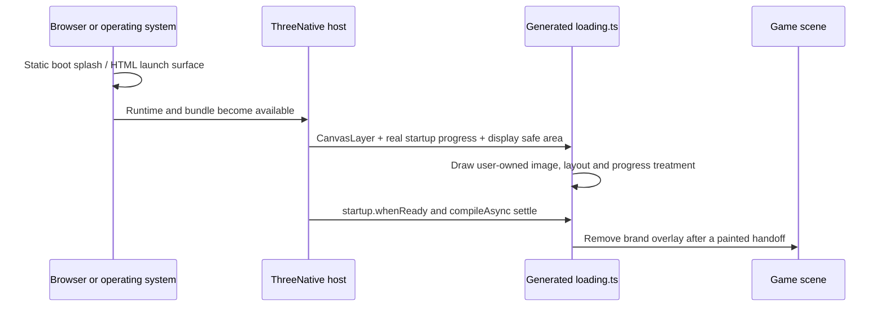

# PRD-153 — One game brand from launcher tap to the first playable frame

**Status:** DONE, 2026-08-19. Squashed onto `main` as `930569b`, with follow-up fixes in `620e464`
and `a4a7db3`. Every gate that executes on this operator box is green: typecheck, lint, `pnpm test`,
`pnpm test:templates` (all seven), `pnpm test:browser`, `pnpm test:playtest`, `pnpm budgets`,
`pnpm native:build` and `pnpm native:verify:desktop`. **Closed by owner decision with two device
lanes unverified**, both of them outside this PRD's work: the Android emulator is red on a
canvas-layer overlay assertion bisected to PRD-155, and no Apple machine exists here so the iOS
simulator has never run. No physical-hardware or iOS claim is made. Record:
`docs/verification/prd-153-154-integration-2026-08-19.md`.

**Outcome:** a generated game can replace every player-visible brand surface that ThreeNative
currently owns — web title and install icons, native launcher and desktop icons, the platform boot
splash, and the live loading screen — without editing framework or runtime source.

**Depends on:** the implemented app-config path described by PRD-067 and the independent
`CanvasLayer` delivered by PRD-075. PRD-067's document still says `NOT STARTED` even though its
loader and packager paths exist; this PRD does not treat that stale status as evidence that the
identity path is complete.

**Complexity: 7 → HIGH mode.** +3 for more than ten files, +2 for one brand contract crossing web,
Android, iOS and desktop packaging, and +2 for multi-package changes.

**Blast radius:** `packages/core/src/config.ts`, `packages/core/src/viewport.ts`,
`packages/create-threenative/src/config.ts`, one Vite branding adapter, the template Vite/HTML/CSS/
portable scene and generated `src/render/loading.ts` files, native packagers and platform resources,
the SDL window path, package/config tests, template tests, artifact inspectors and launch playtests.

## Integration Ledger

`TBD` locations are replaced with real non-test `file:line` values during implementation. A phase
cannot close while one of its rows still says `TBD`.

| # | New thing | Live caller (`file:line`, non-test) | Replaces | Old path removed? | Negative control |
| --- | --- | --- | --- | --- | --- |
| 1 | resolved app-icon variants and `bootSplash` contract | `packages/create-threenative/src/build.ts:TBD` writes the resolved values into the existing packaging config | single `app.icon` path plus an empty iOS `UILaunchScreen` | Phase 4 | declare a missing variant; every target build fails with its path and named code |
| 2 | web metadata adapter and pre-canvas launch surface | each template `vite.config.ts:TBD` registers the adapter, `index.html:TBD` owns the markup and `src/main.ts:TBD` removes it after canvas paint | fixed `favicon.svg` link and blank page before JavaScript | Phase 2 | remove adapter registration or launch removal; the built-page gate fails |
| 3 | Android adaptive icon and system splash resources | `packages/runtime-native/scripts/package-android.mjs:TBD` writes resources consumed by the packaged manifest/theme | one `mipmap-xxxhdpi` bitmap and generic Android 12 splash | Phase 3 | remove the adaptive-icon XML or splash background assignment; packaged-APK assertions fail |
| 4 | iOS icon appearances and static launch screen | `packages/runtime-native/scripts/package-ios.mjs:TBD` compiles the catalog and writes `UILaunchScreen` values | one universal icon and empty launch dictionary | Phase 4 | omit the launch image or mutate its background; staged-app assertions fail |
| 5 | desktop window/application icon | `packages/runtime-native/src/platform/window.cpp:TBD` applies the embedded icon to the live SDL window | generic runtime icon | Phase 5 | bypass `SDL_SetWindowIcon`; the desktop observation reports the generic/missing icon |
| 6 | display-safe loading layout | `packages/core/src/game.ts:TBD` supplies measured insets through `Viewport`; generated `src/render/loading.ts:TBD` positions inside them | full-canvas placement with no cutout knowledge | Phase 6 | inject asymmetric insets and place the bar against the physical edge; the bounds test fails |
| 7 | generated loading-brand source | each template's existing scene `enter():TBD` calls its own `createLoadingScreen` | six inconsistent screens, one absent screen, and five dead config fields | Phase 8 | disable the call or make the fill stretch; the real template playtest fails |
| 8 | launch-handoff regression gate | existing playtest CLI and `packages/runtime-native/scripts/inspect-launch.mjs:TBD` observe the normal built game | point-in-time screenshot that misses blank or wrong-brand frames | n/a, gate | insert one off-brand frame; the frame-sequence assertion fails and names its index |

## 1. Incumbent census

This is partly an **engine bug** and partly generated game appearance.

- The engine bug is discarded or absent platform plumbing: declared loading values have no live
  consumer; one PNG does not produce adaptive/themed Android icons; the desktop window never reads
  the app icon; and no portable safe-area measurement reaches the canvas layer. A game cannot repair
  those platform seams portably, so their fixes belong in `packages/`.
- The game-owned part is every actual visual decision: images, color, logo size, loading-bar shape,
  position, fill treatment and transition. Those remain generated source and assets under the
  user's project, primarily `src/render/loading.ts` and `public/branding/`.

| Surface | Current behavior | Defect |
| --- | --- | --- |
| App identity | `app.id`, name, version and build reach Android/iOS; the desktop title reaches the runtime | useful incumbent; retain |
| App icon | one validated PNG is copied to Android `mipmap-xxxhdpi` and compiled into one iOS universal slot | no Android adaptive/monochrome layers, no iOS dark/tinted inputs, no web or desktop integration |
| Web identity | each template substitutes `<title>` and links a fixed `favicon.svg` | `app.name`/icon changes do not update the page; there is no manifest, touch icon or initial brand background |
| Platform boot | Android uses the generic theme; iOS declares an empty `UILaunchScreen` dictionary | players see framework/default launch chrome before Three.js can draw |
| Loading declaration | `IThreeNativeConfig.loading` validates image, three colors and a bar toggle | no non-test consumer reads `config.loading`; changing every field changes no rendered pixel |
| Loading implementation | six templates own different `loading.ts` files; starter has none; minimal creates then immediately finishes one | no single truthful customization path across generated projects |
| Placement | the canvas layer tracks width and height | no display-safe rectangle; logos/bars can sit under a cutout or system gesture area |

The dead loading declaration is reproduced by this caller census:

```sh
rg -n "config\.loading|loading\.(image|backdropColor|trackColor|progressColor|showProgressBar)" \
  packages --glob '!**/dist/**'
```

The expected current result is validators, tests and template declarations only — no renderer.
Phase 1 records that baseline; Phase 8G turns it into a permanent rejection only after every
generated config has stopped using the dead keys, so every phase can keep the tree green.

## 2. Industry baseline and the decisions it creates

This PRD uses platform documentation, not a cross-engine preset vocabulary.

| Platform fact | Source | Decision here |
| --- | --- | --- |
| Android 12+ always owns the initial splash and exposes icon, icon background, opaque window background and an optional branding image | [Android splash screens](https://developer.android.com/develop/ui/views/launch/splash-screen) | package a system splash; never pretend a Three.js progress bar can render before the activity exists |
| Android launcher icons are foreground/background adaptive layers with an optional monochrome layer for themed icons | [Android adaptive icons](https://developer.android.com/develop/ui/compose/system/icon_design_adaptive) | support all three declared inputs and keep the existing single PNG as the compatibility fallback |
| iOS launch screens are static UIKit/property-list content with no code connections | [Apple launch screens](https://developer.apple.com/documentation/xcode/specifying-your-apps-launch-screen) | allow an opaque color and static image only; progress belongs to `loading.ts` after the runtime starts |
| Apple icon catalogs accept default, dark and tinted appearances | [Apple app-icon configuration](https://developer.apple.com/documentation/xcode/configuring-your-app-icon) | accept optional dark/tinted artwork without requiring it |
| A web manifest carries name, icons, display/orientation and launch colors; icon purposes include `any`, `maskable` and `monochrome` | [W3C Web App Manifest](https://www.w3.org/TR/appmanifest/) | emit the manifest from user-owned config through an explicit template Vite adapter; do not claim offline/PWA support |
| SDL can apply a multi-resolution icon to a window, while Wayland may instead require installed desktop metadata | [SDL window icons](https://wiki.libsdl.org/SDL3/SDL_SetWindowIcon), [SDL Wayland notes](https://wiki.libsdl.org/SDL3/README-wayland) | apply the live window icon everywhere SDL can, and report rather than conceal the raw-binary/Wayland limitation |

## 3. Product boundary

There are three sequential surfaces. Their different owners are part of the contract.



1. **Platform boot splash:** static, immediate and package-owned. It may show a background color,
   centered image and platform icon treatment. It has no progress, timer or arbitrary animation.
2. **Live loading screen:** generated game source. It consumes real `ctx.startup.progress`, may be
   fully disabled, and owns every visual/layout decision.
3. **Playable frame:** the loading layer is disposed only after readiness and compilation. The
   handoff gate rejects a blank, default-brand or half-built frame between stages.

### Reachability

| User action | Existing entry point edited | Live path | Observable result |
| --- | --- | --- | --- |
| edit app name/icons or boot splash, then build | template `vite.config.ts`; existing `create-threenative/src/build.ts` | Vite adapter for web; existing packaging-config handoff for native | served/built web metadata or packaged native resources change |
| edit `src/render/loading.ts` | existing template scene `enter()` caller | `createLoadingScreen(ctx)` draws into the existing `CanvasLayer` | next real startup frame uses the edited composition |
| set `enabled = false` in loading source | same scene caller; no registration change | no-op controller creates no overlay | game renders without the live loading cover |
| rotate or launch around a display cutout | existing viewport resize/platform source | measured safe rectangle reaches the generated layout | non-background brand elements stay inside the usable area |

## 4. Configuration and generated-source contract

### 4.1 Packaging-only app brand

Keep the existing `app.icon: string` working. Add optional fidelity rather than replacing it:

```ts
export default {
  app: {
    id: "com.example.game",
    name: "Example Game",
    icon: "public/branding/icon.png",
    icons: {
      android: {
        foreground: "public/branding/icon-foreground.png",
        background: "#111827",
        monochrome: "public/branding/icon-monochrome.png",
      },
      ios: {
        dark: "public/branding/icon-dark.png",
        tinted: "public/branding/icon-tinted.png",
      },
      web: {
        favicon: "public/branding/favicon.svg",
        maskable: "public/branding/icon-maskable.png",
        monochrome: "public/branding/icon-monochrome.png",
        appleTouch: "public/branding/apple-touch-icon.png",
      },
    },
  },
  bootSplash: {
    backgroundColor: "#0d1b2a",
    image: "public/branding/launch.png",
  },
} satisfies IThreeNativeConfig;
```

`icons` uses platform names because these are packaging seams with genuinely different contracts,
not game-runtime branches. Every declared file is project-relative, exists, has a supported format
and passes target-specific dimension/alpha checks. Invalid declared artwork fails with a stable
`TN_CONFIG_BRAND_*` code. Missing optional variants fall back to `app.icon`; a declared-but-invalid
variant never silently falls back.

`bootSplash` borrows Godot's boot-splash term. The config carries only values a platform packager
must know before game code exists. It does not gain progress-bar layout, logo scale, easing, tips,
percent text or a loading-screen preset.

### 4.2 The live screen is source, not configuration

Remove all seven template declarations first. Then remove `IThreeNativeConfig.loading` and its
validator in Phase 8G, after the caller-census regression test has been observed red against the
incumbent acceptance path. The single editable home for the look is `src/render/loading.ts`.

Every generated loading file exposes ordinary constants and Three.js code for these requested
changes:

| Customization | Required source behavior |
| --- | --- |
| disable everything | `enabled = false` returns a no-op controller, leaves `CanvasLayer.opaque` false and creates zero meshes |
| solid or image backdrop | a color quad or textured cover/contain quad with explicit focal point and no uncovered viewport edge |
| solid or image progress fill | color material or texture whose UV crop reveals progress without horizontally stretching the art |
| bar layout | normalized anchor, pixel/max width, height and safe-area-relative offset; works in portrait, landscape and resize |
| optional logo/status | independently positioned image and optional truthful percent/status; neither is required for the bar |
| reveal | immediate or user-authored fade after readiness; no fake minimum duration and no fabricated progress |

The default stays small: opaque background plus real determinate bar. The source comments show the
five requested edits at their declaration sites. A look that needs a spinner, shader, animation,
segmented bar or entirely different composition is an edit to this file, not a request for another
framework option.

### 4.3 Display-safe placement

Add the smallest portable mechanism the game cannot write: a read-only display-safe rectangle on
`Viewport`, using Godot's `DisplayServer.getDisplaySafeArea` meaning. Web reads CSS safe-area
environment values; Android and iOS forward their actual window insets through the host. Desktop
defaults to the full drawable.

The loading file chooses whether to anchor to the safe rectangle or full bleed. Backgrounds remain
full bleed; logos, text and progress controls default to the safe rectangle. A backend that cannot
read insets returns an explicitly reported full-drawable fallback, not invented padding.

## 5. Platform outputs

| Target | Built output |
| --- | --- |
| Web | substituted title, favicon and Apple touch icon links, a `manifest.webmanifest` artifact emitted from user config, static user-owned HTML/CSS launch background, and a painted handoff to the canvas |
| Android | legacy fallback icon plus adaptive foreground/background/monochrome resources, correct manifest icon references, and Android 12+ splash theme using `bootSplash` |
| iOS simulator | default/dark/tinted icon catalog inputs when declared and a static `UILaunchScreen` color/image whose content mode survives phone/tablet sizes |
| Desktop | embedded brand asset staged with the bundle and applied to the SDL window/task switcher; platform packaging reports whether file-manager metadata is representable by the current artifact format |

The web manifest does not add a service worker, caching, install prompt or offline claim. The iOS
result remains simulator-proved only. Android proof uses the local emulator; physical launcher,
OEM mask and themed-icon review remain named evidence gaps until a phone executes them.

## 6. Execution phases

Each phase is a user-testable vertical slice, edits at least one pre-existing file, touches no more
than five files, and receives the automated checkpoint and integration audit required by the PRD
execution process. Visual phases also require the manual screenshot checkpoint.

### Phase 1A — Packaging accepts a complete brand and rejects a broken one

**Files (3):** `packages/core/src/config.ts`, `packages/create-threenative/src/config.ts`,
`packages/create-threenative/__tests__/config.spec.ts`.

- Record the incumbent loading caller census, including the fact that every hit is declaration,
  validation or test code rather than a renderer consumer.
- Add the typed `app.icons` and `bootSplash` contract with strict path, format, dimensions, alpha
  and color validation.
- Preserve `app.icon: string` as the default/fallback; fill ledger row 1's loader/build caller.

**Proof:** every valid optional variant resolves from the project and one missing, corrupt or
wrong-format variant fails with its own path and stable code.

**Revert check:** bypass validation for one declared file; the focused config spec fails because an
invalid brand would reach packaging.

### Phase 1B — The first real loading subject owns its look in rendered source

**Files (3):** `packages/create-threenative/templates/platformer/threenative.config.ts`,
`packages/create-threenative/templates/platformer/src/render/loading.ts`,
`packages/create-threenative/__tests__/loading-screen.spec.ts`.

- Move the platformer's visual constants into `loading.ts`; remove its dead config group while
  retaining the legacy type temporarily for templates not yet migrated.
- Use platformer first because it is the shipped mobile/touch kit, has the largest orientation and
  safe-area exposure, and exercises a real collapse window; minimal finishes its current screen
  immediately.
- Assert the actual materials and positions produced by the platformer source, not copied config
  values or source text.

**Proof:** editing the platformer loading constants changes the built screen and focused assertion;
editing the removed platformer config cannot change either.

**Revert check:** restore the config as a disconnected source of its colors; the assertion remains
unchanged and the wiring audit fails because the restored values have no consumer.

### Phase 2A — Web identity comes from the same app config in dev and production

**Files (5):** `packages/create-threenative/src/web-brand.ts` (new),
`packages/create-threenative/package.json`,
`packages/create-threenative/__tests__/web-brand.spec.ts` (new),
`packages/create-threenative/templates/platformer/vite.config.ts`,
`packages/create-threenative/templates/platformer/index.html`.

- Export one small Vite adapter that transforms served/built HTML and emits
  `manifest.webmanifest` from the already-resolved user config. It owns metadata plumbing only;
  the template HTML still owns visible markup and CSS.
- Register it explicitly in the generated Vite config so `pnpm dev`, direct `vite build` from the
  template test script and `threenative build --target web` use the same values.
- Inject title, theme/background metadata and favicon/touch/manifest links without overwriting the
  user's source files or maintaining a second JSON identity file.

**Proof:** change only the platformer scaffold's app config; both the dev response and production
artifact carry the new name, icons and manifest values. Remove the Vite registration and the
pre-existing scaffold build assertion fails.

### Phase 2B — The web handoff has no blank or permanently covering frame

**Files (5):** `packages/create-threenative/templates/platformer/src/style.css`,
`packages/create-threenative/templates/platformer/src/main.ts`,
`packages/create-threenative/templates/platformer/index.html`,
`packages/create-threenative/templates/platformer/playtests/branding.playtest.json` (new),
`packages/create-threenative/__tests__/scaffold.spec.ts`.

- Draw a static, branded HTML launch surface before JavaScript and let the template own every
  visible element and style.
- Remove it after the canvas has produced its first loading/game paint, not merely after the start
  promise resolves.
- Prove no blank/default-favicon request occurs and the launch surface cannot remain over playable
  input.

**Proof:** a fresh platformer scaffold shows the chosen identity before boot, the expected static
surface before canvas paint, then the branded loading surface. Removing the handoff removal fails
because the HTML surface still covers the playable game.

### Phase 3 — Android launcher and system splash

**Files (5):** `packages/runtime-native/scripts/package-android.mjs`,
`packages/runtime-native/android/app/src/main/AndroidManifest.xml`,
`packages/runtime-native/android/app/src/main/res/values/themes.xml`,
`packages/runtime-native/tests/android-packaging.integration.test.mjs`,
`packages/create-threenative/__tests__/build.spec.ts`.

- Stage legacy and adaptive icon resources, including optional monochrome artwork, and write every
  manifest/theme reference from the resolved config.
- Generate the Android 12 system splash background/icon treatment from `bootSplash`; keep the
  post-splash game theme and current fullscreen behavior intact.
- Inspect the packaged APK rather than only testing XML render helpers.

**Proof:** the emulator launcher shows the declared icon under circle and squircle masks, the themed
icon uses the declared monochrome layer, and a cold start shows no generic ThreeNative/default frame.

### Phase 4 — iOS launch and icon appearance parity

**Files (3):** `packages/runtime-native/scripts/package-ios.mjs`,
`packages/runtime-native/ios/Info.plist`, `packages/runtime-native/tests/ios-packaging.test.mjs`.

- Compile default, dark and tinted catalog inputs when present; retain platform-generated fallback
  appearances when optional variants are absent.
- Populate the static launch dictionary/catalog with the declared background and image, using
  constraints/content mode that survive supported phone and tablet dimensions.
- Assert the staged `.app` contains and references the compiled artifacts.

**Proof:** the hosted `macos-15` lane captures the iOS simulator's cold launch in portrait and
landscape and sees the configured static brand before the first runtime frame. No physical-device
claim is made.

### Phase 5 — Desktop window branding

**Files (5):** `packages/runtime-native/scripts/package-desktop.mjs`,
`packages/runtime-native/src/cli/main.cpp`, `packages/runtime-native/src/platform/window.cpp`,
`packages/runtime-native/src/platform/window.h`,
`packages/runtime-native/tests/desktop-assets.test.mjs`.

- Stage the selected icon beside the embedded config, decode it through the runtime's existing image
  path, and call SDL's window-icon API on the main thread after window creation.
- Include alternate resolutions when declared; log a bounded capability result when the compositor
  cannot expose a programmatic window icon.
- Do not claim Finder/Explorer/Wayland launcher-file branding unless the produced artifact format
  actually carries it. If that is required to complete the phase, add a follow-on packaging PRD
  rather than writing `applied: true` beside a raw executable.

**Proof:** `native:verify:desktop` observes the non-default live window icon and title. Bypassing the
SDL call makes the same observation fail.

### Phase 6 — Safe-area mechanism and one complete loading screen

**Files (5):** `packages/core/src/viewport.ts`, `packages/core/__tests__/viewport.spec.ts`,
`packages/create-threenative/templates/platformer/src/render/loading.ts`,
`packages/create-threenative/templates/platformer/src/scenes/Level.ts`,
`packages/create-threenative/__tests__/loading-screen.spec.ts`.

- Add the portable display-safe rectangle and drive it through resize/orientation changes.
- Implement the full platformer authoring surface: disabled, background image, image fill with
  cropped UVs, safe-area position and independent logo/status placement.
- Keep existing readiness, compile-before-reveal, NaN clamp, disposal and opaque-layer guarantees.

**Proof:** focused tests cover every customization row in section 4.2; portrait, landscape and
asymmetric-inset screenshots show all non-background content inside the declared safe rectangle.

### Phase 7 — Native inset sources

**Files (5):** `packages/runtime-native/src/platform/input.cpp`,
`packages/runtime-native/src/platform/window.cpp`, `packages/runtime-native/ios/main.mm`,
`packages/runtime-native/android/app/src/main/java/com/mystral/engine/MystralActivity.java`,
`packages/runtime-native/tests/runtime-next-contract.test.mjs`.

- Forward Android window insets and iOS safe-area geometry through the existing coarse viewport
  boundary; do not add per-frame object calls.
- Update on rotation and system-bar changes, and preserve the full-drawable desktop fallback.
- Prove the JavaScript viewport sees the exact injected asymmetric inset fixture.

**Proof:** Android emulator and iOS simulator observations match the host-reported safe rectangle;
zeroing one host source makes its parity assertion fail while the other target remains green.

### Phase 8 — Roll the proven source through every template

This is a sequence of mechanical subphases, each capped at five files and each pair ending in that
template's real playtest. `load` means config + generated loading source + the named scene caller;
`web` means Vite config + HTML + CSS + web entry. Do not combine rows into one wide edit.

| Subphase | Exact template files | User-visible result |
| --- | --- | --- |
| 8A-load | starter `threenative.config.ts`, new `src/render/loading.ts`, `src/scenes/Play.ts` | the default scaffold gains a real startup cover and loses dead loading config |
| 8A-web | starter `vite.config.ts`, `index.html`, `src/style.css`, `src/main.ts` | starter gets config-derived browser identity and a painted handoff |
| 8B-load | minimal `threenative.config.ts`, `src/render/loading.ts`, `src/scenes/Play.ts` | minimal keeps an explicit no-op/opt-out path instead of constructing and immediately finishing a screen |
| 8B-web | minimal `vite.config.ts`, `index.html`, `src/style.css`, `src/main.ts` | minimal browser/install identity follows app config without adding a required visual style |
| 8C-load | action-RPG `threenative.config.ts`, `src/render/loading.ts`, `src/scenes/Play.ts` | action-RPG keeps its own palette through the common behavior |
| 8C-web | action-RPG `vite.config.ts`, `index.html`, `src/style.css`, `src/main.ts` | action-RPG has no blank web-launch frame |
| 8D-load | defense `threenative.config.ts`, `src/render/loading.ts`, `src/scenes/Defense.ts` | defense keeps its own palette through the common behavior |
| 8D-web | defense `vite.config.ts`, `index.html`, `src/style.css`, `src/main.ts` | defense browser/install identity follows app config |
| 8E-load | racing `threenative.config.ts`, `src/render/loading.ts`, `src/scenes/Race.ts` | racing's screen keeps its distinct composition and full customization |
| 8E-web | racing `vite.config.ts`, `index.html`, `src/style.css`, `src/main.ts` | racing browser/install identity follows app config |
| 8F-load | shooter `threenative.config.ts`, `src/render/loading.ts`, `src/scenes/Play.ts` | shooter is the final loading implementation admitted by the discovery gate |
| 8F-web | shooter `vite.config.ts`, `index.html`, `src/style.css`, `src/main.ts` | all seven discovered templates now share the branding contract |
| 8G-truth | `packages/core/src/config.ts`, `packages/create-threenative/src/config.ts`, `packages/create-threenative/__tests__/config.spec.ts` | `loading` is now an unknown config group and no accepted appearance value is unread |

Each template keeps its own palette and composition. Only behavior and edit points are common; this
does not create a package preset or force seven screens to look alike.

### Phase 9 — Full launch sequence and release gates

**Files (4):** `packages/create-threenative/__tests__/template.spec.ts`,
`packages/runtime-native/scripts/inspect-launch.mjs`,
`packages/create-threenative/templates/platformer/playtests/branding.playtest.json`,
`docs/verification/prd-153-game-branding-<date>.md` (new evidence record).

- Discover templates from the filesystem and fail if any lacks declared browser identity, a
  truthful loading caller decision, or a documented opt-out.
- Extend the existing per-frame launch inspector to classify platform splash, live loading and
  playable frames, rejecting zero observations and any intervening blank/default-brand frame.
- Run the same branded subject on Chromium, desktop native and Android emulator; run the static
  launch half on the iOS simulator lane.

**Proof:** all four executed targets show the expected ordered sequence. Desktop, Android emulator
and iOS simulator are named exactly; no physical-mobile or performance-parity claim is added.

## 7. Verification matrix

| Gate | Positive assertion | Required observed red |
| --- | --- | --- |
| Config | every declared brand asset resolves and every removed loading key is unknown | missing icon variant and reintroduced unread loading key both fail |
| Web artifact | built HTML links the manifest/icons and the manifest values match the game | remove the manifest link; built-page inspection fails |
| Android artifact | packaged manifest/resources contain adaptive, monochrome and splash inputs | delete adaptive XML or change splash color; APK inspection fails |
| iOS artifact | staged app contains referenced icon appearances and launch assets | remove `UILaunchScreen` image reference; staged-app test fails |
| Loading unit | disabling creates no overlay; image fill crops; background covers; layout stays safe | restore stretched fill or physical-edge anchoring; focused test fails |
| Launch playtest | every observed frame belongs to platform splash, live loading or playable game in order | inject one magenta/default frame; output names its index and exits nonzero |
| Integration | every new export has a non-test caller and removing it breaks an existing scaffold/build flow | temporarily bypass each ledger caller; the corresponding pre-existing flow fails |

Final commands, after the focused negative controls are restored:

```sh
pnpm typecheck
pnpm lint
pnpm test
pnpm test:templates
pnpm budgets
pnpm native:verify:desktop
```

Android emulator verification is local. The iOS simulator artifact/capture uses the hosted Apple
lane because this operator machine cannot execute it. A command not run is recorded `UNVERIFIED`,
never inferred from another platform.

## 8. Acceptance criteria

| # | Consumer-visible criterion | Done? |
| --- | --- | --- |
| 1 | A freshly generated game changes its web title/favicon/install icon and Android/iOS launcher icon by editing only its own config/assets; the next built artifacts visibly use them | no |
| 2 | Cold launch on Chromium, desktop native, Android emulator and iOS simulator contains no generic ThreeNative icon/splash, blank frame or wrong-brand frame between launch and play | no |
| 3 | The generated loading screen supports bar color and safe-area position, full disable, image fill without stretching, background image, optional logo/status and portrait/landscape resize entirely in `src/render/loading.ts` | no |
| 4 | Platform splashes remain static and loading progress remains truthful; no timer, fake percentage or platform splash is represented as real progress | no |
| 5 | Android adaptive and themed-icon inputs, iOS dark/tinted inputs, web maskable/touch inputs and SDL desktop window icon each reach their real consumer when declared | no |
| 6 | `IThreeNativeConfig.loading` and all dead template declarations are gone; caller census finds no accepted appearance value without a live consumer | no |
| 7 | Display-safe placement uses measured web/Android/iOS insets and survives rotation; missing inset capability is reported as a full-drawable fallback | no |
| 8 | Every ledger row has a real live caller, every gate has an observed red, all final commands actually executed are green, and visual evidence names exactly which platforms ran | no |

## 9. Out of scope

- Store-listing screenshots, trailers, descriptions, age ratings, categories, signing and release
  credentials. They are distribution metadata, not surfaces this repository currently builds.
- Alternate icons selectable by a player at runtime, notification badges, shortcuts and localized
  app names. The default installed identity is the industry baseline here.
- A loading-screen component library, preset gallery, `defineGame` option or framework-owned look.
  Generated source is the customization surface.
- Fake progress, forced minimum splash duration, ads, publisher/legal screens and epilepsy/photosensitivity
  notices. A game may author them, but they are not generic branding plumbing.
- Claiming physical Android/iOS proof, desktop installer branding or offline PWA behavior without
  executing and packaging those exact paths.
