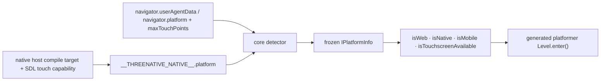

# PRD-154 — Runtime platform and input capabilities

**Status:** DONE, 2026-08-19. Squashed onto `main` as `5cc9be8`. `getPlatform`, `isWeb`, `isNative`,
`isMobile` and `isTouchscreenAvailable` ship from `@threenative/core`, the C++ host publishes the
facts they read before the bundle is evaluated, and the platformer's touch overlay follows them.
Every gate that executes on this operator box is green, including `pnpm native:build` and
`pnpm native:verify:desktop`. **Closed by owner decision with two device lanes unverified**: the
Android emulator is red on a canvas-layer overlay assertion bisected to PRD-155, not to this work,
and the hosted iOS simulator has not run. No physical-hardware or iOS claim is made. Record:
`docs/verification/prd-153-154-integration-2026-08-19.md`.

**Outcome:** portable game source can ask which runtime, operating-system family and input
capabilities it is running on, while the generated platformer's touch controls stay hidden on web
by default, appear on native mobile by default, and remain a one-line game-owned customization.

**Complexity: 7 → HIGH mode.** +3 for more than ten files across all proof lanes, +2 for a new
core module and public contract, and +2 for coordinated core, native-runtime and
generated-template changes. Every phase requires an automated checkpoint; the two visible-control
phases also require a manual screenshot checkpoint.

**Blast radius:** `packages/core/src/platform.ts` (new), the core root export and tests,
`packages/runtime-native/src/runtime.cpp`, native host-contract and smoke proofs, and the
platformer scene, touch-control render source, focused tests and target playtests.

## 1. Problem and incumbent census

The same game source currently has no supported answer to any of these questions:

- Is this bundle executing in a browser or in the owned native host?
- Is the host Android, iOS, Linux, macOS or Windows?
- Is this a mobile-class host, and is touchscreen input actually available?

A game can inspect `window`, `document`, `navigator`, `process.platform` or
`globalThis.__THREENATIVE_NATIVE__`, but those are host details rather than a portable contract.
`window` and `document` also exist as compatibility stubs on native, so their presence does not
identify web. Asking every game to rediscover these seams is framework plumbing.

The visible incumbent is the generated platformer:

- `packages/create-threenative/templates/platformer/src/scenes/Level.ts` always constructs and
  registers `TouchControls`.
- `src/render/touch-controls.ts` always attaches its geometry to the camera and always reads raw
  pointers.
- The result is a thumbstick, jump ring and dash ring on desktop web even when the player is using
  keyboard or gamepad.
- There is no explicit force-on/force-off value at the call site.

The native host already creates `globalThis.__THREENATIVE_NATIVE__`, but only for internal host
services. It does not publish a typed runtime/OS/capability descriptor. It also initializes
`process.platform` with `__linux__` before `__ANDROID__`; Android toolchains define `__linux__`, so
that incidental value cannot become the public source of truth.

**Layer:** this is an engine bug. Runtime identity and host capabilities cross a platform seam a
game cannot implement portably. Detection belongs in `packages/core/` with facts supplied by
`packages/runtime-native/`; the controller's geometry, layout and visibility choice remain
generated game source.

**Files analyzed:** `packages/core/src/index.ts`, `packages/core/src/game.ts`,
`packages/core/src/scene.ts`, `packages/runtime-native/src/runtime.cpp`,
`packages/runtime-native/scripts/bundle.mjs`, the platformer `Level.ts` and `touch-controls.ts`, and
their existing tests and playtests.

## 2. Industry comparison

| Ecosystem | Stable shape | Lesson for ThreeNative |
| --- | --- | --- |
| [React Native Platform](https://reactnative.dev/docs/platform-specific-code.html) | `Platform.OS`, `Platform.Version`, and `Platform.select()` | Expose a stable discriminant; do not make consumers inspect globals. Do not add `select()` here: a plain conditional is shorter and the closed preset rule rejects a selection abstraction. |
| [Flutter foundation](https://api.flutter.dev/flutter/foundation/kIsWeb-constant.html) | `kIsWeb` is separate from `defaultTargetPlatform`, which can describe the browser host | Runtime and OS/device classification are separate axes. `isWeb()` must not be inferred from `isMobile()`. |
| [Godot OS](https://docs.godotengine.org/en/stable/classes/class_os.html) | `OS.get_name()` plus feature tags such as `web_android` | A browser can be Web and still run on Android/iOS; preserve both facts in one descriptor. |
| [Godot DisplayServer](https://docs.godotengine.org/en/stable/classes/class_displayserver.html) | `is_touchscreen_available()` is a capability query | Touch availability is not the same as mobile classification. |
| [Godot TouchScreenButton](https://docs.godotengine.org/en/stable/classes/class_touchscreenbutton.html) | visibility can be always or touchscreen-only | Controller visibility needs an explicit authored override; automatic behavior is only a default. |
| [Expo Device](https://docs.expo.dev/versions/latest/sdk/device/) | coarse phone/tablet/desktop/TV type and nullable facts where detection is imperfect | Return `unknown` rather than guess a detailed form factor or device model. |
| [Unity RuntimePlatform](https://docs.unity3d.com/6000.0/Documentation/ScriptReference/RuntimePlatform.html) | a runtime enum distinct from compile-time platform selection | The value must describe the executable that is actually running and remain useful in a shared bundle. |
| [Pointer Events `maxTouchPoints`](https://developer.mozilla.org/en-US/docs/Web/API/Navigator/maxTouchPoints) | standardized count of simultaneous touch contacts | Use a capability signal for web touch; never equate a narrow viewport or CSS breakpoint with a mobile device. |

The common pattern is a small read-only descriptor plus capability queries. The rejected pattern is
a growing bag of convenience booleans (`isAndroid`, `isIOS`, `isDesktop`, `isTablet`, and so on)
that can disagree and makes every new target a public API expansion.

## 3. Proposed contract

Add the following root exports from `@threenative/core`:

```ts
export type PlatformRuntime = "web" | "native";
export type PlatformOS = "android" | "ios" | "linux" | "macos" | "windows" | "unknown";
export type PlatformFormFactor = "mobile" | "desktop" | "unknown";

export interface IPlatformInfo {
  readonly runtime: PlatformRuntime;
  readonly os: PlatformOS;
  readonly formFactor: PlatformFormFactor;
  readonly maxTouchPoints: number;
}

export function getPlatform(): Readonly<IPlatformInfo>;
export function isWeb(): boolean;
export function isNative(): boolean;
export function isMobile(): boolean;
export function isTouchscreenAvailable(): boolean;
```

Semantics are exact:

1. `runtime` says where JavaScript executes. It is `web` in every browser and `native` only in the
   owned host.
2. `os` says the host OS family. Mobile web may therefore be `{ runtime: "web", os: "android" }`.
3. `formFactor` is deliberately coarse. Android/iOS native targets are `mobile`; native desktop
   targets are `desktop`; web uses reliable browser device data when available and otherwise
   returns `unknown`. It does not infer tablet/phone from viewport dimensions.
4. `maxTouchPoints` is a non-negative observed capability. `isTouchscreenAvailable()` is exactly
   `maxTouchPoints > 0`.
5. `isWeb()` and `isNative()` compare `runtime`; `isMobile()` compares `formFactor`. They are small
   requested conveniences over the descriptor, not separate detection paths.

`getPlatform()` returns one frozen, process-lifetime snapshot so every helper agrees. Its internal
detector accepts a source object for unit tests, but that test seam is not exported. Unknown or
unavailable facts degrade to `unknown`/`0`; malformed native-host facts fail during host startup
with `TN_NATIVE_PLATFORM_INVALID` instead of silently impersonating another platform.

### Detection sources



The native marker is the authority whenever it exists. Browser detection may use
`navigator.userAgentData` when present and a narrow `navigator.platform`/user-agent compatibility
fallback for coarse OS/form-factor classification. The fallback is isolated in one module, tested,
and returns `unknown` when evidence conflicts. No model, manufacturer, OS version, architecture,
locale, unique ID, emulator flag or privacy-sensitive fingerprint enters this PRD.

### Controller default and customization

The generated platformer owns this ordinary source expression in `Level.enter()`:

```ts
const showTouchControls = isNative() && isMobile() && isTouchscreenAvailable();
const touchControls = showTouchControls
  ? ctx.entities.add("touch-controls", new TouchControls(camera))
  : undefined;
```

The update path uses `touchControls?.update(...)`, so no controller object exists and no pointer is
read when the expression is false. The default is intentionally narrower than “touch exists”:
controls do not appear on mobile web or a touch-capable desktop. A user can replace the expression
with `true`, `false`, `isTouchscreenAvailable()`, or any game-owned condition. No framework config
option, visibility preset or second controller API is added.

## 4. Reachability and integration ledger

**How the feature is reached:**

1. The native host installs the platform descriptor before evaluating the import-free game bundle;
   browsers expose their standard navigator facts.
2. A game imports a helper or calls `getPlatform()` from its portable `src/game.ts` or scene.
3. The generated platformer's existing `Level.enter()` calls the helpers on every real start.
4. The player sees no controller geometry on web and sees it on a touch-capable native mobile run;
   editing one generated expression overrides the default.

**User-facing:** yes. The visible consumer is the generated platformer's controller overlay.

**What this replaces:** direct host-global inspection as the only possible runtime test, plus the
platformer's unconditional controller construction/interaction behavior. No second detection path
may remain live.

`TBD` locations are replaced with real non-test `file:line` values during implementation. A phase
cannot close while one of its rows still says `TBD`.

## Integration Ledger

| # | New thing | Live caller (`file:line`, non-test) | Replaces | Old path removed? | Negative control |
| --- | --- | --- | --- | --- | --- |
| 1 | `getPlatform()` | `examples/native-smoke/src/game.ts:TBD` validates and reports the real descriptor | no supported descriptor | Phase 2 | corrupt one descriptor field; native smoke exits before frame 1 |
| 2 | `isWeb()` | `examples/native-smoke/src/game.ts:TBD` asserts it is false on the real host | direct DOM/global inference | Phase 2 | derive it from `document`; native compatibility DOM makes the assertion fail |
| 3 | `isNative()` | platformer `src/scenes/Level.ts:TBD` evaluates it during `enter()`; native smoke asserts it | direct marker inspection | Phase 1 | stub web as native; browser controller-absence gate turns red |
| 4 | `isMobile()` | platformer `src/scenes/Level.ts:TBD` evaluates it during `enter()` | no supported mobile classification | Phase 1 | derive it from touch count; touch-laptop unit row fails |
| 5 | `isTouchscreenAvailable()` | platformer `src/scenes/Level.ts:TBD` evaluates it during `enter()` | raw navigator/host input inspection | Phase 1 | force zero on Android; native controller playtest fails |
| 6 | native `platform` host descriptor | `packages/core/src/platform.ts:TBD` reads it before the platformer enters | incidental `process.platform` and marker-presence inference | Phase 2 | remove the descriptor; native smoke exits on `TN_NATIVE_PLATFORM_INVALID` |
| 7 | generated `showTouchControls` expression | platformer `Level.ts:TBD` conditionally constructs the incumbent controls | unconditional construction and pointer reads | Phase 1 | force the expression true; browser controller-absence gate turns red |

## 5. Execution phases

Each phase edits at least one pre-existing file, touches at most five files, and is incomplete until
its automated checkpoint passes the integration audit and every new gate has been observed red.

### Phase 1 — A web game uses one stable core contract

**Files (5):**

- `packages/core/src/platform.ts` — NEW: descriptor detection and derived helpers.
- `packages/core/src/index.ts` — EDIT: root exports for the five functions and four types.
- `packages/core/__tests__/platform.spec.ts` — NEW: table-driven browser/native detection tests.
- `packages/create-threenative/templates/platformer/src/scenes/Level.ts` — EDIT: become the first
  live caller, conditionally construct controls, and use optional controller input.
- `packages/create-threenative/__tests__/platformer.spec.ts` — EDIT: assert the editable expression,
  conditional construction and neutral absent-controller path.

**Implementation:**

- Implement one internal detector and one frozen lazy snapshot; every helper reads that snapshot.
- Cover web desktop, Android web, iOS/iPad web, touch laptop, Android native, iOS native, native
  desktop, absent navigator and conflicting/unknown facts.
- Assert helper invariants: exactly one of web/native is true; touchscreen equals positive touch
  count; mobile is independent of runtime and touch.
- Keep browser-global access guarded so importing core in Node and native never throws.
- Wire the platformer's default to the helpers in ordinary generated source; `true` and `false`
  remain valid one-line replacements.

**Wiring:** `src/index.ts` exports the module and the pre-existing platformer `Level.enter()` calls
it on every web start. Fill phase-owned ledger rows 3, 4, 5 and 7 with their real lines before this
phase closes.

**Tests required:**

| Test | Assertion | Negative control |
| --- | --- | --- |
| `should identify web without treating DOM presence as proof` | native compatibility DOM still resolves native from its marker | delete marker precedence; native fixture becomes web |
| `should separate mobile web from native mobile` | both are mobile; only one is native | derive mobile from runtime; Android-web row fails |
| `should report touch independently from form factor` | touch laptop is desktop/unknown and touchscreen-capable | equate touch with mobile; row fails |
| `should return unknown when browser evidence conflicts` | no confident OS/form-factor guess | force first-match behavior; row fails |
| `should omit platformer touch controls on web by default` | the normal web descriptor skips construction and passes no touch input | force expression true; focused template spec fails |

**Checkpoint:** focused core and platformer specs, `pnpm --filter @threenative/core build`, and a
scaffolded platformer web build. Revert the new module import and confirm the pre-existing
platformer build fails before recording the checkpoint.

### Phase 2 — Native hosts publish truthful facts

**Files (4):**

- `packages/runtime-native/src/runtime.cpp` — EDIT: install validated runtime, OS, form-factor and
  touch-count facts before bundle evaluation; correct Android/iOS compile-target ordering.
- `packages/runtime-native/tests/runtime-next-contract.test.mjs` — EDIT: assert every compile target
  has an explicit branch and Android cannot fall through Linux.
- `examples/native-smoke/src/game.ts` — EDIT: consume the public API in the real import-free bundle,
  reject contradictions and emit `TN_NATIVE_PLATFORM:<json>`.
- `docs/architecture/CHARTER.md` — EDIT: add platform identity/capability detection to core's
  host-neutral plumbing list, without section citations elsewhere.

**Implementation:**

- Use compile targets for native `os` and form factor; use the host input layer/SDL capability for
  touch count rather than screen dimensions.
- Treat iOS simulator as native iOS/mobile and touchscreen-capable for API semantics; physical vs
  simulator is evidence metadata, not gameplay classification.
- Keep `__THREENATIVE_NATIVE__` internal and additive so physics/playtest fields survive.
- Make native smoke assert `isNative() && !isWeb()` and consistency between descriptor/helpers.

**Tests required:**

| Gate | Assertion | Negative control |
| --- | --- | --- |
| runtime contract test | Android branch precedes Linux and all supported targets assign facts | restore old ordering; test reports Android fallthrough |
| native-smoke bundle | public helpers survive one import-free ESM bundle | remove root export; bundle/typecheck fails |
| desktop native run | emitted descriptor is native desktop with the observed touch count | omit marker; startup fails before frame 1 |
| Android emulator / iOS simulator run | emitted descriptor names the target and reports mobile | mutate target name; target log assertion fails |

**Checkpoint:** focused runtime contract test, `pnpm --filter threenative-native-smoke test`,
`pnpm native:verify:desktop`, local Android-emulator smoke, and the hosted iOS-simulator smoke lane.
Only executed targets may be reported.

### Phase 3 — A real browser proves the controls are absent

**Files (2):**

- `packages/create-threenative/templates/platformer/playtests/touch-controls-web.playtest.json` —
  NEW: assert `touch-controls` is absent from the entity/render observations in the real web build.
- `packages/create-threenative/__tests__/playtest.spec.ts` — EDIT: keep this real-build scenario in
  the template test chain.

**Proof subject:** the platformer is the actual production subject: it is the only template with a
camera-attached multitouch controller and is the workload used by native readiness/performance
gates.

**Tests required:**

| Gate | Assertion | Negative control |
| --- | --- | --- |
| web playtest | `touch-controls` is absent while keyboard gameplay and diagnostics stay green | force caller expression to `true`; presence assertion fails |
| override rerun | replacing the expression with `true` makes controls observable in the same web build | hard-code detection outside generated source; rerun remains absent and fails |

**Checkpoint:** focused template specs, build the scaffolded platformer, and run the new web
playtest through `scripts/xvfb.sh` with the `webgpu` browser recipe. Manual checkpoint: inspect the
captured frame and confirm no thumbstick/jump/dash geometry is present.

### Phase 4 — Native mobile shows and drives the same controls

**Files (3):**

- `packages/create-threenative/templates/platformer/playtests/touch-controls-native.playtest.json`
  — NEW: assert rendered presence plus simultaneous movement and jump from two pointers.
- `packages/create-threenative/__tests__/playtest.spec.ts` — EDIT: keep the scenario in the template
  test chain and assert both Android and iOS target commands are formed.
- `.github/workflows/native.yml` — EDIT only if the existing iOS simulator lane does not already
  execute arbitrary platformer scenarios; otherwise record the existing caller and do not touch it.

**Implementation:** run the same scenario against Android and iOS rather than duplicating gameplay
source or assertions. Android executes locally; iOS executes on the hosted simulator. The scenario
must fail closed if the entity observation, pointer delivery or assertion set is absent.

**Tests required:**

| Gate | Assertion | Negative control |
| --- | --- | --- |
| Android emulator playtest | controls are rendered and two pointers move and jump concurrently | force the generated expression false; presence/input assertions fail |
| iOS simulator playtest | same source and assertions pass through iOS transport | report entity absent; scenario exits nonzero |
| controller override regression | changing caller to `false` hides controls without touching package code | leave a second unconditional construction path; caller census/check fails |

**Checkpoint:** `pnpm test:templates`, the local Android target scenario, the iOS simulator target
scenario, then `pnpm typecheck && pnpm lint && pnpm test && pnpm budgets`. Manual checkpoint:
inspect one Android and one iOS simulator capture and confirm all three control surfaces are visible
and remain inside the viewport.

## 6. Acceptance criteria

- [ ] A portable game imports `getPlatform`, `isWeb`, `isNative`, `isMobile`, and
  `isTouchscreenAvailable` from `@threenative/core` without referencing host globals.
- [ ] Web, desktop native, Android emulator and iOS simulator return internally consistent values;
  no unexecuted physical-hardware claim is made.
- [ ] The generated platformer renders no touch-control overlay in a normal web run.
- [ ] The same generated source renders working multitouch controls on Android and iOS simulator
  native runs.
- [ ] Replacing the generated `showTouchControls` expression with `true` or `false` visibly forces
  the behavior without editing framework code.
- [ ] When controls are omitted, the scene passes no touch-controller input and cannot steal or
  synthesize pointer actions.
- [ ] Unknown browser facts remain `unknown`; no viewport-size guess, model fingerprint or silent
  target fallback is shipped.
- [ ] The native smoke bundle remains one import-free ESM file.
- [ ] Every Integration Ledger row has a real non-test `file:line`, a recorded red negative control,
  and no surviving incumbent path.
- [ ] Full repository gates pass, including a real browser playtest, local Android emulator proof
  and hosted iOS simulator proof.

## 7. Explicit non-goals

- No `Platform.select()`, platform-specific source extensions or compile-time conditional game API.
- No framework-owned controller geometry, layout, colors, opacity or visual preset.
- No `isPhone()`, `isTablet()`, screen-size breakpoint or orientation classification.
- No model/manufacturer, OS version, CPU architecture, locale, unique identifier, emulator/root
  detection or permissions API.
- No promise that touchscreen availability means touch is the player's preferred input. A later
  input-mode API would need live last-used-device evidence, not a platform guess.

## 8. Completion protocol

After each phase, the automated PRD checkpoint must audit the real artifact and integration:

1. Fill every phase-owned ledger cell with real non-test `file:line` callers.
2. Census every new export and confirm the generated platformer is a live consumer.
3. Run each gate once with its detection/visibility path deliberately disabled and record the red.
4. Confirm the old unconditional controller path and any direct global detection have been removed
   or reduced to the one internal adapter.
5. Do not move this PRD to `docs/PRDs/done/` until browser, desktop native, Android emulator and iOS
   simulator evidence is attached and every acceptance box is checked.
