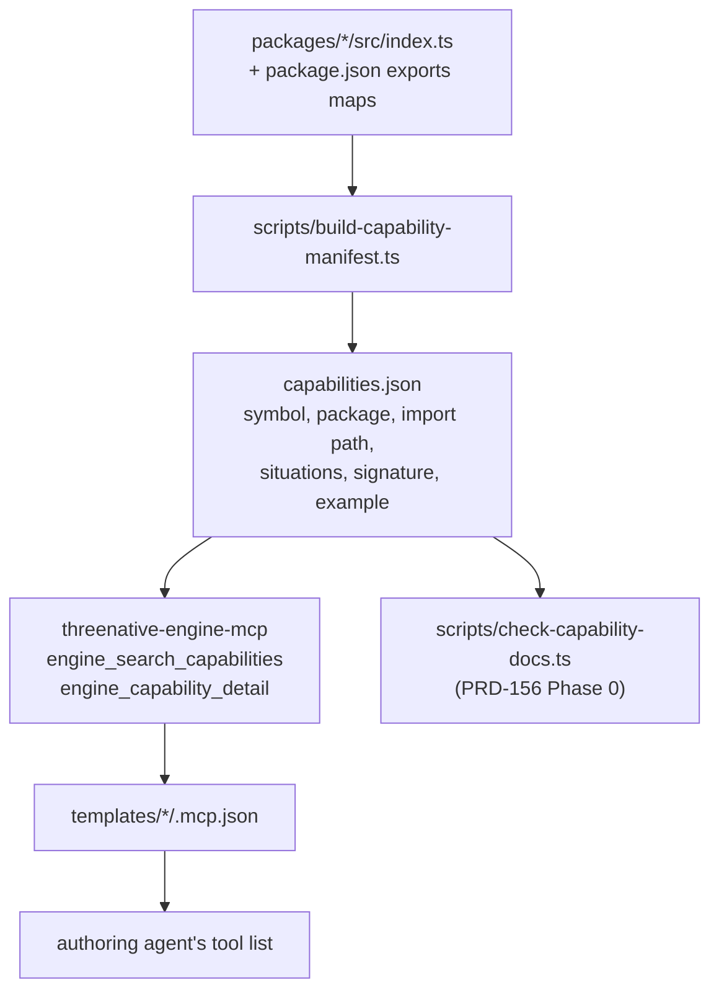

# PRD-157: Capability discovery before authoring

**Date:** 2026-08-18
**Status:** COMPLETE — 2026-08-19. The feature evidence and repair-4 agent cohort pass; the
repository-wide documentation-link baseline is called out explicitly below.
**Pairs with:** PRD-156 (*Engine ships conventions by default*). 156 makes the conventions
exist and keeps the docs honest. **157 makes the agent find them before it writes a line.**

**Complexity: 7 → HIGH mode** (10+ files `+3`, new module from scratch `+2`, multi-package `+2`).
Mandatory checkpoint after every phase.

## Completion record

- The pre-feature cohort reproduced the discovery failure: three fresh sessions imported neither
  `@threenative/physics/navigation` nor `attachToBone`; the full baseline is in
  [capability-discovery-baseline.md](../../verification/capability-discovery-baseline.md).
- The pre-tag manifest negative control exited 1 and named the real untagged export set, including
  the `@threenative/physics/navigation` subpath. The generated offline manifest and the two-tool
  MCP server now pass the focused manifest, search, grounding-detail, and seven-template scaffold
  tests.
- Repair 4 used three fresh Claude Haiku sessions and the real local MCP path. The first search
  preceded the first edit/write in all three; the final cohort reached **2/3** navigation-subpath
  imports, **2/3** `attachToBone` imports, and **0/3** hand-written A*/path-search LOC. See
  [capability-discovery-after.md](../../verification/capability-discovery-after.md) and the
  [integration ledger](../../verification/capability-discovery-integration-ledger.md).
- All seven templates expose the engine MCP server and copied `capabilities.json`; the generated
  `AGENTS.md`/`CLAUDE.md` mirrors pass `pnpm sync:agents --check`.
- The exact repository `pnpm test` command currently stops at seven pre-existing broken links in
  unrelated docs before package tests run. This PRD does not rewrite the user's dirty docs; the
  feature gates that ran are listed in the delivery record.

---

## 1. Context

**Problem:** The authoring agent had `@threenative/physics/navigation` and `attachToBone`
installed and importable, and wrote 446 lines replacing both. It did not choose to ignore them.
**It never knew they existed.**

PRD-156 treats the symptom by making the templates' `AGENTS.md` name every public export. That
is necessary and not sufficient: it assumes an agent reads a prose file to completion, retains a
twenty-item list, and recalls the right entry at the moment it starts writing an enemy. That
assumption has already failed once, measurably.

### The evidence, stated as a contrast

The scaffold ships `.mcp.json` with **two MCP servers**:

```json
{ "mcpServers": {
    "threenative-assets": { "command": "node", "args": ["./node_modules/threenative-asset-mcp/dist/index.js"], … },
    "threenative-sculpt": { "command": "node", "args": ["./node_modules/threenative-sculpt-mcp/dist/server.js"] } } }
```

Their tools land **directly in the authoring agent's tool list**. The agent used them without
being told to: `public/assets/enemy-terrorist.glb`, `weapon-ak47.glb`, and a populated
`CREDITS.md` are all products of that path.

The engine's own API — roughly 20 public classes and functions across `core`, `physics`,
`playtest`, and `ui` — has **no equivalent**. Verified on the current tree:

| Discovery surface for engine capabilities | Exists? |
|---|---|
| MCP server advertising engine capabilities | ❌ none |
| Generated API reference (`docs/api`, typedoc, api-extractor) | ❌ none |
| Machine-readable capability manifest in the scaffold | ❌ none — `kit.json` carries `name`, `title`, `blurb`, `genre`, `kit` and nothing else |
| Prose in `templates/*/AGENTS.md` | ⚠️ the only one — and it omits `NavigationAgent3D`, `attachToBone`, `skeletonBones`, `AudioBus`, `CanvasLayer`, `GPUParticles3D`, `ScenePicker` |

**Assets got a tool surface. The engine's own API got a paragraph.** The agent used what it
could see, and hand-wrote what it could not.

### Two structural amplifiers

1. **Subpath exports are invisible to the technique agents actually use.**
   `@threenative/physics/navigation` cannot be found by grepping a codebase's imports, because
   nothing imports it yet. It appears only in `package.json`'s `exports` map — a file agents read
   for scripts and dependencies, not for capabilities.
2. **The template doc actively discourages looking further.** `templates/minimal/AGENTS.md:161`
   and `templates/starter/AGENTS.md:162` both say *"This table is the complete list."* It is a
   six-row table. An agent that trusts it — and the sentence is written to be trusted — stops
   searching and starts writing. PRD-156 Phase 0 deletes that sentence; this PRD makes the
   accurate answer reachable in one tool call.

**Files analysed:** `packages/create-threenative/templates/*/{AGENTS.md,kit.json,.mcp.json}`,
`packages/create-threenative/src/`, `packages/{core,physics,playtest,ui}/src/index.ts`,
`packages/physics/package.json`, `docs/`, root `package.json`,
`~/projects/threenative/sandbox/fps-framework/{.mcp.json,CLAUDE.md,src/entities/Enemy.ts}`.

---

## 2. Solution

**Approach**

- Generate a **capability manifest from the code**, never hand-written. Prose drifts; an
  `exports`-map walk cannot.
- Serve it to the agent the **same way assets are served** — an MCP server in the scaffold's
  `.mcp.json`, so capabilities appear in the tool list without anyone reading a file.
- Make the manifest answer the question an agent actually has. Not *"what does core export"* but
  *"I am about to write an enemy that walks around walls — what exists?"* Capabilities are indexed
  by **situation**, not by symbol name.
- Add one authoring rule with teeth: before writing a new system, ask. PRD-156's census gate keeps
  the doc honest; this one keeps the agent honest.



**Key decisions**

- [x] **The manifest is generated, and the generator is the gate.** A symbol reaching a public
      `exports` path without a `situations` entry **fails the build**. There is no hand-maintained
      list to fall out of date.
- [x] **MCP, not a longer `AGENTS.md`.** The doc route has been tried and measured: the agent read
      `AGENTS.md`, believed the "complete list" sentence, and wrote 446 lines. The asset path
      proves the tool route works in this exact repo with this exact agent.
- [x] **Indexed by situation, not by symbol.** An agent about to write pathfinding does not search
      for `NavigationAgent3D` — it does not know the name. It searches for *"enemy walks around a
      wall"*. Situations are the search keys; symbols are the results.
- [x] **`situations` lives beside the code**, as a structured doc tag on the export, so it is
      reviewed in the same diff that adds the capability. Not a separate registry file.
- [x] **Shares PRD-156's manifest.** 156's census gate and this PRD's MCP server read the same
      generated `capabilities.json`. Two consumers, one source. If 156 lands first, this PRD adds
      the `situations` field and the server; if this lands first, 156's gate consumes the manifest
      instead of re-walking the exports.

**Data changes:** One generated artifact, `packages/create-threenative/capabilities.json`,
committed so the scaffold ships it offline.

---

## 3. Integration Ledger

| # | New thing | Live caller (`file:line`, non-test) | Replaces | Old path removed? | Negative control |
|---|---|---|---|---|---|
| 1 | `scripts/build-capability-manifest.ts` | `package.json:13` runs the generator before recursive package builds; `scripts/check-budgets.ts:335` and `:340` verify freshness | nothing | n/a | add an export with no `situations` tag → generator exits 1 |
| 2 | `capabilities.json` | `packages/create-threenative/src/index.ts:216` copies it into a scaffold; `packages/engine-mcp/src/index.ts:224` loads it before serving | the prose table in `templates/*/AGENTS.md` | prose keeps the six `ctx` rows; the full list moves to the manifest | delete the file → server start fails loudly, never serves an empty list |
| 3 | `packages/engine-mcp/` (`threenative-engine-mcp`) | `packages/engine-mcp/src/index.ts:224` is the executable; its search/detail handlers are at `:123` and `:153` | nothing | n/a | ask for `"enemy walks around a wall"` → must return `NavigationAgent3D`; return empty → red |
| 4 | `.mcp.json` engine server entry ×7 templates | `packages/create-threenative/src/index.ts:226` and `:255` validate the scaffolded server entry | n/a | n/a | scaffold a project, list MCP tools, assert `engine_search_capabilities` present |
| 5 | "Ask before you write a system" rule | root `AGENTS.md:20` and all seven template `AGENTS.md` files; `pnpm sync:agents` generates their mirrors | n/a | n/a | n/a (doc) |

### Reachability

**How will this feature be reached?**
- Entry point: the authoring agent's MCP tool list, populated at session start from the scaffolded
  project's `.mcp.json` — identical to how `threenative-assets` is reached today.
- Pre-existing files EDITED: root `package.json`, `packages/create-threenative/templates/*/.mcp.json`
  (7 files), `packages/create-threenative/templates/*/AGENTS.md`, `packages/*/src/index.ts`
  (doc tags), `.github/workflows/*` if the manifest needs a build step.
- Registration: new package added to `pnpm-workspace.yaml`; manifest generation added to the
  `build` chain; freshness check added to `budgets`.

**Is this user-facing?** No end-user UI. The consumer is the authoring agent. Observable outcome:
a scaffolded project's agent, asked to add a patrolling enemy, imports
`@threenative/physics/navigation` instead of writing A*.

**Full flow:**
1. User scaffolds a game and asks for an enemy that patrols and chases.
2. The agent's tool list already contains `engine_search_capabilities` (from `.mcp.json`).
3. Per the Phase 4 rule, it calls `engine_search_capabilities({ situation: "enemy patrols and chases the player" })`.
4. Result names `NavigationAgent3D`, its import path `@threenative/physics/navigation`, the
   `recast()` plugin ordering constraint, and a 6-line example.
5. Observable in: the generated `Enemy.ts` imports it. No hand-rolled A*.

**What does this replace?** The prose capability table as the *authoritative* surface. The six-row
`ctx` table stays in `AGENTS.md` (it is genuinely about `ctx` properties, which are not imports);
the full API list moves to the manifest, and `AGENTS.md` points at the tool.

---

## 4. Execution phases

### Phase 0: Reproduce the failure — measure discovery before changing it

**This phase writes no feature. It establishes the baseline the later phases must beat.** Skipping
it produces a PRD that cannot prove it changed anything.

**Files:**
- `docs/verification/capability-discovery-baseline.md` — NEW: the recorded result

**Implementation:**
- [x] Scaffold a fresh project from the `shooter` template on the **current** tree.
- [x] Give a clean agent session one task, verbatim: *"Add an enemy that patrols the level, chases
      the player when it sees them, and holds a rifle in its right hand."*
- [x] Record, without intervening: which engine symbols it imported; how many lines of navigation
      and bone-attachment code it wrote; whether it ever inspected `package.json` `exports` maps.
- [x] Repeat **3 times** with fresh sessions. Discovery is stochastic; one run is an anecdote.

**Expected baseline (this PRD's premise — if it does not reproduce, stop and re-scope):** 0 of 3
runs import `@threenative/physics/navigation` or `attachToBone`.

**Wiring:** none — this phase is a measurement.

**Revert check:** n/a. This phase's output is the negative control for Phase 4.

**User Verification:** read the three transcripts; confirm the counts.

---

### Phase 1: Generate the capability manifest from the code

**Files:**
- `scripts/build-capability-manifest.ts` — NEW
- `package.json` — EDIT: add to the `build` chain and a `--check` to `budgets`
- `packages/core/src/index.ts` — EDIT: add `situations` doc tags to every export
- `packages/physics/src/navigation/index.ts` — EDIT: same
- `scripts/__tests__/capability-manifest.spec.ts` — NEW

**Implementation:**
- [x] Walk every package's `package.json` `exports` map — **including subpaths**. This is the
      branch that catches `@threenative/physics/navigation`; without it the manifest reproduces the
      exact blind spot this PRD exists to fix.
- [x] For each exported class/function, emit: `symbol`, `package`, `importPath` (the literal string
      an agent must write), `kind`, `signature`, `situations: string[]`, `example` (≤10 lines),
      `constraints: string[]`.
- [x] `situations` and `example` come from a structured doc tag on the export itself:
      ```ts
      /**
       * Steer an agent along a navmesh path, avoiding obstacles and other agents.
       * @situation enemy patrols a level
       * @situation enemy chases the player around a wall
       * @situation NPC walks to a destination
       * @constraint requires `recast()` in the plugins array, after `rapier()`
       */
      ```
- [x] **A public export with zero `@situation` tags fails the generator, exit 1.** Allowlist
      internal exports explicitly, each with a one-line reason; an empty reason fails.
- [x] Write `packages/create-threenative/capabilities.json`, committed, so the scaffold works offline.

**Wiring:**
- [x] Caller edited: root `package.json` — `build` generates, `budgets` verifies freshness
- [x] Registration: CI's existing `build → budgets` branch picks it up
- [x] Ledger rows filled: #1, #2

**Tests Required:**
| Test File | Test Name | Assertion | Negative control (observed red) |
|---|---|---|---|
| `capability-manifest.spec.ts` | `should include subpath exports` | manifest contains `NavigationAgent3D` with `importPath: "@threenative/physics/navigation"` | delete the subpath-walk branch → symbol absent → red |
| same | `should fail when a public export has no situation tag` | exit 1, message names the symbol | run on the **current** tree — MUST fail, listing every untagged export. A pass on arrival means the generator is not reading the real export set. |
| same | `should fail when an allowlist entry has an empty reason` | exit 1 | supply a reason → passes |
| same | `should regenerate rather than pass on a stale copy` | delete `capabilities.json`, run `--check` → fails loudly | leave the check reading the old file → passes wrongly |

**Revert check:** delete the generator from `package.json` → the freshness check fails.

---

### Phase 2: `threenative-engine-mcp` — capabilities in the agent's tool list

**Files:**
- `packages/engine-mcp/src/index.ts` — NEW: the server
- `packages/engine-mcp/package.json` — NEW
- `pnpm-workspace.yaml` — EDIT: add the package
- `packages/engine-mcp/__tests__/search.spec.ts` — NEW

**Implementation:**
- [x] Two tools, deliberately not more:
  - `engine_search_capabilities({ situation: string })` → ranked matches over `situations`, each
    with `symbol`, `importPath`, one-line summary, `constraints`.
  - `engine_capability_detail({ symbol: string })` → full signature, example, constraints,
    and any override field (the charter's "flexibility range" — e.g. `GroundSnap.enabled`).
- [x] Reads the committed `capabilities.json`. **Never** returns an empty list silently: a missing
      or unparseable manifest throws with the path, because an empty result is
      indistinguishable from "the engine has nothing" and that is the failure being fixed.
- [x] Match on `situations` text, not symbol names. An agent searching *"enemy walks around a
      wall"* must reach `NavigationAgent3D` without knowing the word "navigation".
- [x] No network. No writes. Read-only over a committed file.

**Wiring:**
- [x] Caller edited: `pnpm-workspace.yaml`; consumed by Phase 3's `.mcp.json`
- [x] Ledger rows filled: #3

**Tests Required:**
| Test File | Test Name | Assertion | Negative control |
|---|---|---|---|
| `search.spec.ts` | `should return NavigationAgent3D for "enemy walks around a wall"` | top 3 results include it, with `importPath: "@threenative/physics/navigation"` | strip `situations` from the manifest → empty result → red |
| same | `should return attachToBone for "put a weapon in a character's hand"` | top 3 include `attachToBone` | as above |
| same | `should throw when the manifest is missing` | throws naming the path | return `[]` instead → red; **this is the silent-pass this PRD is about** |
| same | `should surface the override field in detail` | `engine_capability_detail("GroundSnap")` names `enabled` | omit it → red |

> The first two test cases are the exact two capabilities the real agent failed to find. They are
> not illustrative examples — they are the regression.

**Revert check:** rename the server package → the scaffold-smoke MCP assertion in Phase 3 fails.

---

### Phase 3: Ship it in every scaffold

**Files:**
- `packages/create-threenative/templates/*/.mcp.json` — EDIT (7 files, counted as one change set)
- `packages/create-threenative/src/` — EDIT: copy `capabilities.json` into the scaffold
- `packages/create-threenative/__tests__/scaffold-mcp.spec.ts` — NEW

**Implementation:**
- [x] Add the engine server beside the existing two, matching their shape exactly:
      ```json
      "threenative-engine": {
        "command": "node",
        "args": ["./node_modules/threenative-engine-mcp/dist/index.js"]
      }
      ```
- [x] Add `threenative-engine-mcp` to each template's `devDependencies`.
- [x] Ensure `capabilities.json` lands in the scaffolded project so the server runs offline.

**Wiring:**
- [x] Caller edited: all 7 `.mcp.json` files
- [x] Registration: `pnpm test:templates` already scaffolds each template — extend it to assert the
      tool is present
- [x] Ledger rows filled: #4

**Tests Required:**
| Test File | Test Name | Assertion | Negative control |
|---|---|---|---|
| `scaffold-mcp.spec.ts` | `should expose engine_search_capabilities in every scaffolded template` | for all 7: server starts, tool list contains it | remove the entry from one template → that one goes red (proves the test reads all 7, not just the first) |
| same | `should serve capabilities offline` | run with no network; search returns results | point the manifest path at a missing file → throws, not empty |

**Revert check:** remove the `.mcp.json` entry → `pnpm test:templates` fails.

---

### Phase 4: The authoring rule, and the measured proof it works

**Files:**
- `packages/create-threenative/templates/*/AGENTS.md` — EDIT: the rule + point at the tool
- `AGENTS.md` — EDIT: the engine-side counterpart
- `docs/verification/capability-discovery-after.md` — NEW: the re-measurement

**Implementation:**
- [x] Add to each template's `AGENTS.md`, near the top, where the "complete list" sentence used to be:

  > ### Before you write a system, ask what already exists
  >
  > You have `engine_search_capabilities` in your tool list. **Call it before writing any
  > entity system, movement system, pathfinding, attachment, audio bus, particle system, or
  > measurement helper** — describe the situation in plain words: *"enemy walks around a wall"*,
  > *"put a weapon in a character's hand"*, *"keep a character's feet on the floor"*.
  >
  > The engine's public surface is about twenty classes across four packages, and several are
  > **subpath imports** like `@threenative/physics/navigation` that no amount of grepping this
  > project will reveal — nothing imports them yet. The tool is the only complete answer; this
  > file is a summary and always will be.
  >
  > This is not a suggestion about tidiness. A previous game hand-wrote 446 lines of navigation
  > and bone attachment that were installed and importable at the time, and the hand-written
  > grounding that came with them ran the game at 9 FPS.

- [x] Delete any surviving "complete list" claim (PRD-156 Phase 0 removes two; verify none remain).
- [x] **Re-run Phase 0's experiment**, unchanged: same 3 fresh sessions, same verbatim task, same
      template.

**Wiring:**
- [x] Caller edited: all 7 template `AGENTS.md` + engine `AGENTS.md`
- [x] Registration: `pnpm sync:agents` regenerates `CLAUDE.md` mirrors; `--check` in CI
- [x] Ledger rows filled: #5

**Acceptance for this phase — the whole PRD stands or falls here:**

| Metric | Phase 0 baseline | Phase 4 required |
|---|---|---|
| Runs importing `@threenative/physics/navigation` | expected 0 / 3 | **≥ 2 / 3** |
| Runs importing `attachToBone` | expected 0 / 3 | **≥ 2 / 3** |
| Lines of hand-rolled A* written | expected ~200 | **0** |

Both transcripts are committed. A claim without both files pasted is **UNVERIFIED**, not PASS.

**Revert check:** remove the rule from `AGENTS.md` → `sync:agents --check` fails.

**Manual checkpoint required:** a human reads the three Phase 4 transcripts and confirms the
agent called the tool *before* writing, not after being corrected.

---

## 5. Acceptance criteria

Consumer-scoped. None is satisfiable by a build a user could not tell apart from the previous one.

- [x] Phase 0 baseline recorded, 3 runs, transcripts committed — **before** any fix lands
- [x] The manifest generator, run on the **pre-change** tree, fails and names every untagged public
      export; output pasted
- [x] `capabilities.json` contains `NavigationAgent3D` with `importPath: "@threenative/physics/navigation"`
      — the subpath case that started this
- [x] A freshly scaffolded project's agent tool list contains `engine_search_capabilities`, in all
      **7** templates
- [x] `engine_search_capabilities({ situation: "enemy walks around a wall" })` returns
      `NavigationAgent3D` in its top 3
- [x] `engine_search_capabilities({ situation: "put a weapon in a character's hand" })` returns
      `attachToBone` in its top 3
- [x] **≥2 of 3 fresh agent sessions import the engine navigation instead of writing A*** — the
      before/after transcripts are committed and diffable
- [x] No template `AGENTS.md` claims any partial table is "the complete list"
- [ ] `pnpm typecheck && pnpm lint && pnpm test && pnpm test:templates && pnpm budgets` is fully green:
      `pnpm test` stops at seven pre-existing unrelated documentation links before package tests.
      Typecheck, lint, focused tests, templates, playtest, and budgets pass on the integrated feature.

**Integration gates (unchecked = NOT done):**

- [x] Integration Ledger has zero `TBD` cells.
- [x] Every new export has a non-test consumer; the caller census is pasted in the integration ledger.
- [x] Revert checks passed for rows 1-4.
- [x] Every gate has a negative control **observed red**.
- [x] Proved on real scaffolded projects with real agent sessions — not on a unit fixture.

---

## 6. Relationship to PRD-156

They fix two halves of one failure and neither is sufficient alone.

| | PRD-156 | PRD-157 |
|---|---|---|
| Fixes | the conventions are missing or undocumented | the agent never looks |
| Mechanism | ship `GroundSnap` / `posedBounds` / `normaliseToMetres` / `prewarm`; gate the docs | generate a manifest; serve it as MCP tools; require the query |
| Proof | `Enemy.ts` drops from 1 419 to under 850 lines | ≥2 of 3 fresh sessions import the engine nav |
| Without the other | a documented capability nobody searches for | a search tool over capabilities that do not exist yet |

**Ordering:** 156 Phase 0's census gate and 157 Phase 1's generator both walk the export maps.
**Build the generator once, in 157 Phase 1, and have 156's gate consume its output.** Whichever
lands second adopts the shared manifest rather than duplicating the walk — two independent
export-walkers is precisely the twin-constants smell that lets one drift silently past the other.

---

## 7. Explicitly out of scope

- **Generated API reference docs** (typedoc/api-extractor). The manifest is agent-facing and
  situation-indexed; a human-facing API site is a separate, larger decision.
- **Auto-fixing existing games.** `fps-framework`'s migration is PRD-156 Phase 5.
- **Capability search over `three` itself.** The engine's surface is the scope; Three.js
  discovery is the ecosystem-corpus work in PRD-123.
- **Ranking quality beyond top-3 recall on the two regression cases.** Better search is an
  improvement; recall on the two capabilities that were actually missed is the requirement.
