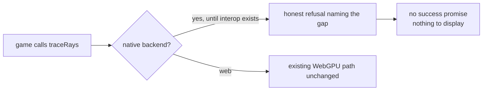

# PRD-198 — The raytracing surface stays dark until results exist

**Status:** COMPLETE 2026-08-25 — native raytracing now exposes an honest refusal until readable
results exist; browser behavior remains unchanged. Evidence is recorded in
`docs/verification/prd-198-raytracing-gated-2026-08-25.md`.

**Complexity:** +2 for 6–10 files, +2 for a public-surface contract change, +1 for
conformance/registry updates = **5 → MEDIUM mode**.

## Context

Scan finding #2: Vulkan and DXR `traceRays` compute into a readback buffer, then TODO the
copy-out, while the JS binding accepts an `outputTexture` and resolves success
(`raytracing/vulkan_rt.cpp:1552`, `dxr_rt.cpp:1286`, accepted at
`webgpu/bindings.cpp:406`). Roughly 2,800 lines Vulkan + 1,294 DXR + 878 Metal deliver a
result nothing can display. This is the silent-success pattern the framework bans: a game
agent reads "resolved" and builds on data that does not exist.

Files analyzed: the three paths above, plus how deprecated-native-GLTF gating is handled
today (the model to mirror).

## Solution

- Gate the raytracing surface off until buffer→texture interop exists, exactly the way the
  deprecated native GLTF path is gated: attempting the surface reports honestly
  (throws/declines with a message naming the missing capability), never resolves success.
- Keep the C++ backends compiling — this is a surface gate, not a deletion of the 5,000
  lines; their TODOs stay visible at the copy-out site.
- Update the conformance registry and any capability manifest entry so discovery says
  "unavailable on native" rather than implying it works.
- When readback lands later, un-gating is one commit whose tests already exist here.

## Integration Ledger

| # | Changed thing | Live caller | Replaces | Negative control |
| --- | --- | --- | --- | --- |
| 1 | Honest-refusal gate on native raytracing | bindings accept point `bindings.cpp:406` | resolve-success-without-result | revert the gate → a call resolving success without readable output must turn the new test red |
| 2 | Registry/capability truth for native RT | `engine_search_capabilities` consumers via generated manifest | entry implying native support | regenerate manifest → native RT row states unavailable |

## Execution Phases

### Phase 1 — The binding refuses before it lies

**Files (4):** `vulkan_rt.cpp`, `dxr_rt.cpp` or their shared factory (EDIT),
`webgpu/bindings.cpp` (EDIT), native contract spec (EDIT).

- [ ] Native `traceRays` requests fail fast with a message naming the missing copy-out.
- [ ] No code path reaches the old accept-and-resolve branch.
- [ ] Metal backend gets the same treatment in the same phase if it shares the accept
      point; otherwise file its gap explicitly in the verification record.

Mutation for red: re-enable the old accept path for one backend — the refusal test must
go red for that backend only.

### Phase 2 — Discovery and conformance tell the truth

**Files (3):** `packages/runtime-native/conformance/registry.json` (EDIT), the capability
manifest source + regenerated `capabilities.json` (EDIT), conformance spec (EDIT).

- [ ] Registry rows for native raytracing state unavailable-until-readback.
- [ ] Regenerated manifest reflects it; no prose hand-edits.
- [ ] A conformance case asserts the refusal on desktop native, naming the executable run.

## Verification

Record `docs/verification/prd-198-raytracing-gated-<date>.md`.

1. Contract spec red-green with the mutation pasted.
2. One desktop playtest/conformance run proving the honest refusal fires from a real game
   call, not a direct function poke.
3. `pnpm build` regenerates `capabilities.json`; diff shows only the RT truth change.
4. Web lane untouched: one browser playtest asserting the existing surface still works.

## Acceptance Criteria

- [ ] On native, a game calling raytracing gets a refusal that names the gap; nothing
      anywhere resolves success for a result that cannot be read.
- [ ] Capability search answers "can I raytrace on native?" with the truth.
- [ ] Reverting the gate makes a named test red (mutation pasted).
- [ ] The copy-out TODOs remain in source, so the future un-gate knows where work resumes.
