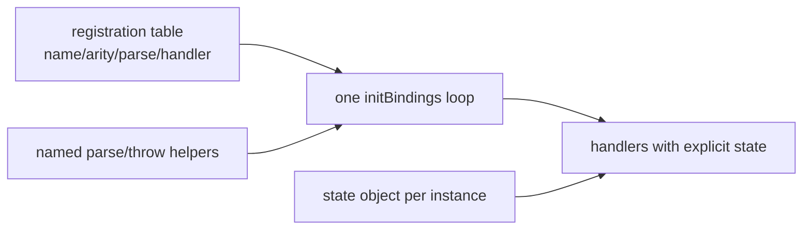

# PRD-205 — WebGPU bindings register from a table and get linted

**Status:** COMPLETED 2026-08-24. WebGPU bindings register from a table, Biome covers
runtime-native, and the record is `docs/verification/prd-205-bindings-table-2026-08-24.md`.

**Complexity:** +3 for 10+ files touched across the pass, +2 for a new registration
system, +2 for reentrancy/state-ownership change = **7 → HIGH mode**. Checkpoint review
after every phase.

## Context

Scan findings #10 and #12, the biggest structural item in the C++ host:

- `initBindings` is one ~4,715-line function (`webgpu/bindings.cpp:1006-5721`)
  registering all 100 API surfaces as nested lambdas up to ~8 deep. 279 `newFunction`
  sites package-wide; 44 hand-rolled `args.empty()` guards; 51 `throwException` sites;
  ~100 file-static globals making the whole WebGPU layer unreentrant and untestable.
- Texture-wrapper construction is duplicated between windowed/offscreen paths, and
  render/compute pipeline lambdas are copy-pasted (~200+ removable lines).
- The house-style counter-example already exists in-tree:
  `physics/native_bindings.cpp` — table-driven registration with named parse helpers.
- The entire runtime-native package is excluded from Biome while being the most active
  package (141 commits/90 d), so regressions here stay invisible to lint gates.

Files analyzed: `webgpu/bindings.cpp`, `physics/native_bindings.cpp` (reference),
`biome.json`, the JS-facing binding contract specs.

## Solution

- Named arg-parse/throw helpers first (the physics-bindings idiom), then table-driven
  registration: each surface declares name, arity, parse spec and handler; `initBindings`
  becomes a loop.
- File-static globals move into a state object owned per device/instance; handlers take
  it explicitly — restoring reentrancy and testability.
- Shared wrapper factories for texture wrappers (windowed/offscreen) and pipeline lambdas.
- Extend Biome over runtime-native's TypeScript surface; C++ formatting is out of scope
  here unless a configured formatter already exists in-repo.
- Kill-switch discipline: every abstraction added is scored by
  `scripts/count-loc.ts`; net LOC must drop or the approach is revised.

## Integration Ledger

| # | Changed thing | Live caller | Replaces | Negative control |
| --- | --- | --- | --- | --- |
| 1 | Table-driven registration | engine bootstrap calling `initBindings` | nested-lambda registrations | remove one table row → that surface's conformance test red |
| 2 | Explicit-state handlers | all migrated handlers | file-static globals | construct two instances interleaved → cross-talk test red on old code, green after |
| 3 | Shared wrapper factories | windowed + offscreen creation paths | duplicated construction | diverge factory → both paths' tests catch via single fixture |
| 4 | Biome over runtime-native TS | `pnpm lint` gate | biome.json package ignore | reintroduce a lint error → CI red |

## Execution Phases

### Phase 1 — Helpers and the first table slice

**Files (4):** `bindings.cpp` (EDIT), new registration-table header/source (NEW),
native bindings contract spec (EDIT), `biome.json` scoping decision note (EDIT).

- [ ] Arg-parse and throw helpers extracted, physics-bindings style.
- [ ] Migrate the smallest cohesive surface family (~10 registrations) to the table;
      loop drives them.
- [ ] Contract suite proves migrated surfaces byte-equivalent in behaviour.

Mutation for red: delete one table row → its conformance case red.

### Phase 2 — State leaves file scope

**Files (4):** state-object header (NEW), `bindings.cpp` (EDIT), reentrancy test
executable (NEW), contract spec (EDIT).

- [ ] Globals migrate behind an owned state struct passed to handlers.
- [ ] Two-instance interleave test passes; no static mutable remains in migrated code.
- [ ] Red first: run the interleave test before migration where feasible — paste the
      cross-talk.

### Phase 3 — All surfaces on the table; wrappers shared

**Files (5 max per increment; repeat increments as sub-phases):** `bindings.cpp`,
table source, wrapper-factory header, conformance suite (EDIT).

- [ ] Remaining ~90 registrations migrated incrementally; each increment keeps the full
      conformance suite green.
- [ ] Windowed/offscreen texture-wrapper duplication collapses into factories; pipeline
      lambda copies share one body parameterized by kind.
- [ ] `initBindings` shrinks from ~4,715 lines to dispatch + declarations; paste line
      counts before/after each increment.

### Phase 4 — Lint covers the package's TS

**Files (3):** `biome.json` (EDIT), flagged files fixed or justified-suppressed (EDIT),
CI lint invocation unchanged (verify only).

- [ ] Package TS under Biome; suppressions individually justified, no blanket ignores.
- [ ] Negative control: introduce one error → `pnpm lint` red, pasted.

## Verification

Record `docs/verification/prd-205-bindings-table-<date>.md`.

1. Full native conformance suite green after every phase; final run names executable +
   adapter.
2. Interleave/reentrancy proof pasted.
3. LOC accounting: `scripts/count-loc.ts` or equivalent diff — net negative for
   `bindings.cpp` including new headers.
4. Behaviour parity: captured JS-side call traces (args in, results/errors out) identical
   pre/post for every migrated family.
5. `pnpm typecheck && pnpm lint && pnpm test` green; desktop playtest naming its run.

## Acceptance Criteria

- [ ] Registering a new API surface means adding one table row, not a nested lambda in a
      4,700-line function.
- [ ] No file-static mutable state remains in the WebGPU layer; two instances can
      interleave safely.
- [ ] Wrapper/pipeline duplication is gone; the ~200 removable lines are removed.
- [ ] Lint runs over the package; a seeded error fails CI.
- [ ] Every behaviour claim has a conformance result from a named executable.
