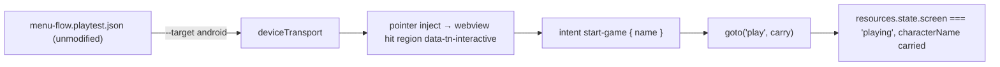

# PRD-219 — The starter's menu flow proves itself on Android

**Status:** DELIVERED 2026-08-25 — criteria 1, 2, 3 and 4 met on `emulator-5554`, and the Phase 3
physical-Pixel 8 stretch passed too, after the phone exposed three further defects the emulator
cannot produce (orientation, emulator-only click injection, and the soft keyboard). Evidence:
`docs/verification/prd-219-android-menu-flow-2026-08-25.md`.
**Complexity:** +2 multi-package (playtest, create-threenative), +1 platform seam (webview
pointer transport) = **3 → LOW/MEDIUM**, checkpoint after every phase.

**Depends on:** the three day-batches merged to HEAD (starter `MainMenu`,
`menu-flow.playtest.json`, `goto(name, { carry })`, the `click` step) and PRD-217's proven
webview mechanism.

## Context

PRD-218's menu-flow batch shipped "scenes are the screens" as a convention and named exactly
what it did not verify: *"Android and iOS executions of the template's menu flow."* The house
rule — **a feature that works on web only is unfinished** — applies to today's headline
feature until the same scenario drives the menu→play transition through the native web view.

What makes this non-trivial, all measured or stated in the day's records:

1. The menu flow's load-bearing pieces are exactly the ones no Android lane has driven:
   the `click` step was specced as *"CDP mouse on web; named error on targets without pointer
   transport"* — whether the Android/webview path has a pointer transport at all is open.
2. PRD-217 proved the webview UI layer renders and measures on the **physical Pixel 8**, not
   on the emulator; the emulator lane has parity evidence for the GL surface but no recorded
   webview-menu execution.
3. Touch is the actual user input on this platform: a keyboard-driven Tab/Enter proof would
   not exercise the `data-tn-interactive` hit-region protocol the way a finger does.
4. The emulator (`emulator-5554`) and the physical Pixel are both reachable tonight; the
   emulator runs first so the physical device stays owned by Lane C (night README).

## Solution

- **One scenario, four targets stays true.** The starter's own `menu-flow.playtest.json` must
  pass under `--target android` **unmodified**. Any fork of the scenario for Android is a
  failure of this PRD (the harness rule: an assertion that only means something on one target
  is a fork).
- **Pointer transport first-class, never skipped.** If the Android lane lacks pointer
  injection, this PRD builds it into the existing device transport (the same channel that
  carries `aimAt` setup data); a missing transport fails `TN_PLAYTEST_UNSUPPORTED_ON_TARGET`
  naming the working target — it never silently degrades to browser.
- **The carried name asserts through `resources`.** The transition assertion observes state
  across the `goto` — the exact sampling fix from menu-flow Phase 2, now under a webview.

**Data changes:** none.

## Integration Ledger

| # | New thing | Live caller | Replaces | Old path removed? | Negative control |
|---|-----------|-------------|----------|-------------------|------------------|
| 1 | Pointer injection on the device transport (if absent) | `packages/playtest/src/runner/deviceTransport.ts` / `androidRunner.ts`; consumed by the `click` step | named-error-only path for pointer on Android | replaced in place | stub the injector → `click` step errors `TN_PLAYTEST_UNSUPPORTED_ON_TARGET` (never skips; test red) |
| 2 | Emulator execution of the template's own menu scenario | `pnpm test:templates` android row / night verification record | nothing — new execution evidence | n/a | remove `carry` from the starter handler → the device run goes red (same mutation as menu-flow criterion 2, now observed on Android) |

## Phases

#### Phase 0: name the input path

- [x] Read PRD-217's lane + `runner/androidRunner.ts`: can the runner already deliver a tap to
      the webview (instrumented bridge, `adb shell input tap`, CDP-over-devtools-socket)?
      Write the answer, with the chosen mechanism, into `docs/verification/prd-219-<date>.md`
      before writing code. One paragraph; no implementation yet.

#### Phase 1: pointer transport on the Android target

**Files (max 5):** `packages/playtest/src/runner/deviceTransport.ts`, `runner/androidRunner.ts`,
`__tests__/` red-first; template docs only if the contract changes.

- [x] Red unit test: a `click` step on `--target android` without a transport fails
      `TN_PLAYTEST_UNSUPPORTED_ON_TARGET` (wrong-typed case still throws at load per house rule).
- [x] Implement injection through the chosen Phase 0 mechanism; coordinates in viewport pixels,
      same semantics as web.
- [x] Green: unit test passes; the misspelled-step-kind guard still throws at load.

#### Phase 2: the starter's menu scenario on the emulator

- [x] Scaffold the starter fresh, build the debug APK (JDK 17 toolchain per the Android lane),
      install on `emulator-5554`.
- [x] Run `menu-flow.playtest.json --target android` unmodified: green, asserting
      `screen` transition and carried `characterName` through `resources`.
- [x] Mutation (red control): remove `carry` from the scaffold's start-game handler → the same
      scenario goes red on device; paste both reports.

#### Phase 3: stretch — physical Pixel rung — PASSED 2026-08-25 on `37251FDJH0037Z`

- [x] Same scenario, same assertions, physical Pixel 8, `observations.deviceMetrics`
      comparability verdict recorded. Emulator results never upgrade to device claims; each
      run names its lane.

## Acceptance criteria

1. **Unmodified scenario, native target.** The starter's `menu-flow.playtest.json` exits 0
   under `--target android` on the emulator, asserting the screen transition and the carried
   name via `resources`. *Red-green:* remove `carry` → red on device (paste both reports).
2. **No silent degradation.** With pointer transport stubbed off, the `click` step fails
   `TN_PLAYTEST_UNSUPPORTED_ON_TARGET` naming android — never a skip, never a browser fallback
   (unit red-green pasted).
3. **Touch, not keyboard.** Evidence shows the tap arriving through the webview hit-region
   protocol (bridge log or instrumentation), not a focus/Enter shortcut.
4. **House gates stay green:** `pnpm typecheck && pnpm lint && pnpm test`, `pnpm budgets`,
   `pnpm sync:agents --check`.

**What the delivered work actually changed.** The pointer transport landed as specified, and
proving it exposed three harness defects that the six-variant calibration had been reading as
noise: the Android target never presented the scenario's declared viewport (so a viewport-pixel
coordinate pointed at a differently-laid-out UI — the `begin` click landed in the 40-pixel gap
between the two controls), the touch rotation was read from two sources that do not describe the
game's window, and `noConsoleErrors` counted the WebView's own C++ diagnostics as the game's
console. The IME-resize hypothesis in the night README's 00:40 steering note was tested and
**refuted** — the host's own hit-test trace shows the overlay's dimensions unchanged across both
clicks in every variant. The shipped scenario also carried a browser-only `noNetworkErrors`
assertion, which moved to a reasoned opt-out so the same file means the same thing on all four
targets.

**Named unverified at proposal time:** iOS (no lane — excluded by standing rule); physical
Pixel execution unless the Phase 3 stretch ran; frame-rate anything (functional assertions
only — the emulator's software GL claims no performance).
